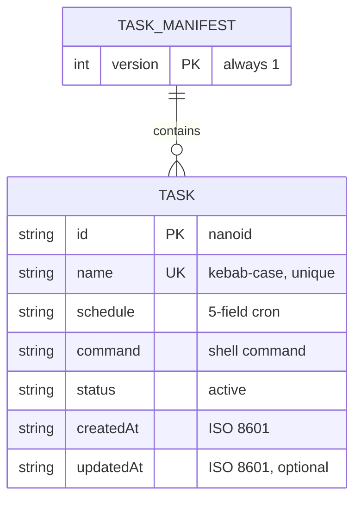
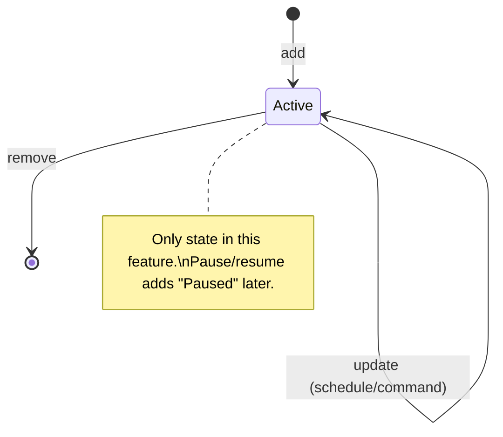
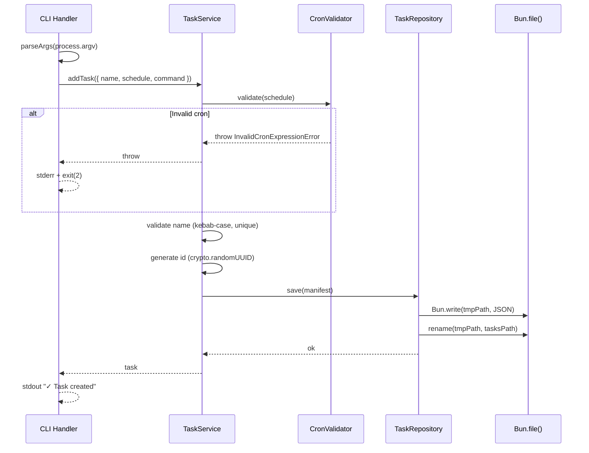

# Plan: Task Manifest & CRUD

- **Feature:** 001-task-manifest
- **Status:** Approved
- **Date:** 2026-03-30
- **Scope:** M (8 FR, 2 entities, 5 subcommands)

---

## Summary

Implement the core task CRUD system: a `TaskManifest` JSON file at `~/.cronshed/tasks.json` with five CLI subcommands (`add`, `list`, `get`, `update`, `remove`) using `parseArgs`, `cron-parser` for validation, and atomic file writes via Bun.

---

## Technical Context

| Aspect | Choice | Source |
|---|---|---|
| Runtime | Bun | Stack |
| Language | TypeScript (strict) | Stack |
| CLI parsing | `parseArgs` (node:util) | Stack |
| Storage | `tasks.json` flat file | Stack, ADR-001 |
| Cron validation | `cron-parser` | Stack, ADR-002 |
| File I/O | `Bun.file()` + `Bun.write()` | Stack |
| ID generation | `crypto.randomUUID()` | Built-in, zero deps |
| Testing | `bun:test` | Strategy |

### Resolved Test Commands

| Action | Command | Tool | Status |
|---|---|---|---|
| Unit tests | `bun test` | bun:test | Ready |
| Integration tests | `bun test` | bun:test | Ready |
| Type check | `bunx tsc --noEmit` | TypeScript | Ready |
| Full suite | `bun test` | bun:test | Ready |

---

## Constitution Check

| Principle | Status | Notes |
|---|---|---|
| Simplicity First | ✅ | Flat JSON, no DB, no server, minimal deps (cron-parser + nanoid) |
| Single Responsibility | ✅ | CLI handler (parse args) → Service (business logic) → Repository (file I/O) |
| Explicit Over Implicit | ✅ | tasks.json is single source of truth, exit codes documented |
| Fail Fast | ✅ | Validate cron, name, command before any write |
| No Side Effects at Import | ✅ | All modules export pure functions/classes, CLI entry triggers side effects |

---

## ER Diagram

---

## State Diagram — Task Lifecycle

---

## Sequence Diagram — Add Task Flow

---

## File-by-File Implementation Plan

### Step 1 — Project setup and types

**Files:**
- `src/task/task.types.ts` (new) — `Task`, `TaskManifest`, `CreateTaskInput`, `UpdateTaskInput` interfaces + `TASK_STATUS` const
- `src/task/task.errors.ts` (new) — Domain error classes: `TaskNotFoundError`, `DuplicateTaskNameError`, `InvalidTaskNameError`, `EmptyCommandError`, `ManifestCorruptedError`, `ManifestVersionError`, `ManifestAccessError` (permissions)
- `src/cron/cron.errors.ts` (new) — `InvalidCronExpressionError`
- `src/app/config.ts` (new) — `getDataDir()` reads `CRONSHED_HOME` or defaults to `~/.cronshed`, `getTasksPath()`
- `tsconfig.json` (new) — strict mode config
- `package.json` (modify) — add deps: `cron-parser`, devDeps: `@types/bun`, `typescript`

> **Note on ID generation:** Using `crypto.randomUUID()` (built-in) instead of `nanoid` to respect the "zero unnecessary dependencies" constitution principle. UUIDs are longer but sufficient for a personal tool.

**FR covered:** FR-001.1: Config and paths, FR-002.1: Type definitions

### Step 2 — Task repository (file I/O layer)

**Files:**
- `src/task/task.repository.ts` (new) — `TaskRepository` class
  - `load(): Promise<TaskManifest>` — read + parse + validate version
  - `save(manifest: TaskManifest): Promise<void>` — atomic write (tmp + rename)
  - `ensureDataDir(): Promise<void>` — create dir + empty manifest if needed

**FR covered:** FR-001.2: Storage read/write, FR-004.1: Atomic write implementation, FR-007.1: Auto-create directory, FR-009.1: Corrupted JSON detection, FR-010.1: Version validation

### Step 3 — Cron validation

**Files:**
- `src/cron/cron.service.ts` (new) — `validateCronExpression(expr: string): void` throws `InvalidCronExpressionError`

**FR covered:** FR-003.1: Cron validation via cron-parser

### Step 4 — Task service (business logic)

**Files:**
- `src/task/task.service.ts` (new) — `TaskService` class
  - `add(input: CreateTaskInput): Promise<Task>` — validate name + schedule + command, generate id, save
  - `list(): Promise<Task[]>`
  - `get(name: string): Promise<Task>`
  - `update(name: string, input: UpdateTaskInput): Promise<Task>` — validate changes, set updatedAt
  - `remove(name: string): Promise<void>`

**FR covered:** FR-002.2: Task field assignment, FR-003.2: Validation before write, FR-005.1: All 5 operations

### Step 5 — CLI handler (argument parsing + output)

**Files:**
- `src/cli/cli.handler.ts` (new) — Parse `process.argv` with `parseArgs`, route to subcommand handlers
- `src/cli/cli.formatter.ts` (new) — Format task table, task details, JSON output, error messages
- `index.ts` (modify) — Import and call CLI handler

**FR covered:** FR-005.2: Subcommand routing, FR-006.1: --json flag support, FR-008.1: Stderr error formatting with usage hints

### Step 6 — Unit tests

**Files:**
- `src/cron/cron.service.test.ts` (new) — Cron validation: valid expressions, invalid expressions, edge cases
- `src/task/task.service.test.ts` (new) — All CRUD operations with in-memory fake repository
- `src/cli/cli.formatter.test.ts` (new) — Table formatting, JSON output, error message formatting
- `src/app/config.test.ts` (new) — CRONSHED_HOME override, default path

**FR covered:** FR-002.3: Field validation tests, FR-003.3: Cron validation tests, FR-006.2: JSON output tests

### Step 7 — Integration tests

**Files:**
- `src/task/task.repository.test.ts` (new) — Atomic write, corrupted JSON handling, version mismatch, auto-create dir
- `src/cli/cli.integration.test.ts` (new) — End-to-end CLI tests: `add`, `list`, `get`, `update`, `remove` via `Bun.$`. Placed in `src/cli/` alongside the CLI handler it tests (co-location per constitution).

**FR covered:** FR-001.3: Storage integration, FR-004.2: Atomic write verification, FR-005.3: Full CLI integration, FR-007.2: Auto-create verification, FR-008.2: Exit code verification, FR-009.2: Corruption handling, FR-010.2: Version mismatch handling

---

## Testing Strategy

| Test Type | What | File | Command | FR/AC |
|---|---|---|---|---|
| Unit | Cron expression validation | src/cron/cron.service.test.ts | `bun test src/cron/` | FR-003, AC-002, AC-011 |
| Unit | Task CRUD logic (add, list, get, update, remove) | src/task/task.service.test.ts | `bun test src/task/task.service.test.ts` | FR-002, FR-005, AC-001, AC-003, AC-008, AC-009, AC-010, AC-012, AC-019 |
| Unit | CLI output formatting (table, details, JSON, errors) | src/cli/cli.formatter.test.ts | `bun test src/cli/cli.formatter.test.ts` | FR-006, FR-008, AC-005, AC-006, AC-007, AC-013, AC-014 |
| Unit | Config path resolution | src/app/config.test.ts | `bun test src/app/` | FR-001, AC-016 |
| Integration | Repository atomic writes + error handling + permissions | src/task/task.repository.test.ts | `bun test src/task/task.repository.test.ts` | FR-004, FR-007, FR-009, FR-010, AC-004, AC-015, AC-018 |
| Integration | Full CLI end-to-end | src/cli/cli.integration.test.ts | `bun test src/cli/cli.integration.test.ts` | AC-001 to AC-019 (all ACs via CLI, AC-017 missing-args paths) |

---

## Risks & Considerations

| Risk | Impact | Mitigation |
|---|---|---|
| Filesystem permission errors | Low (personal machine) | `ManifestAccessError` catches and reports with exit code 3 |
| Atomic write race condition | Low (single-user tool) | tmp + rename is sufficient; documented as accepted in spec edge case 1 |
| `cron-parser` API changes | Low | Pin version in package.json |
| Task name collision across different CRONSHED_HOME paths | None (each dir is independent) | No mitigation needed |

---

*Plan generated by spec.feature --auto — LiveSpec v1.0*
