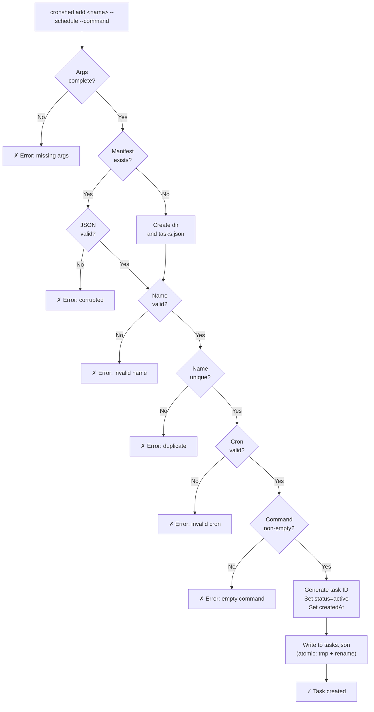
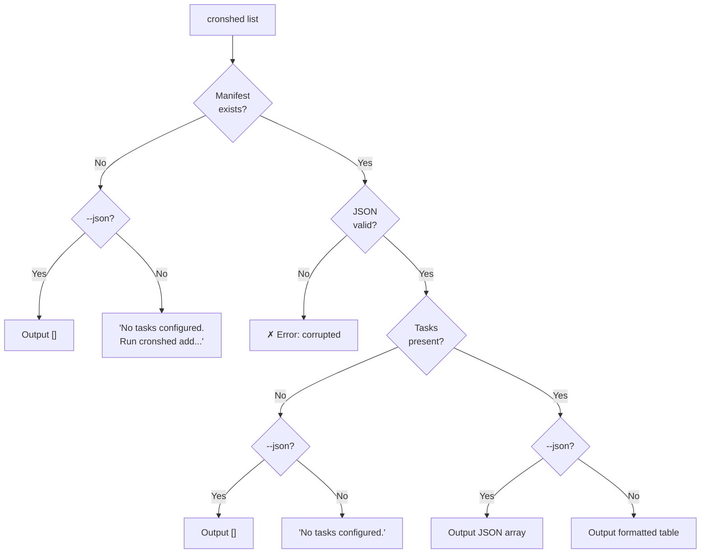
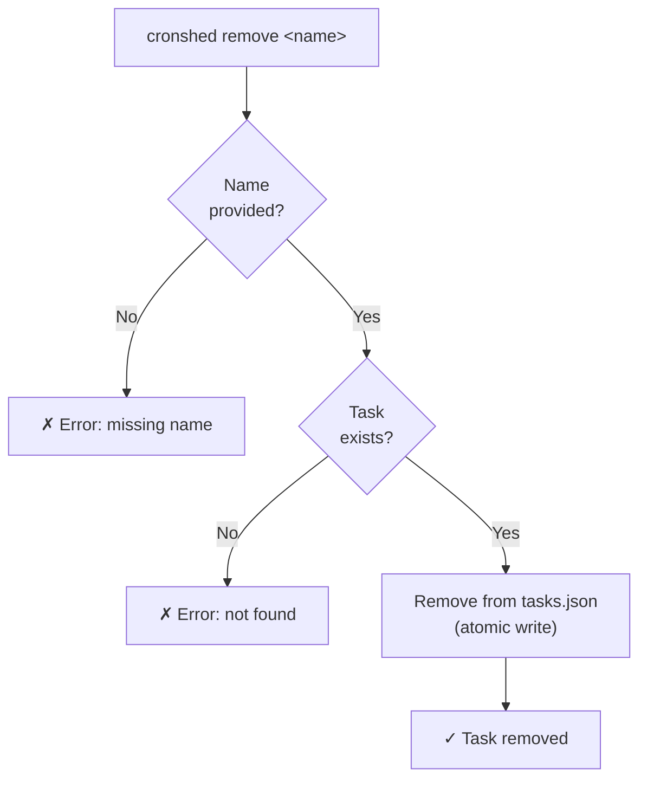
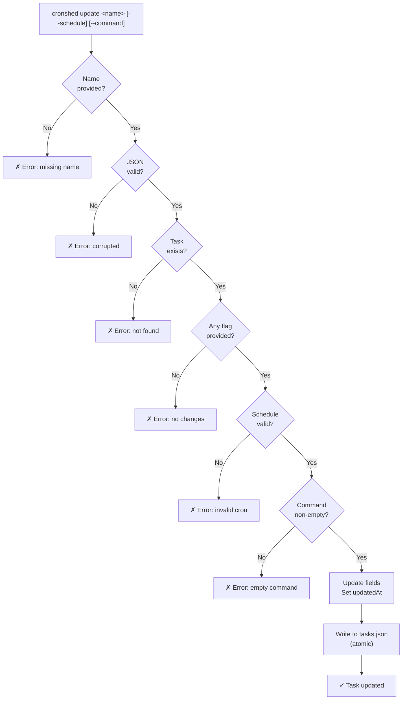
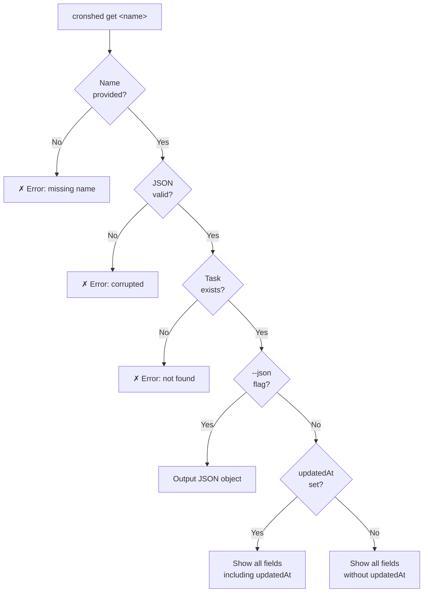

# Feature Spec: Task Manifest & CRUD

- **Feature:** Task Manifest & CRUD
- **Branch:** feature/001-task-manifest
- **Date:** 2026-03-30
- **Status:** Implemented
- **Input:** Create, read, update, delete tasks in tasks.json
- **Feature Number:** 001

---

## Exit Code Conventions

| Code | Meaning |
|------|---------|
| 0 | Success |
| 1 | General error (task not found, already exists) |
| 2 | Bad input (invalid cron, missing arguments, empty values) |
| 3 | Config / filesystem error (permissions, corrupted file) |

---

## User Scenarios & Testing

### Story 1 — Developer adds a new cron task `P1`

**Description:** As a developer, I want to add a new cron task to my manifest so that it can be scheduled and tracked.

**Priority reason:** Core building block — nothing works without task creation.

**Independent test:** Create a task with name, schedule, and command; verify it exists in tasks.json.

```gherkin
Feature: Add a new cron task
  Scenario: Successfully add a task with valid inputs
    Given the tasks manifest exists at ~/.cronshed/tasks.json
    And no task named "backup-db" exists
    When the developer runs "cronshed add backup-db --schedule '0 2 * * *' --command '/usr/local/bin/backup.sh'"
    Then a task named "backup-db" is added to tasks.json
    And the task has schedule "0 2 * * *"
    And the task has command "/usr/local/bin/backup.sh"
    And the task status is "active"
    And the task has a generated unique id
    And the task has a createdAt timestamp
    And stdout shows "✓ Task backup-db created"

  Scenario: Reject task with invalid cron expression
    Given the tasks manifest exists
    When the developer runs "cronshed add bad-task --schedule 'not-a-cron' --command 'echo hi'"
    Then no task is added to tasks.json
    And stderr shows "✗ Error: Invalid cron expression "not-a-cron""
    And stderr shows "→ Expected format: '* * * * *' (minute hour day month weekday)"
    And the exit code is 2

  Scenario: Reject duplicate task name
    Given a task named "backup-db" already exists
    When the developer runs "cronshed add backup-db --schedule '0 3 * * *' --command 'echo dup'"
    Then no task is added to tasks.json
    And stderr shows "✗ Error: Task "backup-db" already exists"
    And the exit code is 1

  Scenario: Reject invalid task name
    Given the tasks manifest exists
    When the developer runs "cronshed add "BAD NAME!" --schedule '0 0 * * *' --command 'echo hi'"
    Then no task is added to tasks.json
    And stderr shows "✗ Error: Invalid task name. Use lowercase letters, numbers, and hyphens only."
    And the exit code is 2

  Scenario: Reject empty command
    Given the tasks manifest exists
    When the developer runs "cronshed add my-task --schedule '0 0 * * *' --command ''"
    Then no task is added to tasks.json
    And stderr shows "✗ Error: Command cannot be empty"
    And the exit code is 2

  Scenario: Create manifest file on first task
    Given ~/.cronshed/ directory does not exist
    When the developer runs "cronshed add first-task --schedule '*/5 * * * *' --command 'echo hello'"
    Then ~/.cronshed/ directory is created
    And ~/.cronshed/tasks.json is created with version 1 and the task
    And stdout shows "✓ Task first-task created"

  Scenario: Create manifest in custom directory via CRONSHED_HOME
    Given CRONSHED_HOME is set to "/tmp/test-cronshed"
    And /tmp/test-cronshed does not exist
    When the developer runs "cronshed add my-task --schedule '0 0 * * *' --command 'echo hi'"
    Then /tmp/test-cronshed/ directory is created
    And /tmp/test-cronshed/tasks.json is created with the task
    And stdout shows "✓ Task my-task created"

  Scenario: Reject missing required arguments
    Given the tasks manifest exists
    When the developer runs "cronshed add"
    Then stderr shows "✗ Error: Missing task name"
    And stderr shows "→ Usage: cronshed add <name> --schedule '<cron>' --command '<cmd>'"
    And the exit code is 2

  Scenario: Handle corrupted manifest
    Given tasks.json exists but contains invalid JSON
    When the developer runs "cronshed add my-task --schedule '0 0 * * *' --command 'echo hi'"
    Then stderr shows "✗ Error: tasks.json is corrupted (invalid JSON)"
    And stderr shows "→ Inspect manually: ~/.cronshed/tasks.json"
    And the exit code is 3

  Scenario: Handle unrecognized manifest version
    Given tasks.json exists with version 2
    When the developer runs "cronshed add my-task --schedule '0 0 * * *' --command 'echo hi'"
    Then stderr shows "✗ Error: Unsupported manifest version (expected 1, got 2)"
    And stderr shows "→ Update cronshed or check tasks.json manually"
    And the exit code is 3
```

#### User Flow



---

### Story 2 — Developer lists all tasks `P1`

**Description:** As a developer, I want to list all tasks in my manifest so I can see what is scheduled.

**Priority reason:** Essential for daily use — must know what tasks exist.

**Independent test:** Add 2 tasks, run list, verify both appear with correct details.

```gherkin
Feature: List all tasks
  Scenario: List tasks with entries
    Given tasks.json contains 2 tasks: "backup-db" (active) and "cleanup-logs" (active)
    When the developer runs "cronshed list"
    Then stdout shows a table with a header row and both tasks
    And each row shows: name, schedule, command, status
    And the exit code is 0

  Scenario: List tasks when manifest is empty
    Given tasks.json exists but contains no tasks
    When the developer runs "cronshed list"
    Then stdout shows "No tasks configured."
    And the exit code is 0

  Scenario: List tasks when manifest does not exist
    Given tasks.json does not exist
    When the developer runs "cronshed list"
    Then stdout shows "No tasks configured. Run 'cronshed add' to create your first task."
    And the exit code is 0

  Scenario: List tasks in JSON format
    Given tasks.json contains 1 task "backup-db"
    When the developer runs "cronshed list --json"
    Then stdout shows valid JSON with an array of task objects
    And the exit code is 0

  Scenario: List tasks in JSON format when empty
    Given tasks.json exists but contains no tasks
    When the developer runs "cronshed list --json"
    Then stdout shows "[]"
    And the exit code is 0
```

#### User Flow



---

### Story 3 — Developer removes a task `P1`

**Description:** As a developer, I want to remove a task from the manifest so I can clean up tasks I no longer need.

**Priority reason:** Core CRUD operation — must be able to undo a creation.

**Independent test:** Add a task, remove it, verify it no longer appears in tasks.json.

```gherkin
Feature: Remove a task
  Scenario: Successfully remove an existing task
    Given a task named "backup-db" exists in tasks.json
    When the developer runs "cronshed remove backup-db"
    Then the task "backup-db" is removed from tasks.json
    And stdout shows "✓ Task backup-db removed"
    And the exit code is 0

  Scenario: Remove the last task leaves empty manifest
    Given tasks.json contains exactly one task named "only-task"
    When the developer runs "cronshed remove only-task"
    Then tasks.json contains version 1 and an empty tasks array
    And stdout shows "✓ Task only-task removed"
    And the exit code is 0

  Scenario: Remove a non-existent task
    Given no task named "ghost-task" exists
    When the developer runs "cronshed remove ghost-task"
    Then tasks.json is unchanged
    And stderr shows "✗ Error: Task "ghost-task" not found"
    And the exit code is 1

  Scenario: Remove with missing argument
    When the developer runs "cronshed remove"
    Then stderr shows "✗ Error: Missing task name"
    And stderr shows "→ Usage: cronshed remove <name>"
    And the exit code is 2
```

#### User Flow



---

### Story 4 — Developer updates a task `P2`

**Description:** As a developer, I want to update the schedule or command of an existing task without recreating it.

**Priority reason:** Important for iterating on schedules, but add+remove can work as workaround.

**Independent test:** Add a task, update its schedule, verify the new schedule in tasks.json.

```gherkin
Feature: Update an existing task
  Scenario: Update task schedule
    Given a task named "backup-db" exists with schedule "0 2 * * *"
    When the developer runs "cronshed update backup-db --schedule '0 3 * * *'"
    Then the task "backup-db" schedule is updated to "0 3 * * *"
    And the task updatedAt timestamp is set
    And stdout shows "✓ Task backup-db updated"

  Scenario: Update task command
    Given a task named "backup-db" exists with command "/usr/local/bin/backup.sh"
    When the developer runs "cronshed update backup-db --command '/usr/local/bin/backup-v2.sh'"
    Then the task "backup-db" command is updated to "/usr/local/bin/backup-v2.sh"
    And stdout shows "✓ Task backup-db updated"

  Scenario: Update with invalid cron expression
    Given a task named "backup-db" exists
    When the developer runs "cronshed update backup-db --schedule 'bad'"
    Then the task is unchanged
    And stderr shows "✗ Error: Invalid cron expression "bad""
    And stderr shows "→ Expected format: '* * * * *' (minute hour day month weekday)"
    And the exit code is 2

  Scenario: Update with empty command
    Given a task named "backup-db" exists
    When the developer runs "cronshed update backup-db --command ''"
    Then the task is unchanged
    And stderr shows "✗ Error: Command cannot be empty"
    And the exit code is 2

  Scenario: Update non-existent task
    Given no task named "ghost" exists
    When the developer runs "cronshed update ghost --schedule '0 0 * * *'"
    Then stderr shows "✗ Error: Task "ghost" not found"
    And the exit code is 1

  Scenario: Update with no changes specified
    Given a task named "backup-db" exists
    When the developer runs "cronshed update backup-db"
    Then stderr shows "✗ Error: No changes specified. Use --schedule or --command"
    And the exit code is 2

  Scenario: Update with missing task name
    When the developer runs "cronshed update"
    Then stderr shows "✗ Error: Missing task name"
    And stderr shows "→ Usage: cronshed update <name> --schedule '<cron>' --command '<cmd>'"
    And the exit code is 2
```

#### User Flow



---

### Story 5 — Developer views a single task `P3`

**Description:** As a developer, I want to view details of a specific task to see its full configuration.

**Priority reason:** Nice-to-have — `list` covers most needs, but `get` is useful for scripting and piping.

**Independent test:** Add a task, run get, verify full details are shown.

```gherkin
Feature: View a single task
  Scenario: Get existing task details
    Given a task named "backup-db" exists with schedule "0 2 * * *" and command "/usr/local/bin/backup.sh"
    And the task has an updatedAt timestamp
    When the developer runs "cronshed get backup-db"
    Then stdout shows the task name, id, schedule, command, status, createdAt, and updatedAt
    And the exit code is 0

  Scenario: Get task without updatedAt
    Given a task named "backup-db" exists with no updatedAt set
    When the developer runs "cronshed get backup-db"
    Then stdout shows the task name, id, schedule, command, status, and createdAt
    And updatedAt is not shown
    And the exit code is 0

  Scenario: Get task in JSON format
    Given a task named "backup-db" exists
    When the developer runs "cronshed get backup-db --json"
    Then stdout shows the task as a valid JSON object
    And the exit code is 0

  Scenario: Get non-existent task
    Given no task named "ghost" exists
    When the developer runs "cronshed get ghost"
    Then stderr shows "✗ Error: Task "ghost" not found"
    And the exit code is 1

  Scenario: Get with missing task name
    When the developer runs "cronshed get"
    Then stderr shows "✗ Error: Missing task name"
    And stderr shows "→ Usage: cronshed get <name>"
    And the exit code is 2
```

#### User Flow



---

## Acceptance Criteria

| # | Criterion | Story |
|---|-----------|-------|
| AC-001 | `cronshed add` creates a task entry in tasks.json with id, name, schedule, command, status, createdAt | Story 1 |
| AC-002 | `cronshed add` rejects invalid cron expressions with error message including expected format hint, exit code 2 | Story 1 |
| AC-003 | `cronshed add` rejects duplicate task names with exit code 1 | Story 1 |
| AC-004 | `cronshed add` creates ~/.cronshed/ and tasks.json if they do not exist | Story 1 |
| AC-005 | `cronshed list` displays all tasks in a formatted table (name, schedule, command, status) | Story 2 |
| AC-006 | `cronshed list --json` outputs tasks as a JSON array | Story 2 |
| AC-007 | `cronshed list` shows a friendly message when no tasks exist | Story 2 |
| AC-008 | `cronshed remove` deletes a task from tasks.json by name | Story 3 |
| AC-009 | `cronshed remove` errors with exit code 1 for non-existent tasks | Story 3 |
| AC-010 | `cronshed update` modifies schedule and/or command of an existing task and sets updatedAt | Story 4 |
| AC-011 | `cronshed update` validates cron expressions and rejects empty commands before applying changes | Story 4 |
| AC-012 | `cronshed update` errors when no changes are specified | Story 4 |
| AC-013 | `cronshed get` displays full details of a single task including updatedAt when present | Story 5 |
| AC-014 | `cronshed get --json` outputs the task as a JSON object | Story 5 |
| AC-015 | All write operations use atomic file writes (temp file + rename) to prevent corruption | Story 1, 3, 4 |
| AC-016 | When `CRONSHED_HOME` is set, all operations use that directory instead of `~/.cronshed/` | Story 1 |
| AC-017 | All subcommands reject missing required positional arguments with usage hint and exit code 2 | All |
| AC-018 | All subcommands report corrupted/unrecognized-version tasks.json with exit code 3 and manual inspection hint (tested representatively via `add`; all commands share the same manifest-loading code path) | All |
| AC-019 | Removing the last task leaves tasks.json with `{"version":1,"tasks":[]}` (file is not deleted) | Story 3 |

---

## Functional Requirements

| # | Requirement | AC |
|---|------------|-----|
| FR-001 | The system must store tasks in a JSON file at `~/.cronshed/tasks.json`, or at `$CRONSHED_HOME/tasks.json` when the env var is set | AC-001, AC-004, AC-016 |
| FR-002 | Each task must have: `id` (crypto.randomUUID()), `name` (unique, kebab-case), `schedule` (valid 5-field cron expression), `command` (non-empty shell command string), `status` ("active"), `createdAt` (ISO 8601), `updatedAt` (ISO 8601, optional) | AC-001, AC-010 |
| FR-003 | The system must validate cron expressions using `cron-parser` before any write operation | AC-002, AC-011 |
| FR-004 | The system must use atomic file writes (write to temp file, then rename) for all mutations to tasks.json | AC-015 |
| FR-005 | The CLI must provide subcommands: `add`, `list`, `get`, `update`, `remove` | AC-001 through AC-014 |
| FR-006 | The CLI must support `--json` output flag on `list` and `get` commands | AC-006, AC-014 |
| FR-007 | The system must auto-create the data directory and `tasks.json` on first `add` if they do not exist | AC-004 |
| FR-008 | All errors must be written to stderr with actionable messages (including usage hints for missing args); stdout must remain clean for piping | AC-002, AC-003, AC-009, AC-012, AC-017 |
| FR-009 | The system must detect corrupted tasks.json (invalid JSON) and report with exit code 3 instead of crashing | AC-018 |
| FR-010 | The system must reject tasks.json with an unrecognized `version` field (not equal to 1) with a clear error and exit code 3 | AC-018 |

---

## Key Entities

### Task

```typescript
interface Task {
  id: string;           // crypto.randomUUID(), unique identifier
  name: string;         // unique, kebab-case, user-provided
  schedule: string;     // valid cron expression (5-field)
  command: string;      // non-empty shell command to execute
  status: "active";     // sealed to "active" for this feature; pause/resume will add "paused" with a version bump
  createdAt: string;    // ISO 8601
  updatedAt?: string;   // ISO 8601, set on update
}
```

### TaskManifest

```typescript
interface TaskManifest {
  version: 1;           // manifest schema version; unrecognized versions trigger error (FR-010)
  tasks: Task[];
}
```

---

## Edge Cases

1. **Concurrent writes** — Two `cronshed add` calls at the same time. Atomic write (temp + rename) prevents corruption but last-write-wins. Acceptable for single-user tool.
2. **Corrupted tasks.json** — File exists but contains invalid JSON. Report clear error with exit code 3 and suggest manual inspection (FR-009).
3. **Permissions denied** — Cannot write to data directory. Report error with the path and suggest checking permissions, exit code 3.
4. **Very large manifest** — Hundreds of tasks. Read/write is O(n) for flat JSON. Acceptable for personal use (unlikely to exceed 50 tasks).
5. **Task name with special characters** — Names are validated as kebab-case (lowercase alphanumeric + hyphens, no leading/trailing hyphens). Reject anything else with exit code 2.
6. **Empty command string** — Reject `--command ""` on both `add` and `update` with exit code 2.
7. **Unrecognized manifest version** — If tasks.json contains `version: 2` (or any value != 1), refuse to read/mutate and report error with exit code 3 (FR-010).
8. **Removing last task** — Leaves `{"version":1,"tasks":[]}` — the file is never deleted (AC-019).

---

## Success Criteria

| # | Criterion | Measurement |
|---|-----------|-------------|
| SC-001 | All 5 subcommands (add, list, get, update, remove) work correctly | All Gherkin scenarios pass as tests |
| SC-002 | Atomic writes prevent data corruption | Integration test verifies temp-file + rename pattern is used |
| SC-003 | CLI follows exit code conventions (0, 1, 2, 3) | All error scenarios return documented exit codes |
| SC-004 | Output is piping-friendly | `cronshed list --json | jq .` works; errors go to stderr only |
| SC-005 | CRONSHED_HOME override works | Test with custom directory confirms all operations use it |
