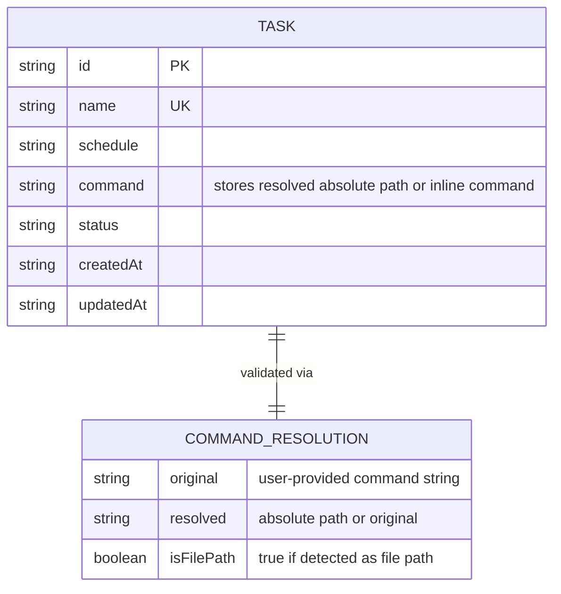
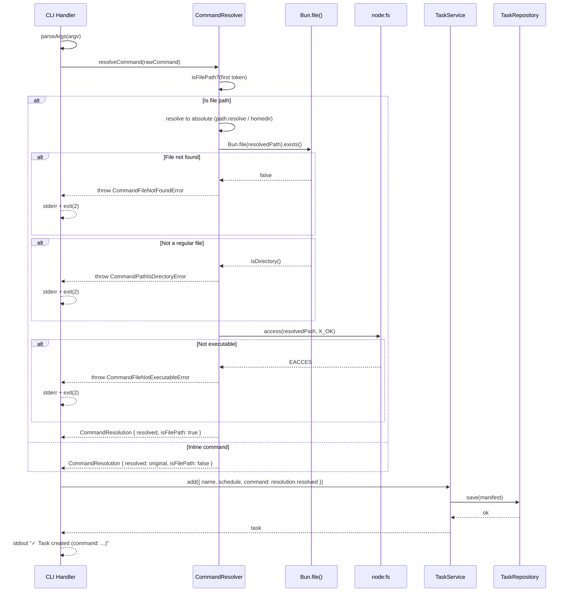

# Technical Plan: Command Path Resolution

- **Feature:** 002-command-path-resolution
- **Status:** Approved
- **Date:** 2026-03-30
- **Spec:** [spec.md](spec.md)

---

## Summary

Add a `resolveCommand()` function in a new `src/cli/command.resolver.ts` module that detects file paths in the `--command` value, resolves them to absolute paths, and validates existence + executable permissions. Integrate into the existing `TaskService.add()` and `TaskService.update()` methods.

---

## Technical Context

| Aspect | Value |
|--------|-------|
| Language | TypeScript (strict) |
| Runtime | Bun |
| Dependencies | `node:path` (resolve), `node:os` (homedir), `Bun.file()` (exists), `node:fs/promises` (access — X_OK only, see note below) |
| Testing | `bun:test` |
| Platform | macOS (local) |
| Project type | CLI tool |

---

## Constitution Check

| Principle | Compliance |
|-----------|------------|
| Simplicity First | Uses only Bun/Node built-ins. No new dependencies. **Note:** `Bun.file()` is used for existence checks per constitution mandate. `node:fs/promises.access(X_OK)` is used for executable permission checks because `Bun.file` does not expose a permissions/stat API — this is the only justified `node:fs` usage |
| Single Responsibility | Path resolution isolated in its own module. Service delegates to it |
| Explicit Over Implicit | Resolved paths always stored; original relative path never persisted |
| Fail Fast | Validation at add/update time, not deferred to execution |
| No Side Effects at Import | `command.resolver.ts` exports pure functions |

---

## ER Diagram

No new entities introduced. The existing `Task.command` field stores the resolved string. A `CommandResolution` value object is used transiently during validation but is not persisted.



---

## Sequence Diagram — Add with File Path



---

## Implementation Plan

### Step 1 — Create error classes

**File:** `src/cli/command.errors.ts` (new)

Create 3 domain error classes:
- `CommandFileNotFoundError(original: string, resolved: string)` — file path does not exist
- `CommandFileNotExecutableError(original: string, resolved: string)` — file exists but not executable
- `CommandPathIsDirectoryError(original: string, resolved: string)` — path resolves to a directory

All extend `Error` with descriptive messages. Map to exit code 2 in `cli.handler.ts`.

**FR coverage:** FR-013, FR-014
**AC coverage:** AC-024, AC-025

### Step 2 — Create command resolver module

**File:** `src/cli/command.resolver.ts` (new)

Functions:
- `isFilePath(command: string): boolean` — checks if first token starts with `./`, `../`, `~/`, or `/`
- `resolveCommand(command: string): Promise<CommandResolution>` — main function:
  1. Extract first token (split on first space)
  2. If not a file path → return `{ original, resolved: original, isFilePath: false }`
  3. Resolve path: `./`/`../` via `path.resolve(cwd)`, `~/` via `homedir()` replacement
  4. For `/`-prefixed commands with arguments: check first token via `Bun.file().exists()`; if not found, treat as inline
  5. Check existence via `Bun.file(resolved).exists()` and verify it is a regular file (not directory) via `Bun.file(resolved).size` + `node:fs/promises.stat().isDirectory()`
  6. Check executable permission: `fs.access(resolved, fs.constants.X_OK)` — justified because `Bun.file` has no permissions API
  7. Reconstruct command: resolved first token + remaining arguments
  8. Return `{ original, resolved: reconstructed, isFilePath: true }`

**FR coverage:** FR-011, FR-012, FR-013, FR-014, FR-015
**AC coverage:** AC-020, AC-021, AC-022, AC-023, AC-024, AC-025, AC-026, AC-027

### Step 3 — Integrate into CLI handler

**File:** `src/cli/cli.handler.ts` (modify)

- In `handleAdd()`: call `resolveCommand()` before passing to `service.add()`. Use the resolved command.
- In `handleUpdate()`: if `--command` is provided, call `resolveCommand()` before passing to `service.update()`.
- Import and map the 3 new error classes in `getExitCode()` (all → exit code 2) and `getErrorHint()`:
  - `CommandFileNotFoundError` → hint: `"Resolved to: {resolved}"`
  - `CommandFileNotExecutableError` → hint: `"Run: chmod +x {resolved}"`
  - `CommandPathIsDirectoryError` → hint: `"Expected a file, not a directory"`
- Update success message in `handleAdd()`: if `resolution.isFilePath`, show `"✓ Task {name} created (command: {resolved})"`.

**FR coverage:** FR-016, FR-017
**AC coverage:** AC-028, AC-029

### Step 4 — Unit tests for command resolver

**File:** `src/cli/command.resolver.test.ts` (new)

Tests:
- `isFilePath` detection: `./foo`, `../foo`, `~/foo`, `/foo` → true; `echo hi`, `curl https://...` → false
- Resolve `./script.sh` from known cwd → absolute path
- Resolve `~/script.sh` → homedir-based path
- Resolve `/abs/script.sh` → same path
- Reject non-existent file → `CommandFileNotFoundError`
- Reject non-executable file → `CommandFileNotExecutableError`
- Reject directory path → `CommandPathIsDirectoryError`
- Path with spaces: `./my scripts/run.sh` with matching file → resolved path preserves space
- Path with arguments: `./run.sh --verbose` → resolved path + ` --verbose`
- `/usr/bin/env python3 -c "..."` → first token exists, treated as file path
- `/nonexistent/tool arg` where first token does not exist → treated as inline (passthrough, no error)
- Inline command passthrough → no validation

**AC coverage:** AC-020 through AC-027

### Step 5 — Integration tests

**File:** `src/cli/cli.integration.test.ts` (modify)

Add tests:
- `shed add` with relative script path → verify absolute path stored in manifest
- `shed add` with non-existent path → exit code 2, error message with resolved path
- `shed add` with non-executable file → exit code 2, chmod hint
- `shed add` with inline command → stored as-is
- `shed add` with directory path → exit code 2, "Path is a directory" error
- `shed update --command` with relative path → verify resolution
- `shed update --command` with non-executable file → exit code 2, chmod hint
- `shed update --schedule` only → no path validation triggered

**AC coverage:** AC-020 through AC-029

### Step 6a — Create implementation.md

- Create `implementation.md` mapping FR-011 through FR-017 and AC-020 through AC-029 to code with `@spec` anchors

### Step 6b — Update changelogs and registry

- Add changelog entry to feature and global changelogs
- Update `.specs/README.md` and `.specs/roadmap.md`

---

## Testing Strategy

| Test Type | What | Where |
|-----------|------|-------|
| Unit | `isFilePath()` detection heuristic | `command.resolver.test.ts` |
| Unit | `resolveCommand()` path resolution + validation | `command.resolver.test.ts` |
| Integration | End-to-end CLI with file paths | `cli.integration.test.ts` |

---

## Risks & Considerations

1. **Platform-specific paths** — `path.resolve` and `homedir` work on macOS. Windows paths are different but out of scope (project is macOS-only).
2. **Permission model** — `X_OK` checks user execute bit. If the file is owned by a different user, the check may not reflect actual runtime permissions under cron.
3. **Race condition** — File may be deleted between validation and cron execution. Accepted as documented in edge case 3.

---

## Resolved Test Commands

```bash
# Run all tests
bun test

# Run only command resolver tests
bun test src/cli/command.resolver.test.ts

# Run integration tests
bun test src/cli/cli.integration.test.ts
```
