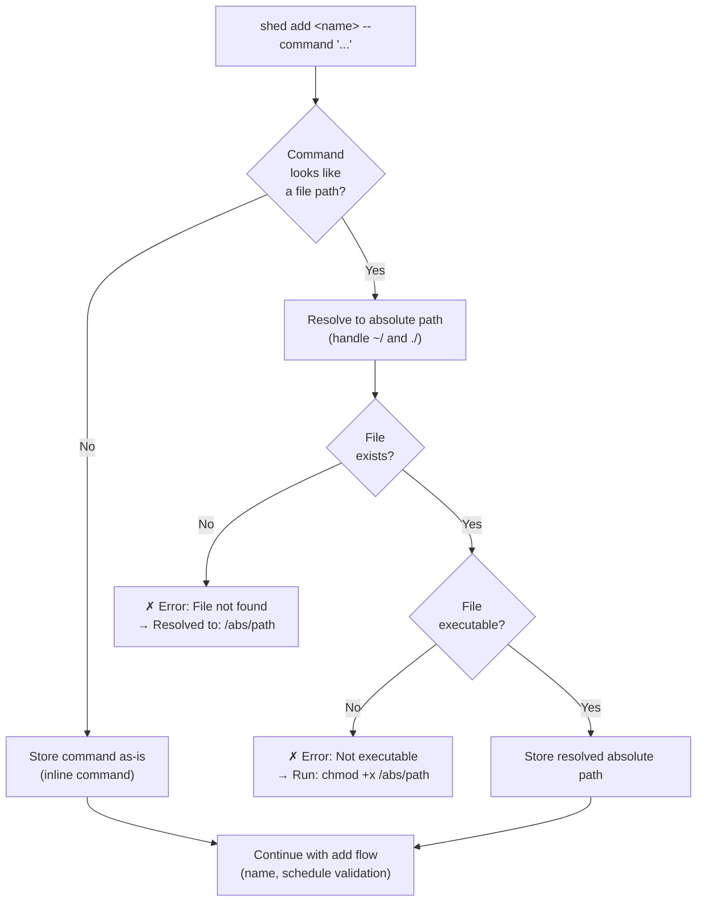
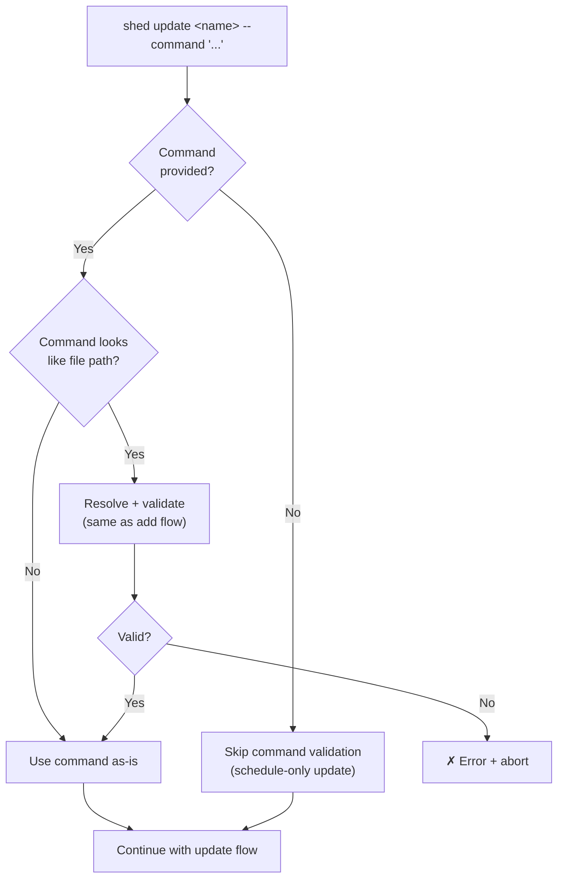
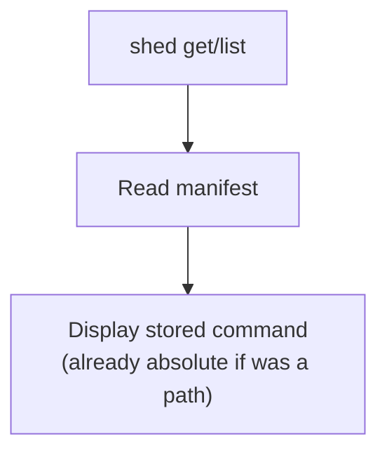

# Feature Spec: Command Path Resolution

- **Feature:** Command Path Resolution
- **Branch:** feature/002-command-path-resolution
- **Date:** 2026-03-30
- **Status:** Implemented
- **Input:** Resolve relative paths to absolute, validate file existence and executable permissions at add time
- **Feature Number:** 002

---

## Context

Feature 001 (Task Manifest & CRUD) stores the `command` field as a raw string. When a developer passes a relative path like `./scripts/backup.sh`, it is stored verbatim. This causes failures at execution time because cron runs from a different working directory.

This feature enhances the `add` and `update` commands to detect file paths in the `--command` value, resolve them to absolute paths, and validate that the referenced file exists and is executable.

---

## Exit Code Conventions

| Code | Meaning |
|------|---------|
| 0 | Success |
| 1 | General error (task not found, already exists) |
| 2 | Bad input (invalid path, missing file, not executable, invalid cron, missing arguments) |
| 3 | Config / filesystem error (permissions, corrupted file) |

---

## User Scenarios & Testing

### Story 1 — Developer adds a task with a script file path `P1`

**Description:** As a developer, I want shed to resolve relative script paths to absolute paths so my cron tasks work regardless of the working directory.

**Priority reason:** Without path resolution, tasks with relative paths silently fail when cron executes them from a different cwd.

**Independent test:** Add a task with `--command './scripts/backup.sh'`, verify the stored command is the resolved absolute path.

```gherkin
Feature: Resolve command file paths on add
  Scenario: Resolve relative path to absolute
    Given a file exists at ./scripts/backup.sh and is executable
    And the current directory is /Users/dev/projects/myapp
    When the developer runs "shed add backup --schedule '0 2 * * *' --command './scripts/backup.sh'"
    Then the task is created with command "/Users/dev/projects/myapp/scripts/backup.sh"
    And stdout shows "✓ Task backup created (command: /Users/dev/projects/myapp/scripts/backup.sh)"

  Scenario: Resolve path starting with ~/
    Given a file exists at ~/scripts/nightly.sh and is executable
    And the user's home directory is /Users/dev
    When the developer runs "shed add nightly --schedule '0 0 * * *' --command '~/scripts/nightly.sh'"
    Then the task is created with command "/Users/dev/scripts/nightly.sh"
    And the stored command does not contain "~"

  Scenario: Accept absolute paths as-is
    Given a file exists at /usr/local/bin/backup.sh and is executable
    When the developer runs "shed add backup --schedule '0 2 * * *' --command '/usr/local/bin/backup.sh'"
    Then the task is created with command "/usr/local/bin/backup.sh"
    And stdout shows "✓ Task backup created (command: /usr/local/bin/backup.sh)"

  Scenario: Reject non-existent file path
    Given no file exists at ./missing.sh
    When the developer runs "shed add broken --schedule '0 0 * * *' --command './missing.sh'"
    Then no task is created
    And stderr shows "✗ Error: File not found: ./missing.sh"
    And stderr shows "→ Resolved to: /Users/dev/projects/myapp/missing.sh"
    And the exit code is 2

  Scenario: Reject non-executable file path
    Given a file exists at ./scripts/data.txt but is not executable
    When the developer runs "shed add bad --schedule '0 0 * * *' --command './scripts/data.txt'"
    Then no task is created
    And stderr shows "✗ Error: File is not executable: ./scripts/data.txt"
    And stderr shows "→ Run: chmod +x /Users/dev/projects/myapp/scripts/data.txt"
    And the exit code is 2

  Scenario: Accept inline commands without validation
    Given no file exists named "curl"
    When the developer runs "shed add ping --schedule '*/5 * * * *' --command 'curl -s https://mysite.com/health'"
    Then the task is created with command "curl -s https://mysite.com/health"
    And no file existence check is performed
```

#### User Flow



---

### Story 2 — Developer updates a task command with a file path `P2`

**Description:** As a developer, I want path resolution to also apply when I update a task's command so that the same safety guarantees apply.

**Priority reason:** Important for consistency, but update is used less frequently than add.

**Independent test:** Update a task's command to a relative path, verify the stored command is resolved.

```gherkin
Feature: Resolve command file paths on update
  Scenario: Resolve relative path on update
    Given a task named "backup" exists
    And a file exists at ./scripts/backup-v2.sh and is executable
    When the developer runs "shed update backup --command './scripts/backup-v2.sh'"
    Then the task command is updated to the resolved absolute path
    And stdout shows "✓ Task backup updated"

  Scenario: Reject non-existent file on update
    Given a task named "backup" exists
    And no file exists at ./gone.sh
    When the developer runs "shed update backup --command './gone.sh'"
    Then the task is unchanged
    And stderr shows "✗ Error: File not found: ./gone.sh"
    And the exit code is 2

  Scenario: Reject non-executable file on update
    Given a task named "backup" exists
    And a file exists at ./scripts/readonly.sh but is not executable
    When the developer runs "shed update backup --command './scripts/readonly.sh'"
    Then the task is unchanged
    And stderr shows "✗ Error: File is not executable: ./scripts/readonly.sh"
    And stderr shows "→ Run: chmod +x"
    And the exit code is 2

  Scenario: Accept inline command on update
    Given a task named "ping" exists
    When the developer runs "shed update ping --command 'curl -s https://newsite.com/health'"
    Then the task command is updated to "curl -s https://newsite.com/health"

  Scenario: Update schedule only without triggering path resolution
    Given a task named "backup" exists with command "/usr/local/bin/backup.sh"
    When the developer runs "shed update backup --schedule '0 4 * * *'"
    Then the task schedule is updated to "0 4 * * *"
    And the task command remains "/usr/local/bin/backup.sh"
    And no file existence check is performed
```

#### User Flow



---

### Story 3 — Developer sees resolved path in task details `P3`

**Description:** As a developer, I want to see the full resolved path when viewing task details so I can verify the command targets the right file.

**Priority reason:** Nice-to-have — the path is already stored resolved, this is just display confirmation.

**Independent test:** Add a task with a relative path, run `shed get`, verify the absolute path is shown.

```gherkin
Feature: Display resolved path in task details
  Scenario: Show resolved path in get output
    Given a task named "backup" exists with command "/Users/dev/projects/myapp/scripts/backup.sh"
    When the developer runs "shed get backup"
    Then stdout shows "Command:    /Users/dev/projects/myapp/scripts/backup.sh"

  Scenario: Show resolved path in list table
    Given a task named "backup" exists with command "/Users/dev/projects/myapp/scripts/backup.sh"
    When the developer runs "shed list"
    Then the table shows the absolute path in the COMMAND column
```

#### User Flow



---

## Acceptance Criteria

| # | Criterion | Story |
|---|-----------|-------|
| AC-020 | When the first token of `--command` starts with `./`, `../`, `~/`, or `/`, it is treated as a file path. For `/`-prefixed commands with spaces, the first token must exist as a file to be treated as a path; otherwise the command is treated as inline | Story 1, 2 |
| AC-021 | Relative file paths (starting with `./` or `../`) are resolved to absolute paths using `path.resolve()` from the current working directory | Story 1, 2 |
| AC-022 | Paths starting with `~/` are expanded to the user's home directory | Story 1 |
| AC-023 | Absolute paths (starting with `/`) are accepted as-is but still validated for existence and permissions | Story 1 |
| AC-024 | If the resolved file does not exist, the command is rejected with an error showing both the original and resolved paths, exit code 2 | Story 1, 2 |
| AC-025 | If the resolved file exists but is not executable, the command is rejected with a hint to `chmod +x`, exit code 2 | Story 1, 2 |
| AC-026 | Inline commands (no path indicators) are stored as-is without file validation | Story 1, 2 |
| AC-027 | The resolved absolute path is stored in tasks.json, never the relative path | Story 1, 2 |
| AC-028 | The success message for `add` includes the resolved path when the command was a file path | Story 1 |
| AC-029 | Path resolution and validation apply to both `add` and `update --command` | Story 2 |

---

## Functional Requirements

| # | Requirement | AC |
|---|------------|-----|
| FR-011 | The system must detect file paths in the `--command` value by checking if the first token (before first space) starts with `./`, `../`, `~/`, or `/`. Commands starting with `/` that contain spaces are only treated as file paths if the first token exists as a file; otherwise they are treated as inline commands | AC-020 |
| FR-012 | The system must resolve relative paths to absolute using `path.resolve()` (via `node:path`) and `~/` paths using `homedir()` (via `node:os`) — both Bun built-ins | AC-021, AC-022 |
| FR-013 | The system must validate that the resolved path exists on disk using file system access check | AC-023, AC-024 |
| FR-014 | The system must validate that the resolved file has executable permissions (user execute bit) | AC-025 |
| FR-015 | The system must store the resolved absolute path in the task manifest, not the original relative path | AC-027 |
| FR-016 | The system must include the resolved path in the success message when a file path command is detected | AC-028 |
| FR-017 | Path resolution and validation must be applied consistently in both `add` and `update` code paths | AC-029 |

---

## Key Entities

### CommandResolution (value object)

```typescript
interface CommandResolution {
  original: string;      // user-provided command string
  resolved: string;      // absolute path (if file path) or original (if inline)
  isFilePath: boolean;   // whether the command was detected as a file path
}
```

---

## Edge Cases

1. **Command contains `/` but is not a file path** — e.g. `curl https://example.com/api`. Detection heuristic: only treat as file path if starts with `/`, `./`, `../`, or `~/`. A command like `curl https://...` does not start with these prefixes, so it passes through as inline.
2. **Symlinked files** — `path.resolve` follows the logical path, not the symlink target. This is correct — the user expects the path they provided.
3. **File becomes non-existent after add** — Validation is at add time only. If the file is deleted later, execution will fail (handled by future error tracking feature).
4. **Path with spaces** — Resolved path may contain spaces. Store as-is; quoting is the caller's responsibility when building crontab entries.
5. **Path starts with `/` but is an inline command** — e.g. `/usr/bin/env python3 -c "print('hi')"`. The first token `/usr/bin/env` exists as a file, so it is treated as a file path command. The resolved command stores the absolute path with arguments preserved: `/usr/bin/env python3 -c "print('hi')"`.
6. **Relative path with arguments** — e.g. `./scripts/run.sh --verbose`. The first token `./scripts/run.sh` is the path to resolve; the rest are arguments preserved as-is. Stored as `/abs/path/scripts/run.sh --verbose`.
7. **Path resolves to a directory** — e.g. `./scripts/` resolves to a directory. The system must check that the resolved path is a regular file (not a directory). Error: `"✗ Error: Path is a directory, not a file: ./scripts/"` with exit code 2.

---

## Success Criteria

| # | Criterion | Measurement |
|---|-----------|-------------|
| SC-006 | Relative paths are resolved to absolute in stored tasks | Unit test: add with `./script.sh`, verify stored path is absolute |
| SC-007 | Non-existent file paths are rejected at add time | Unit test: add with `./missing.sh`, verify error and no task created |
| SC-008 | Non-executable files are rejected at add time | Unit test: add with non-executable file, verify error with chmod hint |
| SC-009 | Inline commands pass through without file validation | Unit test: add with `echo hello`, verify no file check performed |
| SC-010 | Path resolution works consistently for add and update | Integration test: add then update with relative path, verify both resolve |
