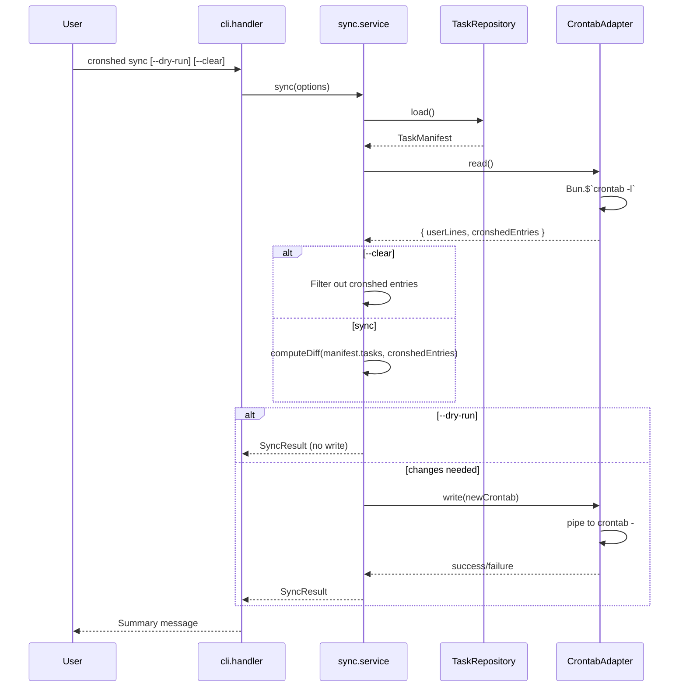
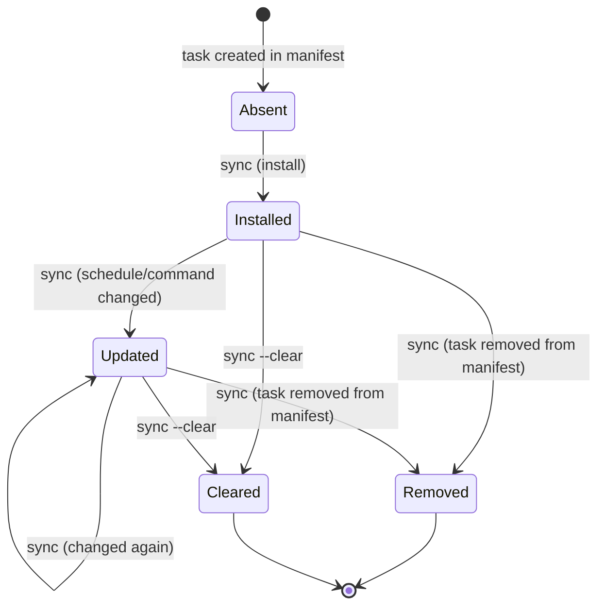

# Plan — Crontab Sync

- **Feature:** 003-crontab-sync
- **Status:** Approved
- **Date:** 2026-03-30

---

## Summary

Add a `sync` subcommand that reconciles the task manifest with the system crontab using marker comments (`# cronshed:<name>`) to identify managed entries. Implemented as an isolated crontab adapter + sync service + CLI handler.

---

## Technical Context

| Aspect | Value |
|--------|-------|
| Language | TypeScript (strict) |
| Runtime | Bun |
| Storage | tasks.json (read via existing TaskRepository) |
| Crontab I/O | `crontab -l` (read), `crontab -` via stdin pipe (write) |
| Shell execution | `Bun.$` for crontab commands |
| Testing | bun:test |
| Platform | macOS |

---

## Constitution Check

| Principle | Compliance |
|-----------|-----------|
| Simplicity First | No new dependencies. Uses system `crontab` binary and `Bun.$` |
| Single Responsibility | Crontab adapter isolated in `src/crontab/`. Sync logic in service. CLI in handler |
| Explicit Over Implicit | Marker comments make cronshed entries identifiable. Sync diff is reported |
| Fail Fast | Validate crontab access before writing. Clear error on access denied |
| No Side Effects at Import | All modules export functions/classes only |

---

## Sequence Diagram — Sync Flow

```gherkin
Feature: Sync execution flow
  Scenario: Successful sync with changes
    Given an authenticated system user
    When the developer runs "cronshed sync"
    Then the system reads the manifest
    And reads the current crontab
    And computes the diff
    And writes the new crontab
    And reports the summary

  Scenario: Sync with crontab write failure
    Given the system denies crontab write access
    When the developer runs "cronshed sync"
    Then the system reads the manifest and crontab successfully
    And the write to crontab fails
    And the system reports exit code 3 with actionable hint
```



---

## State Diagram — Crontab Entry Lifecycle

```gherkin
Feature: Crontab entry states
  Scenario: Install new entry
    Given a task exists in manifest but not in crontab
    When sync runs
    Then the entry state becomes Installed

  Scenario: Entry becomes stale
    Given a task was removed from manifest
    When sync runs
    Then the entry is removed from crontab
```



---

## Implementation Plan

### Step 1 — Crontab adapter (`src/crontab/crontab.adapter.ts`)

**Creates:** `src/crontab/crontab.adapter.ts`, `src/crontab/crontab.types.ts`, `src/crontab/crontab.errors.ts`

**`crontab.types.ts`:**
```typescript
export interface CrontabEntry {
  taskName: string;
  schedule: string;
  command: string;
}

export interface ParsedCrontab {
  userLines: string[];       // non-cronshed lines, order preserved
  entries: CrontabEntry[];   // parsed cronshed entries
}
```

**`crontab.errors.ts`:**
```typescript
export class CrontabReadError extends Error { ... }
export class CrontabWriteError extends Error { ... }
```

**`crontab.adapter.ts`:**
- `read(): Promise<ParsedCrontab>` — runs `crontab -l` via `Bun.$`, parses output
  - Lines matching `# cronshed:<name>` followed by a cron line → `CrontabEntry`
  - Orphaned markers (no following cron line) → silently skipped (not included in entries or userLines)
  - All other lines → `userLines`
  - Exit code 1 with "no crontab" → returns empty ParsedCrontab
- `write(userLines: string[], entries: CrontabEntry[]): Promise<void>` — builds crontab string, pipes to `crontab -`
  - Format: userLines (if any) + blank line + sorted entries (marker + cron line)
  - No leading blank line when userLines is empty
- `buildCrontabLine(entry: CrontabEntry): string[]` — returns `["# cronshed:<name>", "<schedule> <command>"]`

**FR coverage:** FR-020, FR-021, FR-023, FR-026, FR-027, FR-028

### Step 2 — Crontab adapter tests (`src/crontab/crontab.adapter.test.ts`)

**Creates:** `src/crontab/crontab.adapter.test.ts`

Tests use a mock approach: the adapter accepts an optional `executor` parameter (function that runs shell commands) to avoid touching the real crontab in tests.

- Parse crontab with cronshed entries and user lines
- Parse empty crontab (exit code 1)
- Parse crontab with orphaned markers
- Build crontab output with correct ordering and blank line separator
- Build crontab output without leading blank line when no user lines

**AC coverage:** AC-030, AC-031 (orphaned markers), AC-033, AC-040

### Step 3 — Sync service (`src/crontab/sync.service.ts`)

**Creates:** `src/crontab/sync.service.ts`

```typescript
export interface SyncOptions {
  dryRun?: boolean;
  clear?: boolean;
}

export interface SyncResult {
  installed: number;
  updated: number;
  removed: number;
  total: number;          // tasks in manifest
  isUpToDate: boolean;
  diff?: SyncDiffEntry[]; // for dry-run display
}

export interface SyncDiffEntry {
  type: "install" | "update" | "remove";
  taskName: string;
  schedule?: string;
  command?: string;
  oldSchedule?: string;
  oldCommand?: string;
}
```

- `sync(options: SyncOptions): Promise<SyncResult>`
  1. Load manifest via TaskRepository (missing manifest → empty tasks array)
  2. Read crontab via CrontabAdapter
  3. If `--clear`: remove all cronshed entries, write, return result
  4. Compute diff: compare manifest tasks vs crontab entries by task name
  5. If no changes → return `isUpToDate: true`
  6. If `--dry-run` → return diff without writing
  7. Build new entries from manifest tasks, write via adapter

**FR coverage:** FR-022, FR-024, FR-025

### Step 4 — Sync service tests (`src/crontab/sync.service.test.ts`)

**Creates:** `src/crontab/sync.service.test.ts`

Tests inject mock TaskRepository and CrontabAdapter:

- Install tasks into empty crontab
- Update changed schedule/command
- Remove orphaned entries
- Idempotent sync (no changes)
- Clear all entries
- Dry-run returns diff without writing
- Missing manifest → treat as empty

**AC coverage:** AC-030, AC-031, AC-032, AC-034, AC-035, AC-036, AC-037, AC-039, AC-041

### Step 5 — CLI handler (`src/cli/cli.handler.ts`)

**Modifies:** `src/cli/cli.handler.ts`, `src/cli/cli.formatter.ts`

Add `handleSync` function:
- Parse flags: `--dry-run`, `--clear`
- Call `SyncService.sync(options)`
- Format and display result

Add sync formatting to `cli.formatter.ts`:
- `formatSyncResult(result: SyncResult): string` — summary message
- `formatSyncDiff(diff: SyncDiffEntry[]): string` — dry-run diff display

Register `sync` in the `SUBCOMMANDS` map.

Update help text to include `sync`.

**FR coverage:** FR-024 (display), FR-027 (error handling)

### Step 6 — CLI integration tests (`src/cli/cli.integration.test.ts`)

**Modifies:** `src/cli/cli.integration.test.ts`

Add integration tests for the `sync` subcommand. These tests use a mock crontab executor (same approach as step 2) to avoid touching the real system crontab.

- `sync` installs tasks and reports counts
- `sync --dry-run` shows diff without writing
- `sync --clear` removes entries
- `sync` with corrupted manifest → exit 3
- `sync` with crontab write failure → exit 3

**AC coverage:** AC-035, AC-036, AC-037, AC-038

### Step 7 — Spec artifacts

**Creates:** `changelog.md`, updates `implementation.md`

**Modifies:** `.specs/roadmap.md` (mark crontab-sync as checked), `.specs/README.md` (add feature row), `.specs/changelog.md` (add entry)

---

## Testing Strategy

| Layer | What | Tool | Isolation |
|-------|------|------|-----------|
| Unit | Crontab parsing/building | bun:test | Mock executor |
| Unit | Sync diff algorithm | bun:test | Mock repo + adapter |
| Integration | CLI sync subcommand | bun:test + Bun.$ | Mock crontab executor |

**No real crontab is touched in any test.** The adapter accepts an injected executor for testability. The default executor uses `Bun.$` for production.

---

## Risks & Considerations

| Risk | Mitigation |
|------|-----------|
| Accidental crontab corruption | Atomic: read entire crontab, rebuild, write entire crontab. No partial writes |
| Tests touching system crontab | Injected executor pattern — tests never run real `crontab` commands |
| `crontab -l` behavior varies across macOS versions | Test against known exit code 1 + "no crontab" pattern. Document macOS assumption |
| Future wrapper-script interaction | Adapter takes `command` as input — wrapper scripts will change the command value, not the adapter |
