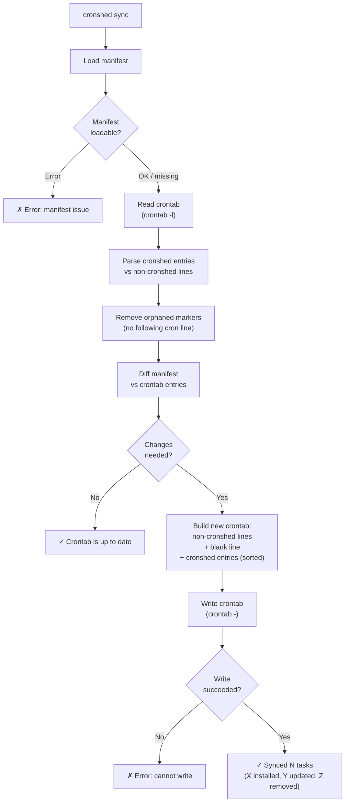
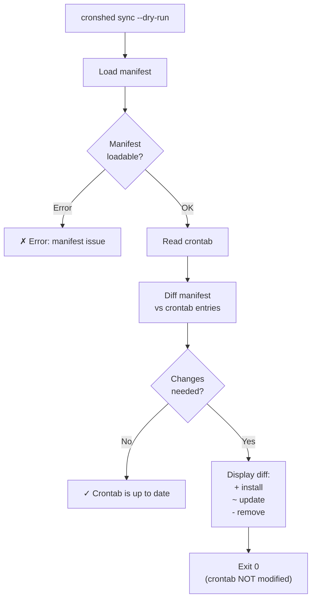
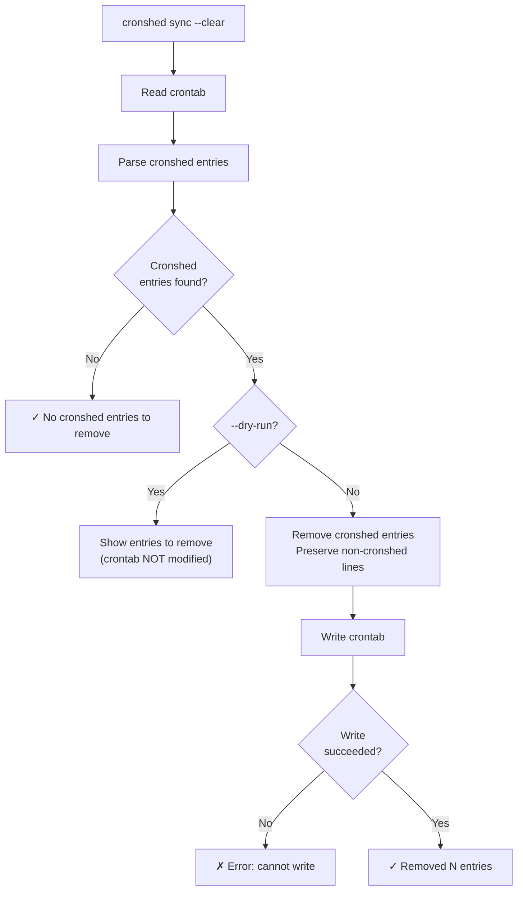

# Feature Spec: Crontab Sync

- **Feature:** Crontab Sync
- **Branch:** —
- **Date:** 2026-03-30
- **Status:** Implemented
- **Feature Number:** 003
- **Input:** Install/remove crontab entries from task manifest

---

## Exit Code Conventions

Inherited from 001-task-manifest:

| Code | Meaning |
|------|---------|
| 0 | Success |
| 1 | General error (task not found) |
| 2 | Bad input (missing arguments) |
| 3 | Config / filesystem error (crontab access denied, corrupted manifest) |

---

## Design Decisions

### Crontab Entry Format

Each cronshed-managed entry in the crontab consists of a **marker comment** followed by the cron line:

```
# cronshed:backup-db
0 2 * * * /usr/local/bin/backup.sh
```

The marker comment (`# cronshed:<task-name>`) allows cronshed to identify, update, and remove its own entries without touching user-managed crontab lines.

### Crontab Interaction

- **Read:** `crontab -l` to get the current crontab contents
- **Write:** pipe new contents to `crontab -` to replace the entire crontab
- Non-cronshed lines are preserved verbatim in their original order
- Cronshed entries are grouped at the end of the crontab, separated by a blank line
- **Platform:** macOS crontab behavior (tested against macOS `crontab` binary)

### Sync Semantics

`cronshed sync` performs a **full reconciliation** between the task manifest and the crontab:

1. **Install** — active tasks in manifest but missing from crontab are added
2. **Update** — active tasks in manifest whose schedule or command differs from crontab are updated
3. **Remove** — cronshed marker entries in crontab for tasks not in the manifest are removed

This is idempotent: running `sync` twice with no manifest changes produces no crontab changes.

### Ordering

Cronshed entries in the crontab are sorted alphabetically by task name. This ensures deterministic output and makes idempotency verifiable. If existing cronshed entries are in non-alphabetical order, a sync will rewrite them in sorted order (counted as an update in the summary).

### Future Compatibility

When the wrapper-script feature (004) is implemented, the crontab entry's command will point to the wrapper script (`~/.cronshed/tasks/<name>.sh`) instead of the raw command. The crontab adapter is designed so the command portion is provided by the caller — no hardcoded format.

---

## User Scenarios & Testing

### Story 1 — Developer syncs all tasks to crontab `P1`

**Description:** As a developer, I want to sync my task manifest to the system crontab so that all active tasks are scheduled.

**Priority reason:** Core purpose of this feature — without sync, tasks exist only in the manifest and never execute.

**Independent test:** Add 2 tasks to manifest, run sync, verify both appear in crontab with correct schedules and commands.

```gherkin
Feature: Sync all tasks to crontab
  Scenario: Install tasks into empty crontab
    Given tasks.json contains 2 active tasks: "backup-db" (schedule "0 2 * * *", command "/usr/local/bin/backup.sh") and "cleanup-logs" (schedule "0 4 * * 0", command "find /tmp -name '*.log' -delete")
    And the crontab is empty
    When the developer runs "cronshed sync"
    Then the crontab contains 2 cronshed entries with correct markers and cron lines
    And entries are sorted alphabetically by task name
    And stdout shows "✓ Synced 2 tasks to crontab (2 installed, 0 updated, 0 removed)"
    And the exit code is 0

  Scenario: Sync with existing non-cronshed entries
    Given tasks.json contains 1 active task "backup-db" (schedule "0 2 * * *", command "/usr/local/bin/backup.sh")
    And the crontab contains a non-cronshed entry "30 3 * * * /usr/bin/custom-job"
    When the developer runs "cronshed sync"
    Then the crontab contains the original non-cronshed entry at the top
    And the crontab contains the cronshed entry for "backup-db" after a blank line
    And stdout shows "✓ Synced 1 task to crontab (1 installed, 0 updated, 0 removed)"

  Scenario: Update a changed schedule
    Given tasks.json contains "backup-db" with schedule "0 3 * * *" and command "/usr/local/bin/backup.sh"
    And the crontab contains a cronshed entry for "backup-db" with schedule "0 2 * * *"
    When the developer runs "cronshed sync"
    Then the crontab entry for "backup-db" is updated to schedule "0 3 * * *"
    And stdout shows "✓ Synced 1 task to crontab (0 installed, 1 updated, 0 removed)"

  Scenario: Update a changed command
    Given tasks.json contains "backup-db" with command "/usr/local/bin/backup-v2.sh"
    And the crontab contains a cronshed entry for "backup-db" with command "/usr/local/bin/backup.sh"
    When the developer runs "cronshed sync"
    Then the crontab entry for "backup-db" is updated to the new command
    And stdout shows "✓ Synced 1 task to crontab (0 installed, 1 updated, 0 removed)"

  Scenario: Remove orphaned cronshed entry
    Given tasks.json contains no tasks
    And the crontab contains a cronshed entry for "old-task" (schedule "0 0 * * *", command "echo old")
    When the developer runs "cronshed sync"
    Then the cronshed entry for "old-task" is removed from crontab
    And stdout shows "✓ Synced 0 tasks to crontab (0 installed, 0 updated, 1 removed)"

  Scenario: Idempotent sync (no changes needed)
    Given tasks.json contains "backup-db" (schedule "0 2 * * *", command "/usr/local/bin/backup.sh")
    And the crontab already contains the matching cronshed entry for "backup-db"
    When the developer runs "cronshed sync"
    Then the crontab is unchanged
    And stdout shows "✓ Crontab is up to date (1 task)"

  Scenario: Sync with empty manifest
    Given tasks.json contains no tasks
    And the crontab is empty
    When the developer runs "cronshed sync"
    Then the crontab remains empty
    And stdout shows "✓ Crontab is up to date (0 tasks)"

  Scenario: Sync when manifest does not exist and crontab has stale entries
    Given tasks.json does not exist
    And the crontab contains a cronshed entry for "stale-task"
    When the developer runs "cronshed sync"
    Then the cronshed entry for "stale-task" is removed from crontab
    And non-cronshed entries are preserved
    And stdout shows "✓ Synced 0 tasks to crontab (0 installed, 0 updated, 1 removed)"

  Scenario: Sync when manifest does not exist and crontab is clean
    Given tasks.json does not exist
    And the crontab contains no cronshed entries
    When the developer runs "cronshed sync"
    Then the crontab is unchanged
    And stdout shows "✓ Crontab is up to date (0 tasks)"

  Scenario: Remove orphaned marker without cron line
    Given the crontab contains a line "# cronshed:broken-task" with no following cron line
    And tasks.json contains no task named "broken-task"
    When the developer runs "cronshed sync"
    Then the orphaned marker line is removed from crontab
    And stdout includes "1 removed" in the summary

  Scenario: Crontab access denied
    Given the system denies write access to crontab
    When the developer runs "cronshed sync"
    Then stderr shows "✗ Error: Cannot write to crontab"
    And stderr shows "→ Check crontab permissions or run 'crontab -e' to verify access"
    And the exit code is 3
```

#### User Flow



---

### Story 2 — Developer previews sync changes `P1`

**Description:** As a developer, I want to preview what sync would do without actually modifying the crontab, so I can verify changes before applying them.

**Priority reason:** Safety net — crontab changes affect running schedules. A dry-run prevents unintended modifications.

**Independent test:** Add tasks to manifest with stale crontab, run sync --dry-run, verify no crontab changes but diff is shown.

```gherkin
Feature: Preview sync changes
  Scenario: Dry run shows pending changes
    Given tasks.json contains "backup-db" (schedule "0 2 * * *", command "/usr/local/bin/backup.sh")
    And the crontab contains a cronshed entry for "old-task" but not "backup-db"
    When the developer runs "cronshed sync --dry-run"
    Then stdout shows an install line for "backup-db"
    And stdout shows a remove line for "old-task"
    And the crontab is NOT modified
    And the exit code is 0

  Scenario: Dry run shows update
    Given tasks.json contains "backup-db" with schedule "0 3 * * *"
    And the crontab contains a cronshed entry for "backup-db" with schedule "0 2 * * *"
    When the developer runs "cronshed sync --dry-run"
    Then stdout shows an update line for "backup-db"
    And the crontab is NOT modified

  Scenario: Dry run with no changes
    Given tasks.json and crontab are in sync
    When the developer runs "cronshed sync --dry-run"
    Then stdout shows "✓ Crontab is up to date (N tasks)"
    And the exit code is 0

  Scenario: Dry run with manifest error
    Given tasks.json contains invalid JSON
    When the developer runs "cronshed sync --dry-run"
    Then stderr shows "✗ Error: tasks.json is corrupted (invalid JSON)"
    And the exit code is 3
```

#### User Flow



---

### Story 3 — Developer removes all cronshed entries from crontab `P2`

**Description:** As a developer, I want to remove all cronshed-managed entries from the crontab so I can cleanly uninstall or reset scheduling.

**Priority reason:** Important for cleanup, but not required for daily use.

**Independent test:** Add cronshed entries and non-cronshed entries to crontab, run sync --clear, verify only cronshed entries are removed.

```gherkin
Feature: Clear all cronshed entries from crontab
  Scenario: Clear cronshed entries preserving others
    Given the crontab contains 2 cronshed entries and 1 non-cronshed entry
    When the developer runs "cronshed sync --clear"
    Then all cronshed entries are removed from crontab
    And the non-cronshed entry is preserved
    And stdout shows "✓ Removed 2 cronshed entries from crontab"
    And the exit code is 0

  Scenario: Clear when no cronshed entries exist
    Given the crontab contains only non-cronshed entries
    When the developer runs "cronshed sync --clear"
    Then the crontab is unchanged
    And stdout shows "✓ No cronshed entries to remove"
    And the exit code is 0

  Scenario: Clear with empty crontab
    Given the crontab is empty
    When the developer runs "cronshed sync --clear"
    Then stdout shows "✓ No cronshed entries to remove"
    And the exit code is 0

  Scenario: Clear with --dry-run
    Given the crontab contains 2 cronshed entries
    When the developer runs "cronshed sync --clear --dry-run"
    Then stdout shows the 2 entries that would be removed
    And the crontab is NOT modified
    And the exit code is 0

  Scenario: Clear with crontab write failure
    Given the crontab contains cronshed entries
    And the system denies write access to crontab
    When the developer runs "cronshed sync --clear"
    Then stderr shows "✗ Error: Cannot write to crontab"
    And stderr shows "→ Check crontab permissions or run 'crontab -e' to verify access"
    And the exit code is 3
```

#### User Flow



---

## Acceptance Criteria

| # | Criterion | Story |
|---|-----------|-------|
| AC-030 | `cronshed sync` installs active tasks from manifest into crontab with `# cronshed:<name>` marker comments | Story 1 |
| AC-031 | `cronshed sync` removes orphaned cronshed entries (in crontab but not in manifest), including orphaned markers without cron lines | Story 1 |
| AC-032 | `cronshed sync` updates crontab entries when schedule or command differs from manifest | Story 1 |
| AC-033 | `cronshed sync` preserves non-cronshed crontab entries verbatim in their original order | Story 1, 3 |
| AC-034 | `cronshed sync` is idempotent — running twice with no manifest changes produces no crontab modification | Story 1 |
| AC-035 | `cronshed sync` reports install/update/remove counts in the success message | Story 1 |
| AC-036 | `cronshed sync --dry-run` shows the diff without modifying the crontab | Story 2 |
| AC-037 | `cronshed sync --clear` removes all cronshed entries from crontab, preserving non-cronshed entries | Story 3 |
| AC-038 | `cronshed sync` and `cronshed sync --clear` fail with exit code 3 and actionable message when crontab is not writable | Story 1, 3 |
| AC-039 | `cronshed sync` treats a missing manifest as empty (removes stale cronshed entries if any, no-op otherwise) | Story 1 |
| AC-040 | Cronshed entries are grouped at the end of the crontab, separated from non-cronshed entries by a blank line, sorted alphabetically by task name | Story 1 |
| AC-041 | `cronshed sync --clear --dry-run` shows entries that would be removed without modifying crontab | Story 3 |

---

## Functional Requirements

> FR-018 and FR-019 are intentionally reserved (gap between feature 002's FR-017 and this feature).

| # | Requirement | AC |
|---|------------|-----|
| FR-020 | The system must read the current crontab via `crontab -l` and write via piping to `crontab -`. macOS-specific: `crontab -l` returns exit code 1 with "no crontab for user" when empty | AC-030, AC-031, AC-032, AC-037, AC-039 |
| FR-021 | Each cronshed-managed crontab entry must consist of a marker comment (`# cronshed:<task-name>`) on the line before the cron line | AC-030, AC-033 |
| FR-022 | The sync algorithm must diff manifest tasks against parsed cronshed entries and produce install/update/remove operations | AC-030, AC-031, AC-032, AC-034, AC-035 |
| FR-023 | When writing the crontab, non-cronshed lines must appear first (preserving order), followed by a blank separator line, then cronshed entries sorted alphabetically by task name | AC-033, AC-040 |
| FR-024 | `--dry-run` flag must compute and display the diff without writing to crontab | AC-036, AC-041 |
| FR-025 | `--clear` flag must remove all lines matching `# cronshed:*` patterns and their associated cron lines from the crontab | AC-037 |
| FR-026 | When `crontab -l` returns "no crontab for user" (exit code 1 on macOS), the system must treat this as an empty crontab, not an error | AC-039 |
| FR-027 | When writing to crontab fails (via `sync` or `--clear`), the system must report the error to stderr with exit code 3 and an actionable hint | AC-038 |
| FR-028 | Orphaned marker comments (`# cronshed:<name>` without a following cron line) must be silently removed during sync | AC-031 |

---

## Key Entities

### CrontabEntry (parsed from crontab)

```typescript
interface CrontabEntry {
  taskName: string;   // extracted from "# cronshed:<name>"
  schedule: string;   // cron expression from the cron line
  command: string;    // command from the cron line
}
```

### SyncDiff (computed by sync algorithm)

```typescript
interface SyncDiff {
  install: Task[];           // in manifest, not in crontab
  update: { task: Task; existing: CrontabEntry }[];  // in both, but differ
  remove: CrontabEntry[];    // in crontab, not in manifest
  unchanged: Task[];         // in both, identical
}
```

---

## Edge Cases

1. **Empty crontab** — `crontab -l` may return exit code 1 with "no crontab for user" on macOS. Treat as empty, not error (FR-026).
2. **Crontab with only comments** — Non-cronshed comments are preserved. Only `# cronshed:*` patterns are managed.
3. **Malformed cronshed entries** — If a `# cronshed:<name>` marker exists but the next line is not a valid cron line (or is another marker, or is EOF), remove the orphaned marker during sync (FR-028, AC-031).
4. **Concurrent crontab access** — Another process modifies crontab between read and write. Acceptable for single-user tool — last-write-wins, same as task manifest.
5. **Task name with special crontab characters** — Task names are already validated as kebab-case by feature 001. No special escaping needed.
6. **Very long commands** — Crontab supports long lines. No truncation or wrapping.
7. **CRONSHED_HOME override** — Sync reads manifest from the configured data directory (respects `CRONSHED_HOME`).
8. **No crontab command available** — If `crontab` binary is not in PATH, report clear error with exit code 3.

---

## Success Criteria

| # | Criterion | Measurement |
|---|-----------|-------------|
| SC-006 | Sync installs, updates, and removes entries correctly | All Gherkin scenarios pass as tests |
| SC-007 | Non-cronshed entries are never modified or reordered | Integration test verifies preservation |
| SC-008 | Sync is idempotent | Running sync twice produces identical crontab |
| SC-009 | Dry-run shows accurate diff without side effects | Integration test verifies crontab unchanged after dry-run |
| SC-010 | Clear removes only cronshed entries | Integration test verifies non-cronshed entries preserved |
