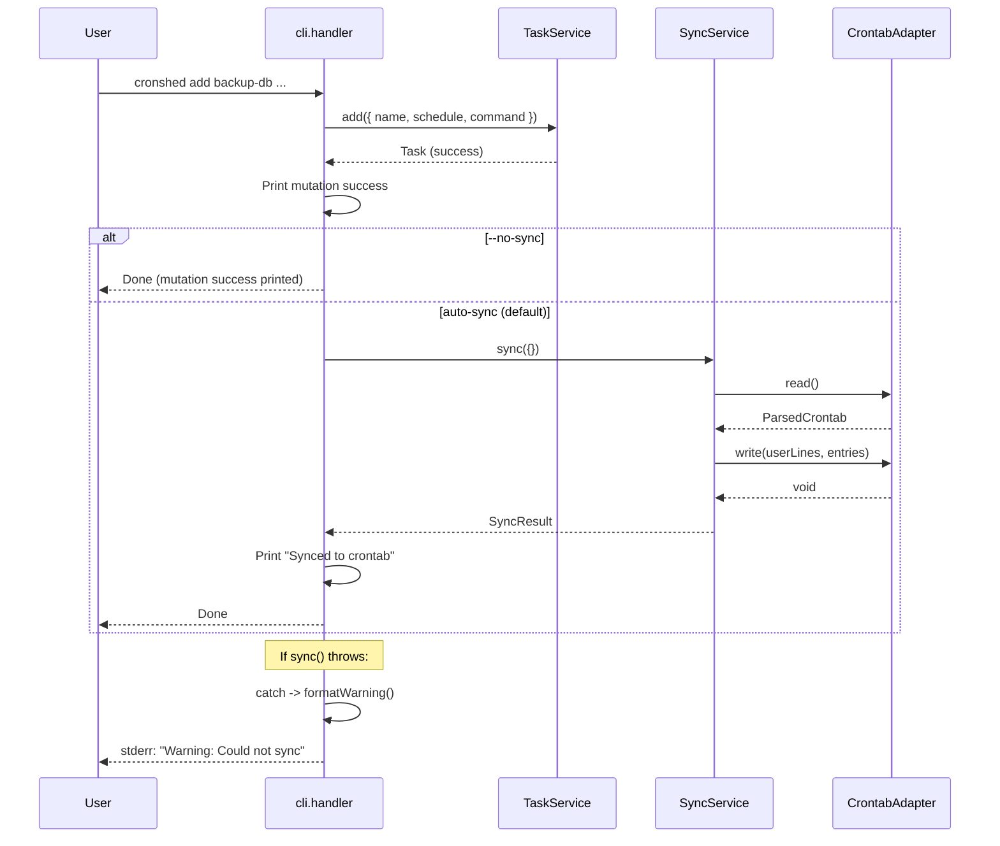

# Plan: Auto-Sync

- **Feature:** 004 — Auto-Sync
- **Date:** 2026-03-30
- **Status:** Approved

---

## Summary

Wire `SyncService.sync()` into the CLI handler's `add`, `remove`, and `update` functions with a non-fatal try/catch wrapper. Add `--no-sync` flag to all three commands. No changes to `SyncService`, `TaskService`, or `CrontabAdapter`.

---

## Technical Context

| Dimension | Value |
|-----------|-------|
| Language | TypeScript (strict) |
| Runtime | Bun |
| Testing | bun:test |
| Key files | `src/cli/cli.handler.ts`, `src/cli/cli.formatter.ts` |
| Dependencies | `SyncService` (003), `CrontabAdapter` (003) |

---

## Constitution Check

| Principle | Compliance |
|-----------|-----------|
| Simplicity First | No new modules, no new deps. Wiring only. |
| Single Responsibility | CLI handler orchestrates; SyncService does the work. No business logic added to handler. |
| Explicit Over Implicit | Auto-sync is the new default (explicit Design Decision). `--no-sync` is the escape hatch. |
| Fail Fast | Mutation errors remain fatal. Auto-sync errors are an intentional exception (documented in spec). |
| No Side Effects at Import | All changes inside handler functions. |

---

## Sequence Diagram

```gherkin
Feature: Auto-sync after mutation
  Scenario: Successful add with auto-sync
    Given a TaskService and SyncService are initialized
    When the CLI handler processes "add backup-db --schedule '0 2 * * *' --command '/usr/local/bin/backup.sh'"
    Then TaskService.add() is called first
    And SyncService.sync() is called after
    And stdout shows the success message followed by sync confirmation

  Scenario: Add with sync failure
    Given a TaskService and SyncService are initialized
    And the crontab is not writable
    When the CLI handler processes "add backup-db --schedule '0 2 * * *' --command '/usr/local/bin/backup.sh'"
    Then TaskService.add() succeeds
    And SyncService.sync() throws CrontabWriteError
    And the handler catches the error and prints a warning to stderr
    And the exit code is 0
```



---

## Implementation Plan

### Step 1 — Add `formatWarning` and `formatSyncConfirmation` to formatter

**File:** `src/cli/cli.formatter.ts`

**Changes:**
- Add `formatWarning(message: string, hint?: string): string` — prefixes with `!` warning marker, optional hint line with arrow (same pattern as `formatError`)
- Add `formatSyncConfirmation(): string` — returns `formatSuccess("Synced to crontab")`

**Why separate functions:** Follows the existing pattern (`formatSuccess`, `formatError`). Keeps handler logic clean.

**Tests:** `src/cli/cli.formatter.test.ts` — add tests for both new functions.

### Step 2 — Update handler signature, dispatcher, and add `autoSync` helper

**File:** `src/cli/cli.handler.ts`

**Changes:**

1. **Split SUBCOMMANDS into two maps** to avoid unused parameters on read-only handlers:
   - `QUERY_SUBCOMMANDS: Record<string, (args: string[], service: TaskService) => Promise<void>>` — contains `list`, `get`
   - `MUTATION_SUBCOMMANDS: Record<string, (args: string[], service: TaskService, repo: TaskRepository) => Promise<void>>` — contains `add`, `remove`, `update`

2. **Update `runCli` dispatch** to check `MUTATION_SUBCOMMANDS` first (pass `repo`), then `QUERY_SUBCOMMANDS` (no `repo`), then `STANDALONE_COMMANDS`.

3. **Add `autoSync(repo: TaskRepository)` helper function:**
   - Creates `CrontabAdapter` and `SyncService(repo, adapter)` internally
   - Calls `syncService.sync({})` (default options — no dryRun, no clear)
   - On success: prints `formatSyncConfirmation()` to stdout
   - On error: prints `formatWarning("Could not sync to crontab", "Run 'cronshed sync' to retry")` to stderr
   - **Never throws** — all errors are caught internally via scoped try/catch

**Why this design:**
- `handleList`/`handleGet` keep their existing 2-param signature (no unused `repo`)
- `handleSync` stays in `STANDALONE_COMMANDS` (separate dispatch path, structurally immune to this change)
- Mutation handlers get `repo` to pass to `autoSync`

**Note:** Unrecognized flags (e.g. `--dry-run` on `add`) are caught by `parseArgs`'s strict mode and surface as a parse error — no special handling needed.

### Step 3 — Wire `--no-sync` and auto-sync into `handleAdd`

**File:** `src/cli/cli.handler.ts`

**Changes:**
- Add `"no-sync": { type: "boolean", default: false }` to `parseArgs` options in `handleAdd`
- After the existing success print, if `!values["no-sync"]`: call `await autoSync(repo)`
- Handler signature changes from `(args: string[], service: TaskService)` to `(args: string[], service: TaskService, repo: TaskRepository)`

### Step 4 — Wire `--no-sync` and auto-sync into `handleRemove`

**File:** `src/cli/cli.handler.ts`

**Changes:**
- Add `parseArgs` call to parse `--no-sync` flag. Currently `handleRemove` takes the name from `args[0]` but does no flag parsing. The new code:
  ```typescript
  const name = args[0];
  // ... name validation ...
  const { values } = parseArgs({
    args: args.slice(1),
    options: {
      "no-sync": { type: "boolean", default: false },
    },
    allowPositionals: false,
  });
  ```
- After the existing `service.remove()` + success print, if `!values["no-sync"]`: call `await autoSync(repo)`
- Handler signature changes to include `repo: TaskRepository`

### Step 5 — Wire `--no-sync` and auto-sync into `handleUpdate`

**File:** `src/cli/cli.handler.ts`

**Changes:**
- Add `"no-sync": { type: "boolean", default: false }` to the existing `parseArgs` options in `handleUpdate`
- After the existing success print, if `!values["no-sync"]`: call `await autoSync(repo)`
- Handler signature changes to include `repo: TaskRepository`

### Step 6 — Integration tests for auto-sync

**File:** `src/cli/auto-sync.integration.test.ts` (new file, co-located with `cli.handler.ts`)

**Tests:**
- AC-042: `add` auto-syncs (verify task in crontab after add)
- AC-043: `remove` auto-syncs (verify task removed from crontab)
- AC-044: `update` auto-syncs (verify crontab entry updated)
- AC-045: `--no-sync` skips crontab (verify crontab unchanged) — one test per command
- AC-046: Sync failure is non-fatal (mock adapter throws `CrontabWriteError` on write, verify exit 0 + stderr warning) — one test per command
- AC-047: Sync confirmation message on stdout
- AC-049: Batch `--no-sync` + manual sync

**Test approach:** Use the same test adapter pattern from `sync.integration.test.ts`. Create a `TestCrontabAdapter` that stores crontab content in memory. For failure tests, use an adapter whose `write()` throws `CrontabWriteError`.

**Regression note:** `handleSync` is in `STANDALONE_COMMANDS` (separate dispatch path from `MUTATION_SUBCOMMANDS`). The signature change in Step 2 does not affect `handleSync`. Running `bun test` confirms all 003-crontab-sync tests in `sync.service.test.ts` and `sync.integration.test.ts` pass unchanged.

### Step 7 — Update help text

**File:** `src/cli/cli.handler.ts`

**Changes:**
- Update the help text in `runCli` to mention `[--no-sync]` for `add`, `update`, and `remove`

---

## Testing Strategy

| Test type | What | File |
|-----------|------|------|
| Unit | `formatWarning`, `formatSyncConfirmation` | `cli.formatter.test.ts` |
| Integration | Auto-sync on add/remove/update, --no-sync, failure handling | `auto-sync.integration.test.ts` |
| Regression | All existing 003-crontab-sync tests still pass | `sync.service.test.ts`, `sync.integration.test.ts` |

---

## Risks & Considerations

1. **Dispatch split** — Splitting `SUBCOMMANDS` into `QUERY_SUBCOMMANDS` and `MUTATION_SUBCOMMANDS` adds a second lookup in `runCli`. Low risk — the dispatch function is simple and testable.
2. **Double crontab write on rapid mutations** — If a user runs `add` twice quickly, two sync calls may race. Acceptable for single-user tool (last-write-wins, same as existing `sync`).
3. **Test isolation** — Integration tests must use in-memory adapter, never touch real crontab. Same pattern as feature 003.
