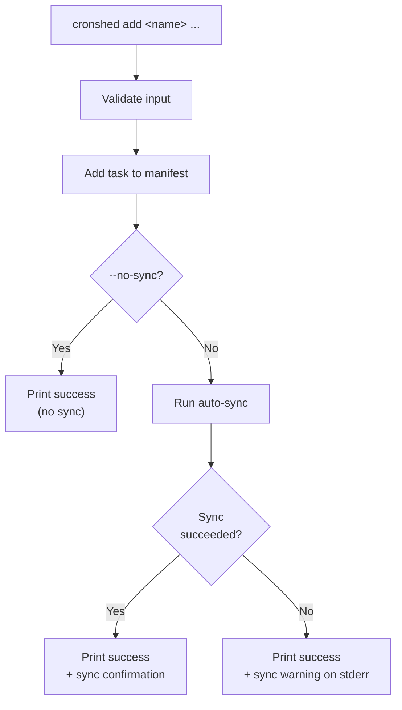
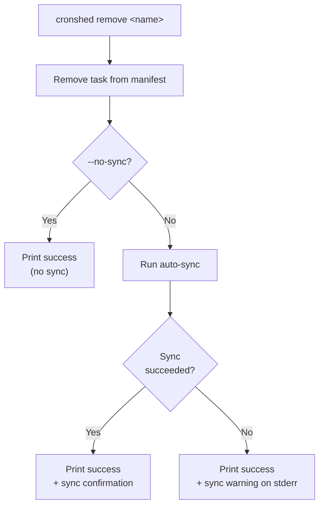
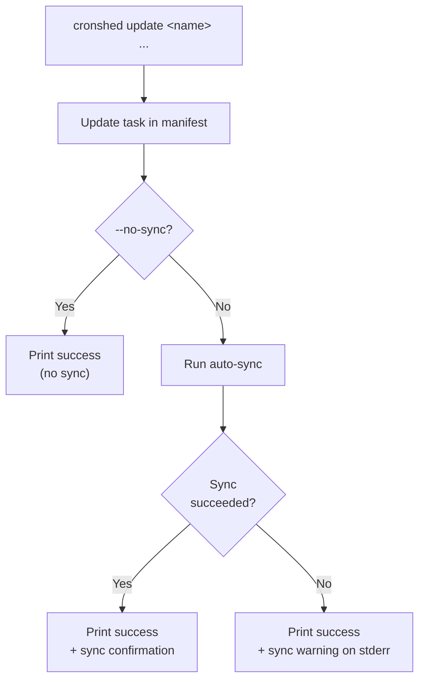
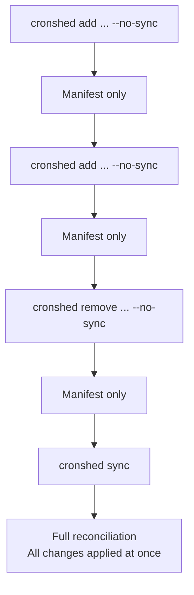

# Feature Spec: Auto-Sync

- **Feature:** Auto-Sync
- **Branch:** —
- **Date:** 2026-03-30
- **Status:** Implemented
- **Feature Number:** 004
- **Input:** Auto-sync crontab after task mutations (add/remove/update) — eliminate the need for explicit `sync` after every task change

---

## Design Decisions

### Auto-Sync by Default

Task mutation commands (`add`, `remove`, `update`) automatically sync the crontab after modifying the manifest. This eliminates the friction of a mandatory two-step workflow (`add` + `sync`) for the most common use case.

**Rationale:** 99% of the time, a developer adding a task expects it to be immediately scheduled. The two-step workflow makes sense for infrastructure tools (Terraform, Ansible) but is overkill for a personal cron manager.

### `--no-sync` Escape Hatch

All mutation commands accept `--no-sync` to skip the automatic crontab sync. This is useful for:
- Batching multiple changes before a single sync
- Working offline or when crontab is temporarily unavailable
- Scripting scenarios where the caller manages sync explicitly

### `sync` Remains a Standalone Command

The existing `cronshed sync` command is unchanged. It remains useful for:
- Manual reconciliation (`sync --dry-run` to preview)
- Cleanup (`sync --clear`)
- Recovery after `--no-sync` mutations

### Sync Errors Are Non-Fatal for Mutations

If the manifest mutation succeeds but the auto-sync fails (e.g. crontab access denied), the command:
1. Reports the mutation success
2. Warns about the sync failure on stderr
3. Exits with code 0 (the primary operation succeeded)
4. Suggests running `cronshed sync` manually

This ensures `add`/`remove`/`update` never fail because of crontab issues — the manifest is always the source of truth.

> **Note:** This is an intentional exception to the constitution's Fail Fast principle. The manifest is the authoritative source of truth; the crontab is an eventually-consistent projection. Auto-sync errors are scoped to the `SyncService.sync()` call only — mutation-level errors (validation, manifest I/O) remain fatal with their original exit codes.

---

## User Scenarios & Testing

### Story 1 — Developer adds a task and it is immediately scheduled `P1`

**Description:** As a developer, I want `cronshed add` to automatically install the task in the crontab so I don't need to run `sync` separately.

**Priority reason:** Core UX improvement — the most common workflow should be a single command.

**Independent test:** Add a task, verify it appears in both `tasks.json` and the crontab without an explicit sync.

```gherkin
Feature: Auto-sync on add
  Scenario: Add task auto-syncs to crontab
    Given tasks.json is empty
    And the crontab has no cronshed entries
    When the developer runs "cronshed add backup-db --schedule '0 2 * * *' --command '/usr/local/bin/backup.sh'"
    Then tasks.json contains "backup-db"
    And the crontab contains a cronshed entry for "backup-db" with schedule "0 2 * * *" and command "/usr/local/bin/backup.sh"
    And stdout shows "Task backup-db created"
    And stdout shows "Synced to crontab"
    And the exit code is 0

  Scenario: Add task with --no-sync skips crontab
    Given tasks.json is empty
    And the crontab has no cronshed entries
    When the developer runs "cronshed add backup-db --schedule '0 2 * * *' --command '/usr/local/bin/backup.sh' --no-sync"
    Then tasks.json contains "backup-db"
    And the crontab has no cronshed entries
    And stdout shows "Task backup-db created"
    And stdout does NOT contain "Synced"
    And the exit code is 0

  Scenario: Add task when crontab is not writable
    Given tasks.json is empty
    And the system denies write access to crontab
    When the developer runs "cronshed add backup-db --schedule '0 2 * * *' --command '/usr/local/bin/backup.sh'"
    Then tasks.json contains "backup-db"
    And stderr shows "Warning: Could not sync to crontab"
    And stderr shows "Run 'cronshed sync' to retry"
    And the exit code is 0
```

#### User Flow



---

### Story 2 — Developer removes a task and it is immediately unscheduled `P1`

**Description:** As a developer, I want `cronshed remove` to automatically remove the task from the crontab so it stops executing immediately.

**Priority reason:** A removed task that keeps executing is confusing and potentially harmful.

**Independent test:** Add a task (with sync), remove it, verify it is gone from both `tasks.json` and the crontab.

```gherkin
Feature: Auto-sync on remove
  Scenario: Remove task auto-syncs to crontab
    Given tasks.json contains "backup-db" (schedule "0 2 * * *", command "/usr/local/bin/backup.sh")
    And the crontab contains a cronshed entry for "backup-db"
    When the developer runs "cronshed remove backup-db"
    Then tasks.json does not contain "backup-db"
    And the crontab does not contain a cronshed entry for "backup-db"
    And stdout shows "Task backup-db removed"
    And stdout shows "Synced to crontab"
    And the exit code is 0

  Scenario: Remove task with --no-sync keeps crontab entry
    Given tasks.json contains "backup-db"
    And the crontab contains a cronshed entry for "backup-db"
    When the developer runs "cronshed remove backup-db --no-sync"
    Then tasks.json does not contain "backup-db"
    And the crontab still contains a cronshed entry for "backup-db"
    And stdout shows "Task backup-db removed"
    And the exit code is 0

  Scenario: Remove task when crontab is not writable
    Given tasks.json contains "backup-db"
    And the crontab contains a cronshed entry for "backup-db"
    And the system denies write access to crontab
    When the developer runs "cronshed remove backup-db"
    Then tasks.json does not contain "backup-db"
    And the crontab still contains the entry for "backup-db"
    And stderr shows "Warning: Could not sync to crontab"
    And the exit code is 0
```

#### User Flow



---

### Story 3 — Developer updates a task and the crontab reflects the change `P1`

**Description:** As a developer, I want `cronshed update` to automatically update the crontab entry so the new schedule or command takes effect immediately.

**Priority reason:** An updated schedule that doesn't take effect is a silent bug — the old schedule keeps running.

**Independent test:** Add a task with schedule A, update to schedule B, verify crontab shows schedule B without explicit sync.

```gherkin
Feature: Auto-sync on update
  Scenario: Update schedule auto-syncs to crontab
    Given tasks.json contains "backup-db" with schedule "0 2 * * *"
    And the crontab contains a cronshed entry for "backup-db" with schedule "0 2 * * *"
    When the developer runs "cronshed update backup-db --schedule '0 3 * * *'"
    Then tasks.json contains "backup-db" with schedule "0 3 * * *"
    And the crontab entry for "backup-db" has schedule "0 3 * * *"
    And stdout shows "Task backup-db updated"
    And stdout shows "Synced to crontab"
    And the exit code is 0

  Scenario: Update command auto-syncs to crontab
    Given tasks.json contains "backup-db" with command "/usr/local/bin/backup.sh"
    And the crontab contains a cronshed entry for "backup-db" with command "/usr/local/bin/backup.sh"
    When the developer runs "cronshed update backup-db --command '/usr/local/bin/backup-v2.sh'"
    Then tasks.json contains "backup-db" with command "/usr/local/bin/backup-v2.sh"
    And the crontab entry for "backup-db" has command "/usr/local/bin/backup-v2.sh"
    And stdout shows "Task backup-db updated"
    And stdout shows "Synced to crontab"
    And the exit code is 0

  Scenario: Update task when crontab is not writable
    Given tasks.json contains "backup-db" with schedule "0 2 * * *"
    And the crontab contains a cronshed entry for "backup-db" with schedule "0 2 * * *"
    And the system denies write access to crontab
    When the developer runs "cronshed update backup-db --schedule '0 3 * * *'"
    Then tasks.json contains "backup-db" with schedule "0 3 * * *"
    And the crontab entry for "backup-db" still has schedule "0 2 * * *"
    And stderr shows "Warning: Could not sync to crontab"
    And stderr shows "Run 'cronshed sync' to retry"
    And the exit code is 0

  Scenario: Update with --no-sync skips crontab
    Given tasks.json contains "backup-db" with schedule "0 2 * * *"
    And the crontab contains a cronshed entry for "backup-db" with schedule "0 2 * * *"
    When the developer runs "cronshed update backup-db --schedule '0 3 * * *' --no-sync"
    Then tasks.json contains "backup-db" with schedule "0 3 * * *"
    And the crontab entry for "backup-db" still has schedule "0 2 * * *"
    And the exit code is 0
```

#### User Flow



---

### Story 4 — Developer batches multiple changes before syncing `P2`

**Description:** As a developer, I want to make multiple task changes without syncing after each one, then sync once at the end.

**Priority reason:** Useful for scripting and batch operations, but most users won't need this.

**Independent test:** Add 3 tasks with `--no-sync`, run `sync`, verify all 3 appear in crontab.

```gherkin
Feature: Batch mutations with --no-sync
  Scenario: Batch add then sync
    Given tasks.json is empty
    When the developer runs "cronshed add task-a --schedule '0 1 * * *' --command 'echo a' --no-sync"
    And the developer runs "cronshed add task-b --schedule '0 2 * * *' --command 'echo b' --no-sync"
    And the developer runs "cronshed add task-c --schedule '0 3 * * *' --command 'echo c' --no-sync"
    And the developer runs "cronshed sync"
    Then the crontab contains cronshed entries for "task-a", "task-b", and "task-c"
    And stdout of sync shows "3 installed"

  Scenario: Mix add and remove then sync
    Given tasks.json contains "old-task"
    And the crontab contains a cronshed entry for "old-task"
    When the developer runs "cronshed add new-task --schedule '0 1 * * *' --command 'echo new' --no-sync"
    And the developer runs "cronshed remove old-task --no-sync"
    And the developer runs "cronshed sync"
    Then the crontab contains a cronshed entry for "new-task"
    And the crontab does not contain a cronshed entry for "old-task"
    And stdout of sync shows "1 installed" and "1 removed"
```

#### User Flow



---

## Acceptance Criteria

| # | Criterion | Story |
|---|-----------|-------|
| AC-042 | `cronshed add` automatically syncs the new task to crontab after manifest write | Story 1 |
| AC-043 | `cronshed remove` automatically syncs the removal to crontab after manifest write | Story 2 |
| AC-044 | `cronshed update` automatically syncs the updated task to crontab after manifest write | Story 3 |
| AC-045 | `--no-sync` flag on `add`, `remove`, and `update` skips the automatic crontab sync | Story 1, 2, 3 |
| AC-046 | When auto-sync fails (e.g. crontab not writable), the mutation still succeeds with exit code 0, a warning is printed to stderr, and a recovery hint suggests `cronshed sync` | Story 1, 2, 3 |
| AC-047 | Auto-sync output shows a brief confirmation message (e.g. "Synced to crontab") on stdout | Story 1, 2, 3 |
| AC-048 | The existing `cronshed sync` command continues to work unchanged | Story 4 |
| AC-049 | Batch mutations with `--no-sync` followed by `cronshed sync` applies all changes correctly | Story 4 |

---

## Functional Requirements

| # | Requirement | AC |
|---|------------|-----|
| FR-029 | After a successful `add` operation, the CLI handler must call `SyncService.sync()` with default options (`{}`) unless `--no-sync` is provided | AC-042, AC-045 |
| FR-030 | After a successful `remove` operation, the CLI handler must call `SyncService.sync()` with default options (`{}`) unless `--no-sync` is provided | AC-043, AC-045 |
| FR-031 | After a successful `update` operation, the CLI handler must call `SyncService.sync()` with default options (`{}`) unless `--no-sync` is provided | AC-044, AC-045 |
| FR-032 | Auto-sync errors must be caught via a try/catch scoped to the `SyncService.sync()` call only. Errors are reported as a non-fatal warning on stderr, without changing the exit code. Mutation-level errors (validation, manifest I/O) remain fatal with their original exit codes via the existing `getExitCode()` handler | AC-046 |
| FR-033 | When auto-sync succeeds, a brief confirmation ("Synced to crontab") must be printed to stdout after the mutation success message | AC-047 |
| FR-034 | All mutation subcommands (`add`, `remove`, `update`) must accept a `--no-sync` presence flag (`type: "boolean"`, default: `false`). Consistent with `parseArgs` boolean handling — no value argument accepted | AC-045 |
| FR-035 | The `cronshed sync` standalone command and its flags (`--dry-run`, `--clear`) must remain unchanged | AC-048 |

---

## Key Entities

No new entities. This feature modifies the CLI handler layer to wire existing `SyncService` into mutation commands.

---

## Edge Cases

1. **Crontab access denied during auto-sync** — Mutation succeeds, sync warning printed. User can retry with `cronshed sync`.
2. **Manifest save succeeds but sync throws** — The manifest is the source of truth. The crontab is eventually consistent via manual `sync`.
3. **`--no-sync` with `--dry-run`** — `--dry-run` is not a valid flag for `add`/`remove`/`update`. Only `sync` supports it.
4. **Task validation fails** — The sync never runs because the mutation itself fails before reaching the sync step.
5. **Auto-sync during concurrent crontab access** — Same last-write-wins semantics as manual `sync`. Acceptable for single-user tool.
6. **Crontab entry orphaned after remove + failed auto-sync** — If `remove` succeeds but auto-sync fails, the crontab entry persists. Recovery: `cronshed sync` removes orphaned entries. If the manifest is also deleted, `cronshed sync --clear` removes all cronshed entries.

---

## Success Criteria

| # | Criterion | Measurement |
|---|-----------|-------------|
| SC-011 | Add/remove/update auto-sync by default | All Gherkin scenarios pass |
| SC-012 | --no-sync correctly skips crontab write | Integration tests verify crontab unchanged |
| SC-013 | Sync failures are non-fatal for mutations | Test with mock adapter that throws on write |
| SC-014 | Existing sync command unchanged | All 003-crontab-sync tests still pass |
