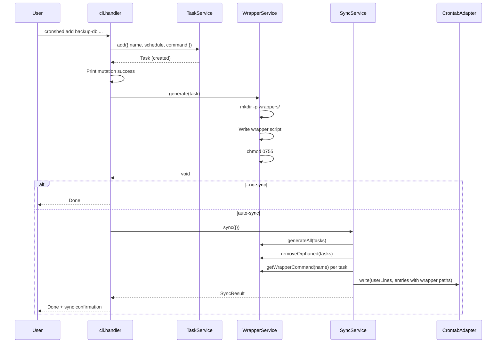
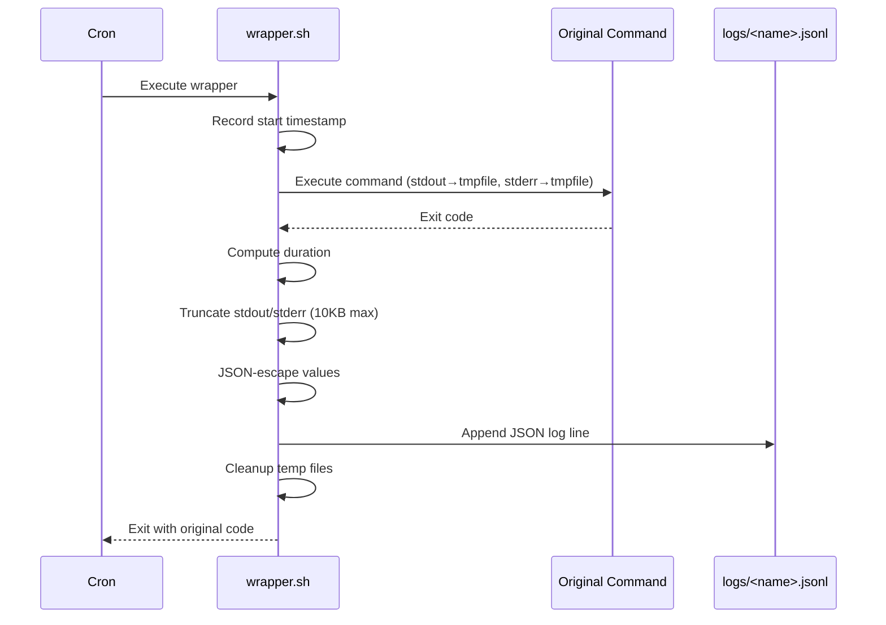
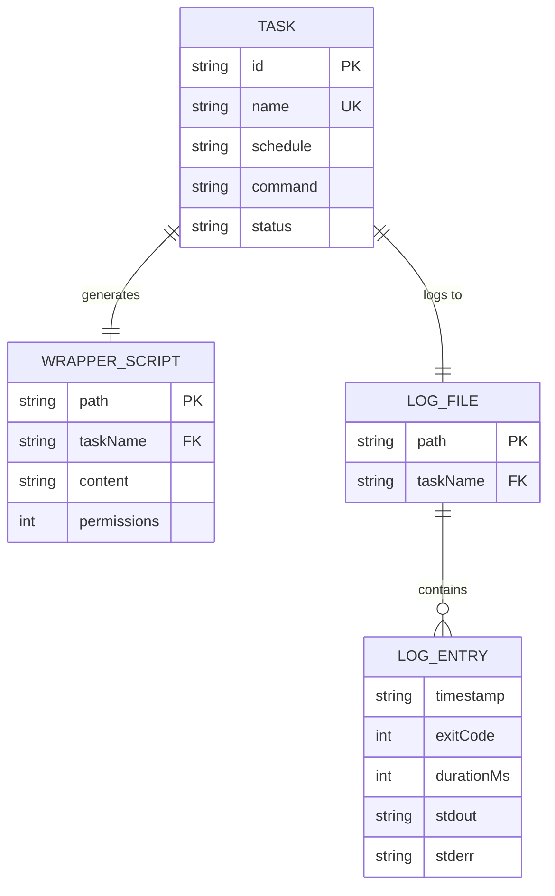

# Plan: Wrapper Script Generation

- **Feature:** 005 — Wrapper Script Generation
- **Date:** 2026-03-30
- **Status:** Approved

---

## Summary

Add a `WrapperService` that generates self-contained bash wrapper scripts per task, wire it into the CLI handler (add/update/remove) and SyncService, and make crontab entries point to wrappers instead of raw commands.

---

## Technical Context

| Dimension | Value |
|-----------|-------|
| Language | TypeScript (strict) |
| Runtime | Bun |
| Testing | bun:test |
| Key files | `src/wrapper/wrapper.service.ts` (new), `src/cli/cli.handler.ts`, `src/crontab/sync.service.ts` |
| Dependencies | `TaskService` (001), `SyncService` (003), `CrontabAdapter` (003) |
| Shell | bash (wrapper scripts), macOS-compatible |

---

## Constitution Check

| Principle | Compliance |
|-----------|-----------|
| Simplicity First | Pure bash wrappers, no new npm deps. WrapperService is one new module |
| Single Responsibility | WrapperService handles wrapper lifecycle. CLI orchestrates. SyncService calls WrapperService for regeneration |
| Explicit Over Implicit | Wrapper content is readable bash. Log format is documented JSON Lines |
| Fail Fast | Directory creation errors surface immediately. Permission errors are clear |
| No Side Effects at Import | WrapperService exports class/functions only |

---

## Sequence Diagram — Add with Wrapper

```gherkin
Feature: Add task with wrapper generation
  Scenario: Successful add with wrapper
    Given WrapperService and TaskService are initialized
    When the CLI handler processes "add backup-db --schedule '0 2 * * *' --command '/usr/local/bin/backup.sh'"
    Then TaskService.add() creates the task
    And WrapperService.generate() creates the wrapper script
    And autoSync syncs to crontab with wrapper path as command

  Scenario: Add when wrappers directory does not exist
    Given the wrappers directory does not exist
    When the CLI handler processes "add backup-db --schedule '0 2 * * *' --command '/usr/local/bin/backup.sh'"
    Then WrapperService.generate() creates the directory
    And the wrapper script is created with 0755 permissions
```



---

## Sequence Diagram — Wrapper Execution

```gherkin
Feature: Wrapper execution at cron time
  Scenario: Successful execution
    Given cron triggers the wrapper script
    When the wrapper executes the original command
    Then stdout and stderr are captured to temp files
    And a JSON log entry is appended to the log file
    And the wrapper exits with the command's exit code

  Scenario: Command failure
    Given cron triggers the wrapper script
    When the original command exits with code 42
    Then the log entry records exitCode 42
    And the wrapper exits with code 42
```



---

## ER Diagram — Data Model



---

## Implementation Plan

### Step 1 — Config helpers for wrapper and log paths

**File:** `src/app/config.ts`

**Changes:**
- Add `getWrappersDir(): string` — returns `<dataDir>/wrappers`
- Add `getLogsDir(): string` — returns `<dataDir>/logs`
- Add `getWrapperPath(taskName: string): string` — returns `<dataDir>/wrappers/<taskName>.sh`
- Add `getLogPath(taskName: string): string` — returns `<dataDir>/logs/<taskName>.jsonl`

**Tests:** `src/app/config.test.ts` — test all path helpers with default and custom `CRONSHED_HOME`.

### Step 2 — WrapperService

**File:** `src/wrapper/wrapper.service.ts` (new), `src/wrapper/wrapper.types.ts` (new), `src/wrapper/wrapper.errors.ts` (new)

**`wrapper.types.ts`:**
```typescript
export interface WrapperConfig {
  taskName: string;
  command: string;
  logPath: string;
  maxOutputBytes: number;
}

export const MAX_OUTPUT_BYTES = 10240;
```

**`wrapper.errors.ts`:**
```typescript
export class WrapperGenerationError extends Error {
  constructor(public readonly taskName: string, cause?: Error) {
    super(`Failed to generate wrapper for task "${taskName}"`);
    this.name = "WrapperGenerationError";
    if (cause) this.cause = cause;
  }
}
```

**`wrapper.service.ts`:**

```typescript
export class WrapperService {
  constructor(private readonly dataDir: string) {}

  // Generate a wrapper script for a task
  async generate(task: { name: string; command: string }): Promise<string>

  // Remove a wrapper script (no-op if missing)
  async remove(taskName: string): Promise<void>

  // Generate all wrappers from tasks, remove orphaned wrappers
  async syncWrappers(tasks: { name: string; command: string }[]): Promise<void>

  // Get the absolute path to the wrapper script
  getWrapperPath(taskName: string): string

  // Build the bash script content
  buildScript(config: WrapperConfig): string
}
```

Key implementation details:
- `generate()`: creates `wrappers/` dir via `mkdir -p`, writes script via `Bun.write()`, sets mode `0755` via `chmod`
- `remove()`: uses `unlink` with try/catch for ENOENT (silent no-op)
- `syncWrappers()`: generates all wrappers from tasks array, then scans `wrappers/` dir and deletes files not in the tasks array
- `buildScript()`: returns the bash script string with hardcoded paths (no env var interpolation at runtime)

### Step 3 — WrapperService unit tests

**File:** `src/wrapper/wrapper.service.test.ts` (new)

**Tests:**
- `buildScript()` produces valid bash with correct command and paths
- `buildScript()` includes truncation logic
- `buildScript()` includes JSON escape function
- `generate()` creates file with 0755 permissions
- `generate()` creates `wrappers/` directory if missing
- `remove()` deletes wrapper file
- `remove()` succeeds silently when file is missing
- `syncWrappers()` generates all and removes orphaned
- `getWrapperPath()` returns correct absolute path

**AC coverage:** AC-050, AC-051, AC-054, AC-056, AC-058, AC-062

### Step 4 — Wire WrapperService into CLI handler

**File:** `src/cli/cli.handler.ts`

**Changes:**

1. **Import** `WrapperService` and `WrapperGenerationError`

2. **`handleAdd`**: After `service.add()` and success print, before `autoSync()`:
   ```typescript
   const wrapperService = new WrapperService(getDataDir());
   await wrapperService.generate(task);
   ```

3. **`handleUpdate`**: After `service.update()` and success print, before `autoSync()`:
   - Only if the command was updated (`values.command` was provided):
   ```typescript
   if (values.command) {
     const wrapperService = new WrapperService(getDataDir());
     await wrapperService.generate(task);
   }
   ```

4. **`handleRemove`**: After `service.remove()` and success print, before `autoSync()`:
   ```typescript
   const wrapperService = new WrapperService(getDataDir());
   await wrapperService.remove(name);
   ```

5. **Add `WrapperGenerationError` to `getExitCode()`**: map to exit code 3 (filesystem error)

6. **Add `WrapperGenerationError` to `getErrorHint()`**: return hint about checking permissions

### Step 5 — Wire WrapperService into SyncService

**File:** `src/crontab/sync.service.ts`

**Changes:**

1. **Constructor**: Accept optional `WrapperService` parameter:
   ```typescript
   constructor(
     private readonly repo: TaskRepository,
     private readonly adapter: CrontabAdapter,
     private readonly wrapperService?: WrapperService,
   ) {}
   ```

2. **`sync()` method**: After loading manifest and before computing diff:
   - If `wrapperService` is provided and `!options.dryRun`:
     - Call `wrapperService.syncWrappers(tasks)` to regenerate all wrappers and remove orphaned
   - When building `newEntries`, use `wrapperService.getWrapperPath(t.name)` as the command if `wrapperService` is provided:
     ```typescript
     const newEntries: CrontabEntry[] = tasks.map((t) => ({
       taskName: t.name,
       schedule: t.schedule,
       command: this.wrapperService
         ? this.wrapperService.getWrapperPath(t.name)
         : t.command,
     }));
     ```

3. **Backward compat**: When `wrapperService` is undefined, behavior is unchanged (raw commands). This maintains all existing 003 and 004 tests.

### Step 6 — Update autoSync and handleSync to pass WrapperService

**File:** `src/cli/cli.handler.ts`

**Changes:**

1. **`autoSync(repo)`**: Create `WrapperService` and pass to `SyncService`:
   ```typescript
   const wrapperService = new WrapperService(getDataDir());
   const syncService = new SyncService(repo, adapter, wrapperService);
   ```

2. **`handleSync(args)`**: Same change — create `WrapperService` and pass to `SyncService`.

### Step 7 — Integration tests for wrapper lifecycle

**File:** `src/wrapper/wrapper.integration.test.ts` (new)

**Tests:**
- AC-050: Add generates wrapper with correct permissions
- AC-051: Wrapper contains correct command and log path
- AC-052: Execute wrapper, parse log entry, verify all fields
- AC-053: Wrapper exit code matches command exit code
- AC-054: Update command regenerates wrapper
- AC-055: Update schedule only does not regenerate wrapper
- AC-056: Remove deletes wrapper, succeeds if missing
- AC-057: Remove preserves log file
- AC-058: Sync regenerates all wrappers, removes orphaned
- AC-059: Sync --dry-run does not create wrappers
- AC-060: Crontab entries use wrapper path
- AC-061: Output truncation at 10KB
- AC-062: Directories created automatically

**Test approach:**
- Use temp directory for `CRONSHED_HOME` (same pattern as existing tests)
- Use mock crontab adapter for sync tests
- Execute wrapper scripts via `Bun.$` for execution tests
- Create test commands that produce known output

### Step 8 — Regression tests and help text

**File:** `src/cli/cli.handler.ts`, existing test files

**Changes:**
- Update help text to mention wrapper generation behavior
- Run all existing tests to verify no regressions
- Update `cli.integration.test.ts` if any add/update/remove calls need wrapper service awareness

### Step 9 — Spec artifacts

**Creates:** `changelog.md`, `implementation.md`
**Modifies:** `.specs/roadmap.md` (mark wrapper-script-generation as checked), `.specs/README.md` (add feature row), `.specs/changelog.md` (add entry)

---

## Testing Strategy

| Test type | What | File |
|-----------|------|------|
| Unit | Config path helpers | `config.test.ts` |
| Unit | Script generation, content, truncation | `wrapper.service.test.ts` |
| Integration | Full wrapper lifecycle (add/update/remove/sync) | `wrapper.integration.test.ts` |
| Integration | Wrapper execution and log parsing | `wrapper.integration.test.ts` |
| Regression | All existing 003/004 tests still pass | Existing test files |

---

## Risks & Considerations

| Risk | Mitigation |
|------|-----------|
| Bash script portability across macOS versions | Use POSIX-compatible constructs. `date +%s` for timestamps (seconds). Pure bash JSON escaping |
| Wrapper script injection via malicious command | Task names are validated as kebab-case. Commands are inserted as-is (same trust model as manual crontab editing) |
| SyncService signature change breaks existing tests | WrapperService parameter is optional with default undefined — all existing test code passes unchanged |
| Wrapper execution in tests creates real files | All tests use temp directories via CRONSHED_HOME override |
| Large log files from frequent cron jobs | Out of scope for this feature (addressed by future log-rotation feature). Truncation limits per-entry size |
