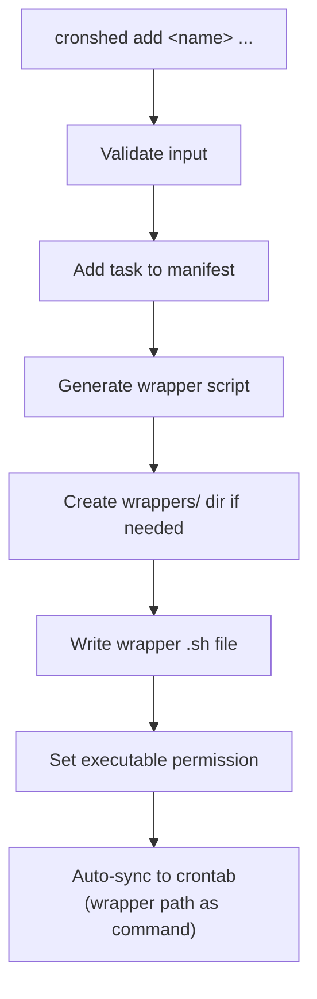
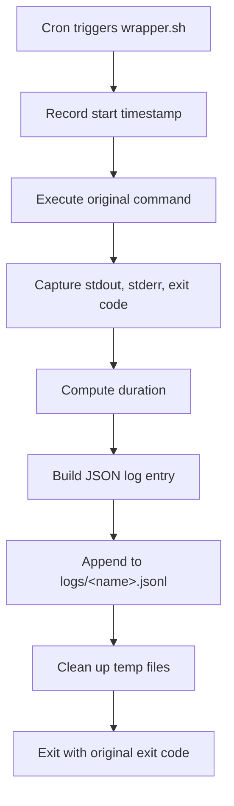
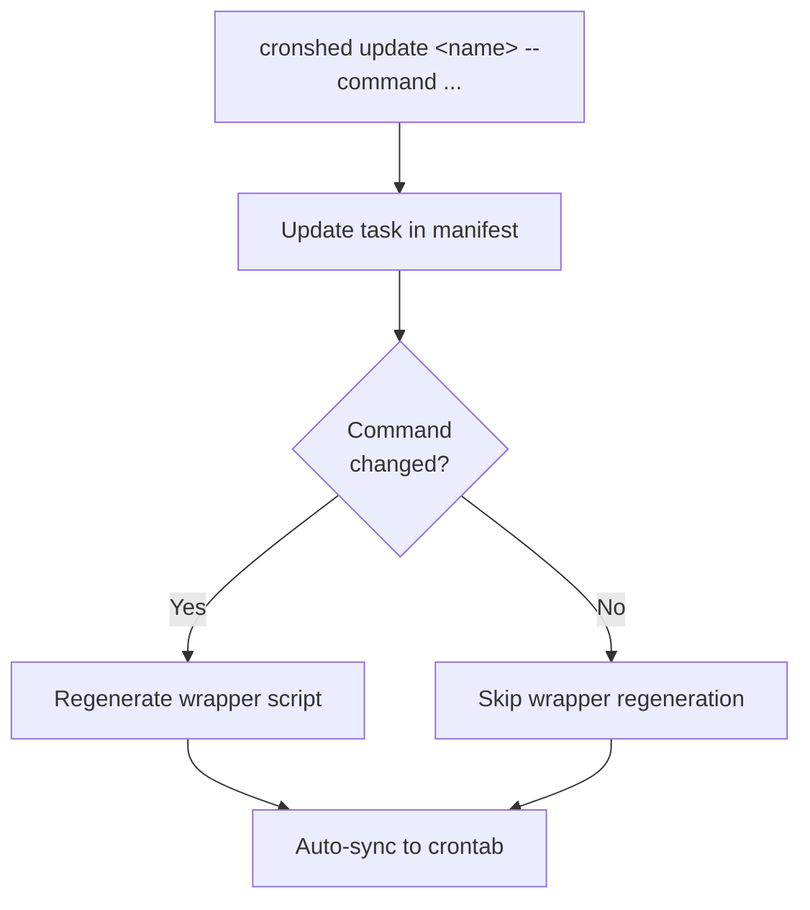
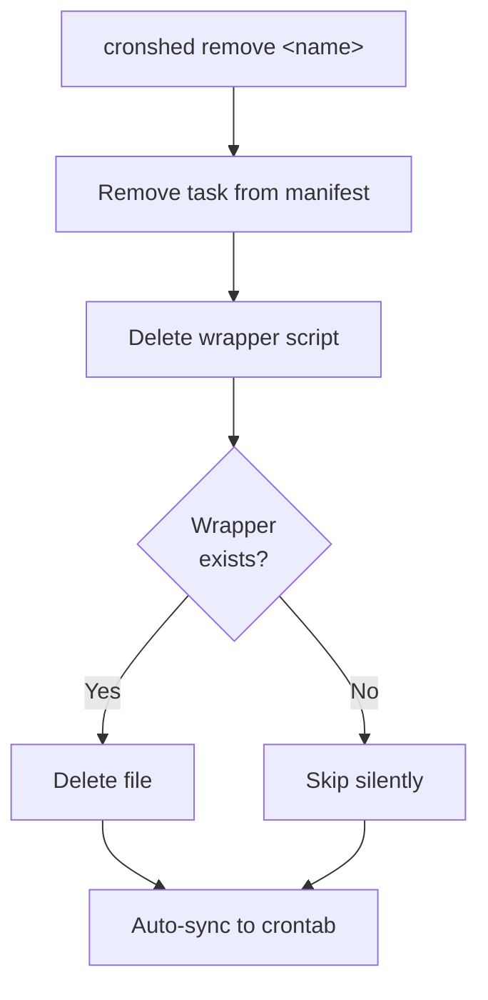
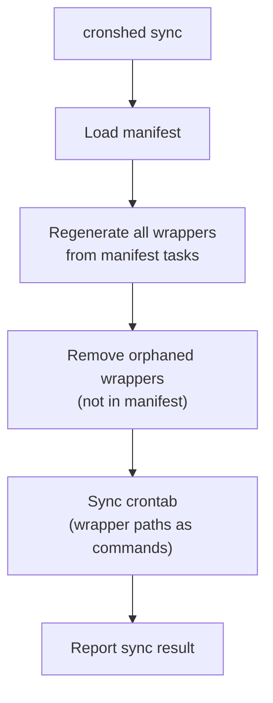
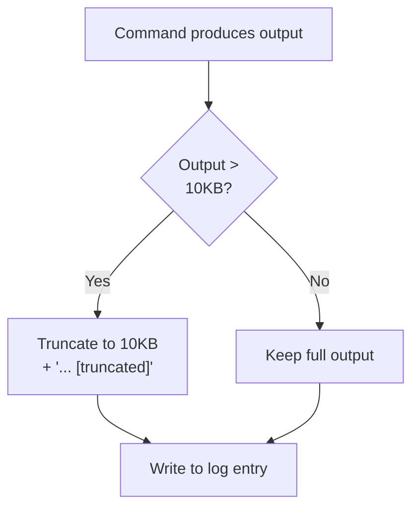

# Feature Spec: Wrapper Script Generation

- **Feature:** Wrapper Script Generation
- **Branch:** feature/005-wrapper-script-generation
- **Date:** 2026-03-30
- **Status:** Implemented
- **Feature Number:** 005
- **Input:** Generate shell wrappers that log execution results — instead of crontab running the user's command directly, it runs a wrapper script that executes the command, captures exit code/stdout/stderr/duration, logs results to a JSON log file, and exits with the original command's exit code.

---

## Design Decisions

### Wrapper Script Location

Wrapper scripts are stored in `~/.cronshed/wrappers/<task-name>.sh` (or configurable via `CRONSHED_HOME`). Each task gets one wrapper script. The wrapper is regenerated whenever the task's command changes.

**Rationale:** A dedicated `wrappers/` directory keeps them separate from user data (`tasks.json`). One wrapper per task simplifies lifecycle management (create on add, update on change, delete on remove).

### Wrapper Script Content

Each wrapper is a self-contained bash script that:
1. Records the start timestamp
2. Executes the original command, capturing stdout and stderr to temp files
3. Records the exit code
4. Computes the duration
5. Appends a JSON log entry to `~/.cronshed/logs/<task-name>.jsonl`
6. Cleans up temp files
7. Exits with the original command's exit code

**Rationale:** The wrapper must be a standalone bash script (not a Bun script) because cron jobs need minimal startup overhead and zero runtime dependencies. JSON Lines format for logs enables append-only writes and easy parsing.

### Log Entry Format

Each log entry is a single JSON line in `~/.cronshed/logs/<task-name>.jsonl`:

```json
{"timestamp":"2026-03-30T10:00:00Z","exitCode":0,"durationMs":1523,"stdout":"...","stderr":""}
```

Fields:
- `timestamp` — ISO 8601 UTC start time
- `exitCode` — integer exit code from the command
- `durationMs` — execution duration in milliseconds
- `stdout` — captured stdout (truncated to 10KB)
- `stderr` — captured stderr (truncated to 10KB)

**Rationale:** JSON Lines is append-only, no file locking needed. Truncation prevents unbounded log growth from verbose commands. 10KB per field is enough to diagnose most failures.

### Crontab Integration

When a task is synced to crontab, the crontab entry's command now points to the wrapper script instead of the raw command:

```
# cronshed:backup-db
0 2 * * * ~/.cronshed/wrappers/backup-db.sh
```

This is transparent to the sync service — the `SyncService` already uses `task.command` as the crontab command. The wrapper generation service provides a `getWrapperCommand(taskName)` that returns the wrapper path, and the sync integration point transforms the command before syncing.

### Wrapper Lifecycle

- **Created:** When a task is added (`cronshed add`)
- **Updated:** When a task's command is updated (`cronshed update --command`)
- **Deleted:** When a task is removed (`cronshed remove`)
- **Regenerated:** During `cronshed sync` — all wrappers are regenerated from current manifest state

### Output Truncation

Stdout and stderr are each truncated to 10KB (10240 bytes) in the log entry. If truncated, the value ends with `... [truncated]`. This prevents a single verbose cron job from filling the disk.

### Wrapper Script Permissions

Generated wrapper scripts are created with mode `0755` (executable by owner, readable by all). This matches the standard permission for executable scripts.

---

## User Scenarios & Testing

### Story 1 — Wrapper script is generated when a task is added `P1`

**Description:** As a developer, I want a wrapper script to be automatically generated when I add a task, so that execution logging is set up from the start.

**Priority reason:** Core functionality — without wrapper generation on add, new tasks have no logging capability.

**Independent test:** Add a task, verify the wrapper script exists at `~/.cronshed/wrappers/<name>.sh` with correct content.

```gherkin
Feature: Wrapper generation on task add
  Scenario: Wrapper created on add
    Given no wrapper script exists for "backup-db"
    When the developer runs "cronshed add backup-db --schedule '0 2 * * *' --command '/usr/local/bin/backup.sh'"
    Then a wrapper script exists at "~/.cronshed/wrappers/backup-db.sh"
    And the wrapper script is executable (mode 0755)
    And the wrapper script contains the command "/usr/local/bin/backup.sh"
    And the wrapper script logs to "~/.cronshed/logs/backup-db.jsonl"

  Scenario: Wrapper content references correct command
    Given no wrapper script exists for "cleanup-logs"
    When the developer runs "cronshed add cleanup-logs --schedule '0 4 * * 0' --command 'find /tmp -name *.log -delete'"
    Then the wrapper script at "~/.cronshed/wrappers/cleanup-logs.sh" contains the command "find /tmp -name *.log -delete"

  Scenario: Wrapper directories are created automatically
    Given the directories "~/.cronshed/wrappers/" and "~/.cronshed/logs/" do not exist
    When the developer runs "cronshed add backup-db --schedule '0 2 * * *' --command '/usr/local/bin/backup.sh'"
    Then the directory "~/.cronshed/wrappers/" exists
    And the wrapper script exists at "~/.cronshed/wrappers/backup-db.sh"
```

#### User Flow



---

### Story 2 — Wrapper script executes command and logs results `P1`

**Description:** As a developer, I want the wrapper script to execute my command and log the exit code, duration, stdout, and stderr to a JSON log file, so I can review execution history later.

**Priority reason:** This is the core value proposition — execution visibility. Without logging, the wrapper is just an unnecessary indirection.

**Independent test:** Execute a wrapper script directly, verify a log entry is appended to the JSONL file with correct fields.

```gherkin
Feature: Wrapper execution and logging
  Scenario: Successful command execution logged
    Given a wrapper script exists for "backup-db" with command "echo hello"
    When the wrapper script is executed
    Then a log entry is appended to "~/.cronshed/logs/backup-db.jsonl"
    And the log entry has "exitCode" equal to 0
    And the log entry has "stdout" containing "hello"
    And the log entry has "stderr" equal to ""
    And the log entry has "durationMs" as a positive integer
    And the log entry has "timestamp" as a valid ISO 8601 string
    And the wrapper exit code is 0

  Scenario: Failed command execution logged
    Given a wrapper script exists for "failing-task" with command "exit 42"
    When the wrapper script is executed
    Then a log entry is appended to "~/.cronshed/logs/failing-task.jsonl"
    And the log entry has "exitCode" equal to 42
    And the wrapper exit code is 42

  Scenario: Command with stderr output
    Given a wrapper script exists for "warn-task" with command "echo warning >&2"
    When the wrapper script is executed
    Then the log entry has "stderr" containing "warning"
    And the log entry has "exitCode" equal to 0

  Scenario: Log file created on first execution
    Given a wrapper script exists for "new-task" with command "echo first"
    And no log file exists at "~/.cronshed/logs/new-task.jsonl"
    When the wrapper script is executed
    Then the log file "~/.cronshed/logs/new-task.jsonl" is created
    And it contains exactly one JSON line

  Scenario: Multiple executions append to log
    Given a wrapper script exists for "repeat-task" with command "echo run"
    And the log file already contains 2 entries
    When the wrapper script is executed
    Then the log file contains 3 entries
```

#### User Flow



---

### Story 3 — Wrapper script is updated when task command changes `P1`

**Description:** As a developer, I want the wrapper script to be regenerated when I update a task's command, so the cron job always executes the current command.

**Priority reason:** A stale wrapper running an old command is a silent bug — the developer expects the update to take effect immediately.

**Independent test:** Add a task, update its command, verify the wrapper script contains the new command.

```gherkin
Feature: Wrapper update on task change
  Scenario: Wrapper regenerated on command update
    Given a task "backup-db" exists with command "/usr/local/bin/backup.sh"
    And a wrapper script exists for "backup-db" containing "/usr/local/bin/backup.sh"
    When the developer runs "cronshed update backup-db --command '/usr/local/bin/backup-v2.sh'"
    Then the wrapper script at "~/.cronshed/wrappers/backup-db.sh" contains "/usr/local/bin/backup-v2.sh"
    And the wrapper script does NOT contain "/usr/local/bin/backup.sh"

  Scenario: Wrapper not regenerated on schedule-only update
    Given a task "backup-db" exists with command "/usr/local/bin/backup.sh" and schedule "0 2 * * *"
    And a wrapper script exists for "backup-db"
    When the developer runs "cronshed update backup-db --schedule '0 3 * * *'"
    Then the wrapper script at "~/.cronshed/wrappers/backup-db.sh" is unchanged
```

#### User Flow



---

### Story 4 — Wrapper script is deleted when task is removed `P1`

**Description:** As a developer, I want the wrapper script to be deleted when I remove a task, so there are no orphaned scripts left behind.

**Priority reason:** Orphaned wrapper scripts clutter the filesystem and could be confusing if the task name is reused later.

**Independent test:** Add a task, verify wrapper exists, remove the task, verify wrapper is deleted.

```gherkin
Feature: Wrapper cleanup on task remove
  Scenario: Wrapper deleted on remove
    Given a task "backup-db" exists
    And a wrapper script exists at "~/.cronshed/wrappers/backup-db.sh"
    When the developer runs "cronshed remove backup-db"
    Then the wrapper script at "~/.cronshed/wrappers/backup-db.sh" does not exist
    And the log file at "~/.cronshed/logs/backup-db.jsonl" is preserved

  Scenario: Remove succeeds even if wrapper is already missing
    Given a task "backup-db" exists
    And no wrapper script exists at "~/.cronshed/wrappers/backup-db.sh"
    When the developer runs "cronshed remove backup-db"
    Then the command succeeds with exit code 0
    And the task is removed from the manifest
```

#### User Flow



---

### Story 5 — Sync regenerates all wrappers `P2`

**Description:** As a developer, I want `cronshed sync` to regenerate all wrapper scripts from the current manifest, so I can recover from corrupted or missing wrappers.

**Priority reason:** Important for recovery and consistency, but less common than the daily add/update/remove workflow.

**Independent test:** Delete all wrapper scripts, run sync, verify all wrappers are regenerated.

```gherkin
Feature: Sync regenerates wrappers
  Scenario: Sync regenerates missing wrappers
    Given tasks.json contains "backup-db" (command "/usr/local/bin/backup.sh") and "cleanup-logs" (command "find /tmp -name '*.log' -delete")
    And no wrapper scripts exist in "~/.cronshed/wrappers/"
    When the developer runs "cronshed sync"
    Then wrapper scripts exist for "backup-db" and "cleanup-logs"
    And the crontab entries point to the wrapper scripts

  Scenario: Sync updates stale wrappers
    Given tasks.json contains "backup-db" with command "/usr/local/bin/backup-v2.sh"
    And the wrapper script for "backup-db" contains the old command "/usr/local/bin/backup.sh"
    When the developer runs "cronshed sync"
    Then the wrapper script for "backup-db" contains "/usr/local/bin/backup-v2.sh"

  Scenario: Sync removes orphaned wrappers
    Given tasks.json contains no tasks
    And a wrapper script exists at "~/.cronshed/wrappers/old-task.sh"
    When the developer runs "cronshed sync"
    Then the wrapper script at "~/.cronshed/wrappers/old-task.sh" does not exist

  Scenario: Dry-run does not regenerate wrappers
    Given tasks.json contains "backup-db"
    And no wrapper script exists for "backup-db"
    When the developer runs "cronshed sync --dry-run"
    Then no wrapper script exists for "backup-db"
```

#### User Flow



---

### Story 6 — Stdout/stderr truncation in logs `P2`

**Description:** As a developer, I want the wrapper to truncate stdout and stderr in log entries to prevent unbounded log growth from verbose commands.

**Priority reason:** Prevents disk exhaustion, but edge case for most cron jobs.

**Independent test:** Execute a wrapper with a command that produces >10KB of output, verify the log entry is truncated.

```gherkin
Feature: Output truncation
  Scenario: Stdout truncated at 10KB
    Given a wrapper script exists for "verbose-task" with a command that outputs 20KB to stdout
    When the wrapper script is executed
    Then the log entry "stdout" is at most 10240 bytes plus the truncation marker
    And the log entry "stdout" ends with "... [truncated]"

  Scenario: Stderr truncated at 10KB
    Given a wrapper script exists for "error-task" with a command that outputs 20KB to stderr
    When the wrapper script is executed
    Then the log entry "stderr" is at most 10240 bytes plus the truncation marker

  Scenario: Small output not truncated
    Given a wrapper script exists for "small-task" with a command that outputs 100 bytes
    When the wrapper script is executed
    Then the log entry "stdout" contains the complete output without truncation marker
```

#### User Flow



---

## Acceptance Criteria

| # | Criterion | Story |
|---|-----------|-------|
| AC-050 | `cronshed add` generates a wrapper script at `~/.cronshed/wrappers/<name>.sh` with mode 0755 | Story 1 |
| AC-051 | The wrapper script contains the task's command and logs to `~/.cronshed/logs/<name>.jsonl` | Story 1, 2 |
| AC-052 | Executing the wrapper logs a JSON entry with `timestamp`, `exitCode`, `durationMs`, `stdout`, `stderr` | Story 2 |
| AC-053 | The wrapper exits with the original command's exit code | Story 2 |
| AC-054 | `cronshed update --command` regenerates the wrapper script with the new command | Story 3 |
| AC-055 | `cronshed update --schedule` (without --command) does not regenerate the wrapper | Story 3 |
| AC-056 | `cronshed remove` deletes the wrapper script; succeeds even if wrapper is already missing | Story 4 |
| AC-057 | Log files are preserved when a task is removed (only wrapper is deleted) | Story 4 |
| AC-058 | `cronshed sync` regenerates all wrappers from current manifest and removes orphaned wrappers | Story 5 |
| AC-059 | `cronshed sync --dry-run` does not create or modify wrapper scripts | Story 5 |
| AC-060 | Crontab entries point to the wrapper script path instead of the raw command | Story 1, 5 |
| AC-061 | Stdout and stderr in log entries are truncated to 10KB with a `... [truncated]` marker | Story 6 |
| AC-062 | The `wrappers/` and `logs/` directories are created automatically if they do not exist | Story 1, 2 |

---

## Functional Requirements

| # | Requirement | AC |
|---|------------|-----|
| FR-036 | A `WrapperService` module must generate, update, and delete wrapper shell scripts in `<dataDir>/wrappers/<task-name>.sh`. Scripts are self-contained bash with `#!/bin/bash` shebang | AC-050, AC-054, AC-056 |
| FR-037 | Generated wrapper scripts must: record start time, execute the command capturing stdout/stderr to temp files, record exit code and duration, append a JSON log line to `<dataDir>/logs/<task-name>.jsonl`, clean up temp files, and exit with the original exit code | AC-051, AC-052, AC-053 |
| FR-038 | The wrapper script must truncate stdout and stderr each to 10240 bytes. If truncated, append `... [truncated]` to the value in the log entry | AC-061 |
| FR-039 | `WrapperService.generate(task)` must create the `wrappers/` directory if it does not exist, write the script file, and set permissions to 0755 | AC-050, AC-062 |
| FR-040 | `WrapperService.remove(taskName)` must delete the wrapper script. If the file does not exist, it must succeed silently (no error) | AC-056 |
| FR-041 | `WrapperService.getWrapperCommand(taskName)` must return the absolute path to the wrapper script for use as the crontab command | AC-060 |
| FR-042 | The CLI handler must call `WrapperService.generate(task)` after `add` and after `update` when the command changes | AC-050, AC-054, AC-055 |
| FR-043 | The CLI handler must call `WrapperService.remove(taskName)` after `remove` (before auto-sync) | AC-056 |
| FR-044 | The `SyncService.sync()` must regenerate all wrappers from the current manifest and remove orphaned wrappers before syncing to crontab. The crontab entry command must be the wrapper path (via `getWrapperCommand`) instead of the raw task command. `--dry-run` must skip wrapper generation | AC-058, AC-059, AC-060 |
| FR-045 | The `logs/` directory must be created by the wrapper script at execution time if it does not exist | AC-062 |
| FR-046 | Log files (`<dataDir>/logs/<task-name>.jsonl`) must be preserved when a task is removed — only the wrapper script is deleted | AC-057 |

---

## Key Entities

### WrapperScript (generated shell file)

```
#!/bin/bash
# cronshed wrapper for: <task-name>
# Command: <original-command>
# Generated: <ISO timestamp>
# DO NOT EDIT — regenerated by cronshed

CRONSHED_LOG_DIR="<dataDir>/logs"
CRONSHED_LOG_FILE="$CRONSHED_LOG_DIR/<task-name>.jsonl"
CRONSHED_MAX_OUTPUT=10240

mkdir -p "$CRONSHED_LOG_DIR"

_start_epoch=$(date +%s)
_stdout_file=$(mktemp)
_stderr_file=$(mktemp)

<original-command> >"$_stdout_file" 2>"$_stderr_file"
_exit_code=$?

_end_epoch=$(date +%s)
_duration_ms=$(( (_end_epoch - _start_epoch) * 1000 ))
_timestamp=$(date -u +"%Y-%m-%dT%H:%M:%SZ")

# Truncation function
_truncate() {
  local content
  content=$(head -c $CRONSHED_MAX_OUTPUT "$1")
  if [ $(wc -c < "$1") -gt $CRONSHED_MAX_OUTPUT ]; then
    echo "${content}... [truncated]"
  else
    echo "$content"
  fi
}

_stdout=$(_truncate "$_stdout_file")
_stderr=$(_truncate "$_stderr_file")

# Escape for JSON (pure bash — no external deps)
_json_escape() {
  local s="$1"
  s="${s//\\/\\\\}"
  s="${s//\"/\\\"}"
  s="${s//$'\n'/\\n}"
  s="${s//$'\r'/\\r}"
  s="${s//$'\t'/\\t}"
  printf '"%s"' "$s"
}

_stdout_json=$(_json_escape "$_stdout")
_stderr_json=$(_json_escape "$_stderr")

printf '{"timestamp":"%s","exitCode":%d,"durationMs":%d,"stdout":%s,"stderr":%s}\n' "$_timestamp" "$_exit_code" "$_duration_ms" "$_stdout_json" "$_stderr_json" >> "$CRONSHED_LOG_FILE"

rm -f "$_stdout_file" "$_stderr_file"
exit $_exit_code
```

### LogEntry (single line in .jsonl file)

```typescript
interface LogEntry {
  timestamp: string;    // ISO 8601 UTC
  exitCode: number;     // integer
  durationMs: number;   // milliseconds
  stdout: string;       // truncated to 10KB
  stderr: string;       // truncated to 10KB
}
```

---

## Edge Cases

1. **Command contains special shell characters** — The wrapper embeds the command literally. Commands with quotes, pipes, redirects, and special characters must be preserved exactly. The command is not re-quoted — it is inserted directly into the script as-is.
2. **Wrapper script deleted externally** — If a wrapper is missing when cron runs, the cron job fails. `cronshed sync` recovers by regenerating all wrappers.
3. **Log directory does not exist at execution time** — The wrapper creates `logs/` via `mkdir -p` before appending.
4. **Concurrent wrapper executions** — Multiple instances of the same wrapper may run simultaneously. JSON Lines append is atomic at the OS level for lines <4KB (PIPE_BUF). For larger log entries (truncated outputs), minor interleaving is acceptable for a single-user tool.
5. **`CRONSHED_HOME` override** — Wrapper scripts use hardcoded absolute paths generated at wrapper creation time. If `CRONSHED_HOME` changes, `cronshed sync` must be run to regenerate wrappers with updated paths.
6. **Task name reuse after remove** — Adding a task with a previously removed name generates a fresh wrapper. The old log file (if preserved) continues to accumulate entries — this is intentional (history is preserved).
7. **JSON escaping** — The wrapper uses pure bash string replacement for JSON escaping (backslash, double quote, newline, carriage return, tab). This avoids external dependencies (no python3 needed). Control characters other than `\n`, `\r`, `\t` are passed through unescaped — acceptable for CLI output.
8. **Duration precision** — macOS `date` does not support `%3N` for milliseconds. The wrapper uses second-level precision (`date +%s`) and multiplies by 1000 for the `durationMs` field. Sub-second precision would require `perl` or `python3`, not worth the dependency for cron jobs.
9. **Wrapper already exists on add** — Overwrite silently. This handles the case of re-adding a previously removed task name.
10. **Sync with --clear** — `sync --clear` removes crontab entries but does NOT delete wrapper scripts or logs. Wrappers are orphaned but harmless. A subsequent `sync` would clean them up.

---

## Success Criteria

| # | Criterion | Measurement |
|---|-----------|-------------|
| SC-015 | Wrapper scripts generated on add with correct content and permissions | Unit + integration tests pass |
| SC-016 | Wrapper execution produces correct log entries | Integration test executes wrapper and parses log |
| SC-017 | Wrapper regeneration on command update, no-op on schedule-only update | Integration tests verify file content |
| SC-018 | Wrapper deletion on task remove, log preservation | Integration tests verify file existence |
| SC-019 | Sync regenerates all wrappers, removes orphans, crontab uses wrapper paths | Integration tests with mock crontab |
| SC-020 | Output truncation at 10KB boundary | Integration test with large output |
