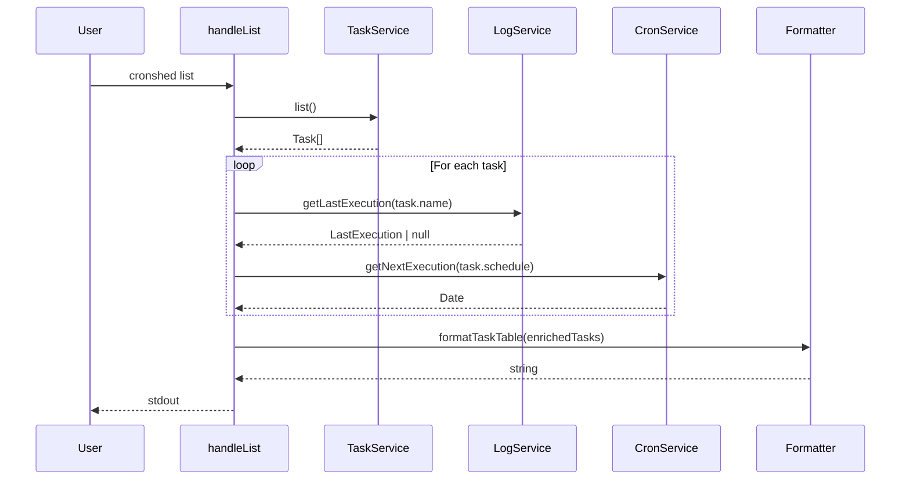
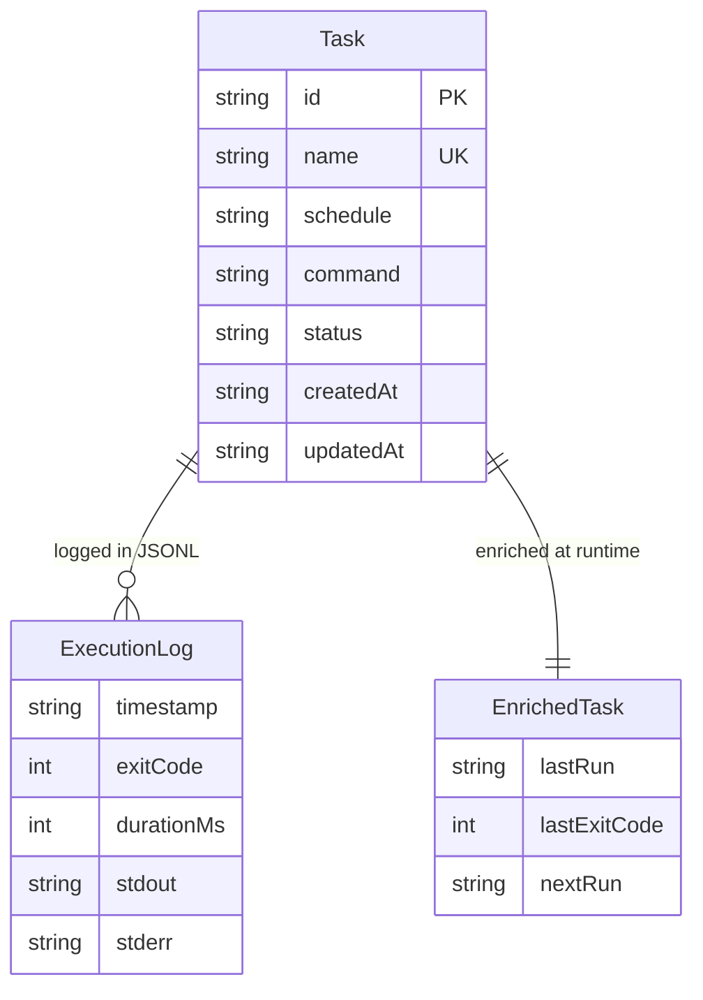

# Plan: Task Listing & Status

- **Status:** Approved
- **Date:** 2026-03-30
- **Summary:** Add next-execution calculation to cron service, create log reader service, enrich list/get CLI commands with last-run and next-run data.

---

## Technical Context

| Dimension | Value |
|---|---|
| Language | TypeScript (strict) |
| Runtime | Bun |
| CLI Parsing | parseArgs (node:util) |
| Storage | JSONL log files in ~/.cronshed/logs/ |
| Cron Parsing | cron-parser |
| Testing | bun:test |
| Platform | macOS (local CLI) |

---

## Constitution Check

| Principle | Alignment |
|---|---|
| Simplicity First | Read-only feature — no new storage format, reads existing JSONL logs |
| Single Responsibility | Log reading isolated in log.service.ts, cron calculation in cron.service.ts, formatting in cli.formatter.ts |
| Explicit Over Implicit | EnrichedTask type makes runtime data visible in the type system |
| Fail Fast | Log read failures return null (graceful degradation), invalid cron expressions already validated at add time |
| No Side Effects at Import | All new code is exported functions, no side effects |

---

## Sequence Diagram — List Command Flow

```gherkin
Feature: List command enrichment
  Scenario: List loads tasks and enriches with runtime data
    Given tasks exist in the manifest
    When the user runs "cronshed list"
    Then the handler loads tasks from TaskService
    And reads the last log entry for each task from LogService
    And calculates the next execution for each task from CronService
    And formats the enriched data as a table
```



---

## ER Diagram — Data Model



---

## Implementation Plan

### Step 1 — Add getNextExecution to cron.service.ts

- **File:** `src/cron/cron.service.ts`
- **Action:** Add `getNextExecution(expression: string): Date` using cron-parser's `parseExpression().next().toDate()`
- **FR:** FR-001
- **Tests:** `src/cron/cron.service.test.ts` — test daily, every-30-min, weekly expressions

### Step 2 — Create log.service.ts with getLastExecution

- **File:** `src/log/log.service.ts` (new)
- **Action:** Create `getLastExecution(taskName: string): Promise<LastExecution | null>`
  - Build log path using `getLogPath(taskName)` from config
  - Read file with `Bun.file()`, check existence
  - Split by newlines, iterate from end to find last valid JSON line
  - Parse and return `{ timestamp, exitCode, durationMs }`
  - Return null on missing/empty file or all-corrupted lines
- **FR:** FR-002, FR-003
- **Types:** `src/log/log.types.ts` (new) — `LastExecution` interface
- **Tests:** `src/log/log.service.test.ts` — happy path, no file, empty file, corrupted lines

### Step 3 — Create EnrichedTask type

- **File:** `src/task/task.types.ts`
- **Action:** Add `EnrichedTask` interface extending Task with `lastRun`, `lastExitCode`, `nextRun`
- **FR:** FR-006

### Step 4 — Update formatTaskTable for enriched columns

- **File:** `src/cli/cli.formatter.ts`
- **Action:** Update `formatTaskTable` to accept `EnrichedTask[]` and display NAME, SCHEDULE, LAST RUN, NEXT RUN, STATUS columns (removing COMMAND)
  - LAST RUN: formatted timestamp or "—"
  - NEXT RUN: formatted timestamp
- **FR:** FR-004, AC-012
- **Tests:** Update `src/cli/cli.formatter.test.ts`

### Step 5 — Update formatTaskDetails for enriched fields

- **File:** `src/cli/cli.formatter.ts`
- **Action:** Update `formatTaskDetails` to accept `EnrichedTask` and add Last run, Exit code (red if non-zero), Next run fields
- **FR:** FR-005, FR-011
- **Tests:** Update `src/cli/cli.formatter.test.ts`

### Step 6 — Update handleList to enrich tasks

- **File:** `src/cli/cli.handler.ts`
- **Action:** After loading tasks, enrich each with last execution and next run data. Pass `EnrichedTask[]` to formatter and JSON output.
- **FR:** FR-007, FR-009
- **Tests:** Update `src/cli/cli.integration.test.ts`

### Step 7 — Update handleGet to enrich task

- **File:** `src/cli/cli.handler.ts`
- **Action:** After loading task, enrich with last execution and next run data. Pass `EnrichedTask` to formatter and JSON output.
- **FR:** FR-008, FR-010
- **Tests:** Update `src/cli/cli.integration.test.ts`

---

## Testing Strategy

| Layer | What | Tool |
|---|---|---|
| Unit | getNextExecution with various cron expressions | bun:test |
| Unit | getLastExecution with various log file states | bun:test + temp files |
| Unit | formatTaskTable with EnrichedTask data | bun:test |
| Unit | formatTaskDetails with EnrichedTask data | bun:test |
| Integration | handleList/handleGet end-to-end with log files | bun:test + temp dir |

---

## Risks & Considerations

| Risk | Mitigation |
|---|---|
| Large log files slow down reading | Read only the last few KB of the file, not the entire file |
| cron-parser breaking change | Pinned in package.json, unit tests catch regressions |
| Timezone display inconsistency | Use local time formatting consistently via `toLocaleString` |
