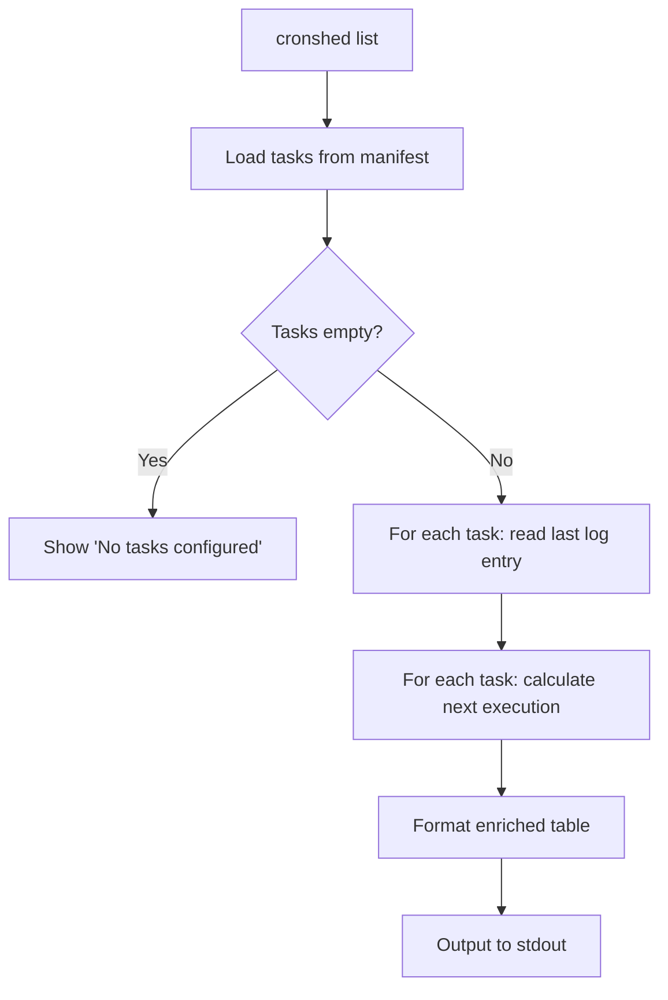
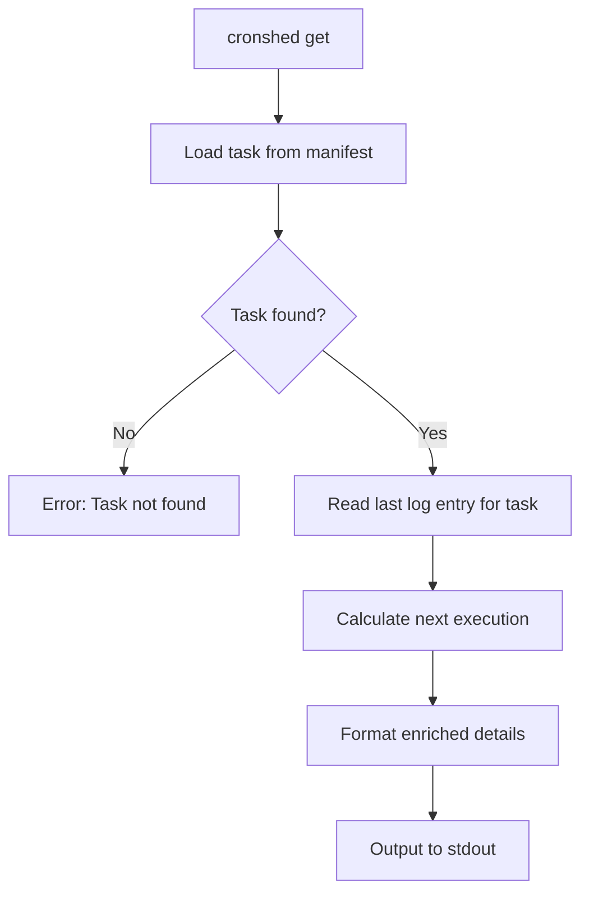
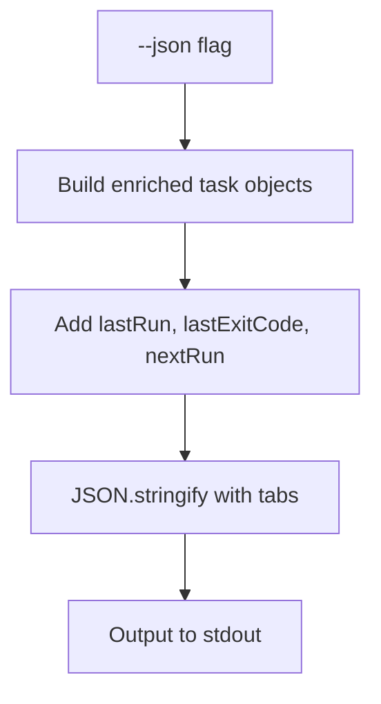
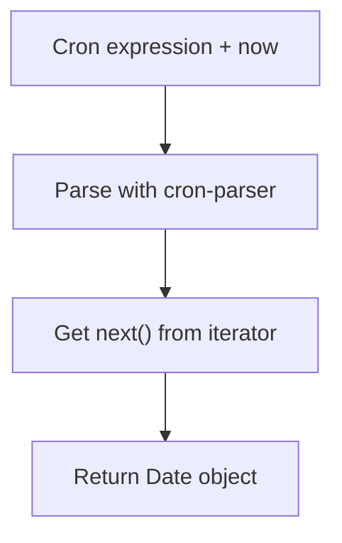
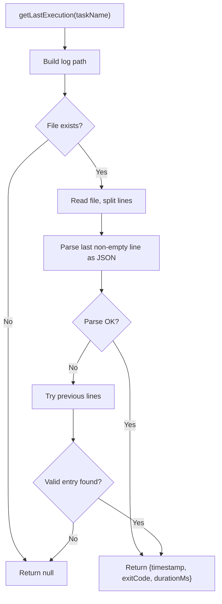

# Feature: Task Listing & Status

- **Branch:** `feature/006-task-listing-status`
- **Date:** 2026-03-30
- **Status:** Implemented
- **Input:** Display all tasks with status, last run, next execution

---

## User Stories

### Story 1 — List tasks with enriched columns (P1 — critical)

As a developer, I want `cronshed list` to show LAST RUN and NEXT RUN columns alongside the existing columns, so I can see at a glance when each task last ran and when it will run next.

**Priority reason:** Core value proposition — visibility on cron state. Without this, the tool is no better than `crontab -l`.

**Independent test:** Run `cronshed list` with tasks that have execution logs; verify LAST RUN and NEXT RUN columns appear with correct values.

```gherkin
Feature: List tasks with enriched columns
  Scenario: List tasks with execution history
    Given a task "backup-db" with schedule "0 2 * * *" exists
    And the task has execution logs with the most recent at "2026-03-30T02:00:05Z" exit code 0
    When the user runs "cronshed list"
    Then the output shows columns NAME, SCHEDULE, LAST RUN, NEXT RUN, STATUS
    And the LAST RUN column shows "2026-03-30 02:00" for "backup-db"
    And the NEXT RUN column shows the next execution time after now
    And the STATUS column shows "active"

  Scenario: List tasks with no execution history
    Given a task "cleanup-tmp" with schedule "0 6 * * 1" exists
    And the task has no execution logs
    When the user runs "cronshed list"
    Then the LAST RUN column shows "—" for "cleanup-tmp"
    And the NEXT RUN column shows the next execution time after now

  Scenario: List tasks with failed last run
    Given a task "sync-files" with schedule "*/30 * * * *" exists
    And the last execution log has exit code 1
    When the user runs "cronshed list"
    Then the LAST RUN column shows the timestamp with a failure indicator
```



### Story 2 — Get task details with run info (P1 — critical)

As a developer, I want `cronshed get <name>` to show the last run time, exit code, and next execution alongside the existing task details, so I can quickly diagnose a specific task.

**Priority reason:** Single-task deep inspection is essential for debugging failed tasks.

**Independent test:** Run `cronshed get backup-db` with execution logs; verify last run and next run fields appear.

```gherkin
Feature: Get task details with run info
  Scenario: Get task with execution history
    Given a task "backup-db" with schedule "0 2 * * *" exists
    And the task has execution logs with the most recent at "2026-03-30T02:00:05Z" exit code 0
    When the user runs "cronshed get backup-db"
    Then the output includes "Last run:" with the timestamp
    And the output includes "Exit code:" with "0"
    And the output includes "Next run:" with the next execution time

  Scenario: Get task with no execution history
    Given a task "cleanup-tmp" with schedule "0 6 * * 1" exists
    And the task has no execution logs
    When the user runs "cronshed get cleanup-tmp"
    Then the output includes "Last run:" with "—"
    And the output includes "Next run:" with the next execution time
    And "Exit code:" is not shown

  Scenario: Get task with failed last run
    Given a task "sync-files" with schedule "*/30 * * * *" exists
    And the last execution log has exit code 1
    When the user runs "cronshed get sync-files"
    Then the output includes "Last run:" with the timestamp
    And the output includes "Exit code:" with "1" in red
```



### Story 3 — JSON output includes run info (P2 — important)

As a developer, I want `cronshed list --json` and `cronshed get <name> --json` to include lastRun and nextRun fields, so I can use the output in scripts and automation.

**Priority reason:** JSON output is the automation interface. Enriched data must be available programmatically.

**Independent test:** Run `cronshed list --json` and verify lastRun/nextRun fields exist in the output.

```gherkin
Feature: JSON output includes run info
  Scenario: List JSON output with enriched fields
    Given a task "backup-db" with schedule "0 2 * * *" exists
    And the task has execution logs
    When the user runs "cronshed list --json"
    Then the output is valid JSON
    And each task object has a "lastRun" field with timestamp or null
    And each task object has a "lastExitCode" field with number or null
    And each task object has a "nextRun" field with ISO timestamp

  Scenario: Get JSON output with enriched fields
    Given a task "backup-db" exists with execution logs
    When the user runs "cronshed get backup-db --json"
    Then the output is valid JSON
    And the object has "lastRun", "lastExitCode", and "nextRun" fields
```



### Story 4 — Next execution calculation (P1 — critical)

As a developer, I want next execution times calculated from the cron schedule, so the displayed times are accurate and account for the current time.

**Priority reason:** Inaccurate next-run times would destroy trust in the tool.

**Independent test:** Call getNextExecution with a known cron expression and a fixed reference date; verify the returned date is correct.

```gherkin
Feature: Next execution calculation
  Scenario: Daily at midnight
    Given a cron expression "0 0 * * *"
    And the current time is "2026-03-30T15:00:00Z"
    When the next execution is calculated
    Then the result is "2026-03-31T00:00:00.000Z"

  Scenario: Every 30 minutes
    Given a cron expression "*/30 * * * *"
    And the current time is "2026-03-30T15:10:00Z"
    When the next execution is calculated
    Then the result is "2026-03-30T15:30:00.000Z"

  Scenario: Weekly on Monday at 6am
    Given a cron expression "0 6 * * 1"
    And the current time is "2026-03-30T15:00:00Z" (Monday)
    When the next execution is calculated
    Then the result is "2026-04-06T06:00:00.000Z" (next Monday)
```



### Story 5 — Read last execution from logs (P1 — critical)

As a developer, I want the last execution data read from the JSONL log files produced by wrapper scripts, so the displayed data reflects actual cron executions.

**Priority reason:** Log reading is the bridge between wrapper execution and CLI display. Without it, last-run data cannot be shown.

**Independent test:** Create a JSONL log file with entries; call getLastExecution; verify it returns the last entry's data.

```gherkin
Feature: Read last execution from logs
  Scenario: Log file with multiple entries
    Given a log file "backup-db.jsonl" with 3 entries
    And the last entry has timestamp "2026-03-30T02:00:05Z" and exitCode 0
    When getLastExecution is called for "backup-db"
    Then it returns timestamp "2026-03-30T02:00:05Z" and exitCode 0

  Scenario: Log file does not exist
    Given no log file exists for "new-task"
    When getLastExecution is called for "new-task"
    Then it returns null

  Scenario: Empty log file
    Given a log file "empty-task.jsonl" exists but is empty
    When getLastExecution is called for "empty-task"
    Then it returns null

  Scenario: Corrupted last line in log file
    Given a log file "bad-task.jsonl" with a corrupted last line
    And valid entries exist before the corrupted line
    When getLastExecution is called for "bad-task"
    Then it returns the last valid entry
```



---

## Acceptance Criteria

| ID | Criterion | Stories |
|---|---|---|
| AC-001 | `cronshed list` displays columns: NAME, SCHEDULE, LAST RUN, NEXT RUN, STATUS | S1 |
| AC-002 | LAST RUN shows formatted timestamp from the last log entry, or "—" if no logs | S1, S2 |
| AC-003 | NEXT RUN shows the next execution time calculated from the cron schedule | S1, S2 |
| AC-004 | Failed last run is indicated visually (red exit code) in `get` output | S2 |
| AC-005 | `cronshed get <name>` shows Last run, Exit code, and Next run fields | S2 |
| AC-006 | `cronshed list --json` includes lastRun, lastExitCode, nextRun per task | S3 |
| AC-007 | `cronshed get <name> --json` includes lastRun, lastExitCode, nextRun | S3 |
| AC-008 | getNextExecution returns the correct next Date for a given cron expression | S4 |
| AC-009 | getLastExecution reads the last valid JSONL entry from the log file | S5 |
| AC-010 | getLastExecution returns null when log file does not exist or is empty | S5 |
| AC-011 | getLastExecution handles corrupted last lines gracefully | S5 |
| AC-012 | COMMAND column is removed from list output (replaced by richer columns) | S1 |

---

## Functional Requirements

| ID | Requirement | AC |
|---|---|---|
| FR-001 | Add `getNextExecution(expression: string): Date` to cron.service.ts using cron-parser | AC-008 |
| FR-002 | Add `getLastExecution(taskName: string): Promise<LastExecution \| null>` to a new log.service.ts | AC-009, AC-010, AC-011 |
| FR-003 | Create `LastExecution` type: `{ timestamp: string; exitCode: number; durationMs: number }` | AC-009 |
| FR-004 | Update `formatTaskTable` to display NAME, SCHEDULE, LAST RUN, NEXT RUN, STATUS columns | AC-001, AC-012 |
| FR-005 | Update `formatTaskDetails` to include Last run, Exit code, Next run fields | AC-005, AC-004 |
| FR-006 | Add `EnrichedTask` type extending Task with lastRun, lastExitCode, nextRun fields | AC-006, AC-007 |
| FR-007 | Update `handleList` to enrich tasks with log and next-execution data before formatting | AC-001, AC-002, AC-003 |
| FR-008 | Update `handleGet` to enrich task with log and next-execution data before formatting | AC-005 |
| FR-009 | Update `handleList` JSON output to use EnrichedTask | AC-006 |
| FR-010 | Update `handleGet` JSON output to use EnrichedTask | AC-007 |
| FR-011 | Failed exit codes (non-zero) displayed in red in `get` detail view | AC-004 |

---

## Key Entities

### LastExecution

Data from the most recent JSONL log entry for a task.

```typescript
interface LastExecution {
  timestamp: string;   // ISO 8601
  exitCode: number;
  durationMs: number;
}
```

### EnrichedTask

Task extended with runtime information for display and JSON output.

```typescript
interface EnrichedTask extends Task {
  lastRun: string | null;      // formatted timestamp or null
  lastExitCode: number | null;
  nextRun: string;             // ISO 8601
}
```

---

## Edge Cases

| Case | Expected Behavior |
|---|---|
| Task has no log file | LAST RUN = "—", no exit code shown |
| Log file is empty | Same as no log file |
| Log file has corrupted last line | Fall back to previous valid line |
| Log file has only corrupted lines | LAST RUN = "—" |
| Cron expression is valid but far in future | NEXT RUN shows the actual far-future date |
| NO_COLOR is set | All output uses plain text, no ANSI codes |

---

## Success Criteria

| ID | Criterion | Measurable |
|---|---|---|
| SC-001 | All 11 AC pass with automated tests | bun test |
| SC-002 | No regression on existing tests | bun test full suite |
| SC-003 | `cronshed list` response time < 500ms with 20 tasks | Manual timing |
