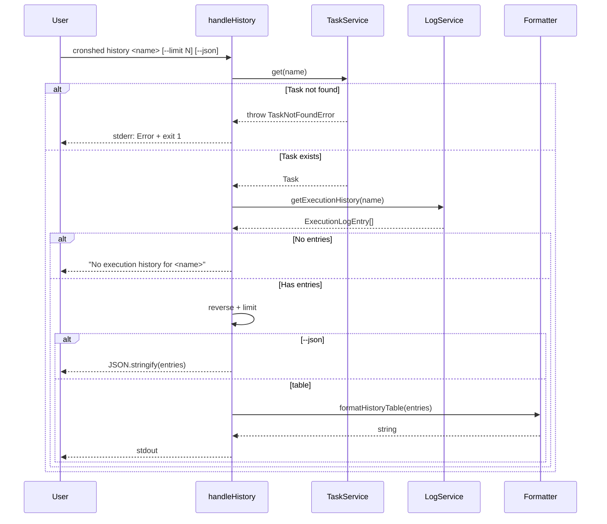
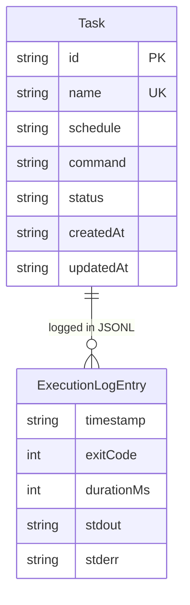

# Plan: Execution History

- **Status:** Approved
- **Date:** 2026-03-30
- **Summary:** Add `getExecutionHistory` to log service, create `handleHistory` CLI handler with `--limit` and `--json` flags, add `formatHistoryTable` formatter.

---

## Technical Context

| Dimension | Value |
|---|---|
| Language | TypeScript (strict) |
| Runtime | Bun |
| CLI Parsing | parseArgs (node:util) |
| Storage | JSONL log files in ~/.cronshed/logs/ |
| Testing | bun:test |
| Platform | macOS (local CLI) |

---

## Constitution Check

| Principle | Alignment |
|---|---|
| Simplicity First | Read-only feature — reads existing JSONL logs, no new storage format |
| Single Responsibility | Log reading in log.service.ts, formatting in cli.formatter.ts, routing in cli.handler.ts |
| Explicit Over Implicit | ExecutionLogEntry type makes all log fields visible in the type system |
| Fail Fast | Validate task existence before attempting to read logs |
| No Side Effects at Import | All new code is exported functions, no side effects |

---

## Sequence Diagram — History Command Flow

```gherkin
Feature: History command flow
  Scenario: Display history for a task
    Given a task exists in the manifest
    And the task has execution logs
    When the user runs "cronshed history <name>"
    Then the handler validates the task exists via TaskService
    And reads all log entries via LogService
    And reverses and limits entries
    And formats them as a table

  Scenario: Task not found
    Given no task with the given name exists
    When the user runs "cronshed history <name>"
    Then the handler catches TaskNotFoundError
    And displays an error message on stderr
```



---

## ER Diagram — Data Model



---

## Implementation Plan

### Step 1 — Add ExecutionLogEntry type to log.types.ts

- **File:** `src/log/log.types.ts`
- **Action:** Add `ExecutionLogEntry` interface with all 5 fields (timestamp, exitCode, durationMs, stdout, stderr)
- **FR:** FR-002
- **Tests:** None (type-only change)

### Step 2 — Add getExecutionHistory to log.service.ts

- **File:** `src/log/log.service.ts`
- **Action:** Add `getExecutionHistory(taskName: string): Promise<ExecutionLogEntry[]>` that:
  - Reads the full JSONL log file via `Bun.file()`
  - Splits by newlines, parses each line as JSON
  - Validates required fields (timestamp, exitCode, durationMs, stdout, stderr)
  - Skips invalid/corrupted lines silently
  - Returns array of valid entries (in file order, caller reverses)
- **FR:** FR-001
- **Tests:** `src/log/log.service.test.ts` — multiple entries, no file, empty file, corrupted lines, mixed valid/invalid

### Step 3 — Add formatHistoryTable to cli.formatter.ts

- **File:** `src/cli/cli.formatter.ts`
- **Action:** Add `formatHistoryTable(entries: ExecutionLogEntry[]): string` that:
  - Renders a table with columns: TIMESTAMP, EXIT CODE, DURATION, STDOUT, STDERR
  - Timestamps formatted as YYYY-MM-DD HH:MM:SS
  - Exit codes colored (green for 0, red for non-zero)
  - Duration formatted as human-readable (e.g., "1.5s", "2m 30s")
  - stdout/stderr truncated to 80 chars with `...` suffix
  - Newlines in stdout/stderr replaced with spaces
- **FR:** FR-004, FR-005
- **Tests:** `src/cli/cli.formatter.test.ts` — various entry shapes, truncation, coloring, empty entries

### Step 4 — Add handleHistory to cli.handler.ts

- **File:** `src/cli/cli.handler.ts`
- **Action:** Add `handleHistory(args: string[], service: TaskService): Promise<void>` that:
  - Parses `name` from args[0] (error if missing)
  - Parses `--limit N` (default 10) and `--json` flags
  - Calls `service.get(name)` to validate task exists
  - Calls `getExecutionHistory(name)` from log service
  - If no entries: prints "No execution history for <name>" (or `[]` for JSON)
  - Reverses entries (most recent first)
  - Applies limit
  - Outputs formatted table or JSON
- **FR:** FR-003, FR-006, FR-007, FR-008, FR-009, FR-010
- **Tests:** `src/cli/cli.integration.test.ts` — full integration tests

### Step 5 — Register history command and update help

- **File:** `src/cli/cli.handler.ts`
- **Action:** Add `history` to `QUERY_SUBCOMMANDS` and update help text
- **FR:** FR-006
- **Tests:** Integration test for `--help` output

### Step 6 — Write unit tests for log.service.ts

- **File:** `src/log/log.service.test.ts`
- **Action:** Add tests for `getExecutionHistory`:
  - Multiple valid entries
  - No log file
  - Empty log file
  - Corrupted lines skipped
  - Mixed valid/corrupted
  - All corrupted returns empty array
- **FR:** FR-001, AC-011

### Step 7 — Write unit tests for cli.formatter.ts

- **File:** `src/cli/cli.formatter.test.ts`
- **Action:** Add tests for `formatHistoryTable`:
  - Multiple entries with headers
  - Exit code coloring
  - Duration formatting
  - stdout/stderr truncation at 80 chars
  - Newline replacement in output fields
- **FR:** FR-004, FR-005

### Step 8 — Write integration tests for history command

- **File:** `src/cli/cli.integration.test.ts`
- **Action:** Full end-to-end tests:
  - History with entries (table output)
  - History with `--json`
  - History with `--limit`
  - History for task with no logs
  - History for non-existent task
  - History with missing name argument
  - Help output includes history command
- **FR:** FR-003, FR-006, FR-007, FR-008, FR-009, FR-010

---

## Testing Strategy

| Layer | What | Tool |
|---|---|---|
| Unit | getExecutionHistory with various log states | bun:test + temp files |
| Unit | formatHistoryTable formatting, truncation, coloring | bun:test |
| Integration | handleHistory end-to-end with real file I/O | bun:test + temp dir |

---

## Risks & Considerations

| Risk | Mitigation |
|---|---|
| Large log files (>1MB) may be slow to read fully | Acceptable for MVP — log rotation is a Future feature |
| JSONL parsing of large files could use significant memory | Read as string, split lines — simple and sufficient for single-user tool |
| stdout/stderr may contain special characters | JSON.parse handles escaping; table display replaces newlines |
