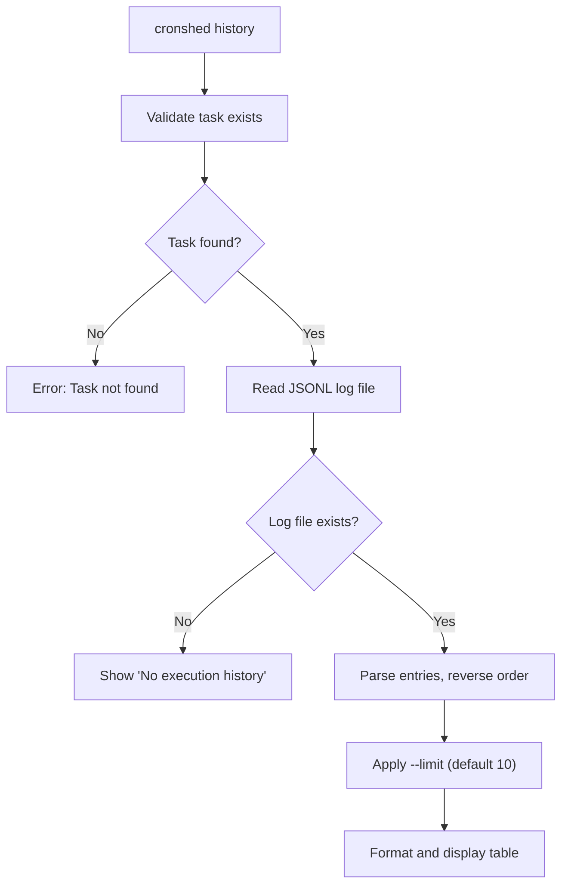
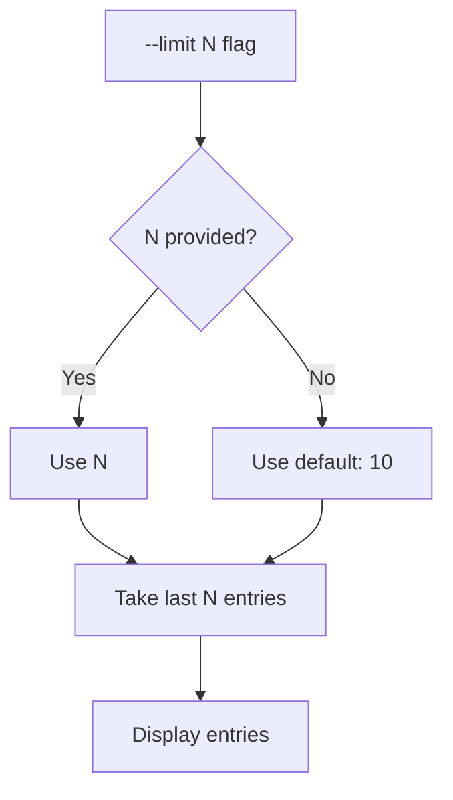
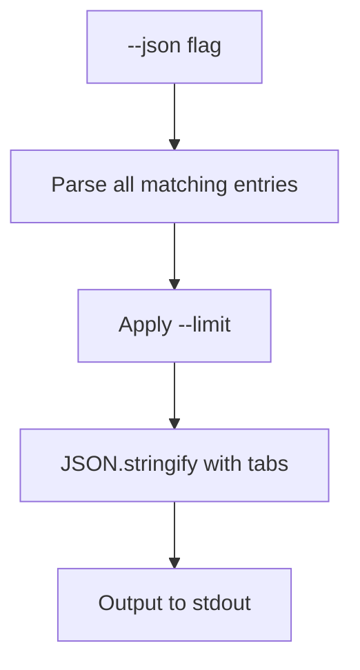
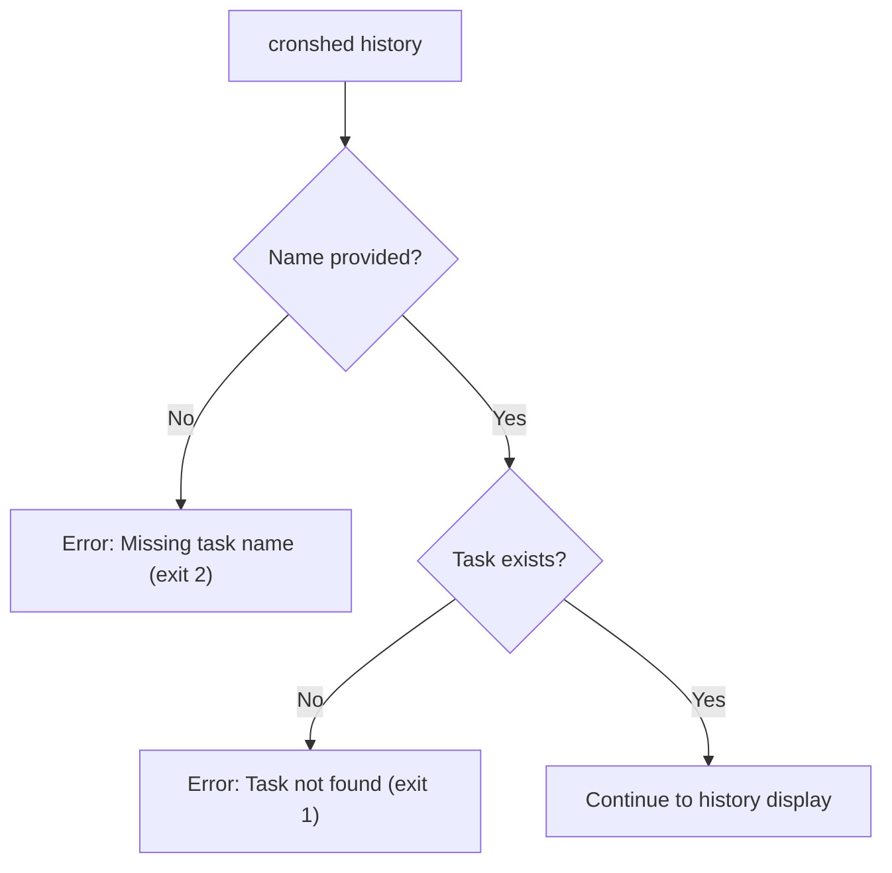
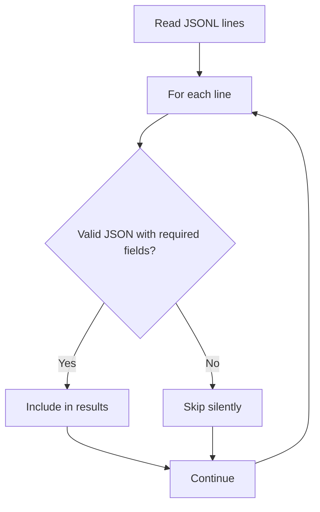

# Feature: Execution History

- **Branch:** `feature/007-execution-history`
- **Date:** 2026-03-30
- **Status:** Implemented
- **Input:** Record and display execution history (exit code, duration, stdout/stderr)

---

## User Stories

### Story 1 — View execution history for a task (P1 — critical)

As a developer, I want to run `cronshed history <name>` to see past executions of a task, so I can diagnose failures and verify that my cron jobs are running correctly.

**Priority reason:** Core debugging capability. Without history, failures are invisible and the tool offers no advantage over raw crontab.

**Independent test:** Create a JSONL log file with multiple entries; run `cronshed history <name>`; verify entries display in reverse chronological order with timestamp, exit code, duration, and truncated output.

```gherkin
Feature: View execution history for a task
  Scenario: Display history with multiple executions
    Given a task "backup-db" exists in the manifest
    And the log file "backup-db.jsonl" contains 5 execution entries
    When the user runs "cronshed history backup-db"
    Then the output shows the 5 entries in reverse chronological order
    And each entry displays timestamp, exit code, and duration
    And stdout/stderr are truncated to 80 characters per field

  Scenario: Display history with failed executions
    Given a task "sync-files" exists in the manifest
    And the log file contains entries with exit codes 0, 0, 1, 0
    When the user runs "cronshed history sync-files"
    Then the entry with exit code 1 shows the exit code in red
    And the entries with exit code 0 show the exit code in green

  Scenario: Task has no execution history
    Given a task "new-task" exists in the manifest
    And no log file exists for "new-task"
    When the user runs "cronshed history new-task"
    Then the output shows "No execution history for new-task"
```



### Story 2 — Limit history entries (P2 — important)

As a developer, I want to use `--limit N` to control how many entries are displayed, so I can see recent runs without scrolling through hundreds of entries.

**Priority reason:** Log files grow unbounded. Without a limit, output becomes unusable for long-running tasks.

**Independent test:** Create a log file with 20 entries; run `cronshed history <name> --limit 5`; verify only 5 most recent entries are shown.

```gherkin
Feature: Limit history entries
  Scenario: Default limit of 10
    Given a task "backup-db" with 20 log entries
    When the user runs "cronshed history backup-db"
    Then exactly 10 entries are displayed
    And they are the 10 most recent entries

  Scenario: Custom limit
    Given a task "backup-db" with 20 log entries
    When the user runs "cronshed history backup-db --limit 5"
    Then exactly 5 entries are displayed
    And they are the 5 most recent entries

  Scenario: Limit exceeds available entries
    Given a task "backup-db" with 3 log entries
    When the user runs "cronshed history backup-db --limit 10"
    Then all 3 entries are displayed
```



### Story 3 — JSON output for automation (P2 — important)

As a developer, I want `cronshed history <name> --json` to output structured JSON, so I can pipe history data into scripts and monitoring tools.

**Priority reason:** JSON output is the automation interface, consistent with `list --json` and `get --json`.

**Independent test:** Run `cronshed history <name> --json`; verify output is valid JSON array with all fields.

```gherkin
Feature: JSON output for automation
  Scenario: JSON output with entries
    Given a task "backup-db" with 3 log entries
    When the user runs "cronshed history backup-db --json"
    Then the output is a valid JSON array
    And each entry contains timestamp, exitCode, durationMs, stdout, stderr
    And entries are in reverse chronological order

  Scenario: JSON output with no history
    Given a task "new-task" with no log file
    When the user runs "cronshed history new-task --json"
    Then the output is an empty JSON array "[]"

  Scenario: JSON output respects limit
    Given a task "backup-db" with 20 log entries
    When the user runs "cronshed history backup-db --json --limit 3"
    Then the output is a JSON array with exactly 3 entries
```



### Story 4 — Handle non-existent task (P1 — critical)

As a developer, I want a clear error when I run `cronshed history` with a task name that does not exist in the manifest, so I know the task name is wrong rather than wondering if it has no history.

**Priority reason:** Fail fast with actionable errors prevents confusion between "no history" and "wrong name".

**Independent test:** Run `cronshed history nonexistent-task`; verify error message and exit code 1.

```gherkin
Feature: Handle non-existent task
  Scenario: Task does not exist
    Given no task named "nonexistent-task" exists in the manifest
    When the user runs "cronshed history nonexistent-task"
    Then stderr shows an error "Task 'nonexistent-task' not found"
    And the exit code is 1

  Scenario: Missing task name argument
    When the user runs "cronshed history" with no arguments
    Then stderr shows an error "Missing task name"
    And a usage hint is displayed
    And the exit code is 2
```



### Story 5 — Handle corrupted log entries (P3 — nice-to-have)

As a developer, I want the history command to gracefully skip corrupted log lines rather than crashing, so partial log corruption does not prevent me from viewing valid entries.

**Priority reason:** Log files are written by bash wrappers and may be interrupted. Graceful handling prevents data loss.

**Independent test:** Create a log file with valid and corrupted lines; run `cronshed history <name>`; verify valid entries display and corrupted lines are silently skipped.

```gherkin
Feature: Handle corrupted log entries
  Scenario: Mixed valid and corrupted entries
    Given a task "backup-db" exists
    And the log file contains 3 valid entries and 2 corrupted lines
    When the user runs "cronshed history backup-db"
    Then only the 3 valid entries are displayed
    And no error is shown for the corrupted lines

  Scenario: All entries corrupted
    Given a task "backup-db" exists
    And the log file contains only corrupted lines
    When the user runs "cronshed history backup-db"
    Then the output shows "No execution history for backup-db"
```



---

## Acceptance Criteria

| ID | Criterion | Stories |
|---|---|---|
| AC-001 | `cronshed history <name>` displays execution entries in reverse chronological order | S1 |
| AC-002 | Each entry shows timestamp, exit code, duration, and truncated stdout/stderr | S1 |
| AC-003 | Non-zero exit codes are displayed in red, zero in green | S1 |
| AC-004 | Default limit is 10 entries when `--limit` is not specified | S2 |
| AC-005 | `--limit N` restricts output to the N most recent entries | S2 |
| AC-006 | `--json` outputs a valid JSON array with all execution fields | S3 |
| AC-007 | `--json` with no history outputs `[]` | S3 |
| AC-008 | Non-existent task name produces error on stderr with exit code 1 | S4 |
| AC-009 | Missing task name argument produces error on stderr with exit code 2 | S4 |
| AC-010 | Task with no log file shows "No execution history for <name>" | S1 |
| AC-011 | Corrupted log lines are silently skipped | S5 |
| AC-012 | `--json` respects `--limit` | S3 |
| AC-013 | `history` command is listed in `--help` output | S1 |

---

## Functional Requirements

| ID | Requirement | AC |
|---|---|---|
| FR-001 | Add `getExecutionHistory(taskName: string): Promise<ExecutionLogEntry[]>` to log.service.ts that reads and parses all valid JSONL entries | AC-001, AC-011 |
| FR-002 | Create `ExecutionLogEntry` type: `{ timestamp: string; exitCode: number; durationMs: number; stdout: string; stderr: string }` | AC-002, AC-006 |
| FR-003 | Add `handleHistory` function to cli.handler.ts that validates task existence, reads history, applies limit, and dispatches to formatter or JSON output | AC-001, AC-004, AC-005, AC-008, AC-009 |
| FR-004 | Add `formatHistoryTable(entries: ExecutionLogEntry[]): string` to cli.formatter.ts that renders a reverse-chronological table with colored exit codes | AC-001, AC-002, AC-003 |
| FR-005 | Truncate stdout/stderr fields to 80 characters in table display (with `...` suffix) | AC-002 |
| FR-006 | Register `history` in cli.handler.ts routing and help text | AC-013 |
| FR-007 | `--json` outputs `JSON.stringify(entries, null, "\t")` | AC-006, AC-007, AC-012 |
| FR-008 | `--limit` flag with default 10, parsed via parseArgs | AC-004, AC-005, AC-012 |
| FR-009 | Validate task exists via TaskService.get() before reading logs | AC-008 |
| FR-010 | Show "No execution history for <name>" when log file is empty or missing | AC-010 |

---

## Key Entities

### ExecutionLogEntry

A single parsed entry from the JSONL log file.

```typescript
interface ExecutionLogEntry {
  timestamp: string;    // ISO 8601
  exitCode: number;
  durationMs: number;
  stdout: string;
  stderr: string;
}
```

---

## Edge Cases

| Case | Expected Behavior |
|---|---|
| Log file does not exist | "No execution history for <name>" |
| Log file is empty | "No execution history for <name>" |
| Log file has only corrupted lines | "No execution history for <name>" |
| Log file has mixed valid/corrupted lines | Show only valid entries |
| `--limit 0` | Show no entries (empty output) |
| `--limit` greater than available entries | Show all available entries |
| Very large log file (>1MB) | Read full file (no tail optimization for history — need all entries) |
| stdout/stderr contain newlines | Newlines replaced with spaces in table display |
| NO_COLOR is set | All output uses plain text, no ANSI codes |

---

## Success Criteria

| ID | Criterion | Measurable |
|---|---|---|
| SC-001 | All 13 AC pass with automated tests | bun test |
| SC-002 | No regression on existing tests | bun test full suite |
| SC-003 | `cronshed history <name>` response time < 500ms for a 1000-entry log | Manual timing |
