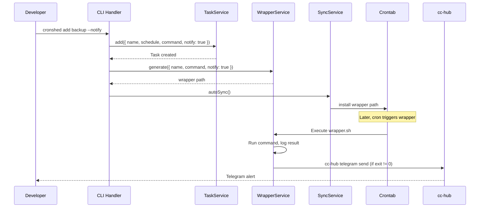
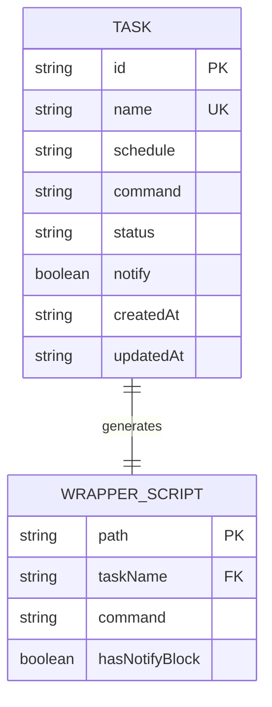

# Plan: Failure Notifications

- **Feature:** 008-failure-notifications
- **Status:** Approved
- **Date:** 2026-03-30

---

## Summary

Add a `notify` boolean field to the Task type and extend the wrapper script generator to include a conditional `cc-hub telegram send` block when a task fails. CLI handlers accept `--notify`/`--no-notify` flags.

---

## Technical Context

| Dimension | Value |
|-----------|-------|
| Language | TypeScript (strict) |
| Runtime | Bun |
| Testing | bun:test |
| File I/O | Bun.file() |
| Storage | tasks.json (flat file) |
| Notification tool | cc-hub telegram send (global CLI) |
| Platform | macOS |

---

## Constitution Check

| Principle | Compliance |
|-----------|------------|
| Simplicity First | Notification is a bash block in the wrapper -- no new runtime deps, no new services |
| Single Responsibility | WrapperService builds the script; CLI handler parses flags; Task type holds config |
| Explicit Over Implicit | notify defaults to false (opt-in); cc-hub availability checked at runtime |
| Fail Fast | Invalid flag combos caught at CLI level; wrapper never fails due to notification |
| No Side Effects at Import | No new modules execute on import |

---

## Service Interaction

```gherkin
Feature: Notification flow through services
  Scenario: Task with notify enabled is added
    Given the developer provides --notify flag
    When the CLI handler processes the add command
    Then TaskService stores notify: true in manifest
    And WrapperService generates a wrapper with notification block
    And SyncService installs the wrapper path in crontab

  Scenario: Wrapper executes and task fails
    Given cron triggers the wrapper script
    When the command exits with non-zero code
    Then the wrapper logs the execution result
    And the wrapper calls cc-hub telegram send with diagnostic message
```



---

## Data Model



---

## Implementation Plan

### Step 1: Add `notify` field to Task type

**Files:** `src/task/task.types.ts`

- Add `notify: boolean` to `Task` interface (after `status`)
- Add `notify?: boolean` to `CreateTaskInput`
- Add `notify?: boolean` to `UpdateTaskInput`
- Default value handling: absent in JSON = false

**Tests:** Update existing type tests if any. No new tests needed -- type-only change.

**FR:** FR-047

---

### Step 2: Update TaskService for notify field

**Files:** `src/task/task.service.ts`, `src/task/task.service.test.ts`

- `add()`: accept `notify` in input, default to `false` if absent
- `update()`: accept `notify` in input, update if provided
- Ensure `notify` is persisted in tasks.json

**Tests:**
- Add task with notify: true, verify manifest
- Add task without notify, verify defaults to false
- Update task notify field, verify manifest updated

**FR:** FR-047

---

### Step 3: Extend WrapperService with notification block

**Files:** `src/wrapper/wrapper.service.ts`, `src/wrapper/wrapper.types.ts`, `src/wrapper/wrapper.service.test.ts`

- Add `notify: boolean` to `WrapperConfig`
- Update `buildScript()`: when notify is true, insert the notification bash block after the JSON log append and before the cleanup
- The notification block:
  1. Checks `$_exit_code -ne 0`
  2. Checks `command -v cc-hub`
  3. Truncates stderr to 500 chars for notification
  4. Calls `cc-hub telegram send` with formatted message
- Update `generate()`: accept notify from task and pass to buildScript
- Update `syncWrappers()`: accept notify field per task

**Tests:**
- buildScript with notify=true: script contains notification block
- buildScript with notify=false: script does NOT contain notification block
- buildScript notification block contains cc-hub check
- buildScript notification block truncates stderr to 500 chars
- generate passes notify to buildScript

**FR:** FR-048, FR-049, FR-050, FR-053

---

### Step 4: Update CLI handler for --notify and --no-notify flags

**Files:** `src/cli/cli.handler.ts`, `src/cli/cli.handler.test.ts`

- `handleAdd()`: add `--notify` flag (boolean, default false), pass to service.add()
- `handleAdd()`: pass notify to WrapperService.generate()
- `handleUpdate()`: add `--notify` and `--no-notify` flags
- `handleUpdate()`: when notify changes, regenerate wrapper (even without command change)
- Update help text to include --notify flags

**Tests:**
- Add with --notify: task has notify true
- Add without --notify: task has notify false
- Update with --notify: task notify set to true, wrapper regenerated
- Update with --no-notify: task notify set to false, wrapper regenerated

**FR:** FR-051, FR-052

---

### Step 5: Update display formatters

**Files:** `src/cli/cli.formatter.ts`, `src/cli/cli.formatter.test.ts`

- `formatTaskDetails()`: add "Notify: on/off" line
- `formatTaskTable()`: no change needed (table is already compact)
- JSON output already includes all task fields -- notify is included automatically

**Tests:**
- formatTaskDetails with notify true shows "Notify: on"
- formatTaskDetails with notify false shows "Notify: off"

**FR:** FR-054, FR-055

---

### Step 6: Update SyncService to pass notify through

**Files:** `src/crontab/sync.service.ts`, `src/crontab/sync.service.test.ts`

- Update `syncWrappers()` call to pass task notify field
- Ensure wrapper regeneration respects notify setting during sync

**Tests:**
- Sync with mixed notify settings: correct wrappers generated

**FR:** FR-053

---

### Step 7: Integration test -- wrapper notification execution

**Files:** `src/wrapper/wrapper.integration.test.ts` (new)

- Create a mock cc-hub script that records its arguments to a file
- Generate a wrapper with notify=true
- Execute the wrapper with a failing command
- Verify mock cc-hub was called with correct message format
- Execute the wrapper with a succeeding command
- Verify mock cc-hub was NOT called
- Test without cc-hub in PATH: wrapper exits normally, no notification

**FR:** FR-048, FR-049 (end-to-end verification)

---

## Testing Strategy

| Test Type | Scope | Tool |
|-----------|-------|------|
| Unit | Task types, service, formatter | bun:test |
| Unit | WrapperService.buildScript() | bun:test |
| Unit | CLI handler flag parsing | bun:test |
| Integration | Wrapper script execution with mock cc-hub | bun:test + Bun.$ |

**Mock strategy:** Create a fake `cc-hub` bash script that writes its arguments to a temp file. Prepend its directory to PATH in the test environment.

---

## Risks & Considerations

| Risk | Mitigation |
|------|------------|
| cc-hub not in PATH at cron runtime | Wrapper checks `command -v cc-hub` before calling; skips silently |
| Telegram rate limiting | Single-user tool; rate limiting unlikely. If hit, cc-hub handles it |
| Notification delays cron job exit | cc-hub telegram send is fast (<1s). Non-critical path |
| Existing tasks have no notify field | Default to false; backward-compatible JSON parsing |
| Wrapper script quoting issues with stderr | Use bash variable expansion, not command substitution with user data |
