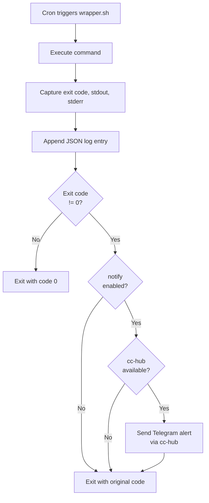
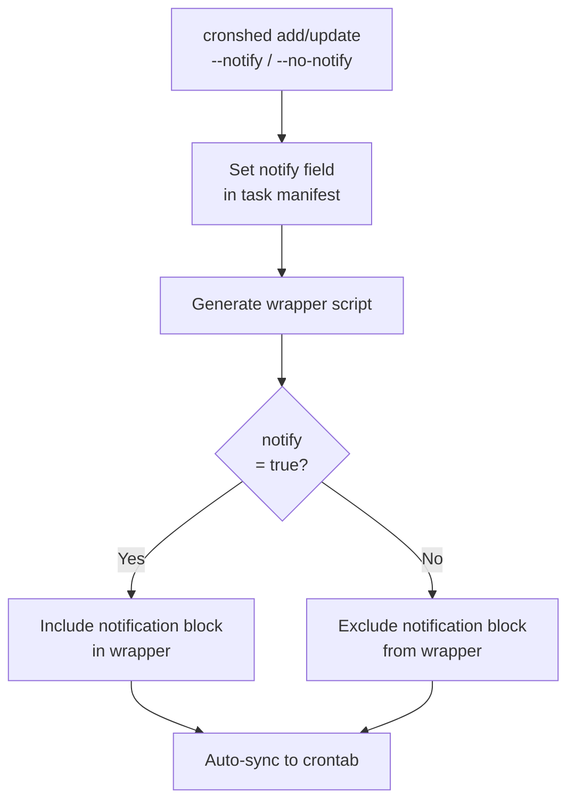
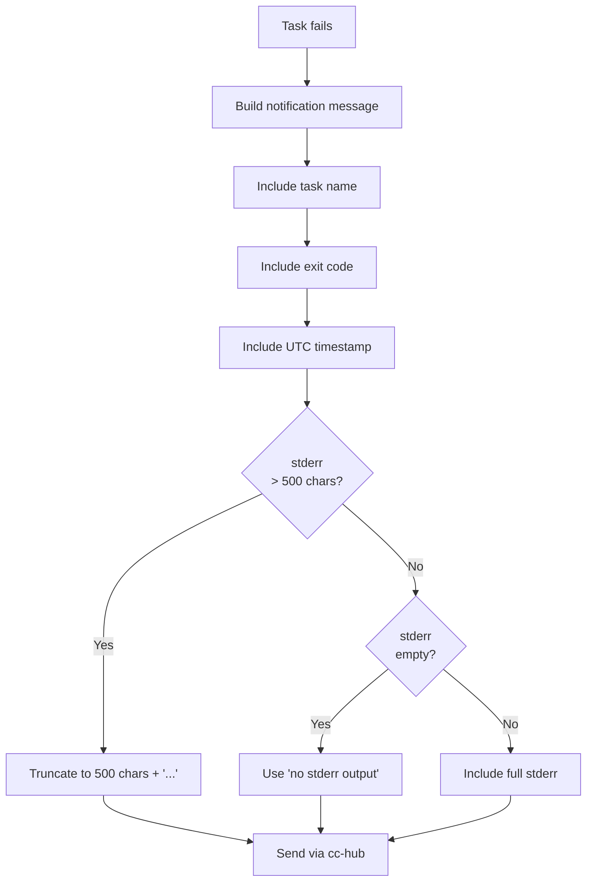
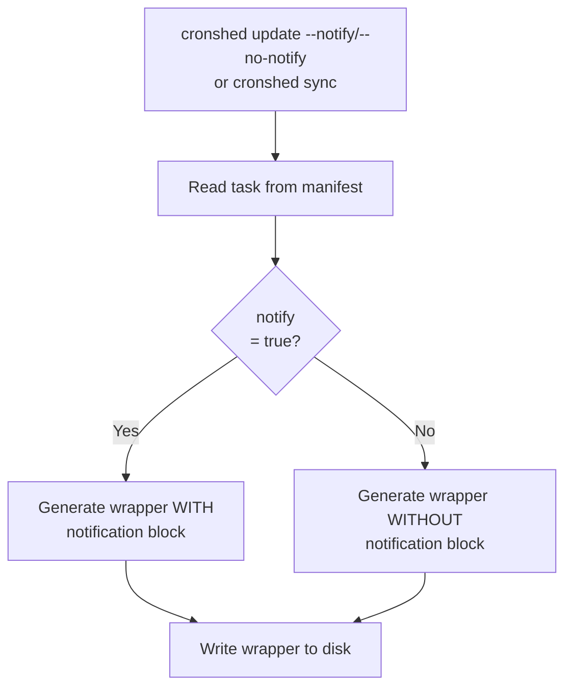
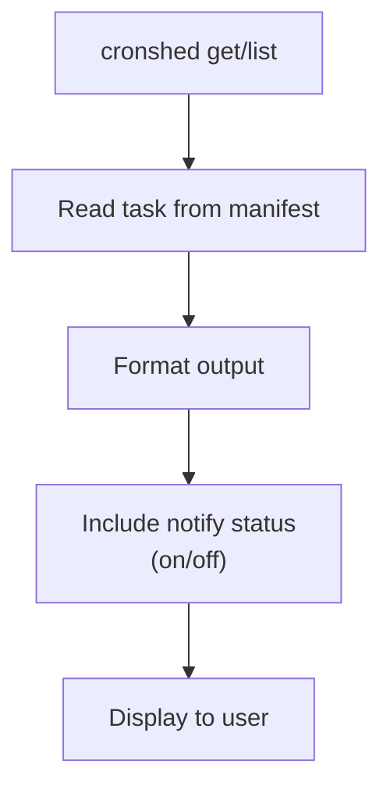

# Feature Spec: Failure Notifications

- **Feature:** Failure Notifications
- **Branch:** feature/008-failure-notifications
- **Date:** 2026-03-30
- **Status:** Implemented
- **Feature Number:** 008
- **Input:** Send Telegram alert via cc-hub on task failure. When a wrapper script detects a non-zero exit code, it should send a Telegram notification including task name, exit code, timestamp, and truncated stderr.

---

## Design Decisions

### Notification Mechanism

Notifications are sent from within the wrapper shell script by calling `cc-hub telegram send`. This avoids adding any runtime TypeScript dependency -- the wrapper is self-contained bash that calls an existing global CLI.

**Rationale:** Wrapper scripts run in cron context where Bun is not available. `cc-hub` is already installed globally and provides Telegram integration with zero configuration.

### Opt-in via Task Property

A `notify` boolean field is added to the `Task` interface. When `true`, the generated wrapper includes the notification block. When `false` or omitted, the wrapper behaves as before (no notification). Default is `false` -- opt-in, not opt-out.

**Rationale:** Not all tasks need notifications. A per-task toggle gives fine-grained control. Default `false` avoids surprise notifications for existing tasks.

### cc-hub Availability Check

The wrapper script checks if `cc-hub` is available in PATH before attempting notification. If absent, it silently skips the notification and logs normally. This prevents wrapper failures when cc-hub is not installed.

**Rationale:** The notification is a best-effort enhancement, not a critical path. A missing cc-hub should never break the cron job itself.

### Notification Content

The Telegram message includes: task name, exit code, UTC timestamp, and the first 500 characters of stderr. This provides enough context to diagnose the failure without flooding the chat.

**Rationale:** 500 chars of stderr is enough for most error messages. Telegram has a 4096 char limit per message -- keeping it short ensures readability.

### CLI Interface

The `cronshed add` and `cronshed update` commands accept a `--notify` flag to enable notifications. `cronshed update --no-notify` disables it. The wrapper is regenerated when the notify setting changes.

**Rationale:** Consistent with existing CLI patterns (flags for boolean properties). Wrapper regeneration ensures the notification block is added/removed immediately.

### Stderr Truncation for Notification

The notification truncates stderr to 500 characters (separate from the 10KB log truncation). If truncated, it appends `...` to indicate more content exists in the logs.

---

## User Scenarios & Testing

### Story 1 -- Wrapper sends Telegram alert on task failure `P1`

**Description:** As a developer, I want to receive a Telegram notification when a cron task fails, so I am immediately aware of failures without checking logs manually.

**Priority reason:** Core value of the feature -- without this, the entire feature has no purpose.

**Independent test:** Execute a wrapper script that fails, verify `cc-hub telegram send` is called with correct message.

```gherkin
Feature: Failure notification via Telegram
  Scenario: Task fails and notification is sent
    Given a task "backup-db" exists with notify enabled
    And the wrapper script is generated with notification support
    And cc-hub is available in PATH
    When the wrapper script executes a command that exits with code 1
    And stderr contains "connection refused"
    Then cc-hub telegram send is called
    And the message contains "backup-db"
    And the message contains "exit code 1"
    And the message contains "connection refused"
    And the message contains a UTC timestamp
    And the wrapper exits with code 1

  Scenario: Task succeeds and no notification is sent
    Given a task "backup-db" exists with notify enabled
    And the wrapper script is generated with notification support
    When the wrapper script executes a command that exits with code 0
    Then cc-hub telegram send is NOT called
    And the wrapper exits with code 0

  Scenario: Task fails but cc-hub is not available
    Given a task "backup-db" exists with notify enabled
    And the wrapper script is generated with notification support
    And cc-hub is NOT in PATH
    When the wrapper script executes a command that exits with code 1
    Then no notification attempt is made
    And the wrapper exits with code 1
    And the log entry is recorded normally
```

#### User Flow



---

### Story 2 -- Enable notifications per task `P1`

**Description:** As a developer, I want to enable or disable notifications per task via CLI flags, so I only get alerts for tasks I care about.

**Priority reason:** Without per-task control, the feature is all-or-nothing, which is unusable for a developer with many tasks.

**Independent test:** Add a task with `--notify`, verify the task has `notify: true` in the manifest and the wrapper contains notification logic.

```gherkin
Feature: Per-task notification toggle
  Scenario: Add task with notifications enabled
    Given no task "critical-backup" exists
    When the developer runs "cronshed add critical-backup --schedule '0 2 * * *' --command '/usr/local/bin/backup.sh' --notify"
    Then the task "critical-backup" has notify set to true in the manifest
    And the wrapper script contains notification logic

  Scenario: Add task without --notify flag (default off)
    Given no task "minor-cleanup" exists
    When the developer runs "cronshed add minor-cleanup --schedule '0 4 * * *' --command '/tmp/cleanup.sh'"
    Then the task "minor-cleanup" has notify set to false in the manifest
    And the wrapper script does NOT contain notification logic

  Scenario: Enable notifications on existing task
    Given a task "backup-db" exists with notify disabled
    When the developer runs "cronshed update backup-db --notify"
    Then the task "backup-db" has notify set to true in the manifest
    And the wrapper script is regenerated with notification logic

  Scenario: Disable notifications on existing task
    Given a task "backup-db" exists with notify enabled
    When the developer runs "cronshed update backup-db --no-notify"
    Then the task "backup-db" has notify set to false in the manifest
    And the wrapper script is regenerated without notification logic
```

#### User Flow



---

### Story 3 -- Notification message contains diagnostic info `P1`

**Description:** As a developer, I want the failure notification to include the task name, exit code, timestamp, and truncated stderr, so I can quickly assess the severity without opening a terminal.

**Priority reason:** A notification saying just "task failed" is useless. The message must contain enough context for immediate triage.

**Independent test:** Trigger a failure with known stderr, verify the notification message format.

```gherkin
Feature: Notification message content
  Scenario: Message includes all diagnostic fields
    Given a task "backup-db" with notify enabled
    When the command fails with exit code 2
    And stderr is "ERROR: connection to database refused at 10.0.0.1:5432"
    Then the notification message contains "backup-db"
    And the notification message contains "exit code 2"
    And the notification message contains a timestamp
    And the notification message contains "connection to database refused"

  Scenario: Long stderr is truncated in notification
    Given a task "verbose-task" with notify enabled
    When the command fails with exit code 1
    And stderr is longer than 500 characters
    Then the notification message contains the first 500 characters of stderr
    And the notification message ends stderr with "..."

  Scenario: Empty stderr in notification
    Given a task "silent-fail" with notify enabled
    When the command fails with exit code 1
    And stderr is empty
    Then the notification message contains "no stderr output"
```

#### User Flow



---

### Story 4 -- Wrapper regeneration propagates notify changes `P2`

**Description:** As a developer, I want the wrapper script to be regenerated when I change the notify setting, so the notification behavior matches the manifest.

**Priority reason:** Important for consistency, but the core add/update workflow already triggers regeneration.

**Independent test:** Update notify setting, verify the wrapper content changes accordingly.

```gherkin
Feature: Wrapper regeneration on notify change
  Scenario: Wrapper updated when notify enabled
    Given a task "backup-db" exists with notify disabled
    And the wrapper script does NOT contain notification logic
    When the developer runs "cronshed update backup-db --notify"
    Then the wrapper script contains notification logic

  Scenario: Wrapper updated when notify disabled
    Given a task "backup-db" exists with notify enabled
    And the wrapper script contains notification logic
    When the developer runs "cronshed update backup-db --no-notify"
    Then the wrapper script does NOT contain notification logic

  Scenario: Sync regenerates wrappers with correct notify state
    Given tasks.json contains "backup-db" with notify true and "cleanup" with notify false
    When the developer runs "cronshed sync"
    Then the wrapper for "backup-db" contains notification logic
    And the wrapper for "cleanup" does NOT contain notification logic
```

#### User Flow



---

### Story 5 -- Task detail shows notification status `P3`

**Description:** As a developer, I want `cronshed get` and `cronshed list` to show whether notifications are enabled, so I can verify the configuration at a glance.

**Priority reason:** Nice-to-have for visibility, not required for the notification feature to work.

**Independent test:** Get a task with notify enabled, verify the output includes the notify status.

```gherkin
Feature: Display notification status
  Scenario: Task detail shows notify enabled
    Given a task "backup-db" exists with notify enabled
    When the developer runs "cronshed get backup-db"
    Then the output includes "Notify: on"

  Scenario: Task detail shows notify disabled
    Given a task "cleanup" exists with notify disabled
    When the developer runs "cronshed get cleanup"
    Then the output includes "Notify: off"

  Scenario: JSON output includes notify field
    Given a task "backup-db" exists with notify enabled
    When the developer runs "cronshed get backup-db --json"
    Then the JSON output includes "notify": true
```

#### User Flow



---

## Acceptance Criteria

| # | Criterion | Story |
|---|-----------|-------|
| AC-063 | When a task with `notify: true` fails (exit code != 0), the wrapper calls `cc-hub telegram send` with a diagnostic message | Story 1 |
| AC-064 | When a task succeeds (exit code 0), no notification is sent regardless of notify setting | Story 1 |
| AC-065 | When `cc-hub` is not available in PATH, the wrapper skips notification silently and does not fail | Story 1 |
| AC-066 | `cronshed add --notify` creates a task with `notify: true` in the manifest | Story 2 |
| AC-067 | `cronshed add` without `--notify` creates a task with `notify: false` (default) | Story 2 |
| AC-068 | `cronshed update --notify` sets `notify: true` and regenerates the wrapper | Story 2 |
| AC-069 | `cronshed update --no-notify` sets `notify: false` and regenerates the wrapper | Story 2 |
| AC-070 | The notification message contains: task name, exit code, UTC timestamp, and truncated stderr (max 500 chars) | Story 3 |
| AC-071 | Empty stderr in notification shows "no stderr output" | Story 3 |
| AC-072 | `cronshed sync` regenerates wrappers with correct notification blocks based on each task's notify field | Story 4 |
| AC-073 | `cronshed get` displays the notify status (on/off) | Story 5 |
| AC-074 | `cronshed get --json` includes the `notify` field in the output | Story 5 |

---

## Functional Requirements

| # | Requirement | AC |
|---|------------|-----|
| FR-047 | Add a `notify` boolean field to the `Task` interface with default `false`. The field is optional in the stored manifest (absent = false) | AC-066, AC-067 |
| FR-048 | `WrapperService.buildScript()` must accept a `notify` flag. When true, include a notification block after the JSON log append that: checks if `cc-hub` exists in PATH, builds a message with task name/exit code/timestamp/truncated stderr, and calls `cc-hub telegram send` on non-zero exit code | AC-063, AC-064, AC-065 |
| FR-049 | The notification stderr truncation limit is 500 characters. If stderr exceeds this, append `...`. If stderr is empty, use the text `no stderr output` | AC-070, AC-071 |
| FR-050 | `WrapperService.generate()` must read the task's `notify` field and pass it to `buildScript()` | AC-063, AC-072 |
| FR-051 | The CLI handler for `add` must accept `--notify` flag and pass `notify: true` to the task creation. Default is `false` | AC-066, AC-067 |
| FR-052 | The CLI handler for `update` must accept `--notify` and `--no-notify` flags. When either is provided, update the task's `notify` field and regenerate the wrapper | AC-068, AC-069 |
| FR-053 | `WrapperService.syncWrappers()` must receive the `notify` field for each task and generate wrappers accordingly | AC-072 |
| FR-054 | `formatTaskDetails()` must display the notify status as "on" or "off" | AC-073 |
| FR-055 | JSON output for `get` and `list` must include the `notify` field from the task manifest | AC-074 |

---

## Key Entities

### Task (updated)

```typescript
interface Task {
  id: string;
  name: string;
  schedule: string;
  command: string;
  status: "active";
  notify: boolean;       // NEW -- default false
  createdAt: string;
  updatedAt?: string;
}
```

### Notification Block (in wrapper script)

```bash
# --- Failure notification ---
if [ $_exit_code -ne 0 ]; then
  if command -v cc-hub >/dev/null 2>&1; then
    _notify_stderr=$(head -c 500 "$_stderr_file")
    if [ -z "$_notify_stderr" ]; then
      _notify_stderr="no stderr output"
    elif [ $(wc -c < "$_stderr_file") -gt 500 ]; then
      _notify_stderr="${_notify_stderr}..."
    fi
    cc-hub telegram send "[cronshed] Task \"<task-name>\" failed (exit code $_exit_code) at $_timestamp
Stderr: $_notify_stderr"
  fi
fi
```

---

## Edge Cases

1. **cc-hub not installed** -- Wrapper checks `command -v cc-hub` before calling. If absent, notification is silently skipped. The wrapper never fails because of a missing cc-hub.
2. **cc-hub fails to send** -- If `cc-hub telegram send` exits with non-zero, the wrapper ignores it and exits with the original command's exit code. Notification failure is non-fatal.
3. **Very long stderr** -- Truncated to 500 chars in the notification message (separate from the 10KB log truncation). The full stderr is still in the log file.
4. **Empty stderr** -- Message shows "no stderr output" to make it clear the task failed without stderr.
5. **Binary/non-UTF8 stderr** -- Passed through as-is. cc-hub handles encoding. Worst case, Telegram shows garbled text but the notification still arrives.
6. **Notify toggled on existing task** -- Wrapper is regenerated immediately. Existing crontab entry still points to the same wrapper path, so the change takes effect on next cron execution.
7. **Sync with mixed notify settings** -- Each wrapper is generated independently based on its task's notify field. No global toggle needed.
8. **Task added with --notify before cc-hub install** -- The notify field is stored in the manifest. The wrapper checks for cc-hub at runtime. Installing cc-hub later makes notifications work without any task changes.
9. **Concurrent notification sends** -- Two tasks failing simultaneously each call cc-hub independently. cc-hub handles its own concurrency. No coordination needed.
10. **Notification during sync --dry-run** -- Dry-run does not generate wrappers, so no notification blocks are created or modified.

---

## Success Criteria

| # | Criterion | Measurement |
|---|-----------|-------------|
| SC-021 | Wrapper sends Telegram notification on task failure when notify is enabled | Integration test with mock cc-hub |
| SC-022 | No notification on success, no notification when notify is disabled | Unit + integration tests |
| SC-023 | Notification message contains task name, exit code, timestamp, truncated stderr | Integration test verifies message format |
| SC-024 | --notify / --no-notify flags work on add and update | Unit tests on CLI handler |
| SC-025 | Wrapper gracefully handles missing cc-hub | Integration test without cc-hub in PATH |
