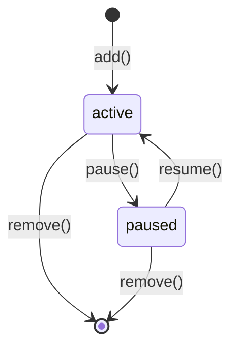
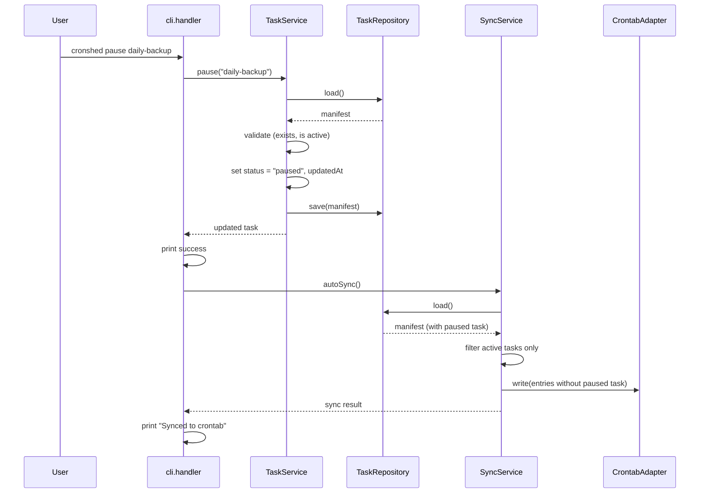
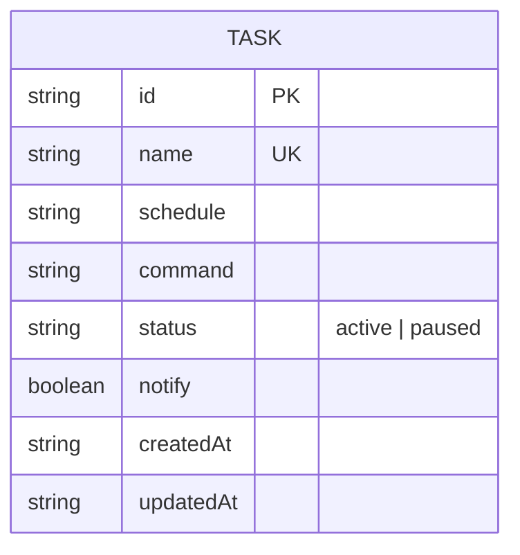

# Plan: Task Pause/Resume

- **Feature:** Task Pause/Resume
- **Feature Number:** 009
- **Date:** 2026-03-30
- **Status:** Approved

---

## Summary

Expand `Task.status` to support `"paused"`, add `pause()`/`resume()` methods to `TaskService`, register CLI handlers as mutation subcommands with auto-sync, filter paused tasks in `SyncService`, and update list/get enrichment to handle paused state.

---

## Technical Context

- **Language:** TypeScript (strict)
- **Runtime:** Bun
- **CLI parsing:** `parseArgs` (node:util)
- **Storage:** `tasks.json` flat file via `TaskRepository`
- **Testing:** `bun:test`
- **Existing patterns:** Mutation subcommands with auto-sync, domain error classes, enriched task display

---

## Constitution Check

| Principle | Compliance |
|-----------|-----------|
| Simplicity First | Two new methods on TaskService, two CLI handlers -- minimal addition |
| Single Responsibility | TaskService handles status mutation, SyncService handles filtering, CLI handles parsing |
| Explicit Over Implicit | Paused status is visible in list, errors for invalid state transitions |
| Fail Fast | TaskNotFoundError, TaskAlreadyPausedError, TaskAlreadyActiveError thrown immediately |
| No Side Effects at Import | New error classes and types are pure exports |

---

## State Diagram -- Task Status Lifecycle

```gherkin
Feature: Task status lifecycle
  Scenario: Pause an active task
    Given a task with status "active"
    When the user runs pause
    Then the task status becomes "paused"

  Scenario: Resume a paused task
    Given a task with status "paused"
    When the user runs resume
    Then the task status becomes "active"

  Scenario: Cannot pause a paused task
    Given a task with status "paused"
    When the user runs pause
    Then an error is returned

  Scenario: Cannot resume an active task
    Given a task with status "active"
    When the user runs resume
    Then an error is returned
```



---

## Sequence Diagram -- Pause Command

```gherkin
Feature: Pause command flow
  Scenario: Successful pause with auto-sync
    Given the user provides a valid task name
    When the CLI handler processes the pause command
    Then TaskService.pause() is called
    And auto-sync removes the task from crontab
    And success message is printed

  Scenario: Pause with --no-sync
    Given the user provides --no-sync flag
    When the CLI handler processes the pause command
    Then TaskService.pause() is called
    And auto-sync is skipped
```



---

## ER Diagram -- Modified Entity



---

## Implementation Plan

### Step 1 -- Expand Task types (task.types.ts)

**Files:** `src/task/task.types.ts`

1. Add `PAUSED: "paused"` to `TASK_STATUS` constant
2. Update `Task.status` type from `"active"` to `TaskStatus` (which now includes `"paused"`)
3. No changes to `CreateTaskInput` or `UpdateTaskInput` -- status is managed by pause/resume, not update

**FR covered:** FR-055

### Step 2 -- Add domain error classes (task.errors.ts)

**Files:** `src/task/task.errors.ts`

1. Add `TaskAlreadyPausedError` class extending `Error`
2. Add `TaskAlreadyActiveError` class extending `Error`

**FR covered:** FR-061

### Step 3 -- Add pause/resume methods to TaskService (task.service.ts)

**Files:** `src/task/task.service.ts`

1. Add `pause(name: string): Promise<Task>` method:
   - Load manifest, find task by name (throw TaskNotFoundError if missing)
   - Throw TaskAlreadyPausedError if status is "paused"
   - Set status to "paused", set updatedAt
   - Save manifest, return updated task
2. Add `resume(name: string): Promise<Task>` method:
   - Load manifest, find task by name (throw TaskNotFoundError if missing)
   - Throw TaskAlreadyActiveError if status is "active"
   - Set status to "active", set updatedAt
   - Save manifest, return updated task

**FR covered:** FR-056, FR-057

### Step 4 -- Add unit tests for TaskService pause/resume (task.service.test.ts)

**Files:** `src/task/task.service.test.ts`

Test cases:
- Pause an active task: status changes, updatedAt set
- Pause a non-existent task: throws TaskNotFoundError
- Pause an already-paused task: throws TaskAlreadyPausedError
- Resume a paused task: status changes, updatedAt set
- Resume a non-existent task: throws TaskNotFoundError
- Resume an already-active task: throws TaskAlreadyActiveError

**AC covered:** AC-001, AC-003, AC-005, AC-006, AC-007, AC-013

### Step 5 -- Filter paused tasks in SyncService (sync.service.ts)

**Files:** `src/crontab/sync.service.ts`

1. In `sync()` method, after loading manifest, filter tasks to only active ones before computing diff and generating entries
2. Wrapper sync also only processes active tasks

**FR covered:** FR-059

### Step 6 -- Add sync tests for paused task filtering (sync.service.test.ts)

**Files:** `src/crontab/sync.service.test.ts`

Test cases:
- Sync with paused task: paused task not installed
- Sync with mix of active and paused: only active tasks installed
- Dry-run with paused task: paused task not in diff
- Paused task with existing crontab entry: entry removed on sync

**AC covered:** AC-010, AC-011

### Step 7 -- Update enrichTask for paused status (cli.handler.ts)

**Files:** `src/cli/cli.handler.ts`

1. In `enrichTask()`, if task status is "paused", set `nextRun` to `"--"` instead of computing next execution
2. The `formatTaskDetails()` already shows `task.status`, so it will show "paused" automatically

**FR covered:** FR-060

### Step 8 -- Register pause/resume CLI handlers (cli.handler.ts)

**Files:** `src/cli/cli.handler.ts`

1. Add `handlePause(args, service, repo)` function:
   - Parse task name from args[0]
   - Parse `--no-sync` flag
   - Call `service.pause(name)`
   - Print success message
   - Call `autoSync(repo)` unless `--no-sync`
2. Add `handleResume(args, service, repo)` function:
   - Same pattern as handlePause but calls `service.resume(name)`
3. Add both to `MUTATION_SUBCOMMANDS` map
4. Add error classes to `getExitCode()` mapping (exit code 1)
5. Update help text

**FR covered:** FR-058, FR-062

### Step 9 -- Add CLI integration tests (cli.integration.test.ts)

**Files:** `src/cli/cli.integration.test.ts`

Test cases:
- `cronshed pause <name>` on active task: success + sync confirmation
- `cronshed pause <name>` on non-existent task: error
- `cronshed pause <name>` on paused task: error
- `cronshed pause <name> --no-sync`: success without sync
- `cronshed resume <name>` on paused task: success + sync confirmation
- `cronshed resume <name>` on non-existent task: error
- `cronshed resume <name>` on active task: error
- `cronshed resume <name> --no-sync`: success without sync
- `cronshed list` with paused task: shows "paused" and "--" for next run
- `cronshed list --json` with paused task: correct JSON output
- `cronshed get <name>` on paused task: shows "paused" and "--" for next run

**AC covered:** AC-001 through AC-013

### Step 10 -- Update spec artifacts

**Files:** `.specs/features/009-task-pause-resume/implementation.md`, `.specs/features/009-task-pause-resume/changelog.md`, `.specs/changelog.md`

1. Create `implementation.md` with FR/AC mapping
2. Update changelogs

---

## Testing Strategy

| Test Type | What | Framework |
|-----------|------|-----------|
| Unit | TaskService.pause(), TaskService.resume(), error classes | bun:test |
| Unit | SyncService filtering paused tasks | bun:test |
| Integration | CLI commands (pause, resume, list, get with paused tasks) | bun:test + CLI runner |

**Estimated new tests:** ~25-30 tests
**Existing tests to verify:** All existing tests must pass (backward compatibility)

---

## Risks & Considerations

| Risk | Mitigation |
|------|-----------|
| Existing tests break due to TaskStatus type change | The type widens from literal `"active"` to union -- existing `"active"` values remain valid |
| Sync accidentally installs paused tasks | Explicit filter before diff computation, tested in isolation |
| Update command on paused task | No special handling needed -- update modifies schedule/command, not status. Task stays paused |
| Wrapper regeneration for paused tasks | Wrappers are preserved during pause (no delete). SyncService.syncWrappers only processes active tasks |
