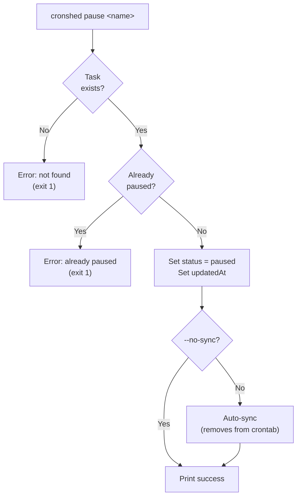
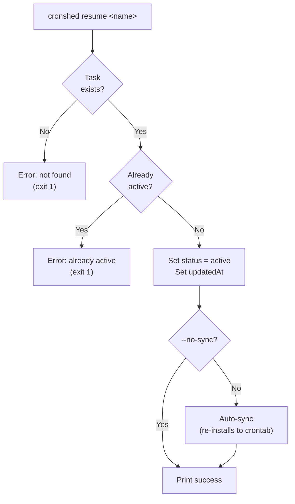
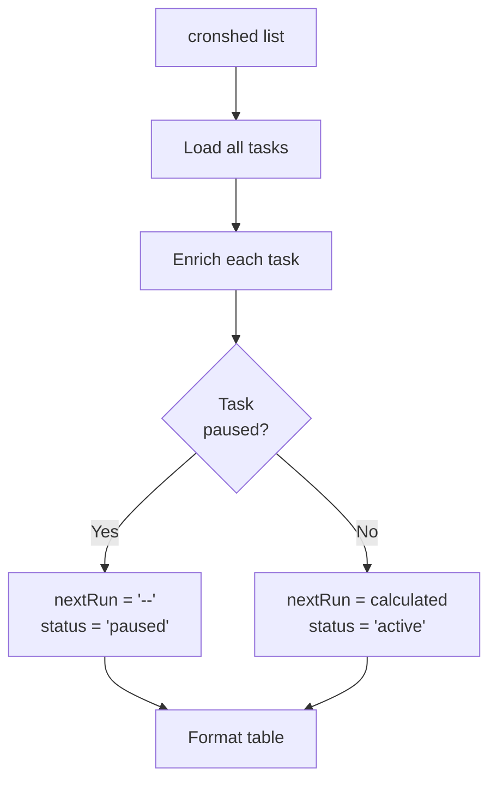
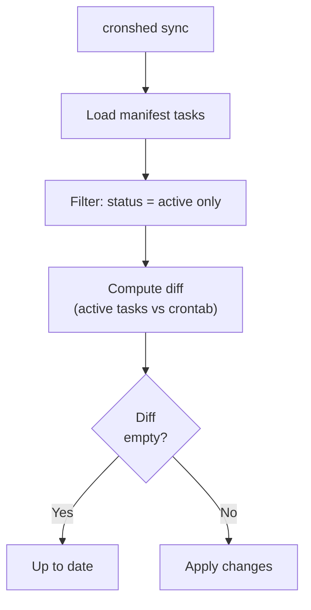
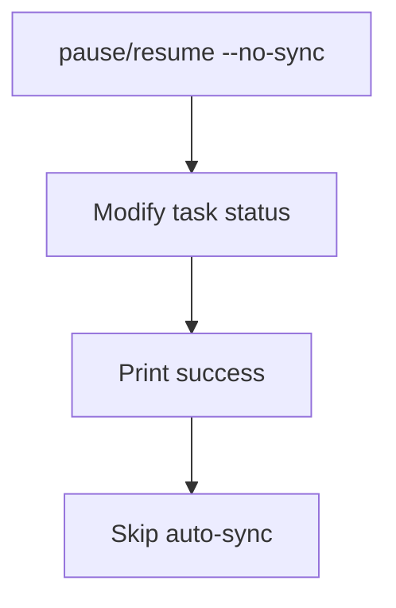

# Feature Spec: Task Pause/Resume

- **Feature:** Task Pause/Resume
- **Branch:** feature/009-task-pause-resume
- **Date:** 2026-03-30
- **Status:** Implemented
- **Feature Number:** 009
- **Input:** Task pause/resume — Temporarily disable a task without removing it. Add `cronshed pause <name>` and `cronshed resume <name>` commands. Pause sets task status to "paused", removes it from crontab (but keeps wrapper and logs). Resume sets task status back to "active", re-adds to crontab.

---

## Design Decisions

### Status Expansion

The `Task.status` field expands from `"active"` to `"active" | "paused"`. The `TASK_STATUS` constant gains a `PAUSED` entry. This is a minimal, backward-compatible change -- existing tasks already have `status: "active"`.

**Rationale:** A simple string union avoids introducing a full state machine for two states. The status field already exists and was designed for this expansion.

### Pause Semantics

Pausing a task sets its status to `"paused"` and triggers an auto-sync, which removes the task from crontab. The wrapper script and execution logs are preserved. This means the task can be resumed instantly without regenerating artifacts.

**Rationale:** The user wants to temporarily disable execution, not delete the task. Keeping wrappers and logs means resume is instant and history is preserved.

### Resume Semantics

Resuming a task sets its status back to `"active"` and triggers an auto-sync, which re-installs it in crontab. The wrapper already exists, so sync picks it up normally.

**Rationale:** Resume is the inverse of pause. Auto-sync handles the crontab reinstallation automatically.

### Sync Skips Paused Tasks

The `SyncService` filters out paused tasks before computing the diff. This means paused tasks are treated as if they do not exist in the manifest from the sync perspective -- their crontab entries are removed on the next sync.

**Rationale:** The sync algorithm already handles "task in manifest but not in crontab" and vice versa. Filtering paused tasks before sync reuses existing logic without special cases.

### Pause/Resume Are Mutations

`pause` and `resume` are classified as mutation subcommands because they modify the task manifest and trigger auto-sync. They follow the same `--no-sync` pattern as `add`, `update`, and `remove`.

**Rationale:** Consistency with existing mutation commands. The user can opt out of auto-sync with `--no-sync`.

### List Shows Paused Status

The `list` command displays paused tasks with a yellow `paused` indicator. Paused tasks show `--` for next run since they will not execute.

**Rationale:** The user needs to see which tasks are paused at a glance. Showing a next run time for a paused task would be misleading.

### Cannot Pause Already-Paused Task

Attempting to pause an already-paused task returns an error. Same for resuming an already-active task. This avoids silent no-ops that could confuse the user.

**Rationale:** Explicit feedback is better than silent success. The user should know the task was already in the desired state.

---

## User Scenarios & Testing

### Story 1 -- Developer pauses a task `P1`

**Description:** As a developer, I want to pause a running cron task so it stops executing without losing its configuration or history.

**Priority reason:** Core functionality -- without pause, the feature has no purpose.

**Independent test:** Run `cronshed pause <name>` on an active task, verify status changes to "paused" and crontab entry is removed.

```gherkin
Feature: Pause a task
  Scenario: Successfully pause an active task
    Given an active task "daily-backup" exists in the manifest
    And "daily-backup" has a crontab entry installed
    When the user runs "cronshed pause daily-backup"
    Then the task status changes to "paused"
    And the manifest updatedAt field is set
    And the crontab entry for "daily-backup" is removed
    And stdout shows a success message "Task daily-backup paused"
    And stdout shows "Synced to crontab"

  Scenario: Pause a task that does not exist
    Given no task named "ghost" exists in the manifest
    When the user runs "cronshed pause ghost"
    Then stderr shows an error "Task \"ghost\" not found"
    And the exit code is 1

  Scenario: Pause a task that is already paused
    Given a paused task "daily-backup" exists in the manifest
    When the user runs "cronshed pause daily-backup"
    Then stderr shows an error "Task \"daily-backup\" is already paused"
    And the exit code is 1
```



### Story 2 -- Developer resumes a paused task `P1`

**Description:** As a developer, I want to resume a paused task so it starts executing again according to its schedule.

**Priority reason:** Without resume, pause is a one-way operation -- the user would have to remove and re-add the task.

**Independent test:** Run `cronshed resume <name>` on a paused task, verify status changes to "active" and crontab entry is re-installed.

```gherkin
Feature: Resume a task
  Scenario: Successfully resume a paused task
    Given a paused task "daily-backup" exists in the manifest
    And "daily-backup" has no crontab entry installed
    When the user runs "cronshed resume daily-backup"
    Then the task status changes to "active"
    And the manifest updatedAt field is set
    And the crontab entry for "daily-backup" is re-installed
    And stdout shows a success message "Task daily-backup resumed"
    And stdout shows "Synced to crontab"

  Scenario: Resume a task that does not exist
    Given no task named "ghost" exists in the manifest
    When the user runs "cronshed resume ghost"
    Then stderr shows an error "Task \"ghost\" not found"
    And the exit code is 1

  Scenario: Resume a task that is already active
    Given an active task "daily-backup" exists in the manifest
    When the user runs "cronshed resume daily-backup"
    Then stderr shows an error "Task \"daily-backup\" is already active"
    And the exit code is 1
```



### Story 3 -- List command shows paused status `P1`

**Description:** As a developer, I want to see which tasks are paused in the task list so I have full visibility on my cron job state.

**Priority reason:** Without visual distinction, the user cannot tell which tasks are disabled.

**Independent test:** Run `cronshed list` with a mix of active and paused tasks, verify paused tasks show "paused" status and `--` for next run.

```gherkin
Feature: List shows paused tasks
  Scenario: List displays mixed active and paused tasks
    Given an active task "daily-backup" exists with schedule "0 2 * * *"
    And a paused task "weekly-report" exists with schedule "0 9 * * 1"
    When the user runs "cronshed list"
    Then the output table shows "daily-backup" with status "active"
    And the output table shows "weekly-report" with status "paused"
    And "weekly-report" shows a dash for NEXT RUN

  Scenario: JSON list includes paused status
    Given a paused task "weekly-report" exists
    When the user runs "cronshed list --json"
    Then the JSON output includes a task with status "paused"
    And the paused task nextRun is a dash string
```



### Story 4 -- Sync skips paused tasks `P2`

**Description:** As a developer, I want `cronshed sync` to skip paused tasks so they are not installed in the crontab.

**Priority reason:** Critical for correctness -- if sync installs paused tasks, the pause feature is broken.

**Independent test:** Run `cronshed sync` with a paused task, verify it is not installed in crontab and dry-run does not show it.

```gherkin
Feature: Sync skips paused tasks
  Scenario: Sync does not install paused tasks
    Given an active task "daily-backup" exists
    And a paused task "weekly-report" exists
    When the user runs "cronshed sync"
    Then only "daily-backup" is installed in the crontab
    And "weekly-report" has no crontab entry

  Scenario: Dry-run does not show paused tasks
    Given a paused task "weekly-report" exists
    And "weekly-report" has no crontab entry
    When the user runs "cronshed sync --dry-run"
    Then the dry-run output does not include "weekly-report"
```



### Story 5 -- Pause with --no-sync flag `P3`

**Description:** As a developer, I want to pause a task without triggering auto-sync so I can batch multiple changes before syncing.

**Priority reason:** Consistency with other mutation commands that support --no-sync.

**Independent test:** Run `cronshed pause <name> --no-sync`, verify status changes but crontab is not modified.

```gherkin
Feature: Pause and resume with --no-sync
  Scenario: Pause without auto-sync
    Given an active task "daily-backup" exists
    When the user runs "cronshed pause daily-backup --no-sync"
    Then the task status changes to "paused"
    And no crontab sync is performed
    And stdout shows "Task daily-backup paused"
    And stdout does not show "Synced to crontab"

  Scenario: Resume without auto-sync
    Given a paused task "daily-backup" exists
    When the user runs "cronshed resume daily-backup --no-sync"
    Then the task status changes to "active"
    And no crontab sync is performed
    And stdout shows "Task daily-backup resumed"
    And stdout does not show "Synced to crontab"
```



---

## Acceptance Criteria

| AC | Description | Story |
|----|-------------|-------|
| AC-001 | `cronshed pause <name>` sets task status to "paused" and persists to manifest | Story 1 |
| AC-002 | `cronshed pause <name>` triggers auto-sync which removes the task from crontab | Story 1 |
| AC-003 | `cronshed resume <name>` sets task status to "active" and persists to manifest | Story 2 |
| AC-004 | `cronshed resume <name>` triggers auto-sync which re-installs the task in crontab | Story 2 |
| AC-005 | Pausing an already-paused task returns an error with exit code 1 | Story 1 |
| AC-006 | Resuming an already-active task returns an error with exit code 1 | Story 2 |
| AC-007 | Pausing or resuming a non-existent task returns TaskNotFoundError with exit code 1 | Story 1, 2 |
| AC-008 | `cronshed list` shows "paused" status for paused tasks and `--` for next run | Story 3 |
| AC-009 | `cronshed list --json` includes paused tasks with correct status and nextRun | Story 3 |
| AC-010 | `cronshed sync` does not install paused tasks in the crontab | Story 4 |
| AC-011 | `cronshed sync --dry-run` does not show paused tasks in the diff | Story 4 |
| AC-012 | `--no-sync` flag prevents auto-sync on both pause and resume | Story 5 |
| AC-013 | Pause and resume set the `updatedAt` field on the task | Story 1, 2 |

---

## Functional Requirements

| FR | Description | AC |
|----|-------------|-----|
| FR-055 | Expand `Task.status` type from `"active"` to `"active" \| "paused"` and add `PAUSED` to `TASK_STATUS` constant | AC-001, AC-003, AC-008 |
| FR-056 | Add `pause(name)` method to `TaskService` that sets status to "paused" with validation (exists, not already paused) | AC-001, AC-005, AC-007, AC-013 |
| FR-057 | Add `resume(name)` method to `TaskService` that sets status to "active" with validation (exists, not already active) | AC-003, AC-006, AC-007, AC-013 |
| FR-058 | Register `pause` and `resume` as mutation subcommands in `cli.handler.ts` with `--no-sync` support and auto-sync | AC-002, AC-004, AC-012 |
| FR-059 | Filter paused tasks in `SyncService.sync()` before computing the diff and generating crontab entries | AC-010, AC-011 |
| FR-060 | Update `enrichTask()` to return `"--"` for `nextRun` when task is paused | AC-008, AC-009 |
| FR-061 | Add `TaskAlreadyPausedError` and `TaskAlreadyActiveError` domain error classes | AC-005, AC-006 |
| FR-062 | Update CLI help text to include pause and resume commands | AC-001, AC-003 |

---

## Key Entities

| Entity | Change | Description |
|--------|--------|-------------|
| Task | Modified | `status` field expands to `"active" \| "paused"` |
| TaskStatus | Modified | Type union gains `"paused"` member |
| TASK_STATUS | Modified | Constant gains `PAUSED: "paused"` entry |

---

## Edge Cases

1. **Pause then sync manually** -- If the user pauses a task with `--no-sync` and then runs `cronshed sync`, the paused task must not be installed
2. **Resume then sync manually** -- Same as above but in reverse: resumed task must be installed on next sync
3. **Update a paused task** -- Updating schedule or command on a paused task should succeed (the task stays paused). The change takes effect on resume
4. **Remove a paused task** -- Removing a paused task should work normally (remove from manifest, delete wrapper)
5. **Get details of a paused task** -- `cronshed get <name>` should show status "paused" and `--` for next run
6. **History of a paused task** -- `cronshed history <name>` should work normally (show past executions)

---

## Success Criteria

| SC | Metric | Target |
|----|--------|--------|
| SC-001 | All pause/resume Gherkin scenarios pass as tests | 100% |
| SC-002 | Paused tasks never appear in crontab after sync | 100% (no false installs) |
| SC-003 | Type check passes with expanded TaskStatus type | `bunx tsc --noEmit` exits 0 |
| SC-004 | Existing tests remain green (backward compatibility) | 0 regressions |
