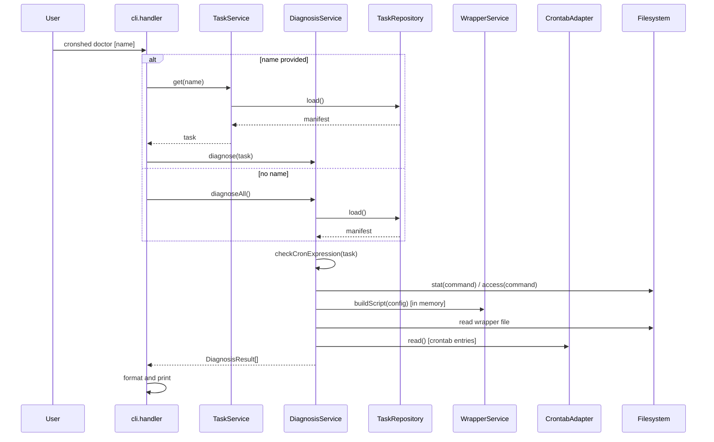

# Plan: Task Diagnosis

- **Feature:** Task Diagnosis
- **Feature Number:** 010
- **Date:** 2026-03-30
- **Status:** Approved

---

## Summary

Add a read-only `cronshed doctor [name]` command backed by a `DiagnosisService` that runs 5 checks per task (cron expression, command file, directory, permissions, wrapper staleness, crontab entry), returns structured results with severity levels, and outputs color-coded reports or JSON.

---

## Technical Context

- **Language:** TypeScript (strict)
- **Runtime:** Bun
- **CLI parsing:** `parseArgs` (node:util)
- **Storage:** `tasks.json` flat file via `TaskRepository`
- **Testing:** `bun:test`
- **Existing patterns:** Query subcommands, `isFilePath()` from command.resolver, `WrapperService.buildScript()`, `CrontabAdapter.read()`

---

## Constitution Check

| Principle | Compliance |
|-----------|-----------|
| Simplicity First | Read-only command, no state mutation, single new service |
| Single Responsibility | DiagnosisService handles checks, CLI handler handles I/O, formatter handles display |
| Explicit Over Implicit | Structured results with severity levels, clear error/warning distinction |
| Fail Fast | TaskNotFoundError for unknown task name, immediate return on empty manifest |
| No Side Effects at Import | New types and service are pure exports |

---

## Sequence Diagram -- Doctor Command

```gherkin
Feature: Doctor command flow
  Scenario: Doctor all tasks
    Given the user runs "cronshed doctor" with no arguments
    When the CLI handler processes the doctor command
    Then DiagnosisService.diagnoseAll() is called
    And all tasks are checked
    And results are formatted and printed

  Scenario: Doctor single task
    Given the user provides a task name
    When the CLI handler processes the doctor command
    Then TaskService.get() validates the task exists
    And DiagnosisService.diagnose() is called for that task
    And results are formatted and printed
```



---

## Implementation Plan

### Step 1 -- Define diagnosis types (diagnosis.types.ts)

**Files:** `src/diagnosis/diagnosis.types.ts`

1. Define `IssueSeverity` type: `"error" | "warning"`
2. Define `DiagnosisIssue` interface: `{ check: string; severity: IssueSeverity; message: string; hint?: string }`
3. Define `DiagnosisResult` interface: `{ taskName: string; status: "ok" | "issues"; issues: DiagnosisIssue[] }`
4. Define check name constants: `CRON_EXPRESSION`, `COMMAND_FILE_NOT_FOUND`, `COMMAND_FILE_NOT_EXECUTABLE`, `COMMAND_FILE_IS_DIRECTORY`, `WRAPPER_MISSING`, `WRAPPER_STALE`, `CRONTAB_ENTRY_MISSING`

**FR covered:** FR-068

### Step 2 -- Implement DiagnosisService (diagnosis.service.ts)

**Files:** `src/diagnosis/diagnosis.service.ts`

1. Create `DiagnosisService` class accepting `TaskRepository`, `CrontabAdapter`, `WrapperService`, and `dataDir`
2. Implement `diagnose(task: Task): Promise<DiagnosisResult>`:
   - Run all checks in sequence, collect issues
   - Return `{ taskName, status: issues.length > 0 ? "issues" : "ok", issues }`
3. Implement `diagnoseAll(): Promise<DiagnosisResult[]>`:
   - Load all tasks from repository
   - Read crontab once (cache for all tasks)
   - Run `diagnose()` on each task
4. Implement private check methods:
   - `checkCronExpression(task)`: validate with `cron-parser`, catch error -> issue
   - `checkCommandFile(task)`: use `isFilePath()` to detect file paths, then check stat + access
   - `checkWrapper(task)`: read wrapper file, compare with `buildScript()` output
   - `checkCrontabEntry(task, entries)`: lookup task name in crontab entries, skip paused

**FR covered:** FR-063, FR-064, FR-065, FR-066, FR-067

### Step 3 -- Add unit tests for DiagnosisService (diagnosis.service.test.ts)

**Files:** `src/diagnosis/diagnosis.service.test.ts`

Test cases per check:
- **Cron expression:** valid passes, invalid detected
- **Command file:** inline skipped, file not found detected, not executable detected, directory detected, valid file passes
- **Wrapper:** missing detected, stale detected, up-to-date passes
- **Crontab entry:** missing for active detected, missing for paused skipped, present passes
- **diagnoseAll():** empty manifest returns empty array, multiple tasks all checked

**AC covered:** AC-004 through AC-012, AC-015

### Step 4 -- Add diagnosis formatter (cli.formatter.ts)

**Files:** `src/cli/cli.formatter.ts`

1. Add `formatDiagnosisReport(results: DiagnosisResult[]): string`:
   - For each task: show task name with colored status indicator
   - Green checkmark for ok tasks
   - For tasks with issues: list each issue with red (error) or yellow (warning) prefix
   - Include hints when available
2. Add `formatDiagnosisSummary(results: DiagnosisResult[]): string`:
   - One-line summary: "N tasks checked, N ok, N with issues"

**FR covered:** FR-070

### Step 5 -- Register doctor CLI handler (cli.handler.ts)

**Files:** `src/cli/cli.handler.ts`

1. Add `handleDoctor(args, service)` function:
   - Parse optional task name from args[0]
   - Parse `--json` flag
   - If name provided: call `service.get(name)` to validate, then `diagnosisService.diagnose(task)`
   - If no name: call `diagnosisService.diagnoseAll()`
   - If `--json`: output `JSON.stringify(results, null, "\t")`
   - Else: output `formatDiagnosisReport(results)`
   - Exit 1 if any issues found, exit 0 if all ok
2. Add `doctor` to `QUERY_SUBCOMMANDS` map (but as a standalone command since it needs its own dependencies)
3. Update help text to include `doctor [name] [--json]`
4. Handle empty results (no tasks): print "No tasks configured." and exit 0

**FR covered:** FR-069, FR-071, FR-072, FR-073

### Step 6 -- Add CLI integration tests (cli.handler.test.ts additions)

**Files:** `src/cli/cli.handler.test.ts` (or `src/diagnosis/diagnosis.integration.test.ts`)

Test cases:
- `cronshed doctor` with no tasks: "No tasks configured"
- `cronshed doctor` with healthy tasks: all ok, exit 0
- `cronshed doctor` with broken tasks: issues reported, exit 1
- `cronshed doctor <name>`: single task diagnosed
- `cronshed doctor <name>` non-existent: error, exit 1
- `cronshed doctor --json`: valid JSON output
- `cronshed doctor <name> --json`: single task JSON

**AC covered:** AC-001 through AC-015

### Step 7 -- Update spec artifacts

**Files:** `.specs/features/010-task-diagnosis/implementation.md`, `.specs/features/010-task-diagnosis/changelog.md`, `.specs/changelog.md`, `.specs/README.md`, `.specs/roadmap.md`

1. Create `implementation.md` with FR/AC mapping
2. Create feature changelog
3. Update global changelog
4. Update README features table
5. Check roadmap item as done

---

## Testing Strategy

| Test Type | What | Framework |
|-----------|------|-----------|
| Unit | DiagnosisService per-check methods | bun:test |
| Unit | formatDiagnosisReport formatter | bun:test |
| Integration | CLI doctor command end-to-end | bun:test + temp dirs |

**Estimated new tests:** ~35-45 tests
**Existing tests to verify:** All existing tests must pass (backward compatibility)

---

## Risks & Considerations

| Risk | Mitigation |
|------|-----------|
| Crontab read failure breaks doctor | Catch CrontabReadError, skip crontab check with warning, still run other checks |
| Wrapper staleness false positives from timestamp in generated header | Strip the `# Generated:` timestamp line from both expected and actual before comparing |
| Command with arguments (e.g. `/path/to/script.sh --flag`) | Extract first token for file checks, consistent with `isFilePath()` and `resolveCommand()` pattern |
| Large number of tasks slows diagnosis | All checks are fast (filesystem stat + one crontab read). Crontab is read once and cached. Acceptable for local single-user tool |
