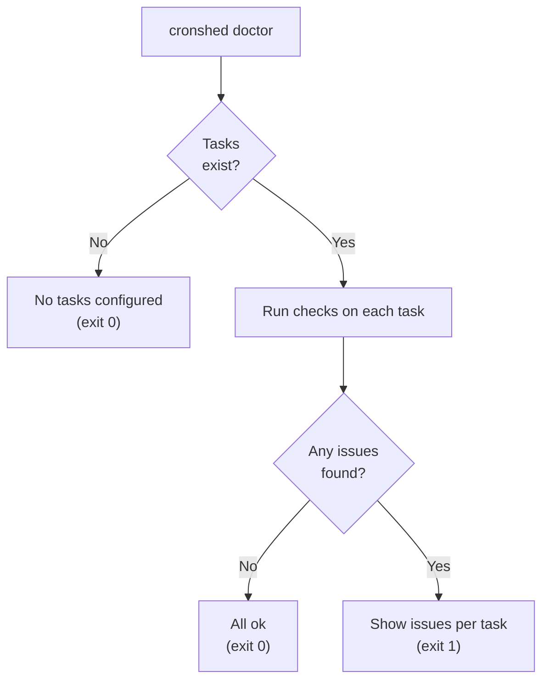
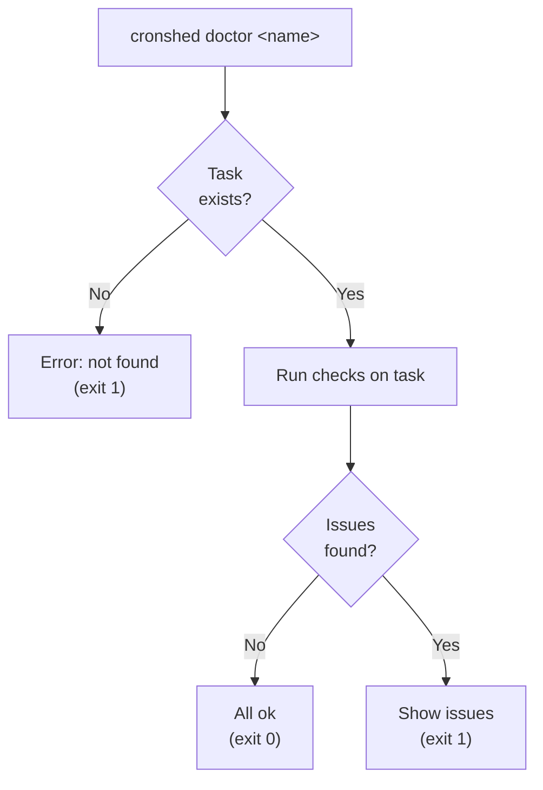
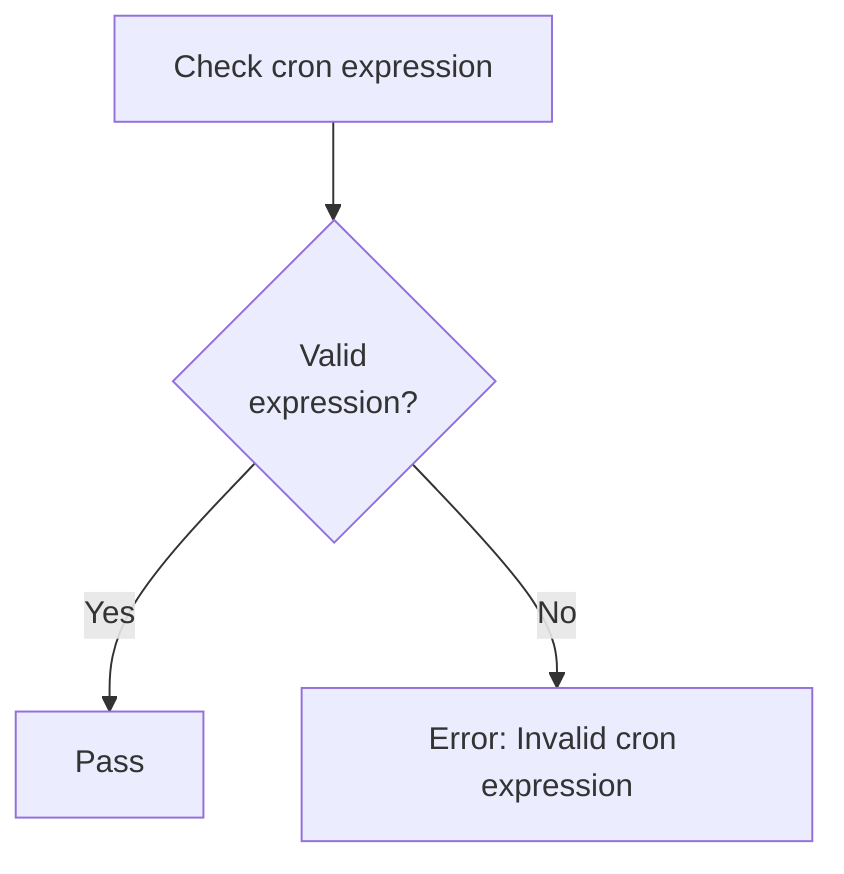
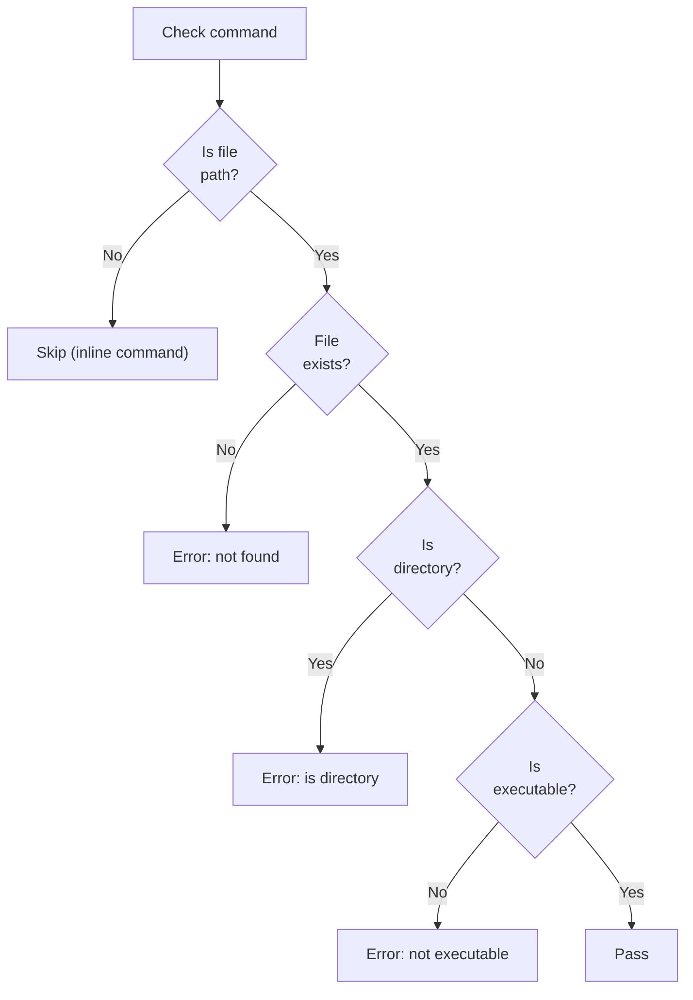
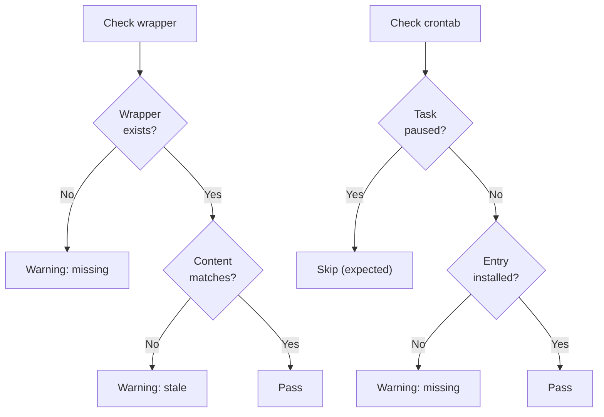
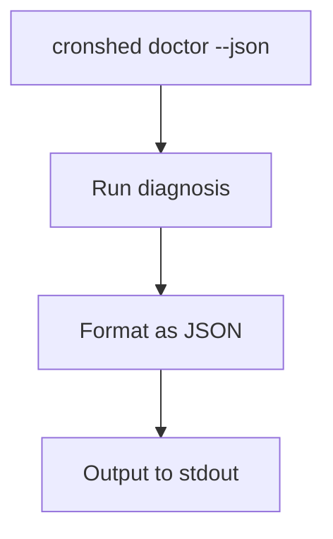

# Feature Spec: Task Diagnosis

- **Feature:** Task Diagnosis
- **Branch:** feature/010-task-diagnosis
- **Date:** 2026-03-30
- **Status:** Implemented
- **Feature Number:** 010
- **Input:** Task diagnosis — Detect common misconfigurations (bad cron expr, missing script, permission issues). Add a `cronshed doctor [name]` command that checks tasks for common issues: invalid cron expression, command file not found, command file not executable, command is a directory, wrapper script missing or stale, crontab entry missing for active task. If `name` provided: diagnose single task. If omitted: diagnose all tasks. Output: list of issues per task, color-coded (red=error, yellow=warning, green=ok).

---

## Design Decisions

### New "doctor" Subcommand

The diagnosis feature is a read-only query command (`cronshed doctor [name]`). It does not modify any state -- it only reads the manifest, filesystem, wrapper scripts, and crontab to report issues.

**Rationale:** Separating diagnosis from mutation follows the Single Responsibility principle. The command name "doctor" is familiar from `brew doctor`, `npm doctor`, etc.

### Diagnosis Checks as a Service

All diagnosis logic lives in a dedicated `DiagnosisService` that accepts dependencies (TaskRepository, CrontabAdapter, WrapperService) and returns structured results. The CLI handler only formats and displays.

**Rationale:** Testable in isolation without CLI. The service returns typed results, the formatter decides colors and layout.

### Issue Severity Levels

Each check produces an issue with a severity level:
- **error** (red) -- Task will not execute correctly (invalid cron, missing script, not executable, is directory)
- **warning** (yellow) -- Task may work but is in a degraded state (wrapper missing/stale, crontab entry missing)
- **ok** (green) -- No issues found for this task

**Rationale:** The user needs to know at a glance which tasks need immediate attention (errors) vs which have secondary problems (warnings).

### Wrapper Staleness Detection

A wrapper is "stale" when its content does not match what `WrapperService.buildScript()` would generate for the current task state. The check regenerates the expected script in memory and compares it with the file on disk.

**Rationale:** Wrappers can become stale if tasks.json is edited manually or if the wrapper generation logic changed. Comparing against the expected output catches both cases.

### Crontab Entry Check Skips Paused Tasks

The "crontab entry missing" check only applies to active tasks. Paused tasks are expected to have no crontab entry.

**Rationale:** Consistency with the pause/resume feature -- paused tasks are intentionally removed from crontab.

### Exit Code Semantics

- Exit 0: all tasks pass (no errors or warnings)
- Exit 1: at least one warning or error found
- Exit 2: usage error (invalid arguments)
- Standard error handling for manifest/crontab access errors (exit 3)

**Rationale:** Non-zero exit code allows scripting (`cronshed doctor && echo "All good"`).

---

## User Scenarios & Testing

### Story 1 -- Developer runs doctor on all tasks `P1`

**Description:** As a developer, I want to run `cronshed doctor` to check all my tasks for common issues so I can fix misconfigurations before they cause silent failures.

**Priority reason:** Core functionality -- the primary use case is scanning all tasks at once.

**Independent test:** Create tasks with various issues, run `cronshed doctor`, verify all issues are detected and reported.

```gherkin
Feature: Doctor all tasks
  Scenario: All tasks healthy
    Given an active task "daily-backup" exists with valid config
    And its wrapper script exists and is up to date
    And its crontab entry is installed
    When the user runs "cronshed doctor"
    Then the output shows "daily-backup" with a green ok status
    And the exit code is 0

  Scenario: Multiple tasks with mixed issues
    Given an active task "daily-backup" exists with a valid config
    And an active task "broken-job" exists with a missing command file
    And an active task "stale-job" exists with a stale wrapper
    When the user runs "cronshed doctor"
    Then the output shows "daily-backup" with ok status
    And the output shows "broken-job" with an error "Command file not found"
    And the output shows "stale-job" with a warning "Wrapper script is stale"
    And the exit code is 1

  Scenario: No tasks configured
    Given no tasks exist in the manifest
    When the user runs "cronshed doctor"
    Then the output shows "No tasks configured"
    And the exit code is 0
```



### Story 2 -- Developer runs doctor on a single task `P1`

**Description:** As a developer, I want to run `cronshed doctor <name>` to diagnose a specific task so I can quickly check a task I suspect has problems.

**Priority reason:** Essential for targeted diagnosis when the user already knows which task might be broken.

**Independent test:** Run `cronshed doctor <name>` on a task with known issues, verify issues are reported.

```gherkin
Feature: Doctor single task
  Scenario: Diagnose a healthy task
    Given an active task "daily-backup" exists with valid config
    And its wrapper and crontab entry exist
    When the user runs "cronshed doctor daily-backup"
    Then the output shows "daily-backup" with ok status
    And the exit code is 0

  Scenario: Diagnose a task with errors
    Given an active task "broken-job" exists
    And its command file does not exist on disk
    When the user runs "cronshed doctor broken-job"
    Then the output shows "broken-job" with an error "Command file not found"
    And the exit code is 1

  Scenario: Diagnose a non-existent task
    Given no task named "ghost" exists
    When the user runs "cronshed doctor ghost"
    Then stderr shows an error "Task \"ghost\" not found"
    And the exit code is 1
```



### Story 3 -- Detect invalid cron expression `P1`

**Description:** As a developer, I want the doctor to detect tasks with invalid cron expressions so I can fix expressions that were manually edited in tasks.json.

**Priority reason:** Invalid cron expressions prevent the task from being scheduled -- this is a critical error.

**Independent test:** Manually edit tasks.json to insert an invalid cron expression, run doctor, verify it is detected.

```gherkin
Feature: Detect invalid cron expression
  Scenario: Task with invalid cron expression
    Given a task "broken-cron" exists with schedule "not a cron"
    When the user runs "cronshed doctor broken-cron"
    Then the output shows an error "Invalid cron expression: not a cron"
    And the exit code is 1

  Scenario: Task with valid cron expression
    Given a task "valid-cron" exists with schedule "0 2 * * *"
    When the user runs "cronshed doctor valid-cron"
    Then no cron expression error is reported
```



### Story 4 -- Detect command file issues `P1`

**Description:** As a developer, I want the doctor to detect when a command file has been deleted, had its permissions changed, or is a directory, so I can fix file-level issues.

**Priority reason:** Command file issues are the most common misconfiguration after initial setup -- scripts get moved or permissions reset.

**Independent test:** Create a task pointing to a non-existent file, run doctor, verify detection.

```gherkin
Feature: Detect command file issues
  Scenario: Command file not found
    Given a task "missing-cmd" exists with command "/path/to/deleted-script.sh"
    And the file "/path/to/deleted-script.sh" does not exist
    When the user runs "cronshed doctor missing-cmd"
    Then the output shows an error "Command file not found: /path/to/deleted-script.sh"

  Scenario: Command file not executable
    Given a task "no-exec" exists with command "/path/to/script.sh"
    And the file "/path/to/script.sh" exists but is not executable
    When the user runs "cronshed doctor no-exec"
    Then the output shows an error "Command file not executable: /path/to/script.sh"
    And the hint suggests "chmod +x /path/to/script.sh"

  Scenario: Command is a directory
    Given a task "dir-cmd" exists with command "/path/to/somedir"
    And "/path/to/somedir" is a directory
    When the user runs "cronshed doctor dir-cmd"
    Then the output shows an error "Command path is a directory: /path/to/somedir"

  Scenario: Command is an inline command (not a file path)
    Given a task "inline-cmd" exists with command "echo hello"
    When the user runs "cronshed doctor inline-cmd"
    Then no command file check is performed (inline commands are not validated)
```



### Story 5 -- Detect wrapper and crontab issues `P2`

**Description:** As a developer, I want the doctor to detect when wrapper scripts are missing or stale, and when crontab entries are missing for active tasks, so I can run `cronshed sync` to fix them.

**Priority reason:** Wrapper and crontab issues are secondary to command-level errors but still indicate the task will not execute correctly.

**Independent test:** Delete a wrapper script, run doctor, verify it detects the missing wrapper.

```gherkin
Feature: Detect wrapper and crontab issues
  Scenario: Wrapper script missing
    Given an active task "daily-backup" exists
    And its wrapper script does not exist at the expected path
    When the user runs "cronshed doctor daily-backup"
    Then the output shows a warning "Wrapper script missing"
    And the hint suggests "Run 'cronshed sync' to regenerate"

  Scenario: Wrapper script is stale
    Given an active task "daily-backup" exists
    And its wrapper script exists but does not match the expected content
    When the user runs "cronshed doctor daily-backup"
    Then the output shows a warning "Wrapper script is stale"
    And the hint suggests "Run 'cronshed sync' to regenerate"

  Scenario: Crontab entry missing for active task
    Given an active task "daily-backup" exists
    And its crontab entry is not installed
    When the user runs "cronshed doctor daily-backup"
    Then the output shows a warning "Crontab entry missing"
    And the hint suggests "Run 'cronshed sync' to install"

  Scenario: Crontab entry missing for paused task (not an issue)
    Given a paused task "paused-job" exists
    And it has no crontab entry
    When the user runs "cronshed doctor paused-job"
    Then no crontab entry warning is reported (paused tasks are expected to have no entry)

  Scenario: Wrapper check skipped for paused tasks
    Given a paused task "paused-job" exists
    And its wrapper script exists
    When the user runs "cronshed doctor paused-job"
    Then wrapper staleness is still checked (wrapper exists, so we validate it)
```



### Story 6 -- JSON output for doctor `P3`

**Description:** As a developer, I want `cronshed doctor --json` to output structured diagnosis results so I can pipe them to other tools.

**Priority reason:** Nice-to-have for scripting and automation, consistent with other commands' `--json` flag.

**Independent test:** Run `cronshed doctor --json`, verify output is valid JSON with expected structure.

```gherkin
Feature: JSON output for doctor
  Scenario: JSON output with issues
    Given a task "broken-job" exists with a missing command file
    When the user runs "cronshed doctor --json"
    Then the output is valid JSON
    And each task has a "name" field and an "issues" array
    And each issue has "check", "severity", "message" fields

  Scenario: JSON output for single task
    Given a healthy task "daily-backup" exists
    When the user runs "cronshed doctor daily-backup --json"
    Then the output is valid JSON with a single task entry
    And the issues array is empty
```



---

## Acceptance Criteria

| AC | Description | Story |
|----|-------------|-------|
| AC-001 | `cronshed doctor` with no args runs diagnosis on all tasks | Story 1 |
| AC-002 | `cronshed doctor <name>` runs diagnosis on a single task | Story 2 |
| AC-003 | Non-existent task name returns TaskNotFoundError with exit code 1 | Story 2 |
| AC-004 | Invalid cron expression is detected as an error | Story 3 |
| AC-005 | Missing command file (file path command) is detected as an error | Story 4 |
| AC-006 | Non-executable command file is detected as an error with chmod hint | Story 4 |
| AC-007 | Command path that is a directory is detected as an error | Story 4 |
| AC-008 | Inline commands (non-file-path) skip file checks | Story 4 |
| AC-009 | Missing wrapper script is detected as a warning | Story 5 |
| AC-010 | Stale wrapper script is detected as a warning | Story 5 |
| AC-011 | Missing crontab entry for active task is detected as a warning | Story 5 |
| AC-012 | Missing crontab entry for paused task is not reported (expected) | Story 5 |
| AC-013 | Exit code 0 when all tasks pass, exit code 1 when issues found | Story 1, 2 |
| AC-014 | `--json` flag outputs structured JSON with diagnosis results | Story 6 |
| AC-015 | Empty manifest shows "No tasks configured" with exit code 0 | Story 1 |

---

## Functional Requirements

| FR | Description | AC |
|----|-------------|-----|
| FR-063 | Create `DiagnosisService` class with `diagnose(task)` and `diagnoseAll()` methods returning structured results | AC-001, AC-002 |
| FR-064 | Implement cron expression validation check: parse schedule with cron-parser, report error if invalid | AC-004 |
| FR-065 | Implement command file checks: detect file paths (using `isFilePath`), check existence, directory, executable permission | AC-005, AC-006, AC-007, AC-008 |
| FR-066 | Implement wrapper check: compare on-disk wrapper with expected content from `WrapperService.buildScript()` | AC-009, AC-010 |
| FR-067 | Implement crontab entry check: verify active tasks have a crontab entry, skip paused tasks | AC-011, AC-012 |
| FR-068 | Define `DiagnosisResult`, `DiagnosisIssue`, and `IssueSeverity` types | AC-001, AC-014 |
| FR-069 | Register `doctor` as a query subcommand in `cli.handler.ts` with optional name argument and `--json` flag | AC-001, AC-002, AC-003, AC-015 |
| FR-070 | Add `formatDiagnosisReport()` to `cli.formatter.ts` for color-coded output (red=error, yellow=warning, green=ok) | AC-013 |
| FR-071 | Exit with code 0 when no issues, code 1 when any error or warning found | AC-013 |
| FR-072 | Support `--json` flag outputting `DiagnosisResult[]` as JSON | AC-014 |
| FR-073 | Update CLI help text to include the `doctor` command | AC-001 |

---

## Key Entities

| Entity | Type | Description |
|--------|------|-------------|
| DiagnosisResult | New | `{ taskName: string; status: "ok" \| "issues"; issues: DiagnosisIssue[] }` |
| DiagnosisIssue | New | `{ check: string; severity: "error" \| "warning"; message: string; hint?: string }` |
| IssueSeverity | New | `"error" \| "warning"` type alias |

---

## Edge Cases

1. **Task with inline command** -- `echo hello` is not a file path. Doctor skips file existence/permission checks for inline commands.
2. **Task with command arguments** -- `/path/to/script.sh --flag value` should check existence of `/path/to/script.sh` only, not the full string.
3. **Paused task** -- Crontab entry check is skipped. All other checks still apply (cron expression, command file, wrapper).
4. **Manually edited tasks.json** -- Invalid cron expressions can only appear if tasks.json is edited by hand (validation at add/update time prevents them). Doctor catches this.
5. **Wrapper directory does not exist** -- If the wrappers directory has not been created yet, all wrapper checks report "missing".
6. **Crontab read failure** -- If crontab cannot be read, the crontab entry check is skipped with a warning rather than failing the entire diagnosis.
7. **Command with tilde path** -- `~/scripts/backup.sh` is resolved via homedir before checking existence.

---

## Success Criteria

| SC | Metric | Target |
|----|--------|--------|
| SC-001 | All Gherkin scenarios pass as tests | 100% |
| SC-002 | Doctor detects all 6 check types correctly | 100% |
| SC-003 | Type check passes | `bunx tsc --noEmit` exits 0 |
| SC-004 | Existing tests remain green (backward compatibility) | 0 regressions |
