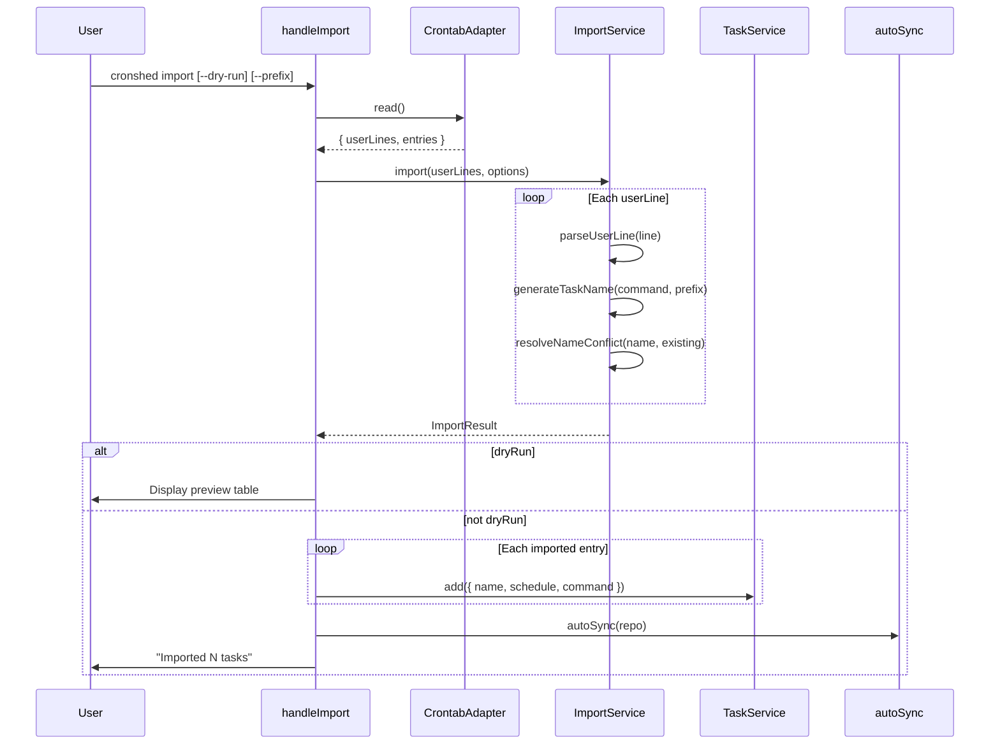
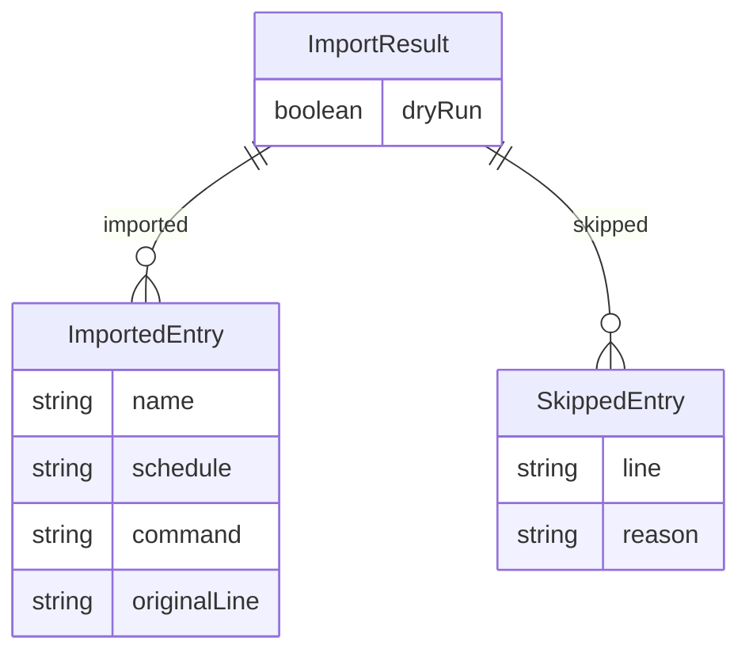

# Plan: Import Existing Crontab

- **Feature:** 011-import-existing-crontab
- **Status:** Approved
- **Date:** 2026-03-30

---

## Summary

Add a `cronshed import [--dry-run] [--prefix <name>]` CLI command that reads the current crontab, parses non-cronshed user lines into cron entries, auto-generates task names from commands, resolves name conflicts, and creates tasks in tasks.json with auto-sync.

---

## Technical Context

| Dimension | Value |
|---|---|
| Language | TypeScript (strict) |
| Runtime | Bun |
| CLI parsing | `parseArgs` (node:util) |
| Storage | `tasks.json` flat file via TaskRepository |
| Cron validation | `cron-parser` via `validateCronExpression` |
| Testing | `bun:test` |
| Platform | macOS (local) |

---

## Constitution Check

| Principle | Compliance |
|---|---|
| Simplicity First | New service with pure functions, no new dependencies |
| Single Responsibility | ImportService handles import logic only; CLI handler handles arg parsing |
| Explicit Over Implicit | Task names generated deterministically from commands; conflicts resolved with explicit suffix |
| Fail Fast | Invalid cron expressions rejected with warning; invalid names fall back to "imported-task" |
| No Side Effects at Import | ImportService is a class instantiated by the handler, no module-level side effects |

---

## Sequence Diagram — Import Flow

```gherkin
Feature: Import crontab entries
  Scenario: Successful import with auto-sync
    Given the system crontab has user-managed cron entries
    When the user runs "cronshed import"
    Then the CLI handler reads the crontab via CrontabAdapter
    And ImportService parses valid entries from userLines
    And tasks are created via TaskService.add for each entry
    And auto-sync updates the crontab with cronshed wrappers
    And a success summary is displayed
```



---

## ER Diagram — Import Result Entities



---

## Implementation Plan

### Step 1: Create import types (`src/import/import.types.ts`)

- Define `ImportOptions`, `ImportResult`, `ImportedEntry`, `SkippedEntry` interfaces
- **FR:** FR-075
- **Tests:** Type-only, no runtime tests needed

### Step 2: Create import service (`src/import/import.service.ts`)

- `parseUserLine(line: string): { schedule: string, command: string } | null`
  - Skip empty/whitespace lines
  - Skip comment lines (start with `#`)
  - Skip environment variable lines (match `^[A-Z_]+=`)
  - Parse 5-field cron schedule + remaining as command
  - Validate cron expression via `validateCronExpression`
  - Return null for invalid lines with warning to stderr
- `generateTaskName(command: string, prefix?: string): string`
  - Extract first token (before `|`, `>`, `>>`, `&&`, `;`)
  - Extract basename from path
  - Remove file extension (`.sh`, `.py`, `.js`, etc.)
  - Replace underscores and dots with hyphens
  - Lowercase, trim leading/trailing hyphens
  - Validate against `TASK_NAME_REGEX`; fallback to `imported-task`
  - Prepend prefix if provided: `prefix-name`
- `resolveNameConflict(baseName: string, existingNames: Set<string>): string`
  - If name not in set, return as-is
  - Otherwise try `name-2`, `name-3`, ... up to `name-99`
- `import(userLines: string[], options: ImportOptions): ImportResult`
  - Iterate userLines, parse each, generate name, resolve conflicts
  - Track `imported` and `skipped` arrays
  - Return `ImportResult`
- **FR:** FR-075, FR-076, FR-077, FR-078, FR-084, FR-085
- **Tests:** Unit tests for `parseUserLine`, `generateTaskName`, `resolveNameConflict`, `import`

### Step 3: Create import service tests (`src/import/import.service.test.ts`)

- Test `parseUserLine`:
  - Valid cron line returns `{ schedule, command }`
  - Comment line returns null
  - Empty line returns null
  - Environment variable returns null
  - Invalid cron expression returns null
  - Line with fewer than 6 parts returns null
- Test `generateTaskName`:
  - Absolute path extracts basename
  - Removes `.sh`, `.py` extensions
  - Normalizes underscores to hyphens
  - Bare command (e.g., `curl`) returns as-is
  - Command with args uses first token
  - Piped command uses first command
  - Invalid characters produce fallback name
  - Prefix prepended correctly
- Test `resolveNameConflict`:
  - No conflict returns original name
  - Single conflict returns `name-2`
  - Multiple conflicts increments suffix
  - Within-batch conflicts tracked
- Test `import`:
  - Multiple valid entries imported
  - Mixed valid/invalid entries
  - Empty input returns empty result
  - Dry-run flag carried through
- **FR:** All FR-075 through FR-085
- **AC:** AC-001 through AC-015

### Step 4: Add import CLI handler to `cli.handler.ts`

- Add `handleImport(args: string[])` function
  - Parse `--dry-run` and `--prefix <name>` flags
  - Instantiate `CrontabAdapter`, `TaskRepository`, `TaskService`, `ImportService`
  - Read crontab, get existing task names
  - Call `ImportService.import(userLines, options)`
  - If dry-run: display preview using `formatImportPreview`
  - If not dry-run: loop through imported entries, call `TaskService.add()` for each
  - Generate wrappers for each added task
  - Call `autoSync(repo)` after all tasks added
  - Display summary using `formatImportSummary`
  - Handle skipped entries with warnings
- Register `import` in `STANDALONE_COMMANDS`
- Add import to help text
- **FR:** FR-079, FR-080, FR-081, FR-082, FR-083

### Step 5: Add formatter functions to `cli.formatter.ts`

- `formatImportPreview(entries: ImportedEntry[]): string` — tabular preview with NAME, SCHEDULE, COMMAND columns
- `formatImportSummary(result: ImportResult): string` — "Imported N tasks" or "No entries to import"
- `formatSkippedWarning(entry: SkippedEntry): string` — warning format for skipped entries
- **FR:** FR-080, FR-083

### Step 6: Add CLI handler integration tests (`src/import/import.handler.test.ts`)

- Test full `handleImport` flow with mock CrontabAdapter
- Test dry-run flag
- Test prefix flag
- Test empty crontab
- Test name conflict resolution during actual import
- Test auto-sync is called after import
- Test error handling for crontab read failures
- **AC:** AC-001 through AC-015

### Step 7: Update spec artifacts

- Create `implementation.md` mapping all FR/AC to `@spec` anchors
- Create `changelog.md` entry
- Update global `.specs/changelog.md`
- Update `.specs/README.md` features table
- Update `.specs/roadmap.md` — check the import item

---

## Testing Strategy

| Test Type | What | File |
|---|---|---|
| Unit | `parseUserLine` function | `src/import/import.service.test.ts` |
| Unit | `generateTaskName` function | `src/import/import.service.test.ts` |
| Unit | `resolveNameConflict` function | `src/import/import.service.test.ts` |
| Unit | `ImportService.import` orchestration | `src/import/import.service.test.ts` |
| Unit | Formatter functions | `src/import/import.service.test.ts` |
| Integration | `handleImport` CLI handler | `src/import/import.handler.test.ts` |

---

## Risks & Considerations

1. **Non-standard cron syntax:** `@hourly`, `@daily` etc. may or may not be supported by cron-parser. Need to test and handle gracefully (skip with warning if unsupported).
2. **Very large crontabs:** Importing 50+ entries is unlikely for a personal tool but should work without performance issues.
3. **Command with special characters:** Quotes, backticks, redirections in commands — stored as-is, no shell interpretation.
4. **Name generation edge cases:** Commands like `./script.sh` or `~/bin/tool` — need to handle relative paths and tilde expansion in basename extraction.
