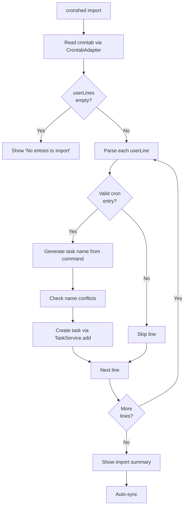
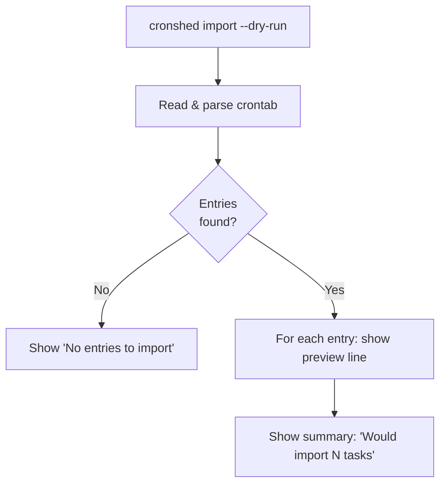
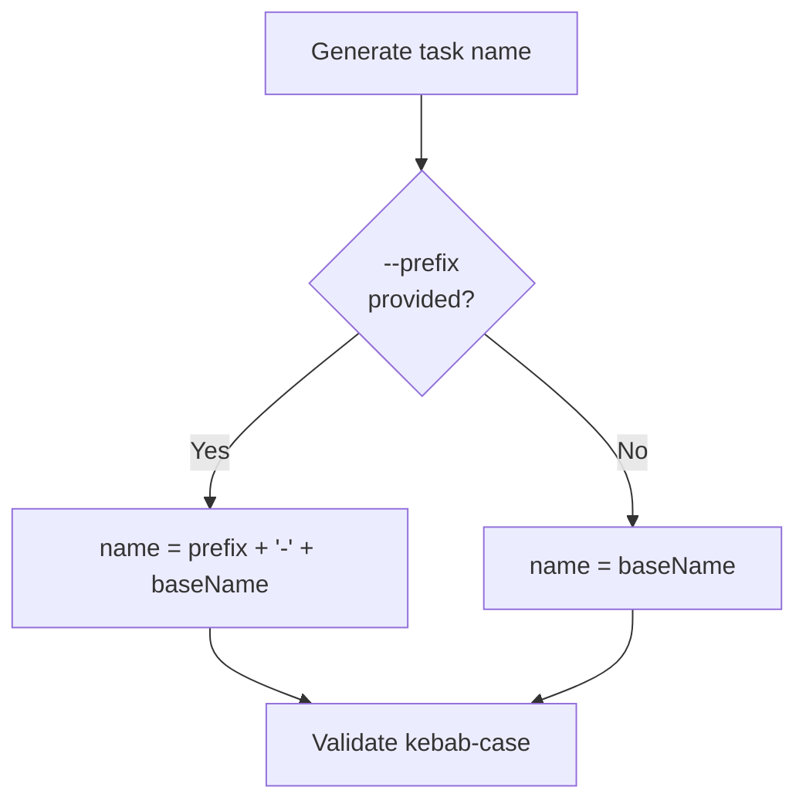
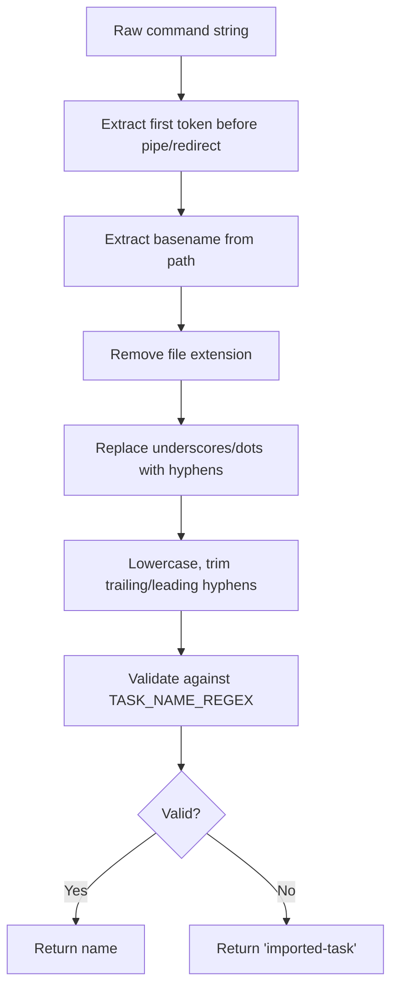
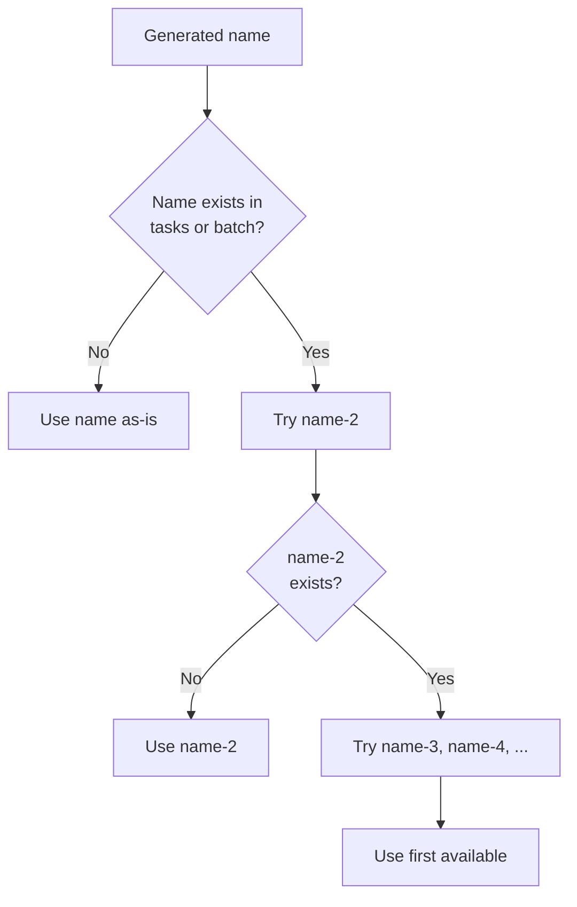
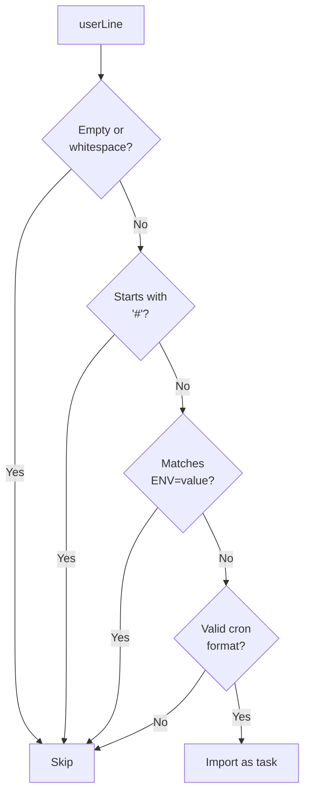

# Feature: Import Existing Crontab

- **Branch:** `feature/011-import-existing-crontab`
- **Date:** 2026-03-30
- **Status:** Implemented
- **Priority:** P2 (Post-MVP)

---

## Input

> As a developer, I want to import my existing crontab entries into cronshed so that I can manage all my cron jobs through a single tool without manually re-adding each one.

---

## User Scenarios & Testing

### Story 1: Import all crontab entries (P1 — Critical)

**Description:** Developer runs `cronshed import` to parse non-cronshed crontab entries and create tasks in tasks.json.

**Priority reason:** Core feature — without this, the import command has no value.

**Independent test:** Run import on a crontab with 3 user entries, verify 3 tasks created.

```gherkin
Feature: Import crontab entries
  Scenario: Import crontab with multiple entries
    Given the system crontab contains 3 non-cronshed cron entries
    And tasks.json has no existing tasks
    When the user runs "cronshed import"
    Then 3 tasks are created in tasks.json
    And each task has the correct schedule extracted from the crontab
    And each task has the correct command extracted from the crontab
    And each task has status "active"
    And each task has notify set to false
    And a success message shows "Imported 3 tasks"
    And auto-sync runs to update crontab with cronshed-managed entries

  Scenario: Import from empty crontab
    Given the system crontab has no non-cronshed entries
    When the user runs "cronshed import"
    Then no tasks are created
    And a message shows "No entries to import"

  Scenario: Import skips cronshed-managed entries
    Given the system crontab contains 2 non-cronshed entries
    And the system crontab contains 1 cronshed-managed entry
    When the user runs "cronshed import"
    Then only 2 tasks are created
    And the cronshed-managed entry is not duplicated
```



### Story 2: Dry-run mode (P1 — Critical)

**Description:** Developer runs `cronshed import --dry-run` to preview what would be imported without making changes.

**Priority reason:** Safety net — users need to verify before bulk-importing.

**Independent test:** Run import with --dry-run, verify no tasks created, preview displayed.

```gherkin
Feature: Dry-run import preview
  Scenario: Preview import without making changes
    Given the system crontab contains 2 non-cronshed cron entries
    When the user runs "cronshed import --dry-run"
    Then no tasks are created in tasks.json
    And the output shows each entry that would be imported
    And each preview line shows the generated task name, schedule, and command
    And no sync is performed

  Scenario: Dry-run with no entries to import
    Given the system crontab has no non-cronshed entries
    When the user runs "cronshed import --dry-run"
    Then the output shows "No entries to import"
```



### Story 3: Prefix option for task names (P2 — Important)

**Description:** Developer uses `--prefix` to add a prefix to all generated task names, e.g., `--prefix imported` produces `imported-backup` instead of `backup`.

**Priority reason:** Helps distinguish imported tasks from manually created ones.

**Independent test:** Run import with --prefix, verify all task names start with the prefix.

```gherkin
Feature: Prefix task names
  Scenario: Import with prefix
    Given the system crontab contains an entry with command "/usr/local/bin/backup.sh"
    When the user runs "cronshed import --prefix imported"
    Then a task is created with name "imported-backup"

  Scenario: Import without prefix
    Given the system crontab contains an entry with command "/usr/local/bin/backup.sh"
    When the user runs "cronshed import"
    Then a task is created with name "backup"
```



### Story 4: Auto-generate task names from commands (P1 — Critical)

**Description:** Task names are auto-generated from the command by extracting the script/binary basename and converting to kebab-case.

**Priority reason:** Core to the import UX — users should not need to name each imported task manually.

**Independent test:** Import entries with various command formats, verify generated names.

```gherkin
Feature: Auto-generate task names
  Scenario: Name from absolute path script
    Given a crontab entry with command "/usr/local/bin/backup.sh"
    When the entry is imported
    Then the generated task name is "backup"

  Scenario: Name from script with extension
    Given a crontab entry with command "/home/user/scripts/db-cleanup.py"
    When the entry is imported
    Then the generated task name is "db-cleanup"

  Scenario: Name from bare command
    Given a crontab entry with command "curl https://example.com/ping"
    When the entry is imported
    Then the generated task name is "curl"

  Scenario: Name from command with arguments
    Given a crontab entry with command "/opt/scripts/rotate-logs.sh --days 7"
    When the entry is imported
    Then the generated task name is "rotate-logs"

  Scenario: Name with invalid characters normalized
    Given a crontab entry with command "/usr/bin/my_script_v2.sh"
    When the entry is imported
    Then the generated task name is "my-script-v2"

  Scenario: Name from piped command
    Given a crontab entry with command "cat /var/log/syslog | grep error | mail admin@example.com"
    When the entry is imported
    Then the generated task name is "cat"
```



### Story 5: Handle name conflicts (P1 — Critical)

**Description:** When an auto-generated task name conflicts with an existing task, append a numeric suffix to make it unique.

**Priority reason:** Essential for reliability — duplicate name would cause add() to throw.

**Independent test:** Import entries where generated names collide, verify suffixes applied.

```gherkin
Feature: Handle name conflicts
  Scenario: Name conflicts with existing task
    Given a task named "backup" already exists
    And a crontab entry would generate the name "backup"
    When the entry is imported
    Then the task is created with name "backup-2"

  Scenario: Multiple name conflicts
    Given tasks named "backup" and "backup-2" already exist
    And a crontab entry would generate the name "backup"
    When the entry is imported
    Then the task is created with name "backup-3"

  Scenario: Name conflict within same import batch
    Given the crontab contains 2 entries that would both generate "curl"
    When the user runs "cronshed import"
    Then one task is created with name "curl"
    And the other task is created with name "curl-2"

  Scenario: No conflict
    Given no task named "backup" exists
    And a crontab entry would generate the name "backup"
    When the entry is imported
    Then the task is created with name "backup"
```



### Story 6: Skip non-cron lines (P2 — Important)

**Description:** Import skips comments, empty lines, and environment variable assignments in the crontab.

**Priority reason:** Robustness — real crontabs contain non-cron lines that must not cause errors.

**Independent test:** Import a crontab with comments, env vars, empty lines, and valid entries; verify only valid cron entries are imported.

```gherkin
Feature: Skip non-cron lines
  Scenario: Skip comment lines
    Given the crontab contains "# This is a comment"
    When the user runs "cronshed import"
    Then the comment line is not imported as a task

  Scenario: Skip empty lines
    Given the crontab contains blank lines between entries
    When the user runs "cronshed import"
    Then blank lines are not imported as tasks

  Scenario: Skip environment variable assignments
    Given the crontab contains "SHELL=/bin/bash"
    And the crontab contains "MAILTO=admin@example.com"
    And the crontab contains "PATH=/usr/local/bin:/usr/bin"
    When the user runs "cronshed import"
    Then environment variable lines are not imported as tasks

  Scenario: Mixed content
    Given the crontab contains 2 comments, 1 env variable, 1 empty line, and 2 valid cron entries
    When the user runs "cronshed import"
    Then exactly 2 tasks are created
```



---

## Acceptance Criteria

| # | Criterion | Stories |
|---|---|---|
| AC-001 | `cronshed import` reads the current crontab and creates tasks for each valid non-cronshed cron entry | S1 |
| AC-002 | Each imported task has the correct schedule and command extracted from the crontab line | S1 |
| AC-003 | Imported tasks have status "active" and notify false by default | S1 |
| AC-004 | Import skips comments, empty lines, and environment variable assignments | S6 |
| AC-005 | Import skips cronshed-managed entries (lines with `# cronshed:` marker) | S1 |
| AC-006 | Task names are auto-generated from the command basename, converted to kebab-case | S4 |
| AC-007 | `--prefix <name>` prepends the prefix to all generated task names | S3 |
| AC-008 | Name conflicts with existing tasks are resolved by appending `-N` suffix | S5 |
| AC-009 | Name conflicts within the same import batch are resolved by appending `-N` suffix | S5 |
| AC-010 | `--dry-run` shows a preview of what would be imported without creating any tasks | S2 |
| AC-011 | `--dry-run` shows generated task name, schedule, and command for each entry | S2 |
| AC-012 | After import (non-dry-run), auto-sync runs to update crontab with cronshed-managed wrappers | S1 |
| AC-013 | Success message displays count of imported tasks | S1 |
| AC-014 | Empty crontab (no importable entries) shows "No entries to import" | S1, S2 |
| AC-015 | Import validates cron expressions before creating tasks; invalid expressions are skipped with a warning | S6 |

---

## Functional Requirements

| # | Requirement | AC |
|---|---|---|
| FR-075 | `ImportService` class with `import(options)` and `parseUserLine(line)` methods | AC-001, AC-004, AC-015 |
| FR-076 | `parseUserLine` returns `{ schedule, command }` for valid cron lines, `null` for non-cron lines (comments, empty, env vars) | AC-002, AC-004, AC-005 |
| FR-077 | `generateTaskName(command, prefix?)` extracts basename, removes extension, normalizes to kebab-case | AC-006, AC-007 |
| FR-078 | `resolveNameConflict(baseName, existingNames)` appends `-N` suffix until unique | AC-008, AC-009 |
| FR-079 | `handleImport` CLI handler parses `--dry-run` and `--prefix` flags | AC-010, AC-011, AC-007 |
| FR-080 | Dry-run mode calls `ImportService.import({ dryRun: true })` and displays preview table | AC-010, AC-011 |
| FR-081 | Non-dry-run mode creates tasks via `TaskService.add()` for each valid entry | AC-001, AC-003 |
| FR-082 | After successful import, auto-sync runs (reuses existing `autoSync` pattern from cli.handler.ts) | AC-012 |
| FR-083 | Import summary message: `"Imported N tasks"` or `"No entries to import"` | AC-013, AC-014 |
| FR-084 | Cron expression validation via `validateCronExpression` — invalid entries are skipped with a warning to stderr | AC-015 |
| FR-085 | Environment variable lines matching `^[A-Z_]+=` pattern are skipped | AC-004 |

---

## Key Entities

| Entity | Description |
|---|---|
| `ImportResult` | `{ imported: ImportedEntry[], skipped: SkippedEntry[], dryRun: boolean }` |
| `ImportedEntry` | `{ name: string, schedule: string, command: string, originalLine: string }` |
| `SkippedEntry` | `{ line: string, reason: string }` |

---

## Edge Cases

1. **Crontab with only cronshed-managed entries:** All lines are cronshed markers and their cron lines — userLines is empty, nothing to import
2. **Command is a complex pipeline:** `cat /var/log | grep error | mail admin` — name generated from first command only
3. **Duplicate commands with same basename:** Two entries running `/opt/a/backup.sh` and `/opt/b/backup.sh` — conflict resolution handles it
4. **Very long command:** No truncation — full command stored in task
5. **Crontab entry with inline comment:** `0 * * * * /usr/bin/cmd # hourly` — the `# hourly` part is included in the command (cron standard behavior)
6. **Non-standard cron extensions:** `@hourly`, `@daily` etc. — handled by cron-parser if supported, otherwise skipped with warning
7. **No crontab at all:** `crontab -l` returns "no crontab for user" — handled by CrontabAdapter returning empty userLines

---

## Success Criteria

| # | Criterion | Metric |
|---|---|---|
| SC-001 | All 15 AC pass automated tests | 100% pass rate |
| SC-002 | Import a real crontab with 5+ entries | All entries correctly imported |
| SC-003 | Dry-run produces accurate preview | Preview matches actual import result |
