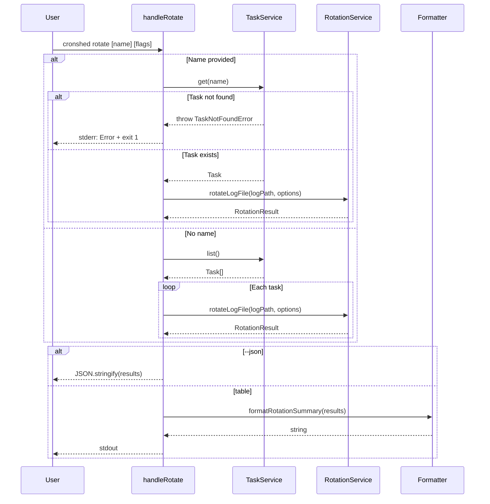
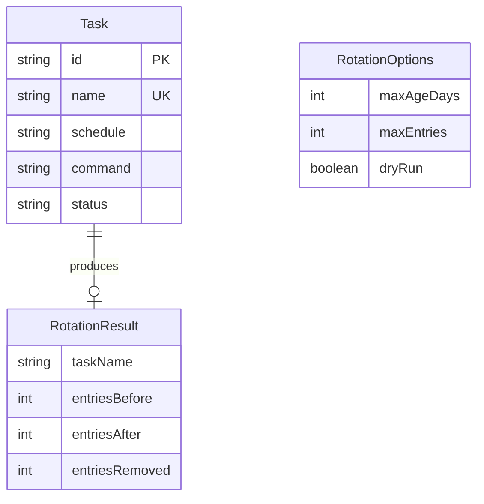

# Plan: Log Rotation

- **Status:** Approved
- **Date:** 2026-03-30
- **Summary:** Add `rotation.service.ts` with log file truncation logic, `rotation.types.ts` for options/result types, `handleRotate` CLI handler with `--max-age`, `--max-entries`, `--dry-run`, `--json` flags, and `formatRotationSummary` formatter.

---

## Technical Context

| Dimension | Value |
|---|---|
| Language | TypeScript (strict) |
| Runtime | Bun |
| CLI Parsing | parseArgs (node:util) |
| Storage | JSONL log files in ~/.cronshed/logs/ |
| Testing | bun:test |
| Platform | macOS (local CLI) |

---

## Constitution Check

| Principle | Alignment |
|---|---|
| Simplicity First | Simple truncation — no compression, no archive directory, no external deps |
| Single Responsibility | Rotation logic in rotation.service.ts, formatting in cli.formatter.ts, routing in cli.handler.ts |
| Explicit Over Implicit | RotationOptions and RotationResult types make all parameters and outputs visible |
| Fail Fast | Validate flag values (reject negative), validate task existence before rotation |
| No Side Effects at Import | All new code is exported functions, no side effects |

---

## Sequence Diagram — Rotate Command Flow

```gherkin
Feature: Rotate command flow
  Scenario: Rotate all task logs
    Given tasks exist in the manifest with log files
    When the user runs "cronshed rotate"
    Then the handler lists all tasks via TaskService
    And rotates each task's log file via RotationService
    And displays a summary of entries removed

  Scenario: Rotate single task
    Given a task "backup-db" exists
    When the user runs "cronshed rotate backup-db"
    Then the handler validates the task exists
    And rotates only that task's log file

  Scenario: Dry-run mode
    Given tasks exist with old log entries
    When the user runs "cronshed rotate --dry-run"
    Then the handler calculates what would be removed
    And displays the preview without modifying files
```



---

## ER Diagram — Data Model



---

## Implementation Plan

### Step 1 — Create rotation types

- **File:** `src/log/rotation.types.ts` (new)
- **Action:** Define `RotationOptions` and `RotationResult` interfaces
- **FR:** FR-002, FR-003
- **Tests:** None (type-only)

### Step 2 — Create rotation service

- **File:** `src/log/rotation.service.ts` (new)
- **Action:** Implement:
  - `rotateLogFile(taskName, logPath, options): Promise<RotationResult>` — reads JSONL, filters by age then entry count, rewrites atomically (write `.tmp`, rename)
  - `rotateAllLogs(tasks, options): Promise<RotationResult[]>` — iterates tasks, calls `rotateLogFile` for each
  - Constants: `DEFAULT_MAX_AGE_DAYS = 30`, `DEFAULT_MAX_ENTRIES = 1000`
- **FR:** FR-001, FR-004, FR-008, FR-009, FR-010
- **Tests:** `src/log/rotation.service.test.ts`

### Step 3 — Add rotation formatter

- **File:** `src/cli/cli.formatter.ts` (modify)
- **Action:** Add:
  - `formatRotationSummary(results, dryRun): string` — per-task line with entries removed, total summary
  - Import `RotationResult` type
- **FR:** FR-007
- **Tests:** `src/cli/cli.formatter.test.ts`

### Step 4 — Add handleRotate CLI handler

- **File:** `src/cli/cli.handler.ts` (modify)
- **Action:** Add `handleRotate(args)` that:
  - Parses optional positional task name
  - Parses `--max-age`, `--max-entries`, `--dry-run`, `--json` flags
  - Validates flag values (reject negative numbers)
  - If task name: validate via `TaskService.get()`, rotate single task
  - If no task name: list all tasks, rotate all
  - Output: formatted summary or JSON
- **FR:** FR-005, FR-006
- **Tests:** Integration tests

### Step 5 — Register rotate command

- **File:** `src/cli/cli.handler.ts` (modify)
- **Action:** Add `rotate` to `STANDALONE_COMMANDS`, update help text
- **FR:** FR-006
- **Tests:** Help output test

### Step 6 — Write unit tests for rotation service

- **File:** `src/log/rotation.service.test.ts` (new)
- **Action:** Tests:
  - Entries older than max-age removed
  - Entries capped at max-entries
  - Both thresholds applied (age first, then count)
  - No file exists: skip gracefully
  - Empty file: skip gracefully
  - All entries within thresholds: no rewrite
  - All entries outside thresholds: file emptied
  - Corrupted lines dropped
  - Dry-run does not modify files
  - Atomic rewrite (temp file then rename)
  - `--max-age 0` removes all entries
  - `--max-entries 0` removes all entries
- **FR:** FR-001, FR-004, FR-008, FR-009, FR-010
- **AC:** AC-001, AC-002, AC-005, AC-006, AC-012, AC-014

### Step 7 — Write unit tests for formatter

- **File:** `src/cli/cli.formatter.test.ts` (modify)
- **Action:** Tests for `formatRotationSummary`:
  - Single task with removals
  - Multiple tasks
  - Nothing to rotate message
  - Dry-run prefix
- **FR:** FR-007
- **AC:** AC-007, AC-008

### Step 8 — Write integration tests for rotate command

- **File:** `src/cli/cli.handler.test.ts` (new or modify)
- **Action:** Full CLI integration tests:
  - `cronshed rotate` with entries to remove
  - `cronshed rotate --dry-run`
  - `cronshed rotate --json`
  - `cronshed rotate <name>` single task
  - `cronshed rotate nonexistent` error
  - `cronshed rotate --max-age 7`
  - `cronshed rotate --max-entries 100`
  - `cronshed rotate --max-age -1` rejected
  - Help includes rotate
- **FR:** FR-005, FR-006
- **AC:** AC-001 through AC-014

---

## Testing Strategy

| Layer | What | Tool |
|---|---|---|
| Unit | rotateLogFile with various log states, thresholds, edge cases | bun:test + temp files |
| Unit | formatRotationSummary formatting | bun:test |
| Integration | handleRotate end-to-end with real file I/O | bun:test + temp dir |

---

## Risks & Considerations

| Risk | Mitigation |
|---|---|
| Data loss from accidental rotation | Dry-run mode for preview; atomic rewrite prevents corruption |
| Large log files using memory | Read full file into memory — acceptable for single-user tool |
| Concurrent cron execution during rotation | Atomic rename prevents partial writes; at worst one appended line is lost |
| Clock skew in timestamp comparison | Use `now` parameter (injectable for testing); system clock is authoritative |
