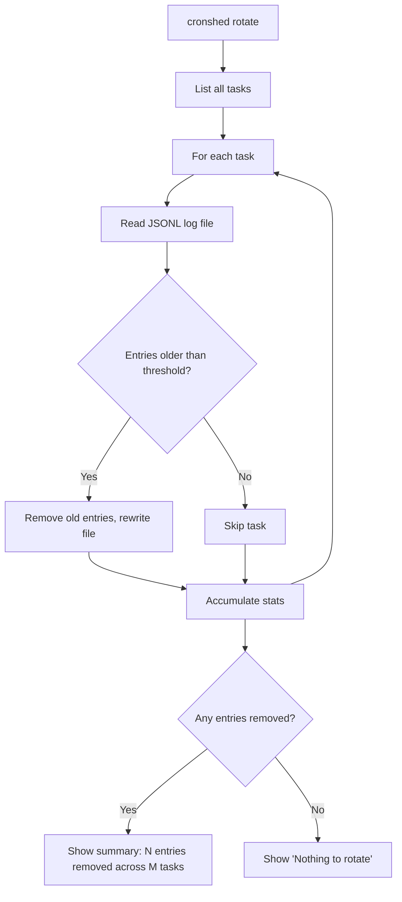
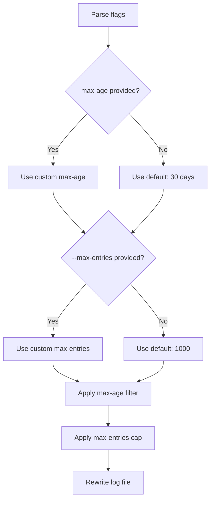
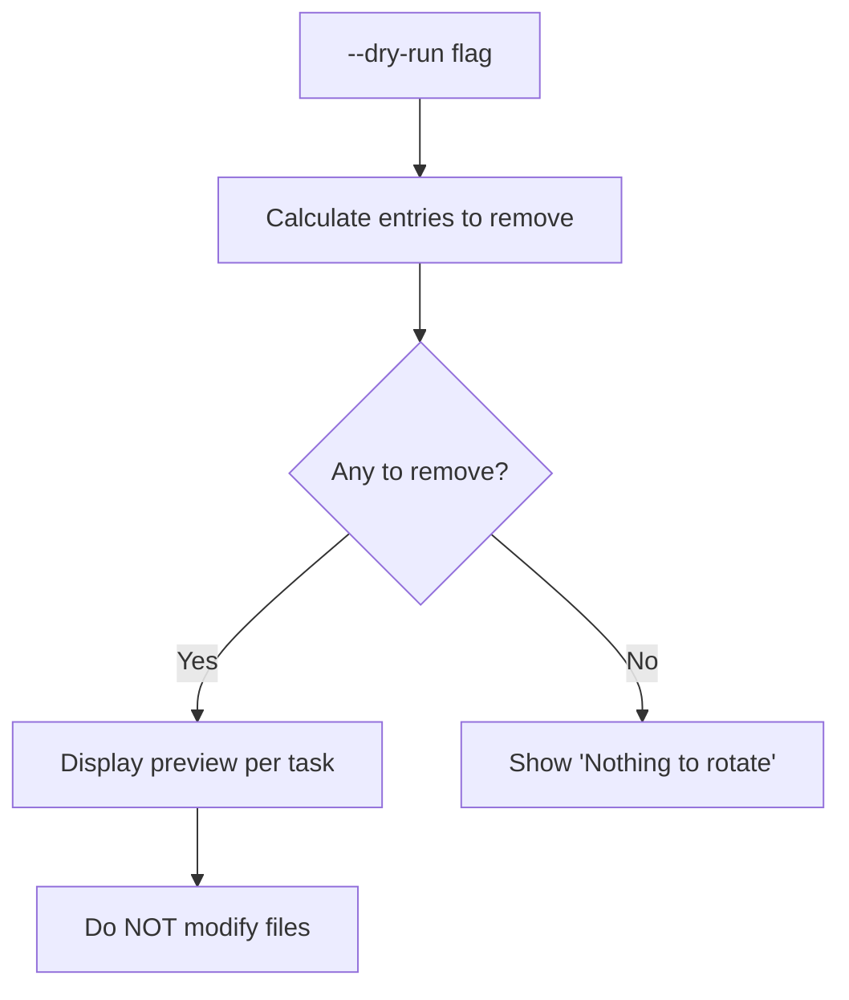
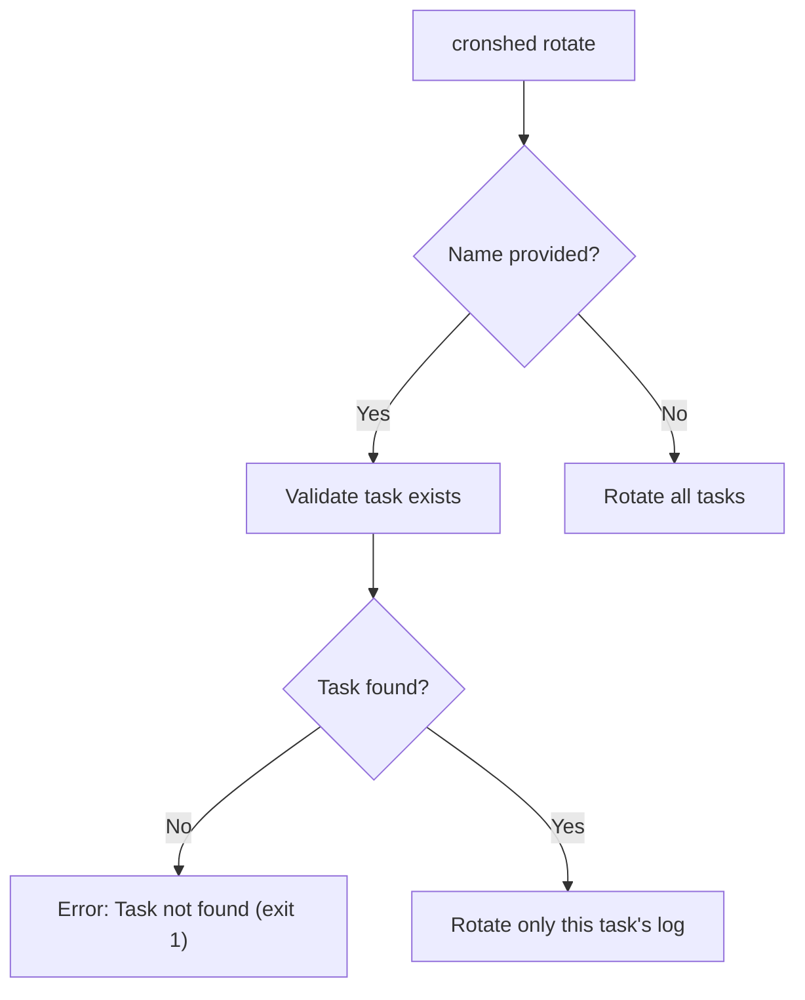
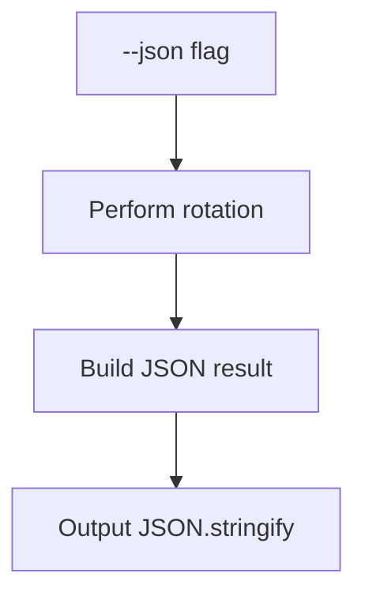

# Feature: Log Rotation

- **Branch:** `feature/012-log-rotation`
- **Date:** 2026-03-30
- **Status:** Implemented
- **Input:** Archive old execution history to prevent unbounded growth

---

## User Stories

### Story 1 — Rotate logs for all tasks (P1 — critical)

As a developer, I want to run `cronshed rotate` to truncate old execution log entries across all tasks, so my `~/.cronshed/logs/` directory does not grow unbounded.

**Priority reason:** Without rotation, log files grow indefinitely with every cron execution. This is the core problem the feature solves.

**Independent test:** Create log files with entries spanning 60 days; run `cronshed rotate`; verify entries older than 30 days are removed and recent entries are preserved.

```gherkin
Feature: Rotate logs for all tasks
  Scenario: Remove entries older than default 30 days
    Given a task "backup-db" exists in the manifest
    And the log file contains entries from the last 60 days
    When the user runs "cronshed rotate"
    Then entries older than 30 days are removed from "backup-db.jsonl"
    And entries from the last 30 days are preserved
    And a success message shows the number of entries removed

  Scenario: Multiple tasks are rotated
    Given tasks "backup-db" and "sync-files" exist in the manifest
    And both log files contain entries older than 30 days
    When the user runs "cronshed rotate"
    Then both log files are truncated
    And the summary shows totals for all tasks

  Scenario: No entries to rotate
    Given a task "fresh-task" exists in the manifest
    And all log entries are from the last 7 days
    When the user runs "cronshed rotate"
    Then no entries are removed
    And the output shows "Nothing to rotate"
```



### Story 2 — Customize rotation thresholds (P2 — important)

As a developer, I want to use `--max-age <days>` and `--max-entries <N>` flags to control how aggressively logs are pruned, so I can balance between history retention and disk usage.

**Priority reason:** Default thresholds may not fit all use cases. A task that runs every minute needs more aggressive pruning than one that runs weekly.

**Independent test:** Create a log file with 2000 entries; run `cronshed rotate --max-entries 500`; verify only the 500 most recent entries remain.

```gherkin
Feature: Customize rotation thresholds
  Scenario: Custom max-age
    Given a task "monitor" has entries from the last 90 days
    When the user runs "cronshed rotate --max-age 7"
    Then only entries from the last 7 days are preserved

  Scenario: Custom max-entries
    Given a task "monitor" has 2000 log entries
    When the user runs "cronshed rotate --max-entries 500"
    Then only the 500 most recent entries are preserved

  Scenario: Both thresholds applied (most restrictive wins)
    Given a task "monitor" has 800 entries spanning 60 days
    When the user runs "cronshed rotate --max-age 30 --max-entries 500"
    Then entries older than 30 days are removed first
    And if more than 500 remain, only the 500 most recent are kept
```



### Story 3 — Dry-run mode (P2 — important)

As a developer, I want to run `cronshed rotate --dry-run` to preview what would be removed without actually modifying files, so I can verify the rotation thresholds before committing.

**Priority reason:** Destructive operations need a preview mode. Consistent with `sync --dry-run` and `import --dry-run`.

**Independent test:** Run `cronshed rotate --dry-run`; verify output shows what would be removed; verify log files are untouched.

```gherkin
Feature: Dry-run mode
  Scenario: Preview rotation
    Given a task "backup-db" has 50 entries older than 30 days
    When the user runs "cronshed rotate --dry-run"
    Then the output shows "Would remove 50 entries from backup-db"
    And the log file is not modified

  Scenario: Dry-run with nothing to rotate
    Given all task logs are within thresholds
    When the user runs "cronshed rotate --dry-run"
    Then the output shows "Nothing to rotate"
```



### Story 4 — Rotate a single task (P3 — nice-to-have)

As a developer, I want to run `cronshed rotate <name>` to rotate logs for a specific task only, so I can target cleanup without affecting other tasks.

**Priority reason:** Convenient for tasks with unusually large logs, but not essential since the default rotates all tasks.

**Independent test:** Run `cronshed rotate backup-db`; verify only backup-db.jsonl is modified.

```gherkin
Feature: Rotate a single task
  Scenario: Rotate specific task
    Given tasks "backup-db" and "sync-files" both have old entries
    When the user runs "cronshed rotate backup-db"
    Then only "backup-db.jsonl" is modified
    And "sync-files.jsonl" is untouched

  Scenario: Task does not exist
    Given no task named "nonexistent" exists
    When the user runs "cronshed rotate nonexistent"
    Then stderr shows an error "Task 'nonexistent' not found"
    And the exit code is 1
```



### Story 5 — JSON output (P3 — nice-to-have)

As a developer, I want `cronshed rotate --json` to output structured JSON results, so I can integrate log rotation into automation scripts.

**Priority reason:** Consistency with other commands that support `--json`. Low effort since data is already structured.

**Independent test:** Run `cronshed rotate --json`; verify output is valid JSON with per-task rotation stats.

```gherkin
Feature: JSON output
  Scenario: JSON output after rotation
    Given a task "backup-db" has entries to rotate
    When the user runs "cronshed rotate --json"
    Then the output is a valid JSON object
    And it contains a "tasks" array with per-task stats
    And each entry has "name", "entriesBefore", "entriesAfter", "entriesRemoved"
    And there is a "totalRemoved" field

  Scenario: JSON output with nothing to rotate
    Given all task logs are within thresholds
    When the user runs "cronshed rotate --json"
    Then the output is a valid JSON object with totalRemoved 0
```



---

## Acceptance Criteria

| ID | Criterion | Stories |
|---|---|---|
| AC-001 | `cronshed rotate` removes entries older than 30 days from all task log files | S1 |
| AC-002 | `cronshed rotate` caps entries at 1000 per task (most recent kept) | S1, S2 |
| AC-003 | `--max-age <days>` overrides the default 30-day threshold | S2 |
| AC-004 | `--max-entries <N>` overrides the default 1000-entry cap | S2 |
| AC-005 | Both thresholds are applied: max-age first, then max-entries | S2 |
| AC-006 | `--dry-run` shows what would be removed without modifying files | S3 |
| AC-007 | Success message shows entries removed per task and total | S1 |
| AC-008 | "Nothing to rotate" when no entries exceed thresholds | S1, S3 |
| AC-009 | `cronshed rotate <name>` targets a single task only | S4 |
| AC-010 | Non-existent task name produces error on stderr with exit code 1 | S4 |
| AC-011 | `--json` outputs structured JSON with per-task stats | S5 |
| AC-012 | Corrupted log lines are silently dropped during rotation | S1 |
| AC-013 | `rotate` command is listed in `--help` output | S1 |
| AC-014 | Log file is rewritten atomically (write to temp, rename) | S1 |

---

## Functional Requirements

| ID | Requirement | AC |
|---|---|---|
| FR-001 | Add `rotateLogFile(logPath, options): Promise<RotationResult>` to `src/log/rotation.service.ts` that reads, filters, and rewrites a JSONL log file | AC-001, AC-002, AC-005, AC-012, AC-014 |
| FR-002 | Create `RotationOptions` type: `{ maxAgeDays: number; maxEntries: number; dryRun: boolean; now?: Date }` | AC-003, AC-004, AC-006 |
| FR-003 | Create `RotationResult` type: `{ taskName: string; entriesBefore: number; entriesAfter: number; entriesRemoved: number }` | AC-007, AC-011 |
| FR-004 | Add `rotateAllLogs(options): Promise<RotationResult[]>` that iterates all tasks and rotates each log | AC-001, AC-007 |
| FR-005 | Add `handleRotate` function to `cli.handler.ts` with `--max-age`, `--max-entries`, `--dry-run`, `--json` flags and optional task name positional | AC-001 through AC-013 |
| FR-006 | Register `rotate` in CLI routing (`STANDALONE_COMMANDS`) and update help text | AC-013 |
| FR-007 | Add `formatRotationSummary(results): string` to `cli.formatter.ts` | AC-007, AC-008 |
| FR-008 | Atomic file rewrite: write to `<path>.tmp`, then rename to `<path>` | AC-014 |
| FR-009 | Default thresholds: `MAX_AGE_DAYS = 30`, `MAX_ENTRIES = 1000` | AC-001, AC-002 |
| FR-010 | Apply max-age filter first (remove entries with timestamp older than `now - maxAgeDays`), then max-entries cap (keep most recent N) | AC-005 |

---

## Key Entities

### RotationOptions

```typescript
interface RotationOptions {
  maxAgeDays: number;   // default: 30
  maxEntries: number;   // default: 1000
  dryRun: boolean;      // default: false
  now?: Date;           // injectable for testing
}
```

### RotationResult

```typescript
interface RotationResult {
  taskName: string;
  entriesBefore: number;
  entriesAfter: number;
  entriesRemoved: number;
}
```

---

## Edge Cases

| Case | Expected Behavior |
|---|---|
| Log file does not exist | Skip task, no error, entriesRemoved = 0 |
| Log file is empty | Skip task, no error, entriesRemoved = 0 |
| All entries are within thresholds | No rewrite, entriesRemoved = 0 |
| All entries are outside thresholds | Rewrite with empty file (0 bytes) |
| Log file has only corrupted lines | All lines dropped, file emptied |
| `--max-age 0` | Remove all entries (everything is older than 0 days) |
| `--max-entries 0` | Remove all entries |
| Very large log file | Read full file, filter in memory (single-user tool, acceptable) |
| Concurrent write during rotation | Atomic rename prevents partial writes; last-line may be lost |
| Task has no log file but exists in manifest | Skip, no error |
| `--max-age` negative value | Reject with exit code 2 and error message |
| `--max-entries` negative value | Reject with exit code 2 and error message |

---

## Success Criteria

| ID | Criterion | Measurable |
|---|---|---|
| SC-001 | All 14 AC pass with automated tests | bun test |
| SC-002 | No regression on existing tests | bun test full suite |
| SC-003 | Rotation of a 10,000-entry log file completes in < 1s | Manual timing |
