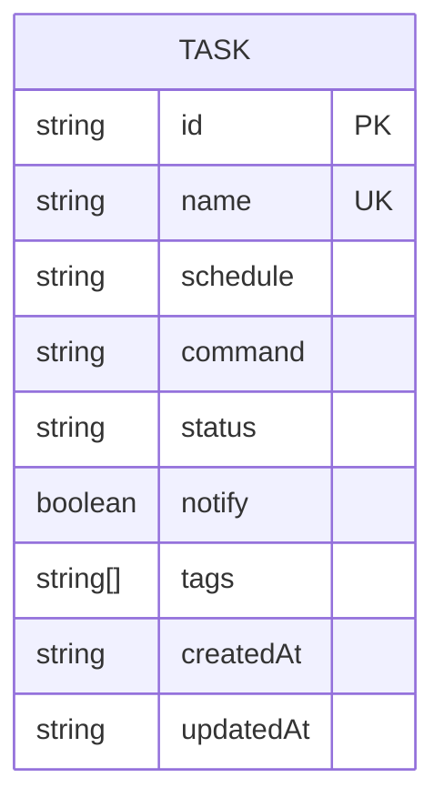

# Plan: Task Groups/Tags

- **Status:** Approved
- **Feature:** [013-task-groups-tags](spec.md)
- **Date:** 2026-03-30

---

## Summary

Add an optional `tags: string[]` field to the Task entity with full CRUD support through existing commands (`add --tag`, `update --tag/--untag`, `list --tag`) plus a new `tags` subcommand for tag discovery.

## Technical Context

| Dimension | Value |
|-----------|-------|
| Language | TypeScript (strict) |
| Runtime | Bun |
| CLI parsing | `parseArgs` (node:util) |
| Storage | `tasks.json` flat file |
| File I/O | `Bun.file()` |
| Testing | `bun:test` |
| Project type | Local CLI tool |

## Constitution Check

| Principle | Compliance |
|-----------|------------|
| Simplicity First | Tags are a simple string array — no separate tag registry, no relationships |
| Single Responsibility | Tag validation is a pure function; service handles business logic; handler parses CLI args |
| Explicit Over Implicit | Tags stored explicitly in tasks.json, visible in `get` output |
| Fail Fast | Invalid tags rejected at CLI boundary before any mutation |
| No Side Effects at Import | All new functions are pure exports |

---

## Data Model

---

## Implementation Plan

### Step 1: Add `tags` field to types and validation (`src/task/task.types.ts`)

**Files:** `src/task/task.types.ts`

- Add `tags: string[]` to `Task` interface
- Add `tags?: string[]` to `CreateTaskInput`
- Add `tags?: string[]` and `untags?: string[]` to `UpdateTaskInput`
- Export `validateTag(tag: string): void` function using `TASK_NAME_REGEX`

**FR covered:** FR-001, FR-002, FR-003, FR-007

### Step 2: Add `InvalidTagError` (`src/task/task.errors.ts`)

**Files:** `src/task/task.errors.ts`

- Add `InvalidTagError` class extending `Error`

**FR covered:** FR-008

### Step 3: Update `TaskService` for tag support (`src/task/task.service.ts`)

**Files:** `src/task/task.service.ts`

- `add()`: validate tags, deduplicate, sort, store. Default `[]`
- `update()`: accept `tags`/`untags`, apply additions/removals, deduplicate, sort. Count tag changes as valid change (fix `NoChangesSpecifiedError` check)

**FR covered:** FR-004, FR-005

### Step 4: Update `TaskRepository.load()` for backward compat (`src/task/task.repository.ts`)

**Files:** `src/task/task.repository.ts`

- In the backward compat section, default missing `tags` to `[]`

**FR covered:** FR-006

### Step 5: Unit tests for tag operations (`src/task/task.service.test.ts`)

**Files:** `src/task/task.service.test.ts`

- Test `add()` with tags, without tags, with invalid tags, with duplicates
- Test `update()` with `--tag`, `--untag`, combined, nonexistent untag, invalid tag
- Test backward compat loading

**AC covered:** AC-001 through AC-007, AC-013, AC-014

### Step 6: Update CLI handler for tag flags (`src/cli/cli.handler.ts`)

**Files:** `src/cli/cli.handler.ts`

- `handleAdd`: parse `--tag` (multiple), validate, pass to service
- `handleUpdate`: parse `--tag` and `--untag` (multiple), validate, pass to service
- `handleList`: parse `--tag` filter, filter enriched tasks before display
- `handleTags`: new handler for `cronshed tags [--json]`
- Register `tags` in `QUERY_SUBCOMMANDS`
- Update help text
- Map `InvalidTagError` in `getExitCode` → exit 2
- Map `InvalidTagError` in `getErrorHint`

**FR covered:** FR-009, FR-010, FR-011, FR-012, FR-015

### Step 7: Update formatter (`src/cli/cli.formatter.ts`)

**Files:** `src/cli/cli.formatter.ts`

- `formatTaskDetails`: add `Tags:` line (comma-separated or `—` if empty)
- `formatTaskTable`: add TAGS column
- `formatTagsTable`: new function for `cronshed tags` output
- `formatTagsSummary`: "No tags in use" message

**FR covered:** FR-013, FR-014

### Step 8: Integration tests (`src/cli/cli.integration.test.ts`)

**Files:** `src/cli/cli.integration.test.ts`

- Test `add` with `--tag`
- Test `update` with `--tag` / `--untag`
- Test `list --tag` filtering
- Test `tags` subcommand (table and JSON)
- Test `get` shows tags
- Test invalid tag errors
- Test backward compat (create task without tags, verify loads correctly)

**AC covered:** All AC-001 through AC-014

---

## Testing Strategy

| Test Type | Scope | Count (est.) |
|-----------|-------|--------------|
| Unit | Tag validation, service add/update with tags, backward compat | ~20 |
| Integration | CLI end-to-end for add/update/list/get/tags with tag flags | ~18 |
| Regression | Existing 396 tests pass without modification | 396 |

---

## Risks & Considerations

| Risk | Mitigation |
|------|------------|
| `parseArgs` doesn't natively support repeated flags | Use `{ type: "string", multiple: true }` which is supported |
| Breaking change if tags field is required | Default to `[]`, backward compat in repository load |
| Tag column widens list output | Tags column shows first 2-3 tags with ellipsis if many |
