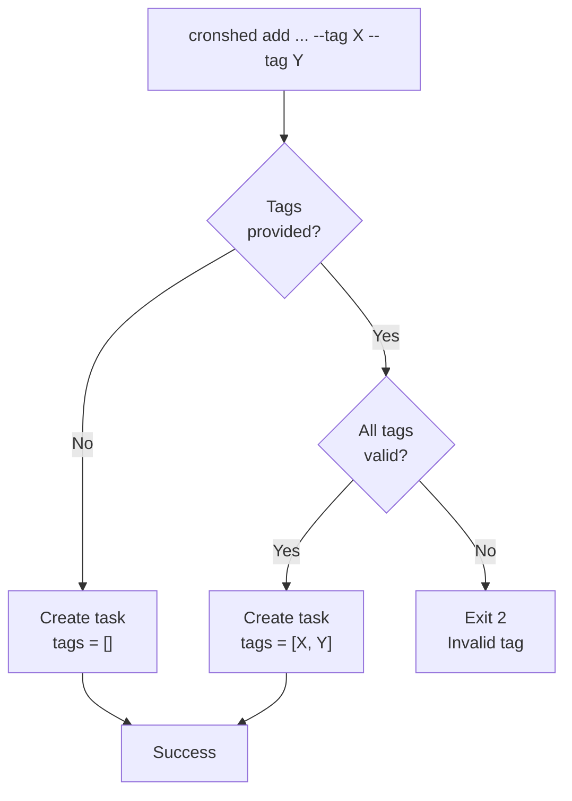
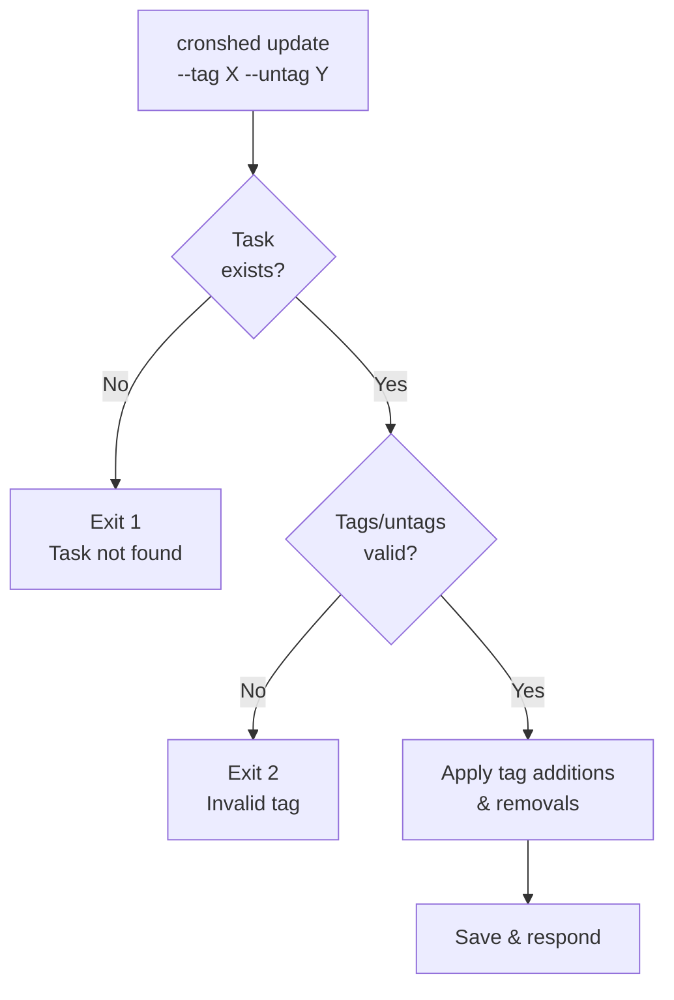
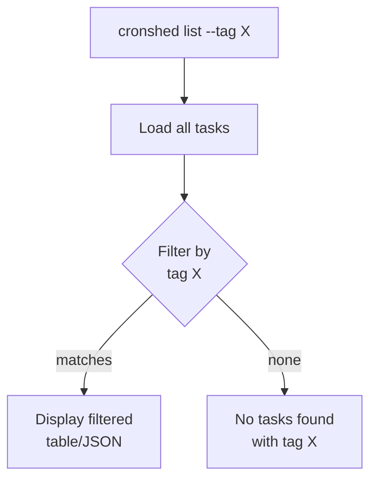
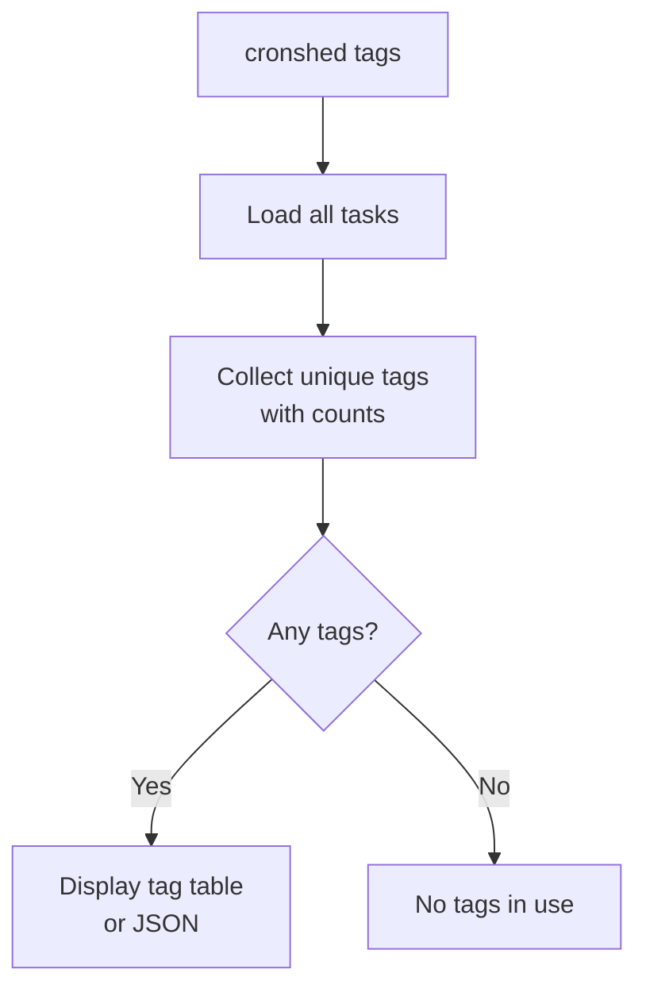
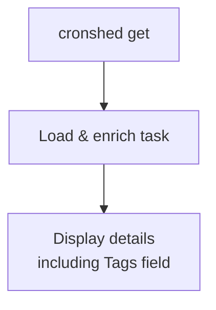

# Feature: Task Groups/Tags

- **Branch:** `feature/013-task-groups-tags`
- **Date:** 2026-03-30
- **Status:** Implemented

---

## Input

> Add optional tags to tasks for organization and filtering. Tasks can be tagged on creation or update, filtered by tag in list, and a `tags` command shows all unique tags with task counts.

---

## User Stories

### US-001: Tag tasks on creation (P2 — important)

> As a developer, I want to assign tags when creating a task so that I can categorize it from the start.

**Priority reason:** Tags are most useful when assigned early. If creation doesn't support tags, users must always run a separate update command.

**Independent test:** Create a task with `--tag backup --tag db`, verify the task's `tags` field contains both values.

```gherkin
Feature: Tag tasks on creation
  Scenario: Create a task with multiple tags
    Given no tasks exist
    When  the user runs 'cronshed add my-task --schedule "0 0 * * *" --command "echo hi" --tag backup --tag db --no-sync'
    Then  the command exits with code 0
    And   the task "my-task" has tags ["backup", "db"]

  Scenario: Create a task without tags
    Given no tasks exist
    When  the user runs 'cronshed add my-task --schedule "0 0 * * *" --command "echo hi" --no-sync'
    Then  the command exits with code 0
    And   the task "my-task" has tags []

  Scenario: Reject invalid tag format
    Given no tasks exist
    When  the user runs 'cronshed add my-task --schedule "0 0 * * *" --command "echo hi" --tag "BAD TAG" --no-sync'
    Then  the command exits with code 2
    And   stderr contains "Invalid tag"
```



### US-002: Modify tags on existing tasks (P2 — important)

> As a developer, I want to add or remove tags from existing tasks so that I can reorganize as my task collection evolves.

**Priority reason:** Without tag modification, miscategorized tasks require removal and re-creation.

**Independent test:** Create a task, add a tag via `--tag`, remove it via `--untag`, verify changes persist.

```gherkin
Feature: Modify tags on existing tasks
  Scenario: Add a tag to an existing task
    Given a task "my-task" exists with tags []
    When  the user runs 'cronshed update my-task --tag backup'
    Then  the task "my-task" has tags ["backup"]

  Scenario: Remove a tag from an existing task
    Given a task "my-task" exists with tags ["backup", "db"]
    When  the user runs 'cronshed update my-task --untag db'
    Then  the task "my-task" has tags ["backup"]

  Scenario: Add and remove tags in a single update
    Given a task "my-task" exists with tags ["old"]
    When  the user runs 'cronshed update my-task --tag new --untag old'
    Then  the task "my-task" has tags ["new"]

  Scenario: Remove a tag that does not exist (no-op)
    Given a task "my-task" exists with tags ["backup"]
    When  the user runs 'cronshed update my-task --untag nonexistent'
    Then  the task "my-task" has tags ["backup"]
    And   the command exits with code 0

  Scenario: Reject invalid tag format on update
    Given a task "my-task" exists with tags []
    When  the user runs 'cronshed update my-task --tag "BAD TAG"'
    Then  the command exits with code 2
    And   stderr contains "Invalid tag"

  Scenario: Update only tags counts as a valid change
    Given a task "my-task" exists with tags []
    When  the user runs 'cronshed update my-task --tag backup'
    Then  the command exits with code 0
    And   updatedAt is set
```



### US-003: Filter tasks by tag in list (P2 — important)

> As a developer, I want to filter the task list by tag so that I can focus on a specific category.

**Priority reason:** Filtering is the primary consumer of tags — without it, tags have no practical value.

**Independent test:** Create 3 tasks with different tags, list with `--tag backup`, verify only matching tasks appear.

```gherkin
Feature: Filter tasks by tag
  Scenario: List tasks filtered by a tag
    Given tasks exist: "db-backup" with tags ["backup", "db"], "log-clean" with tags ["cleanup"], "db-migrate" with tags ["db"]
    When  the user runs 'cronshed list --tag db'
    Then  the output contains "db-backup" and "db-migrate"
    And   the output does not contain "log-clean"

  Scenario: Filter with non-existent tag returns empty
    Given tasks exist: "db-backup" with tags ["backup"]
    When  the user runs 'cronshed list --tag nonexistent'
    Then  the output shows "No tasks found with tag \"nonexistent\""

  Scenario: Filter with --json outputs filtered array
    Given tasks exist: "db-backup" with tags ["backup"], "log-clean" with tags ["cleanup"]
    When  the user runs 'cronshed list --tag backup --json'
    Then  stdout is a JSON array with 1 element
    And   the element has name "db-backup"
```



### US-004: List all unique tags (P2 — important)

> As a developer, I want to see all tags in use with their task counts so that I can understand my task organization.

**Priority reason:** Discoverability — without a tags listing, the user must inspect tasks individually to know what tags exist.

**Independent test:** Create tasks with various tags, run `cronshed tags`, verify all unique tags are listed with correct counts.

```gherkin
Feature: List all unique tags
  Scenario: Display tags with task counts
    Given tasks exist: "a" with tags ["backup", "db"], "b" with tags ["backup"], "c" with tags ["cleanup"]
    When  the user runs 'cronshed tags'
    Then  the output shows "backup" with count 2
    And   the output shows "cleanup" with count 1
    And   the output shows "db" with count 1

  Scenario: No tags exist
    Given tasks exist: "a" with tags [], "b" with tags []
    When  the user runs 'cronshed tags'
    Then  the output shows "No tags in use"

  Scenario: JSON output
    Given tasks exist: "a" with tags ["backup"], "b" with tags ["backup", "db"]
    When  the user runs 'cronshed tags --json'
    Then  stdout is a JSON object with tag counts
    And   "backup" has count 2
    And   "db" has count 1
```



### US-005: Tags displayed in task details (P3 — nice-to-have)

> As a developer, I want to see a task's tags in `cronshed get` output so that I know its categorization at a glance.

**Priority reason:** Display enhancement — informational, not blocking.

**Independent test:** Create a task with tags, run `cronshed get`, verify tags appear in the output.

```gherkin
Feature: Tags in task details
  Scenario: Get shows tags for a tagged task
    Given a task "my-task" exists with tags ["backup", "db"]
    When  the user runs 'cronshed get my-task'
    Then  the output contains "Tags:       backup, db"

  Scenario: Get shows empty tags
    Given a task "my-task" exists with tags []
    When  the user runs 'cronshed get my-task'
    Then  the output contains "Tags:       —"

  Scenario: JSON output includes tags array
    Given a task "my-task" exists with tags ["backup"]
    When  the user runs 'cronshed get my-task --json'
    Then  the JSON object has tags: ["backup"]
```



---

## Acceptance Criteria

| ID | Criterion | Stories |
|----|-----------|---------|
| AC-001 | `tags` field on Task defaults to `[]` and is backward compatible with existing tasks.json | US-001 |
| AC-002 | `cronshed add` accepts zero or more `--tag <tag>` flags | US-001 |
| AC-003 | Tags are validated: lowercase kebab-case matching `TASK_NAME_REGEX` | US-001, US-002 |
| AC-004 | Invalid tag format causes exit code 2 with "Invalid tag" error message | US-001, US-002 |
| AC-005 | `cronshed update` accepts `--tag <tag>` and `--untag <tag>` (multiple allowed) | US-002 |
| AC-006 | Removing a nonexistent tag is a no-op (no error) | US-002 |
| AC-007 | Duplicate tags are deduplicated (stored sorted, unique) | US-001, US-002 |
| AC-008 | `cronshed list --tag <tag>` shows only tasks having that tag | US-003 |
| AC-009 | `cronshed list --tag <tag>` with no matches shows a "no tasks found" message | US-003 |
| AC-010 | `cronshed tags` displays unique tags with task counts, sorted alphabetically | US-004 |
| AC-011 | `cronshed tags --json` outputs `{ "tag": count }` | US-004 |
| AC-012 | `cronshed get` displays tags in detail output | US-005 |
| AC-013 | `--tag` / `--untag` on update counts as a valid change (no NoChangesSpecifiedError) | US-002 |
| AC-014 | Existing tasks without `tags` field load with `tags: []` (backward compat in repository) | AC-001 |

---

## Functional Requirements

| ID | Description | AC |
|----|-------------|-----|
| FR-001 | Add `tags: string[]` to `Task` interface, default `[]` | AC-001 |
| FR-002 | Add `tags?: string[]` to `CreateTaskInput` interface | AC-002 |
| FR-003 | Add `tags?: string[]` and `untags?: string[]` to `UpdateTaskInput` interface | AC-005 |
| FR-004 | `TaskService.add()` validates tags and stores deduplicated sorted array | AC-002, AC-003, AC-007 |
| FR-005 | `TaskService.update()` applies `--tag` additions and `--untag` removals, deduplicates and sorts | AC-005, AC-006, AC-007, AC-013 |
| FR-006 | `TaskRepository.load()` backward compat: default missing `tags` to `[]` | AC-014 |
| FR-007 | Tag validation function: same regex as task names (`TASK_NAME_REGEX`) | AC-003, AC-004 |
| FR-008 | `InvalidTagError` domain error class | AC-004 |
| FR-009 | CLI `handleAdd` parses `--tag` (multiple) and passes to service | AC-002 |
| FR-010 | CLI `handleUpdate` parses `--tag` and `--untag` (multiple) and passes to service | AC-005 |
| FR-011 | CLI `handleList` accepts `--tag` filter and filters results before display | AC-008, AC-009 |
| FR-012 | CLI `handleTags` subcommand collects unique tags with counts, formats table or JSON | AC-010, AC-011 |
| FR-013 | `formatTaskDetails` displays `Tags:` line | AC-012 |
| FR-014 | `formatTaskTable` includes TAGS column | AC-008 |
| FR-015 | Help text updated with new flags and `tags` command | All |

---

## Key Entities

| Entity | Field | Type | Description |
|--------|-------|------|-------------|
| Task | tags | `string[]` | Sorted, deduplicated, lowercase kebab-case tag names. Defaults to `[]` |

---

## Edge Cases

- **Empty tag string:** `--tag ""` → treated as invalid (fails `TASK_NAME_REGEX`)
- **Duplicate tags in input:** `--tag backup --tag backup` → stored once
- **Adding an already-present tag:** No-op, no error
- **Removing the only tag:** Results in `tags: []`
- **Very long tag:** Validated by regex (max practical limit from kebab-case pattern)
- **tags subcommand with no tasks:** Shows "No tags in use"
- **Backward compat:** Old tasks.json without `tags` field loads correctly with `[]`

---

## Success Criteria

| ID | Metric |
|----|--------|
| SC-001 | All 14 AC pass with automated tests |
| SC-002 | Existing 396 tests continue to pass (no regressions) |
| SC-003 | Old tasks.json files without `tags` field load correctly |
| SC-004 | `cronshed tags` returns in < 100ms for 50 tasks |
