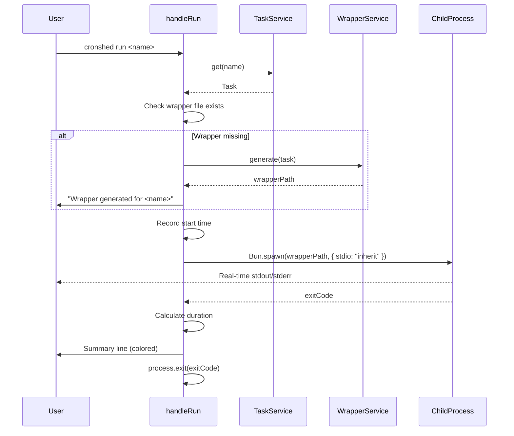

# Plan: Dry-run Mode

- **Status:** Approved
- **Feature:** [014-dry-run-mode](spec.md)
- **Date:** 2026-03-30

---

## Summary

Add a `cronshed run <name>` standalone command that looks up a task, ensures a wrapper exists (auto-generating if needed), spawns the wrapper with inherited stdio for real-time streaming, then displays an execution summary with exit code and duration.

## Technical Context

| Dimension | Value |
|-----------|-------|
| Language | TypeScript (strict) |
| Runtime | Bun |
| CLI parsing | `parseArgs` (node:util) |
| Storage | `tasks.json` flat file |
| File I/O | `Bun.file()` |
| Testing | `bun:test` |
| Project type | Local CLI tool |

## Constitution Check

| Principle | Compliance |
|-----------|------------|
| Simplicity First | Single new handler function, reuses existing services, no new modules |
| Single Responsibility | Handler parses args, delegates to TaskService and WrapperService, formats output |
| Explicit Over Implicit | Wrapper auto-generation logged to user, exit code propagated explicitly |
| Fail Fast | Task lookup fails immediately if not found, wrapper checked before execution |
| No Side Effects at Import | New functions are exported, no side effects at import |

---

## Execution Flow

```gherkin
Feature: Run command execution
  Scenario: Full execution with wrapper auto-generation
    Given a task "my-task" exists
    And   no wrapper script exists
    When  the run handler is invoked with "my-task"
    Then  the wrapper is generated
    And   the wrapper is spawned with inherited stdio
    And   the exit code and duration are captured
    And   a summary is displayed

  Scenario: Execution with existing wrapper
    Given a task "my-task" exists
    And   a wrapper script exists
    When  the run handler is invoked with "my-task"
    Then  the wrapper is spawned directly
    And   the exit code and duration are captured
```



---

## Implementation Plan

### Step 1: Add `formatRunSummary` to formatter (`src/cli/cli.formatter.ts`)

**Files:** `src/cli/cli.formatter.ts`

- Add `formatRunSummary(taskName: string, exitCode: number, durationMs: number): string` function
- Exit code 0: green checkmark + "completed"
- Exit code != 0: red cross + "failed"
- Format: `✓ my-task completed (exit 0) in 1.2s` or `✗ my-task failed (exit 42) in 1.2s`
- Uses existing `formatDuration()` helper

**FR covered:** FR-006

### Step 2: Add `handleRun` handler (`src/cli/cli.handler.ts`)

**Files:** `src/cli/cli.handler.ts`

- Add `handleRun(args: string[]): Promise<void>` function
- Parse args: first positional is task name, `--json` flag
- Validate task name provided (exit 2 with usage hint if missing)
- Instantiate `TaskRepository`, `TaskService`, `WrapperService`
- Lookup task via `service.get(name)` (throws TaskNotFoundError if missing)
- Check if wrapper exists via `Bun.file(wrapperPath).exists()`
- If missing: generate via `wrapperService.generate(task)`, show info message
- Record `Date.now()` start time
- Spawn wrapper via `Bun.spawn([wrapperPath], { stdout: "inherit", stderr: "inherit" })`
- Await process exit via `.exited`
- Calculate duration: `Date.now() - start`
- If `--json`: output `{ taskName, exitCode, durationMs }` to stdout
- Else: print summary line via `formatRunSummary()`
- `process.exit(exitCode)`

**FR covered:** FR-001, FR-002, FR-003, FR-004, FR-005, FR-006, FR-007, FR-008, FR-009

### Step 3: Register `run` command (`src/cli/cli.handler.ts`)

**Files:** `src/cli/cli.handler.ts`

- Add `run: handleRun` to `STANDALONE_COMMANDS` map
- Add help text line for `run` command in the `--help` block

**FR covered:** FR-010

### Step 4: Add unit tests (`src/cli/run.test.ts`)

**Files:** `src/cli/run.test.ts`

- Test `formatRunSummary()` output for exit 0 and non-zero
- Test `handleRun` missing task name (exit 2)
- Test `handleRun` task not found (exit 1)
- Test `handleRun` successful execution (exit 0, output appears, summary shown)
- Test `handleRun` failed execution (non-zero exit, summary shown)
- Test `handleRun` auto-generates wrapper when missing
- Test `handleRun --json` outputs JSON
- Test paused task executes successfully

**FR covered:** All FR + AC

### Step 5: Add integration test (`src/cli/run.integration.test.ts`)

**Files:** `src/cli/run.integration.test.ts`

- Full CLI integration: `Bun.$\`bun src/index.ts run <name>\``
- Verify real-time output (stdout contains expected text)
- Verify exit code propagation
- Verify execution logged in history (JSONL file updated by wrapper)
- Verify wrapper auto-generation when file is missing

**FR covered:** FR-011 (wrapper handles logging), AC-009

### Step 6: Update implementation.md and changelog

**Files:** `.specs/features/014-dry-run-mode/implementation.md`, `.specs/features/014-dry-run-mode/changelog.md`, `.specs/changelog.md`

- Create implementation mapping (FR → files → @spec anchors)
- Add feature changelog entry
- Add global changelog entry

**FR covered:** Documentation

---

## Testing Strategy

| Test Type | Scope | Tool |
|-----------|-------|------|
| Unit | formatRunSummary, handleRun argument parsing, error paths | bun:test |
| Integration | Full CLI execution, output streaming, exit code propagation, history logging | bun:test + Bun.$ |

---

## Risks & Considerations

| Risk | Mitigation |
|------|------------|
| Wrapper script output buffering could prevent real-time streaming | Using `stdio: "inherit"` which bypasses Node.js buffering entirely |
| Bun.spawn API differences from Node.js child_process | Using Bun-native `Bun.spawn` with `.exited` promise for exit code |
| Wrapper generates a log entry that includes captured stdout/stderr (different from terminal-streamed output) | This is expected — wrapper uses temp files internally, independent of terminal pipe |
