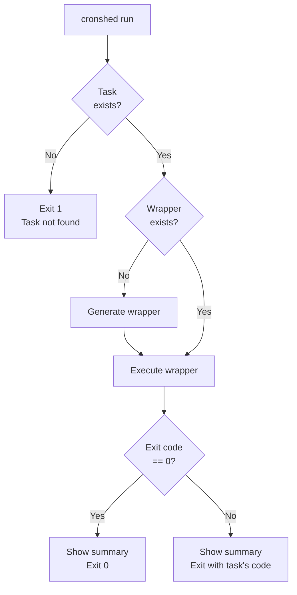
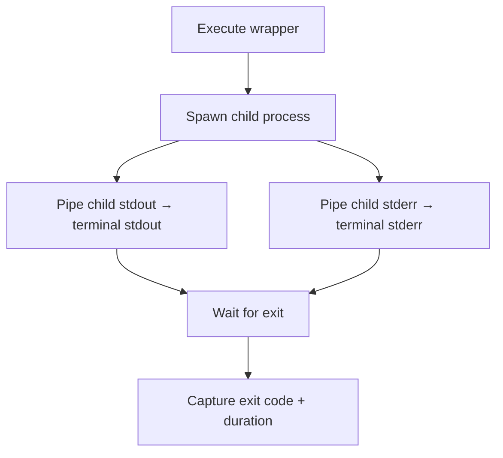
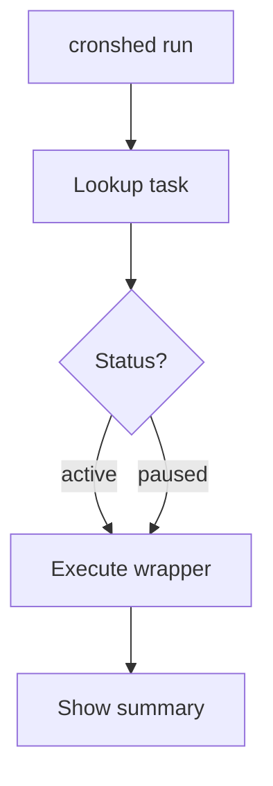
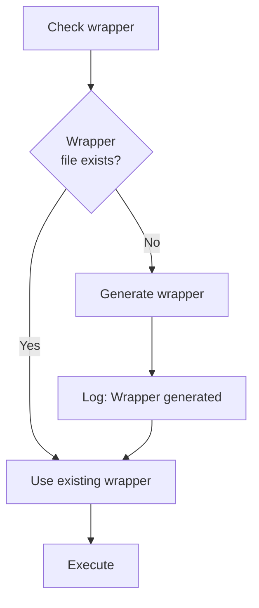
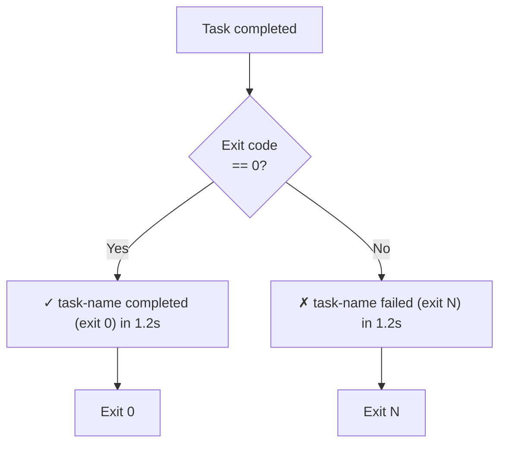

# Feature: Dry-run Mode

- **Branch:** `feature/014-dry-run-mode`
- **Date:** 2026-03-30
- **Status:** Implemented

---

## Input

> Add a `cronshed run <name>` command that executes a task immediately via its wrapper script (not via cron), streams output to the terminal in real-time, shows execution summary, and logs the execution through the wrapper's normal logging. Works with both active and paused tasks. Generates the wrapper first if it does not exist.

---

## User Stories

### US-001: Run a task immediately (P1 — critical)

> As a developer, I want to run a task immediately so that I can test whether my cron job works without waiting for cron to trigger it.

**Priority reason:** This is the core purpose of the feature. Without immediate execution, the developer has no way to test tasks except by waiting for the cron schedule.

**Independent test:** Create a task with `echo hello`, run `cronshed run <name>`, verify stdout shows "hello", exit code is 0, and execution is logged.

```gherkin
Feature: Run a task immediately
  Scenario: Successful execution with output
    Given a task "my-task" exists with command "echo hello"
    And   a wrapper script exists for "my-task"
    When  the user runs 'cronshed run my-task'
    Then  stdout contains "hello"
    And   the command exits with code 0
    And   a summary line shows exit code 0 and duration

  Scenario: Task command fails
    Given a task "fail-task" exists with command "exit 1"
    And   a wrapper script exists for "fail-task"
    When  the user runs 'cronshed run fail-task'
    Then  the command exits with a non-zero code
    And   a summary line shows the non-zero exit code and duration

  Scenario: Task not found
    Given no task named "ghost" exists
    When  the user runs 'cronshed run ghost'
    Then  stderr contains "not found"
    And   the command exits with code 1
```



### US-002: Real-time output streaming (P1 — critical)

> As a developer, I want to see stdout and stderr in real-time while the task runs so that I can observe its behavior as it happens, not just after completion.

**Priority reason:** Deferred output defeats the purpose of manual testing. Long-running tasks need immediate feedback.

**Independent test:** Create a task that echoes lines with a delay, run it, verify lines appear incrementally (not all at once after completion).

```gherkin
Feature: Real-time output streaming
  Scenario: Stdout streams in real-time
    Given a task "slow-task" exists with a command that outputs multiple lines over time
    And   a wrapper script exists for "slow-task"
    When  the user runs 'cronshed run slow-task'
    Then  stdout lines appear incrementally during execution
    And   stderr lines from the task appear on stderr

  Scenario: Both stdout and stderr are visible
    Given a task "mixed-task" exists with a command that writes to both stdout and stderr
    And   a wrapper script exists for "mixed-task"
    When  the user runs 'cronshed run mixed-task'
    Then  stdout from the task appears on the terminal stdout
    And   stderr from the task appears on the terminal stderr
```



### US-003: Run paused tasks (P2 — important)

> As a developer, I want to run a paused task so that I can test it without having to resume it first.

**Priority reason:** Paused tasks are often paused because they are being debugged. Requiring resume before dry-run adds unnecessary friction.

**Independent test:** Create a task, pause it, run it with `cronshed run`, verify it executes successfully despite being paused.

```gherkin
Feature: Run paused tasks
  Scenario: Execute a paused task
    Given a task "paused-task" exists with status "paused"
    And   a wrapper script exists for "paused-task"
    When  the user runs 'cronshed run paused-task'
    Then  the task executes successfully
    And   the command exits with code 0
    And   the task remains paused after execution
```



### US-004: Auto-generate wrapper if missing (P2 — important)

> As a developer, I want the run command to generate the wrapper automatically if it does not exist so that I do not need to manually sync before testing.

**Priority reason:** New tasks or tasks modified outside of cronshed may not have a wrapper. Requiring manual sync is a friction point that defeats the purpose of quick testing.

**Independent test:** Create a task, delete its wrapper file, run `cronshed run`, verify wrapper is generated then task executes.

```gherkin
Feature: Auto-generate wrapper if missing
  Scenario: Wrapper does not exist
    Given a task "new-task" exists with command "echo test"
    And   no wrapper script exists for "new-task"
    When  the user runs 'cronshed run new-task'
    Then  the wrapper is generated before execution
    And   stdout contains "test"
    And   the command exits with code 0

  Scenario: Wrapper already exists
    Given a task "existing-task" exists with command "echo hi"
    And   a wrapper script exists for "existing-task"
    When  the user runs 'cronshed run existing-task'
    Then  the existing wrapper is used
    And   no regeneration message is shown
```



### US-005: Execution summary display (P2 — important)

> As a developer, I want to see an execution summary after the task finishes so that I get a clear status report at a glance.

**Priority reason:** Without a summary, the developer must scroll back through output to assess the result. A compact summary line provides instant feedback.

**Independent test:** Run a task, verify the summary shows exit code, duration, and a success/failure indicator.

```gherkin
Feature: Execution summary display
  Scenario: Successful task shows green summary
    Given a task "ok-task" exists with command "echo done"
    When  the user runs 'cronshed run ok-task'
    Then  the last line of output shows a green checkmark, the task name, exit code 0, and duration

  Scenario: Failed task shows red summary
    Given a task "bad-task" exists with command "exit 42"
    When  the user runs 'cronshed run bad-task'
    Then  the last line of output shows a red cross, the task name, exit code 42, and duration

  Scenario: JSON output mode
    Given a task "json-task" exists with command "echo hi"
    When  the user runs 'cronshed run json-task --json'
    Then  stdout contains valid JSON with fields "taskName", "exitCode", "durationMs"
```



---

## Acceptance Criteria

| ID | Criterion |
|----|-----------|
| AC-001 | `cronshed run <name>` executes the task's wrapper script and exits with the wrapper's exit code |
| AC-002 | Stdout from the wrapper streams to the terminal stdout in real-time |
| AC-003 | Stderr from the wrapper streams to the terminal stderr in real-time |
| AC-004 | After execution, a summary line displays task name, exit code (colored), and duration |
| AC-005 | If the task does not exist, exit with code 1 and display "not found" error on stderr |
| AC-006 | Both active and paused tasks can be run |
| AC-007 | If the wrapper script does not exist, it is generated before execution |
| AC-008 | When the wrapper is auto-generated, a message is shown to the user |
| AC-009 | The execution is logged to the history file by the wrapper script (no extra logging from `run`) |
| AC-010 | `--json` flag outputs a JSON object with taskName, exitCode, durationMs |
| AC-011 | Missing task name shows usage hint and exits with code 2 |
| AC-012 | The `run` command appears in `cronshed --help` output |

---

## Functional Requirements

| ID | Description | AC |
|----|-------------|-----|
| FR-001 | Add `run` as a standalone command in `cli.handler.ts` | AC-001, AC-012 |
| FR-002 | Lookup task by name via `TaskService.get()` | AC-005, AC-006 |
| FR-003 | Check if wrapper exists at `getWrapperPath(name)`, generate via `WrapperService.generate()` if missing | AC-007, AC-008 |
| FR-004 | Spawn wrapper script as a child process with stdout/stderr inherited (piped to terminal) | AC-002, AC-003 |
| FR-005 | Capture the child process exit code and execution duration in milliseconds | AC-001, AC-004 |
| FR-006 | Display colored summary line after execution: green checkmark + duration for success, red cross for failure | AC-004 |
| FR-007 | Support `--json` flag that outputs `{ taskName, exitCode, durationMs }` instead of summary line | AC-010 |
| FR-008 | Exit the `cronshed` process with the same exit code as the wrapper script | AC-001 |
| FR-009 | Show usage error if task name is not provided: `Usage: cronshed run <name> [--json]` | AC-011 |
| FR-010 | Register `run` command in help text and STANDALONE_COMMANDS map | AC-012 |
| FR-011 | Wrapper script handles its own execution logging to JSONL — `run` command does not duplicate logging | AC-009 |

---

## Key Entities

No new entities. Uses existing `Task` and `WrapperService`.

---

## Edge Cases

| Case | Behavior |
|------|----------|
| Task exists but wrapper was manually deleted | Auto-generate wrapper, then execute |
| Task command takes a long time | Output streams in real-time, no timeout (wrapper handles timeout if configured) |
| Wrapper script has lost execute permissions | Fail with "Permission denied" error from shell |
| Task name not provided | Exit 2 with usage hint |
| Unknown flags passed | Exit 2 (parseArgs strict mode) |

---

## Success Criteria

| ID | Criterion |
|----|-----------|
| SC-001 | `cronshed run <name>` completes in <100ms overhead (excluding task execution time) |
| SC-002 | All 12 AC pass in test suite |
| SC-003 | Execution is logged via wrapper (visible in `cronshed history <name>`) |
