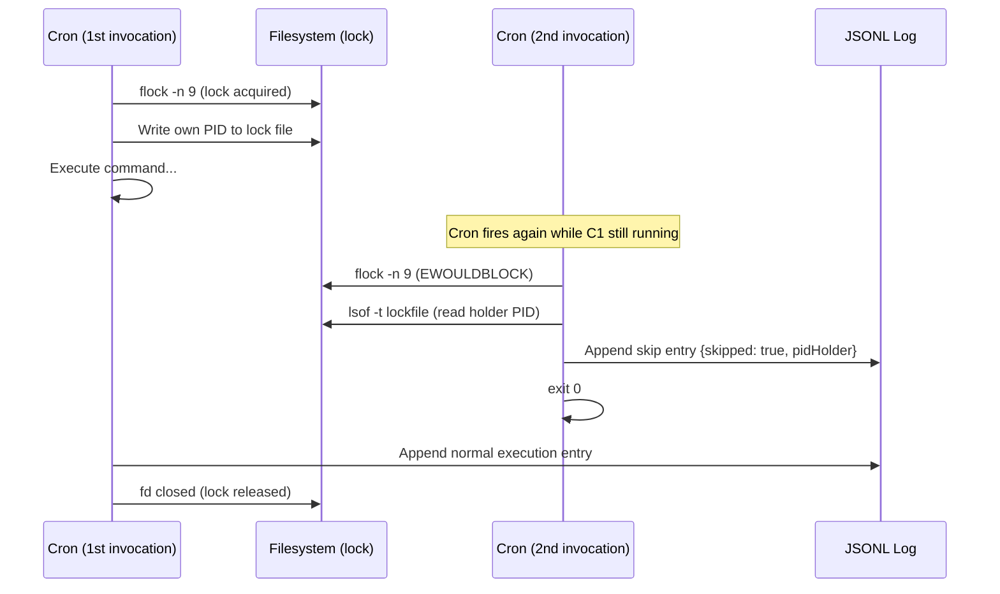
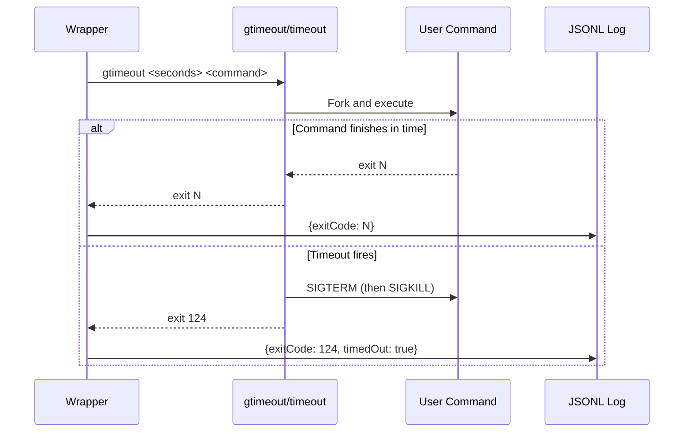
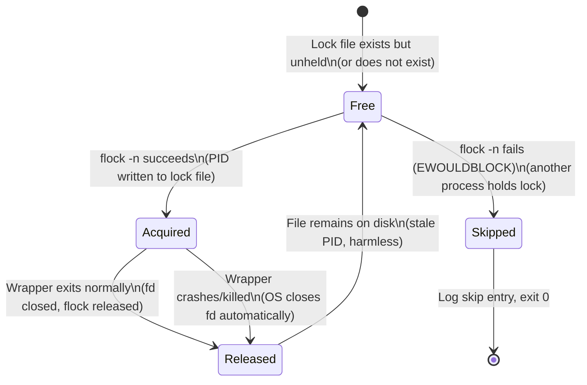
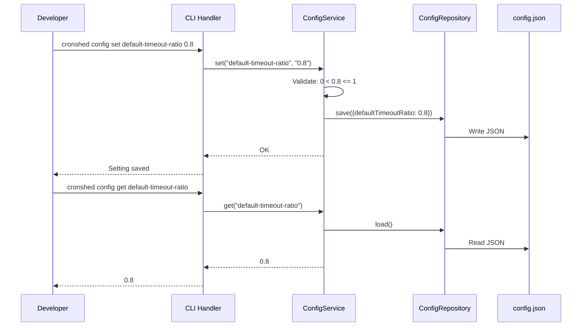
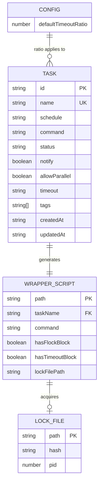

# Plan: Wrapper Protections

- **Feature:** 015-wrapper-protections
- **Status:** Approved
- **Date:** 2026-04-13

---

## Summary

Extend the wrapper script generator with flock-based single-instance protection (default ON, opt-out via `--allow-parallel`), optional timeout via `gtimeout`/`timeout` (detected at generation time), and a global `default-timeout-ratio` config that auto-computes timeout from schedule interval.

---

## Technical Context

| Dimension | Value |
|-----------|-------|
| Language | TypeScript (strict) |
| Runtime | Bun |
| Testing | bun:test |
| File I/O | Bun.file() |
| Storage | tasks.json (flat file), config.json (new) |
| Cron parsing | cron-parser |
| Shell tools | flock, gtimeout/timeout, sha256sum/shasum, lsof |
| Platform | macOS (primary), Linux |

---

## Constitution Check

| Principle | Compliance |
|-----------|------------|
| Simplicity First | Protections are pure bash blocks injected into wrapper scripts -- no new runtime deps, no new daemons. Config is a single JSON file |
| Single Responsibility | WrapperService builds scripts; ConfigService handles config.json; CLI handler parses flags; duration utilities are standalone |
| Explicit Over Implicit | Single-instance is ON by default (safe default); timeout is opt-in; timeout tool checked at generation time, not runtime |
| Fail Fast | Missing timeout tool fails at `cronshed add` time with install instructions; invalid ratio rejected at `config set` time |
| No Side Effects at Import | All new modules export functions/classes only; no execution at import time |

---

## Single-Instance Lock Flow

```gherkin
Feature: Single-instance via flock
  Scenario: Second invocation skipped while first holds lock
    Given a task "backup-db" wrapper is currently executing (holds flock)
    When cron triggers the wrapper a second time
    Then flock --nonblock fails immediately
    And the wrapper reads the holder PID from the lock file
    And a skip log entry is appended with skipped=true, pidHolder, reason="already running"
    And the second invocation exits 0

  Scenario: Lock released after normal completion
    Given a task "backup-db" wrapper has completed execution
    When the wrapper is invoked again
    Then flock acquires the lock successfully
    And the command executes normally
```



---

## Timeout Flow

```gherkin
Feature: Timeout protection
  Scenario: Command killed after timeout duration
    Given a task "slow-job" has timeout "2s" configured
    When the wrapper executes the command via "gtimeout 2 <command>"
    Then the command is killed after 2 seconds
    And the exit code is 124
    And the log entry includes timedOut=true

  Scenario: Command completes within timeout
    Given a task "fast-job" has timeout "60s" configured
    When the wrapper executes the command via "gtimeout 60 <command>"
    Then the command completes normally with its own exit code
    And the log entry does not contain timedOut
```



---

## Lock Lifecycle

```gherkin
Feature: Lock lifecycle
  Scenario: Lock transitions through normal execution
    Given the lock file does not exist or is not held
    When the wrapper starts
    Then the lock transitions from Free to Acquired
    And when the wrapper exits normally, the lock transitions to Released

  Scenario: Lock released on crash
    Given the wrapper holds the flock
    When the wrapper process is killed (SIGKILL)
    Then the OS closes the fd
    And the lock transitions to Released (file remains but unheld)
```



---

## Config Set/Get Flow

```gherkin
Feature: Config set and get
  Scenario: Set valid timeout ratio
    When the developer runs "cronshed config set default-timeout-ratio 0.8"
    Then ConfigService validates 0 < 0.8 <= 1
    And writes {defaultTimeoutRatio: 0.8} to ~/.cronshed/config.json
    And stdout confirms the setting

  Scenario: Get existing config value
    Given default-timeout-ratio is set to 0.8
    When the developer runs "cronshed config get default-timeout-ratio"
    Then stdout prints "0.8"

  Scenario: Invalid ratio rejected
    When the developer runs "cronshed config set default-timeout-ratio 1.5"
    Then ConfigService rejects with "must be between 0 and 1"
    And exit code is non-zero
```



---

## Data Model



---

## Implementation Plan

### Step 0: Infrastructure Setup

**Files:** None (no external infrastructure needed)

This feature requires only local filesystem and system utilities (`flock`, `shasum`, `lsof`, `gtimeout`/`timeout`). No cloud services, databases, or external APIs. Verification:

- `which flock` -- must exist on target platform (macOS: built-in since Ventura; Linux: util-linux)
- `which shasum` -- macOS built-in; Linux alternative: `sha256sum`
- `which lsof` -- standard on both platforms
- `which gtimeout || which timeout` -- only needed when timeout is configured; checked at generation time

No provisioning needed. Infrastructure is verified at runtime/generation time.

---

### Step 1: Extend Task type and add duration parser

**Files:** `src/task/task.types.ts`, `src/wrapper/duration.ts` (new)

- Add `allowParallel?: boolean` and `timeout?: string` to `Task` interface
- Add `allowParallel?: boolean` and `timeout?: string` to `CreateTaskInput`
- Add `allowParallel?: boolean` and `timeout?: string` to `UpdateTaskInput`
- Create `src/wrapper/duration.ts` with:
  - `parseDuration(input: string): number` -- parse `<N>s`, `<N>m`, `<N>h` to seconds. Reject `0s` and negative values
  - `formatDurationForDisplay(seconds: number): string` -- for confirmation messages

**Tests:** `src/wrapper/duration.test.ts`
- parseDuration("50s") returns 50
- parseDuration("5m") returns 300
- parseDuration("2h") returns 7200
- parseDuration("0s") throws
- parseDuration("abc") throws
- parseDuration("-5m") throws

**FR:** FR-088 (type extension), FR-090 (duration parsing)

---

### Step 2: Add schedule interval calculator

**Files:** `src/cron/schedule-interval.ts` (new)

- `scheduleToIntervalSeconds(schedule: string): number | null` -- parse cron expression using `cron-parser`, compute the minimum interval between two consecutive executions by iterating next N occurrences (e.g., 10) and finding the minimum gap. Return `null` if interval cannot be determined
- Uses existing `cron-parser` dependency

**Tests:** `src/cron/schedule-interval.test.ts`
- `*/5 * * * *` returns 300
- `* * * * *` returns 60
- `0 */2 * * *` returns 7200
- `0 0 * * *` returns 86400
- `0 9,17 * * *` returns minimum gap (28800 or similar)

**FR:** FR-095

---

### Step 3: ConfigService and ConfigRepository

**Files:** `src/config/config.service.ts` (new), `src/config/config.repository.ts` (new), `src/config/config.types.ts` (new)

**config.types.ts:**
- `CronshedConfig` interface: `{ defaultTimeoutRatio?: number }`
- Valid config keys enum/type

**config.repository.ts:**
- `ConfigRepository` class with constructor accepting `configPath` (default: `~/.cronshed/config.json`)
- `load(): Promise<CronshedConfig>` -- read and parse; return `{}` if file missing
- `save(config: CronshedConfig): Promise<void>` -- write with `mkdir -p` for parent dir

**config.service.ts:**
- `ConfigService` class with `ConfigRepository` dependency
- `get(key: string): Promise<string | undefined>` -- read config, return value for key
- `set(key: string, value: string): Promise<void>` -- validate and persist
  - `default-timeout-ratio`: parse as float, validate `0 < value <= 1`
  - Unknown keys: reject with error

**Tests:** `src/config/config.service.test.ts`, `src/config/config.repository.test.ts`
- Set valid ratio (0.8): persisted correctly
- Set invalid ratio (1.5, -0.3, 0): rejected
- Get existing key: returns value
- Get missing key: returns undefined
- Load missing file: returns empty config
- Unknown key rejected

**FR:** FR-092, FR-093

---

### Step 4: Extend WrapperService with flock and timeout blocks

**Files:** `src/wrapper/wrapper.service.ts`, `src/wrapper/wrapper.types.ts`, `src/wrapper/wrapper.errors.ts`

**wrapper.types.ts:**
- Add to `WrapperConfig`: `allowParallel: boolean`, `timeout?: { seconds: number; tool: string }`, `lockFilePath?: string`, `locksDir?: string`

**wrapper.errors.ts:**
- Add `TimeoutToolMissingError` class with install instructions for macOS/Linux

**wrapper.service.ts:**
- Add `detectTimeoutTool(): Promise<string>` -- check `which gtimeout`, then `which timeout`; throw `TimeoutToolMissingError` if neither found
- Add `computeLockHash(configPath: string, taskName: string): string` -- SHA-256 of `<configPath>:<taskName>` using `Bun.CryptoHasher` (native Bun API, no shell dependency for hash)
- Update `generate()` signature: accept `allowParallel`, `timeout`, `configPath`
- Update `buildScript()`: inject flock block (conditional on `!allowParallel`), inject timeout wrapping (conditional on timeout config)
- Update `syncWrappers()`: accept extended task info

**Flock block structure (injected into bash):**
```
CRONSHED_LOCK_DIR="<dataDir>/locks"
CRONSHED_LOCK_FILE="$CRONSHED_LOCK_DIR/<hash>.lock"
mkdir -p "$CRONSHED_LOCK_DIR"
(
  flock -n 9 || {
    _pid_holder=$(lsof -t "$CRONSHED_LOCK_FILE" 2>/dev/null | head -1)
    _skipped_at=$(date -u +"%Y-%m-%dT%H:%M:%SZ")
    printf '{"timestamp":"%s","exitCode":0,"skipped":true,"skippedAt":"%s","reason":"already running","pidHolder":%s}\n' \
      "$_skipped_at" "$_skipped_at" "${_pid_holder:-0}" >> "$CRONSHED_LOG_FILE"
    exit 0
  }
  echo $$ > "$CRONSHED_LOCK_FILE"

  # ... existing execution logic (with optional timeout wrapping) ...
) 9>"$CRONSHED_LOCK_FILE"
```

**Timeout wrapping:** Replace `{{COMMAND}}` with `<timeout_tool> <seconds> {{COMMAND}}`, and add post-execution check:
```
if [ $_exit_code -eq 124 ] && [ -n "$CRONSHED_TIMEOUT" ]; then
  # Add timedOut field to log entry
fi
```

**Tests:** `src/wrapper/wrapper.service.test.ts` (extend existing)
- buildScript with allowParallel=false: output contains flock block
- buildScript with allowParallel=true: output does NOT contain flock block
- buildScript with timeout: output contains gtimeout/timeout command
- buildScript without timeout: output does NOT contain timeout command
- buildScript with flock + timeout: both blocks present, correctly nested
- computeLockHash produces different hashes for different config paths
- detectTimeoutTool finds gtimeout first, falls back to timeout, throws if neither

**FR:** FR-086, FR-087, FR-089, FR-090, FR-091, FR-097, FR-098, FR-099

---

### Step 5: CLI handler for `config set` and `config get`

**Files:** `src/cli/handlers/config.handler.ts` (new), `src/cli/cli.handler.ts`

**config.handler.ts:**
- `handleConfig(args: string[]): Promise<void>` -- dispatch to `handleConfigSet` or `handleConfigGet` based on first positional
- `handleConfigSet(args: string[]): Promise<void>` -- parse key and value, delegate to ConfigService.set()
- `handleConfigGet(args: string[]): Promise<void>` -- parse key, delegate to ConfigService.get(), print value or "not set"

**cli.handler.ts:**
- Register `config` in `STANDALONE_COMMANDS`
- Add `TimeoutToolMissingError` to error mapping (exit code 2)
- Update help text with `config set/get` usage

**Tests:** `src/cli/handlers/config.handler.test.ts`
- config set valid ratio: success message
- config set invalid ratio: error
- config get existing: prints value
- config get missing: prints "not set"
- config with no subcommand: usage error

**FR:** FR-093

---

### Step 6: Update `add` and `update` CLI handlers

**Files:** `src/cli/handlers/task-crud.handler.ts`

**handleAdd:**
- Add `--allow-parallel` (boolean flag) and `--timeout` (string) to parseArgs
- Pass `allowParallel` and `timeout` to `service.add()`
- Before wrapper generation: if timeout specified, call `detectTimeoutTool()`
- If no explicit timeout and `defaultTimeoutRatio` configured: compute timeout from interval
- If schedule interval <= 60s, no timeout, no ratio: print warning to stderr
- Pass all protection fields to `wrapperService.generate()`

**handleUpdate:**
- Add `--allow-parallel` and `--no-allow-parallel` (boolean flags) and `--timeout` (string) to parseArgs
- Pass to `service.update()`
- Regenerate wrapper when `allowParallel` or `timeout` changes (in addition to command/notify changes)

**Tests:** Updated in `src/cli/cli.integration.test.ts` or handler-level tests
- Add with --allow-parallel: task has allowParallel=true
- Add with --timeout 5m: task has timeout="5m", wrapper contains timeout
- Add with short schedule, no timeout, no ratio: warning printed
- Update with --allow-parallel: wrapper regenerated without flock

**FR:** FR-088, FR-094, FR-096

---

### Step 7: Update TaskService and TaskRepository for new fields

**Files:** `src/task/task.service.ts`, `src/task/task.repository.ts`

**task.service.ts:**
- `add()`: accept and store `allowParallel` and `timeout` fields
- `update()`: accept and apply `allowParallel` and `timeout` changes

**task.repository.ts:**
- Backward compatibility in `load()`: default `allowParallel` to `undefined` (falsy) and `timeout` to `undefined` for existing tasks without these fields

**Tests:** `src/task/task.service.test.ts` (extend)
- Add task with allowParallel: persisted
- Add task with timeout: persisted
- Update task allowParallel: updated
- Update task timeout: updated

**FR:** FR-088

---

### Step 8: Update SyncService for protection fields

**Files:** `src/crontab/sync.service.ts`

- Update `syncWrappers()` call to pass `allowParallel`, `timeout`, and `configPath` per task
- WrapperService.syncWrappers() needs config context to generate proper wrappers

**Tests:** `src/crontab/sync.service.test.ts` (extend)
- Sync regenerates wrappers with protection fields

**FR:** FR-086, FR-098

---

### Step 9: Update LogEntry type and display formatters

**Files:** `src/log/log.types.ts`, `src/cli/formatters/task.formatter.ts`

**log.types.ts:**
- Add optional fields to `ExecutionLogEntry`: `skipped?: boolean`, `skippedAt?: string`, `reason?: string`, `pidHolder?: number`, `timedOut?: boolean`

**task.formatter.ts:**
- `formatTaskDetails()`: show "Parallel: allowed/blocked" and "Timeout: <value>/none"
- History display: indicate skip entries and timeout entries

**Tests:** Formatter tests for new fields

**FR:** FR-087, FR-091

---

### Step 10: Integration tests for wrapper execution

**Files:** `src/wrapper/wrapper-protections.integration.test.ts` (new)

- **Flock integration:** Generate wrapper with flock, execute twice in parallel (first with `sleep 5`, second immediately), verify second produces skip log entry with correct fields
- **Timeout integration:** Generate wrapper with 2s timeout and `sleep 10` command, execute, verify exit code 124 and timedOut in log
- **Allow-parallel integration:** Generate wrapper with allowParallel=true, execute twice in parallel, verify both complete
- **Flock + timeout combined:** Generate wrapper with both protections, verify both work together

**FR:** FR-086, FR-087, FR-090, FR-091 (end-to-end verification)

---

### Step 11: Help text and documentation

**Files:** `src/cli/cli.handler.ts`

- Update help text for `add` command: include `--allow-parallel` and `--timeout` flags
- Update help text for `update` command: include `--allow-parallel`, `--no-allow-parallel`, and `--timeout` flags
- Add help text for `config` command

**FR:** All (documentation)

---

## Testing Strategy

| Test Type | Scope | Tool | Key Scenarios |
|-----------|-------|------|---------------|
| Unit | Duration parser | bun:test | Parse s/m/h, reject invalid, reject 0 |
| Unit | Schedule interval calculator | bun:test | Common cron patterns, min gap computation |
| Unit | ConfigService set/get/validate | bun:test | Valid ratio, invalid ratio, missing config |
| Unit | ConfigRepository load/save | bun:test | Missing file, valid JSON, corrupt JSON |
| Unit | WrapperService.buildScript() | bun:test | Flock block presence/absence, timeout wrapping, combined |
| Unit | WrapperService.computeLockHash() | bun:test | Different paths produce different hashes |
| Unit | WrapperService.detectTimeoutTool() | bun:test | gtimeout found, timeout fallback, neither found |
| Unit | CLI handler flag parsing | bun:test | --allow-parallel, --timeout, config set/get |
| Unit | Short-schedule warning | bun:test | <=60s warns, >60s no warn, timeout set no warn |
| Integration | Wrapper flock execution | bun:test + Bun.$ | Parallel runs, skip entry validation |
| Integration | Wrapper timeout execution | bun:test + Bun.$ | Timeout kill, timedOut field in log |
| Integration | Wrapper flock + timeout | bun:test + Bun.$ | Combined protections |

**Mock strategy:**
- Duration parser and hash computation: pure functions, no mocks needed
- ConfigRepository: use temp directory for test isolation
- detectTimeoutTool: mock `Bun.$` or use PATH manipulation to control which tool is found
- Integration tests: use real `flock` and `sleep` commands, temp directories for all data

---

## Risks & Considerations

| Risk | Impact | Mitigation |
|------|--------|------------|
| `flock` not available on older macOS | Wrapper fails at runtime with "command not found" | Document minimum macOS version (Ventura+). Do NOT check at generation time since flock is expected to be ubiquitous. If missing, `cronshed doctor` can flag it in a future enhancement |
| `shasum` vs `sha256sum` availability | Lock hash computation fails | Use `Bun.CryptoHasher("sha256")` in TypeScript at generation time -- no shell dependency for hashing. Hash is baked into the wrapper as a literal string |
| `lsof` not available | PID holder cannot be read on skip | Wrapper uses `lsof -t` with fallback to `0` if lsof fails (`${_pid_holder:-0}`). Skip entry still written, just without PID detail |
| flock in subshell semantics | flock on fd 9 must be inherited by the subshell | Using `( ... ) 9>"$CRONSHED_LOCK_FILE"` -- the redirection opens fd 9 for the subshell, and `flock -n 9` locks that fd. This is the standard flock-in-subshell pattern |
| Task schema migration (existing tasks.json) | Existing tasks lack `allowParallel` and `timeout` fields | Backward-compatible: `load()` in TaskRepository defaults missing fields to `undefined`. `undefined` for `allowParallel` is falsy (single-instance ON by default). `undefined` for `timeout` means no timeout. No migration script needed |
| Timeout tool removed after wrapper generation | Wrapper fails at runtime with "command not found" | Documented edge case. Recovery: reinstall tool or `cronshed update <task> --timeout ""` to remove timeout. `cronshed doctor` could detect this in a future feature |
| Duration string validation | User provides invalid format like "5min" or "300" | Strict regex validation in `parseDuration()`: only `<N>s`, `<N>m`, `<N>h` accepted. Clear error message with valid formats |
| Lock file accumulation | `~/.cronshed/locks/` grows with stale lock files | Lock files are tiny (< 20 bytes). Acceptable for a single-user tool. Future: `cronshed` could clean orphaned locks. Not in scope for this feature |
| Concurrent `cronshed add` with same task name | Race on tasks.json | Same risk as existing codebase -- single-user tool, not a concern. TaskRepository uses atomic write (tmp + rename) |
| `default-timeout-ratio` applied retroactively | User expects existing wrappers to gain timeout | Documented: ratio only applies to tasks added/updated AFTER config is set. `cronshed sync` regenerates all wrappers but needs to know the config -- addressed in Step 8 |
