# Feature Spec: Wrapper Protections

- **Feature:** Wrapper Protections
- **Branch:** feature/015-wrapper-protections
- **Date:** 2026-04-13
- **Status:** Implemented
- **Feature Number:** 015
- **Input:** Add two protections to the generated wrapper script: (1) Single-instance via flock (default ON, opt-out with `--allow-parallel`), (2) Timeout via system `timeout`/`gtimeout` (opt-in with `--timeout <duration>`). Add a global `default-timeout-ratio` config for proportional auto-timeout based on schedule interval.

---

## Design Decisions

### Single-Instance via flock

The wrapper uses `flock --nonblock` on `~/.cronshed/locks/<hash>.lock` to prevent concurrent execution. The lock file name is a SHA-256 hash of the full task path (`<config-file-path>:<task-name>`) to avoid collisions when different config files have tasks with the same name. The `locks/` directory is created by the wrapper (`mkdir -p`).

When a lock cannot be acquired, the wrapper logs a skip entry (`skipped: true`, `pidHolder: <pid>`) and exits 0. This is intentional: the skip is not an error, it is expected overlap prevention.

Single-instance is ON by default. Passing `--allow-parallel` on `cronshed add` or `cronshed update` disables it for that task.

### Timeout via gtimeout / timeout

Timeout is opt-in, specified via `--timeout <duration>` (e.g., `50s`, `5m`) on `cronshed add` or `cronshed update`. The wrapper wraps the command invocation with `gtimeout` (macOS with coreutils) or `timeout` (Linux).

The availability of the timeout tool is checked at **wrapper generation time** (in TypeScript, before writing the `.sh` file), not at runtime. If neither `gtimeout` nor `timeout` is found, a blocking error is thrown with installation instructions.

When timeout fires (exit code 124), the log entry includes `timedOut: true`.

### Global Timeout-Ratio Config

`cronshed config set default-timeout-ratio <0-1>` stores the ratio in `~/.cronshed/config.json`. When a task is added/updated without an explicit `--timeout` and a ratio is configured, the wrapper auto-computes a timeout from the schedule interval:

- Parse schedule to extract the minimum interval in seconds
- Multiply by ratio, round down
- Minimum 10 seconds
- Example: `*/5 * * * *` = 300s interval, ratio 0.8 = 240s timeout

This only applies to tasks added/updated AFTER the config is set. Existing wrappers are not retroactively updated.

### Short Schedule Warning

If a task has a schedule interval of 60 seconds or less (e.g., `* * * * *`, `*/1 * * * *`) and no `--timeout` is set and no `default-timeout-ratio` is configured, `cronshed add` prints a non-blocking warning suggesting `--timeout`.

---

## User Scenarios & Testing

### Story 1 — Single-instance protection prevents concurrent execution `P1`

**Description:** As a developer, I want the wrapper to prevent concurrent execution of the same task by default, so overlapping cron runs do not cause data corruption or resource contention.

**Priority reason:** Core protection — concurrent execution is the most common cron job failure mode, and the default-ON behavior means every user benefits without configuration.

**Independent test:** Run the wrapper twice in parallel; verify the second run is skipped with a log entry containing `skipped: true`.

```gherkin
Feature: Single-instance protection
  Scenario: Second run is skipped when first is still running
    Given a task "backup-db" exists with single-instance enabled (default)
    And the wrapper for "backup-db" is currently running (holds the flock)
    When the wrapper for "backup-db" is invoked a second time
    Then the second invocation exits with code 0
    And a log entry is appended with "skipped" equal to true
    And the log entry contains "reason" equal to "already running"
    And the log entry contains "pidHolder" with the PID of the first instance
    And the log entry contains "skippedAt" as a valid ISO 8601 timestamp

  Scenario: Lock is released after execution completes
    Given a task "backup-db" exists with single-instance enabled
    And the wrapper for "backup-db" was previously running and has completed
    When the wrapper for "backup-db" is invoked again
    Then the wrapper acquires the lock and executes the command normally
    And the log entry does not contain "skipped"
```

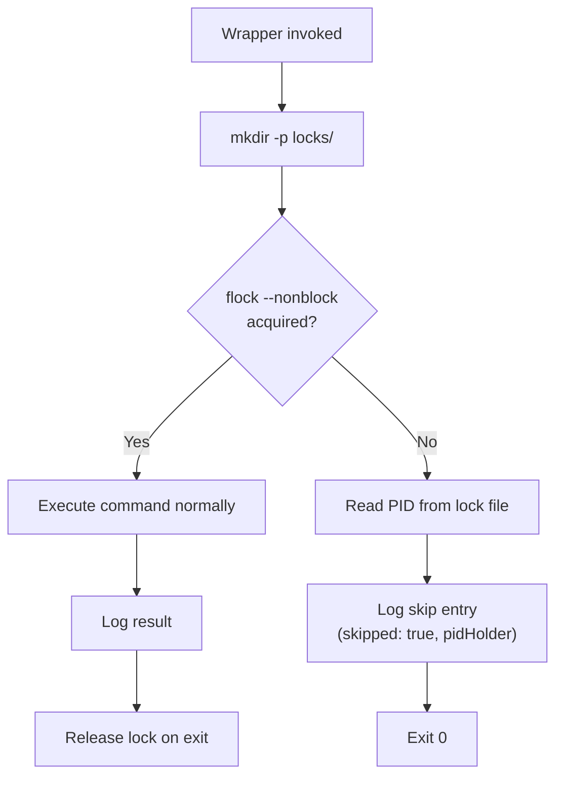

---

### Story 2 — `--allow-parallel` flag disables single-instance protection `P1`

**Description:** As a developer, I want to opt out of single-instance protection with `--allow-parallel` on `cronshed add` or `cronshed update`, so tasks that are safe to run concurrently are not blocked.

**Priority reason:** Some tasks (e.g., stateless health checks) are safe to overlap. Without an opt-out, single-instance would be too restrictive for these use cases.

**Independent test:** Add a task with `--allow-parallel`, run the wrapper twice in parallel; verify both complete.

```gherkin
Feature: Allow parallel flag
  Scenario: Task added with --allow-parallel runs concurrently
    Given the developer runs "cronshed add health-check --schedule '* * * * *' --command 'curl -s http://localhost/health' --allow-parallel"
    When the wrapper for "health-check" is invoked twice simultaneously
    Then both invocations execute the command
    And both invocations log normal execution entries (no "skipped" field)

  Scenario: Existing task updated to allow parallel
    Given a task "backup-db" exists with single-instance enabled (default)
    When the developer runs "cronshed update backup-db --allow-parallel"
    Then the wrapper for "backup-db" is regenerated without flock protection
    And concurrent invocations of the wrapper both execute the command
```

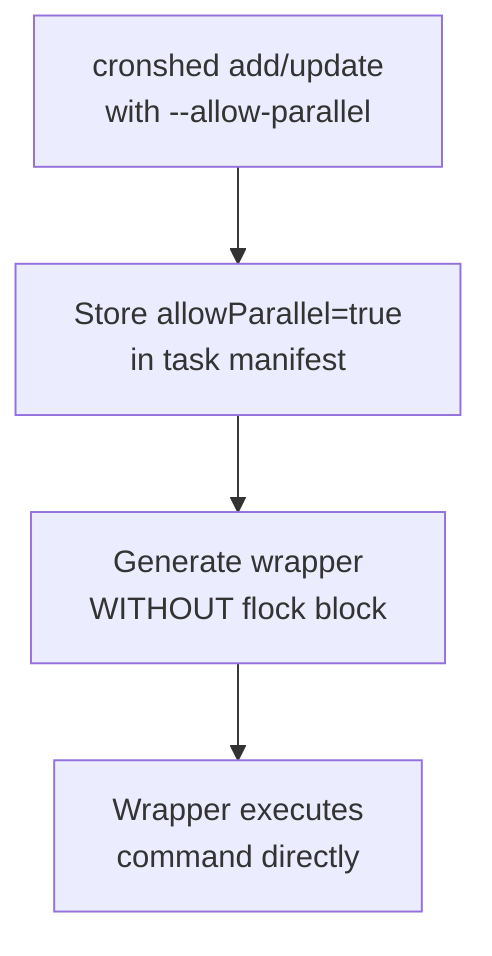

---

### Story 3 — Timeout kills long-running tasks `P1`

**Description:** As a developer, I want to set a timeout on a task with `--timeout <duration>`, so long-running commands are killed before the next scheduled execution.

**Priority reason:** Timeout prevention is essential for tasks with fixed intervals. Without it, a hung command accumulates zombie processes across cron cycles.

**Independent test:** Add a task with `--timeout 2s` and a command that sleeps 10 seconds; verify the command is killed and the log entry contains `timedOut: true`.

```gherkin
Feature: Timeout protection
  Scenario: Command killed after timeout
    Given a task "slow-job" exists with "--timeout 2s" and command "sleep 10"
    When the wrapper for "slow-job" is executed
    Then the command is killed after 2 seconds
    And the log entry has "exitCode" equal to 124
    And the log entry has "timedOut" equal to true

  Scenario: Command completes within timeout
    Given a task "fast-job" exists with "--timeout 10s" and command "echo done"
    When the wrapper for "fast-job" is executed
    Then the command completes normally
    And the log entry has "exitCode" equal to 0
    And the log entry does not contain "timedOut"
```

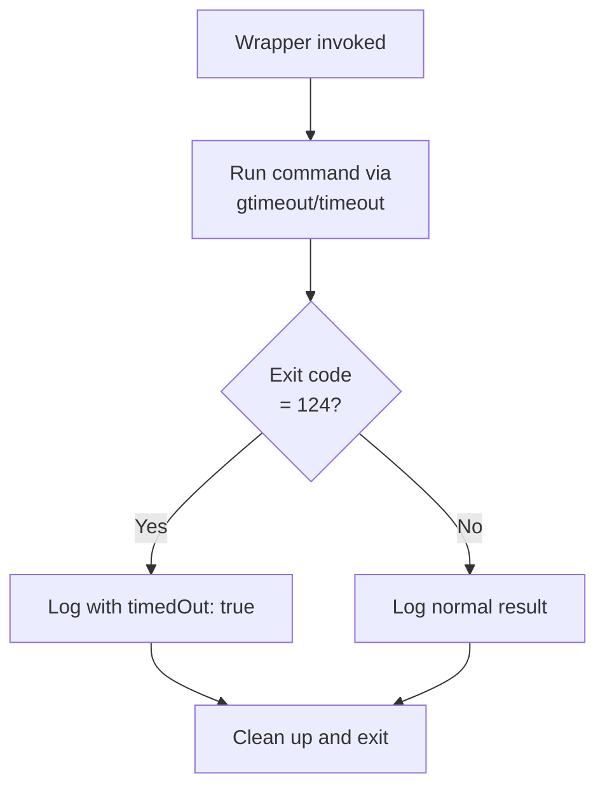

---

### Story 4 — Timeout tool check at wrapper generation time `P1`

**Description:** As a developer, I want `cronshed add --timeout` to fail with a clear error if `gtimeout`/`timeout` is not installed, so I discover the missing dependency immediately rather than at runtime.

**Priority reason:** A missing tool at runtime would cause silent cron failures. Checking at generation time gives the developer an actionable error with installation instructions.

**Independent test:** On a system without `timeout`/`gtimeout`, run `cronshed add --timeout 5s`; verify a blocking error with install instructions.

```gherkin
Feature: Timeout tool availability check
  Scenario: Timeout tool found on system
    Given "gtimeout" is available on the system PATH
    When the developer runs "cronshed add slow-job --schedule '*/5 * * * *' --command 'make build' --timeout 5m"
    Then the task is added successfully
    And the wrapper script uses "gtimeout" as the timeout command

  Scenario: Neither timeout nor gtimeout is available
    Given neither "timeout" nor "gtimeout" is available on the system PATH
    When the developer runs "cronshed add slow-job --schedule '*/5 * * * *' --command 'make build' --timeout 5m"
    Then the command fails with a non-zero exit code
    And stderr contains "requires 'timeout' command (GNU coreutils)"
    And stderr contains "brew install coreutils" for macOS instructions
```

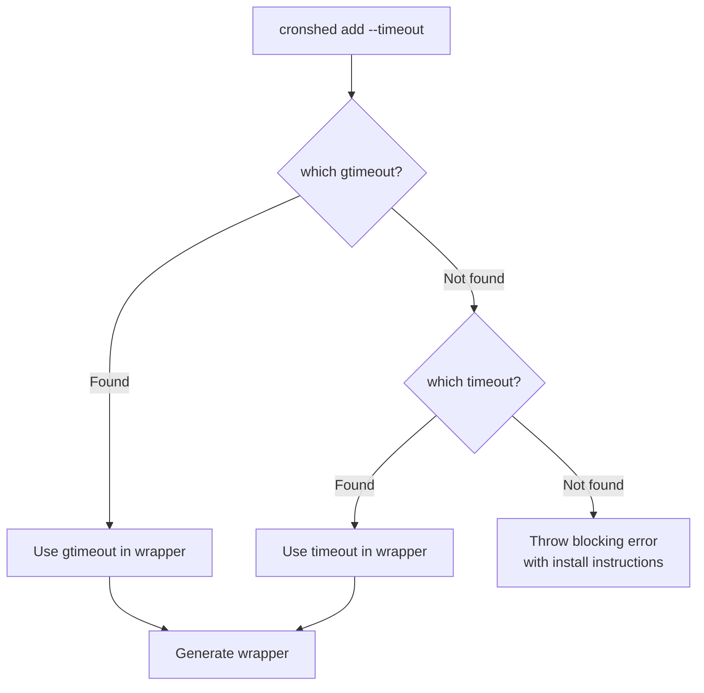

---

### Story 5 — Warning when schedule is 1 minute or less without timeout `P2`

**Description:** As a developer, I want `cronshed add` to warn me when my schedule runs every minute and I have not set a timeout, so I am reminded of the overlap risk.

**Priority reason:** Short-interval tasks without timeout are the highest-risk for overlap. A non-blocking warning is a low-cost safety net.

**Independent test:** Add a task with schedule `* * * * *` and no `--timeout`; verify warning is printed to stderr but task is still added.

```gherkin
Feature: Short schedule warning
  Scenario: Warning shown for every-minute schedule without timeout
    Given no default-timeout-ratio is configured
    When the developer runs "cronshed add monitor --schedule '* * * * *' --command 'curl http://localhost/health'"
    Then stderr contains "Schedule runs every minute. Consider adding --timeout"
    And the task "monitor" is added successfully

  Scenario: No warning when timeout is set
    Given no default-timeout-ratio is configured
    When the developer runs "cronshed add monitor --schedule '* * * * *' --command 'curl http://localhost/health' --timeout 45s"
    Then the task "monitor" is added successfully
    And stderr does not contain "Consider adding --timeout"

  Scenario: No warning when default-timeout-ratio is configured
    Given a default-timeout-ratio of 0.8 is configured
    When the developer runs "cronshed add monitor --schedule '* * * * *' --command 'curl http://localhost/health'"
    Then the task "monitor" is added successfully
    And stderr does not contain "Consider adding --timeout"
```

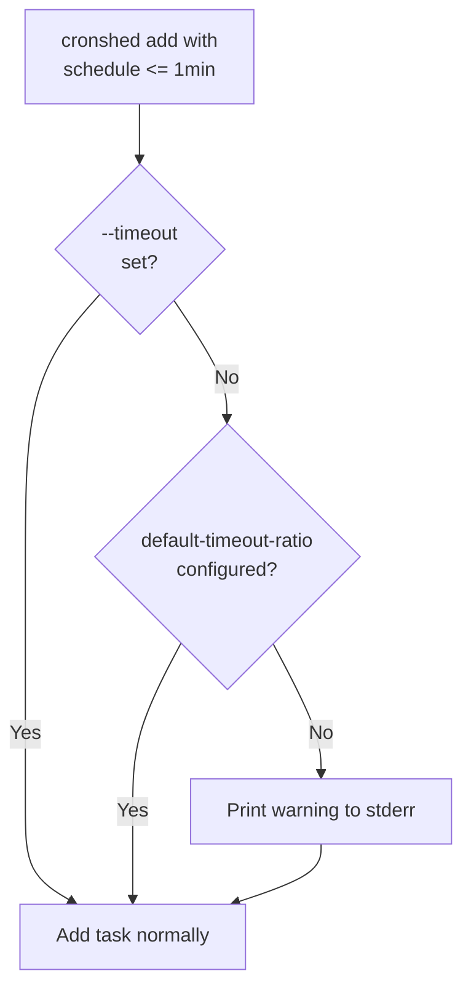

---

### Story 6 — Global timeout-ratio config `P2`

**Description:** As a developer, I want to set a global `default-timeout-ratio` so that tasks automatically get a proportional timeout based on their schedule interval, without specifying `--timeout` on each task.

**Priority reason:** Reduces boilerplate for users with many tasks. A single config sets a sensible default for all future tasks.

**Independent test:** Set `default-timeout-ratio` to 0.8, add a task with `*/5 * * * *` schedule; verify the wrapper contains a 240s timeout.

```gherkin
Feature: Global timeout-ratio config
  Scenario: Set default-timeout-ratio
    When the developer runs "cronshed config set default-timeout-ratio 0.8"
    Then "~/.cronshed/config.json" contains "defaultTimeoutRatio" equal to 0.8

  Scenario: Invalid ratio rejected
    When the developer runs "cronshed config set default-timeout-ratio 1.5"
    Then the command fails with a non-zero exit code
    And stderr contains "must be between 0 and 1"

  Scenario: Negative ratio rejected
    When the developer runs "cronshed config set default-timeout-ratio -0.3"
    Then the command fails with a non-zero exit code
    And stderr contains "must be between 0 and 1"
```

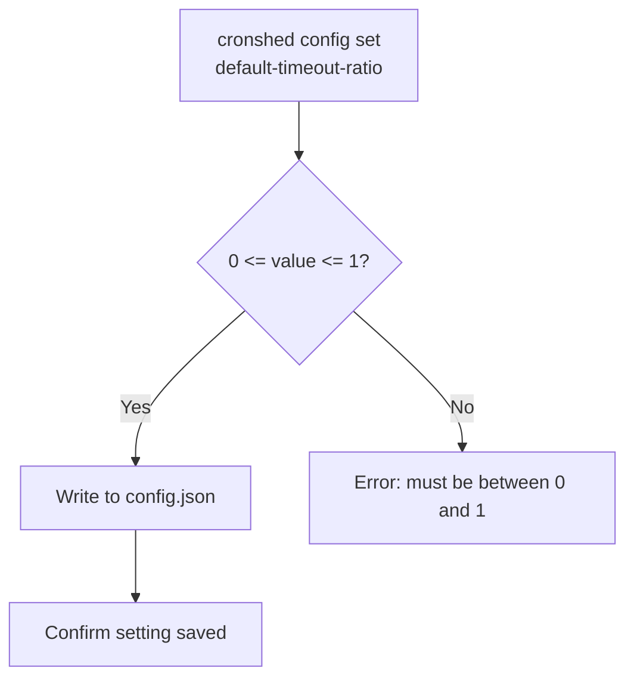

---

### Story 7 — Timeout-ratio auto-applies to new tasks `P2`

**Description:** As a developer, I want tasks added after setting `default-timeout-ratio` to automatically have a proportional timeout injected into the wrapper, so I do not need to specify `--timeout` on every task.

**Priority reason:** This is the payoff of the config: seamless timeout protection without per-task flags.

**Independent test:** Set ratio to 0.8, add task with `*/5 * * * *`; verify wrapper includes `gtimeout 240` or `timeout 240`.

```gherkin
Feature: Auto-timeout from ratio
  Scenario: Ratio applied to new task without explicit timeout
    Given a default-timeout-ratio of 0.8 is configured
    And "gtimeout" is available on the system PATH
    When the developer runs "cronshed add sync-files --schedule '*/5 * * * *' --command 'rsync /src /dst'"
    Then the wrapper script for "sync-files" contains "gtimeout 240"
    And no warning is printed about missing timeout

  Scenario: Explicit --timeout overrides ratio
    Given a default-timeout-ratio of 0.8 is configured
    When the developer runs "cronshed add sync-files --schedule '*/5 * * * *' --command 'rsync /src /dst' --timeout 30s"
    Then the wrapper script for "sync-files" contains a 30-second timeout
    And the ratio-computed value of 240s is not used

  Scenario: Ratio with very short schedule enforces minimum 10s
    Given a default-timeout-ratio of 0.1 is configured
    And "gtimeout" is available on the system PATH
    When the developer runs "cronshed add fast-job --schedule '* * * * *' --command 'echo ping'"
    Then the wrapper script for "fast-job" contains "gtimeout 10"
    And the computed value of 6s (60 * 0.1 = 6) is clamped to 10
```

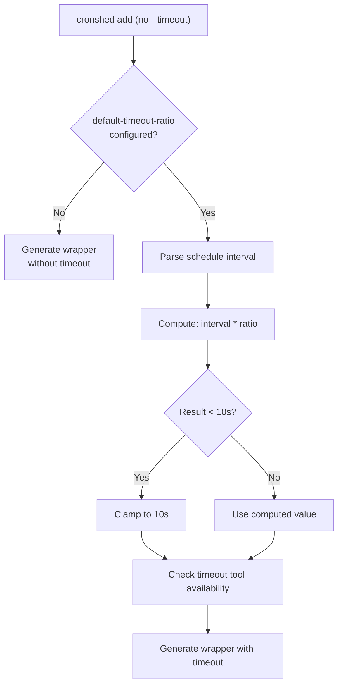

---

### Story 8 — `cronshed config get` shows current config `P2`

**Description:** As a developer, I want to view the current `default-timeout-ratio` value to confirm my configuration.

**Priority reason:** Without a read command, the developer would have to inspect `config.json` manually, which breaks the CLI abstraction.

**Independent test:** Set a ratio, run `cronshed config get default-timeout-ratio`; verify the output matches.

```gherkin
Feature: Config get
  Scenario: Get existing config value
    Given a default-timeout-ratio of 0.8 is configured
    When the developer runs "cronshed config get default-timeout-ratio"
    Then stdout contains "0.8"

  Scenario: Get unset config value
    Given no default-timeout-ratio is configured
    When the developer runs "cronshed config get default-timeout-ratio"
    Then stdout contains "not set" or a similar indicator
    And the exit code is 0
```

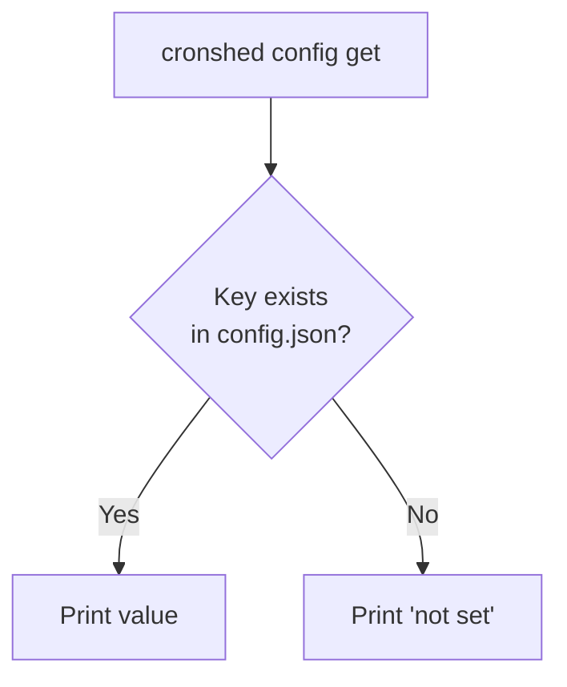

---

### Story 9 — Lock file naming uses hash of full task path `P2`

**Description:** As a developer, I want the lock file name to be based on a hash of the full task path (config path + task name), so tasks with the same name in different contexts do not collide.

**Priority reason:** Collision safety prevents silent mutual exclusion between unrelated tasks. This is important for users who manage multiple cron setups.

**Independent test:** Generate wrappers for two tasks with the same name but different config paths; verify the lock file hashes differ.

```gherkin
Feature: Lock file hash naming
  Scenario: Lock file uses hash of full task path
    Given a task "backup" exists with config path "/home/user/.cronshed/tasks.json"
    When the wrapper is generated for "backup"
    Then the lock file path is "~/.cronshed/locks/<sha256-of-/home/user/.cronshed/tasks.json:backup>.lock"

  Scenario: Same task name in different configs produces different lock files
    Given a task "backup" in config "/home/user/project-a/.cronshed/tasks.json"
    And a task "backup" in config "/home/user/project-b/.cronshed/tasks.json"
    When wrappers are generated for both tasks
    Then the two lock file paths are different
    And each lock file path contains a different hash
```

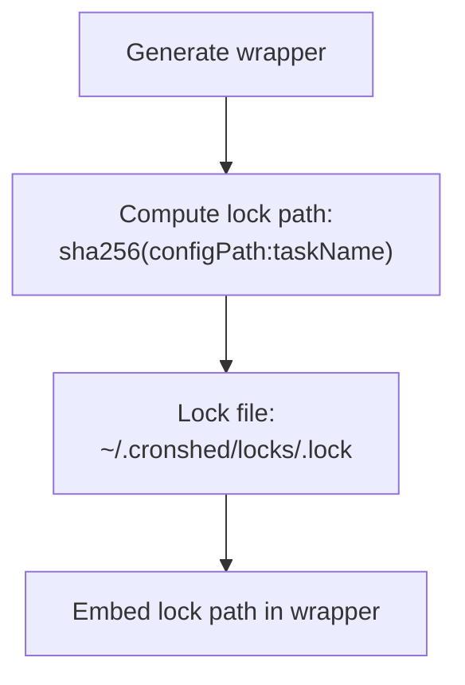

---

### Story 10 — Skip log entry format with skipped and pidHolder fields `P3`

**Description:** As a developer, I want skip events to be logged with `skipped: true`, `skippedAt`, `reason`, and `pidHolder` fields, so I can audit overlap occurrences and identify the holding process.

**Priority reason:** Nice-to-have diagnostic detail. The core skip behavior (Story 1) works without this detail, but it aids troubleshooting.

**Independent test:** Trigger a skip, parse the log entry, verify all skip-specific fields are present and correctly typed.

```gherkin
Feature: Skip log entry format
  Scenario: Skip entry contains all required fields
    Given a task "backup-db" is currently running (PID 12345 holds the lock)
    When a second invocation of the wrapper is triggered
    Then the log entry contains "skipped" equal to true
    And the log entry contains "skippedAt" as an ISO 8601 timestamp
    And the log entry contains "reason" equal to "already running"
    And the log entry contains "pidHolder" equal to 12345
    And the log entry contains "exitCode" equal to 0
    And the log entry does not contain "durationMs"

  Scenario: Normal execution does not contain skip fields
    Given a task "backup-db" is not currently running
    When the wrapper for "backup-db" executes normally
    Then the log entry does not contain "skipped"
    And the log entry does not contain "pidHolder"
    And the log entry does not contain "reason"
```

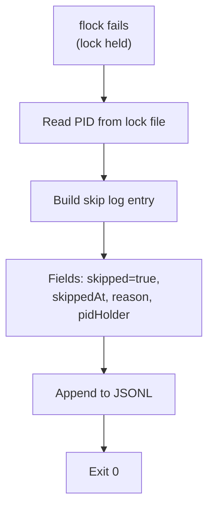

---

### Story 11 — Timeout log entry includes timedOut field `P3`

**Description:** As a developer, I want the log entry to include `timedOut: true` when the command is killed by timeout, so I can distinguish timeouts from other non-zero exit codes.

**Priority reason:** Exit code 124 alone is ambiguous (the command itself could return 124). The `timedOut` field makes it unambiguous.

**Independent test:** Trigger a timeout, verify the log entry contains `timedOut: true` alongside `exitCode: 124`.

```gherkin
Feature: Timeout log entry
  Scenario: Timeout produces timedOut field
    Given a task "slow-build" exists with "--timeout 1s" and command "sleep 60"
    When the wrapper for "slow-build" is executed
    Then the log entry has "timedOut" equal to true
    And the log entry has "exitCode" equal to 124

  Scenario: Non-timeout failure does not include timedOut
    Given a task "failing-task" exists with "--timeout 60s" and command "exit 1"
    When the wrapper for "failing-task" is executed
    Then the log entry has "exitCode" equal to 1
    And the log entry does not contain "timedOut"
```

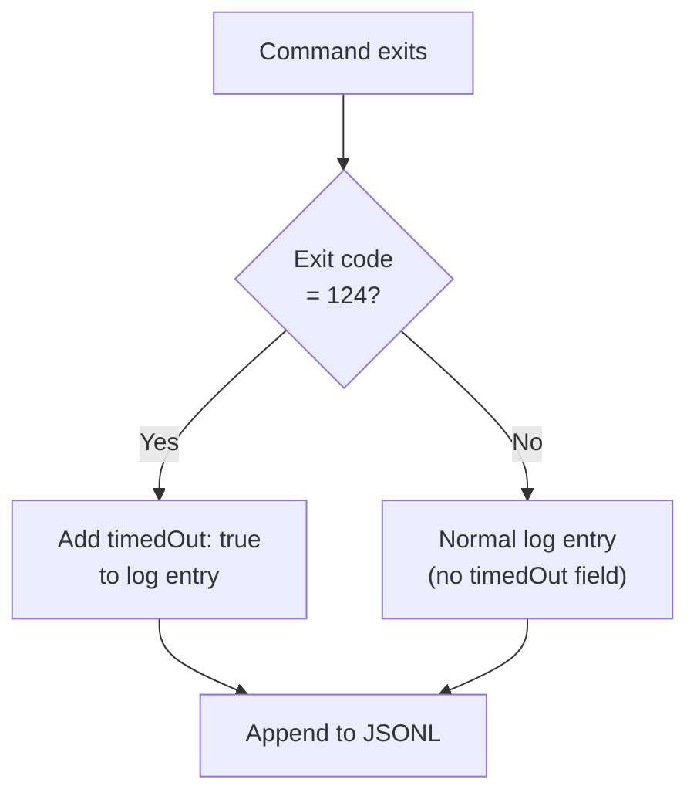

---

## Acceptance Criteria

| # | Criterion | Story |
|---|-----------|-------|
| AC-075 | Wrapper uses `flock --nonblock` on `~/.cronshed/locks/<hash>.lock` by default to prevent concurrent execution | Story 1 |
| AC-076 | When lock cannot be acquired, wrapper logs a skip entry with `skipped: true`, `skippedAt`, `reason: "already running"`, `pidHolder`, and exits 0 | Story 1, 10 |
| AC-077 | Lock is released automatically when the wrapper process exits (flock on fd) | Story 1 |
| AC-078 | `cronshed add --allow-parallel` stores `allowParallel: true` on the task and generates a wrapper without flock | Story 2 |
| AC-079 | `cronshed update --allow-parallel` regenerates the wrapper without flock | Story 2 |
| AC-080 | `cronshed add --timeout <duration>` stores the timeout value and generates a wrapper that wraps the command with `gtimeout`/`timeout` | Story 3 |
| AC-081 | When timeout fires (exit code 124), the log entry includes `timedOut: true` | Story 3, 11 |
| AC-082 | At wrapper generation time, if `--timeout` is specified and neither `gtimeout` nor `timeout` is available, a blocking error is thrown with install instructions | Story 4 |
| AC-083 | If schedule interval is <= 60s and no `--timeout` and no `default-timeout-ratio` is set, `cronshed add` prints a non-blocking warning to stderr | Story 5 |
| AC-084 | `cronshed config set default-timeout-ratio <value>` validates 0 <= value <= 1 and stores it in `~/.cronshed/config.json` | Story 6 |
| AC-085 | Invalid ratio values (< 0 or > 1) are rejected with an error message | Story 6 |
| AC-086 | When `default-timeout-ratio` is configured and no explicit `--timeout` is set, wrapper generation auto-computes timeout from schedule interval * ratio (minimum 10s) | Story 7 |
| AC-087 | Explicit `--timeout` takes precedence over `default-timeout-ratio` | Story 7 |
| AC-088 | `cronshed config get default-timeout-ratio` prints the current value or "not set" | Story 8 |
| AC-089 | Lock file name is `sha256(<configPath>:<taskName>).lock` — different config paths produce different lock files | Story 9 |
| AC-090 | The `locks/` directory is created by the wrapper via `mkdir -p` before flock | Story 1, 9 |
| AC-091 | Normal execution log entries do not contain `skipped`, `pidHolder`, `reason`, or `timedOut` fields | Story 10, 11 |
| AC-092 | Auto-timeout from ratio requires the timeout tool to be available; same blocking error as explicit `--timeout` | Story 7 |

---

## Functional Requirements

| # | Requirement | AC |
|---|------------|-----|
| FR-086 | The `WrapperService.buildScript()` method must inject a flock block that acquires `~/.cronshed/locks/<hash>.lock` with `--nonblock`. The lock file hash is SHA-256 of `<configFilePath>:<taskName>`. If the lock is not acquired, the wrapper logs a skip entry and exits 0. The flock block is omitted when `allowParallel` is true on the task | AC-075, AC-076, AC-077, AC-078, AC-089, AC-090 |
| FR-087 | The skip log entry must contain: `exitCode: 0`, `skipped: true`, `skippedAt: <ISO 8601>`, `reason: "already running"`, `pidHolder: <PID>`. The PID is read from the lock file content. No `durationMs`, `stdout`, or `stderr` fields | AC-076, AC-091 |
| FR-088 | The `Task` interface and `CreateTaskInput` must be extended with optional fields: `allowParallel?: boolean` and `timeout?: string`. The CLI `add` and `update` handlers must parse `--allow-parallel` (boolean flag) and `--timeout <string>` arguments | AC-078, AC-079, AC-080 |
| FR-089 | At wrapper generation time, if timeout is required (explicit `--timeout` or computed from ratio), the `WrapperService` must check for `gtimeout` or `timeout` on PATH via `which`. If neither is found, throw a `TimeoutToolMissingError` with install instructions for macOS (`brew install coreutils`) and Linux (`sudo apt-get install coreutils`) | AC-082, AC-092 |
| FR-090 | The `WrapperService.buildScript()` method must wrap the command invocation with `<timeout-tool> <seconds>` when a timeout is configured. The timeout tool name (`gtimeout` or `timeout`) is resolved at generation time and hardcoded in the wrapper | AC-080, AC-081 |
| FR-091 | When the command exits with code 124 and a timeout was configured, the wrapper log entry must include `timedOut: true`. When exit code is not 124 or no timeout is configured, the `timedOut` field is omitted | AC-081, AC-091 |
| FR-092 | A `ConfigService` module must provide `get(key)` and `set(key, value)` operations on `~/.cronshed/config.json`. The `set` operation for `default-timeout-ratio` must validate 0 <= value <= 1 | AC-084, AC-085, AC-088 |
| FR-093 | The CLI must add `cronshed config set <key> <value>` and `cronshed config get <key>` commands that delegate to `ConfigService` | AC-084, AC-088 |
| FR-094 | When `default-timeout-ratio` is configured, `WrapperService.generate()` must compute timeout from the task's schedule interval: `floor(intervalSeconds * ratio)`, clamped to minimum 10s. This computed timeout is used only when no explicit `--timeout` is set on the task | AC-086, AC-087 |
| FR-095 | A `scheduleToIntervalSeconds(schedule: string): number` utility must parse a cron expression and return the minimum interval between executions in seconds. Used for ratio calculation and short-schedule warning | AC-083, AC-086 |
| FR-096 | When adding a task, if `scheduleToIntervalSeconds(schedule) <= 60` and no `--timeout` is set and no `default-timeout-ratio` is configured, print a warning to stderr: "Schedule runs every minute. Consider adding --timeout to prevent overlap." The task is still added | AC-083 |
| FR-097 | The wrapper must write its own PID to the lock file after acquiring flock, so skipped invocations can read the holder PID | AC-076, AC-089 |
| FR-098 | `WrapperService.generate()` must accept the config file path to compute the lock hash. The hash is `sha256(<configFilePath>:<taskName>)` and is hardcoded in the generated wrapper script | AC-089 |
| FR-099 | Special characters in task names must be sanitized for use in wrapper filenames (existing behavior). The lock file hash handles arbitrary task names safely since SHA-256 output is hexadecimal | AC-089 |

---

## Key Entities

### Extended LogEntry

```typescript
interface LogEntry {
  timestamp: string;        // ISO 8601 UTC
  exitCode: number;         // integer
  durationMs?: number;      // milliseconds (absent on skip)
  stdout?: string;          // truncated to 10KB (absent on skip)
  stderr?: string;          // truncated to 10KB (absent on skip)
  skipped?: true;           // only present when lock not acquired
  skippedAt?: string;       // ISO 8601 UTC, only on skip
  reason?: string;          // "already running", only on skip
  pidHolder?: number;       // PID of lock holder, only on skip
  timedOut?: true;          // only present when exit code 124 from timeout
}
```

### Extended Task

```typescript
interface Task {
  // ... existing fields ...
  allowParallel?: boolean;  // default false (single-instance ON)
  timeout?: string;         // e.g., "50s", "5m" — opt-in
}
```

### CronshedConfig

```typescript
interface CronshedConfig {
  defaultTimeoutRatio?: number;  // 0-1, stored in ~/.cronshed/config.json
}
```

### Lock File

- **Path:** `~/.cronshed/locks/<sha256-hash>.lock`
- **Content:** PID of the process holding the lock (written after flock acquired)
- **Lifecycle:** Created by wrapper, held via flock fd, released on process exit

---

## Edge Cases

1. **Lock file directory does not exist** — The wrapper creates `~/.cronshed/locks/` via `mkdir -p` before attempting flock. This is idempotent.

2. **Stale lock file after crash** — If a wrapper process is killed (SIGKILL), flock is released by the OS (fd closed on process death). The lock file remains on disk but is not held. Next invocation acquires flock successfully. The stale PID in the file is harmless.

3. **Missing timeout tool after initial add** — The timeout tool is checked at generation time only. If uninstalled after wrapper generation, the wrapper will fail at runtime with "command not found". Recovery: reinstall the tool or run `cronshed update --timeout ""` to remove timeout.

4. **Special characters in task name** — The lock hash uses SHA-256 of the full path, which produces safe hexadecimal output regardless of input characters. Task names with spaces, quotes, or unicode are handled safely.

5. **Schedule interval computation for complex expressions** — Expressions like `0 */2 * * *` (every 2 hours) or `0 0 * * 1` (weekly) have well-defined intervals. Expressions with multiple values (e.g., `0 9,17 * * *`) use the minimum gap between any two consecutive execution times. If interval cannot be determined, timeout-ratio is not applied and a warning is logged.

6. **Concurrent wrapper start with flock race** — Two wrapper invocations starting at the exact same microsecond: flock is atomic at the kernel level. Exactly one process wins the lock, the other gets EWOULDBLOCK. No race condition.

7. **Config file does not exist** — `ConfigService.get()` returns undefined when `config.json` is missing. `ConfigService.set()` creates the file (and parent directory). This is the first-use bootstrap path.

8. **Timeout value of 0** — `--timeout 0s` is rejected as invalid. Timeout must be a positive duration.

9. **Ratio produces timeout larger than interval** — If ratio is 1.0 and schedule is `*/5 * * * *`, timeout = 300s (same as interval). This is valid: the task is allowed to use the entire interval. Ratio > 1.0 is rejected at config set time.

10. **flock not available** — flock is available on all modern Linux distributions and macOS (via `brew install util-linux` or built-in on recent macOS). If somehow missing, the wrapper script will fail. The `WrapperService` does not check for flock availability (unlike timeout tool) since flock is a POSIX standard utility.

11. **Existing wrappers not retroactively updated** — Setting `default-timeout-ratio` does not modify existing wrappers. Only tasks added/updated AFTER the config change get the computed timeout. The developer must run `cronshed sync` to regenerate all wrappers if retroactive application is desired.

---

## Success Criteria

| # | Criterion | Measurement |
|---|-----------|-------------|
| SC-026 | Single-instance prevents concurrent execution with correct skip log | Integration test: parallel wrapper invocations, parse JSONL |
| SC-027 | `--allow-parallel` disables flock in generated wrapper | Unit test: `buildScript()` output with `allowParallel: true` lacks flock block |
| SC-028 | Timeout kills long-running commands at configured duration | Integration test: `sleep 10` with 2s timeout, verify exit 124 and timedOut |
| SC-029 | Timeout tool check blocks generation when tool is missing | Unit test: mock `which` failure, verify `TimeoutToolMissingError` thrown |
| SC-030 | Short-schedule warning printed for <= 60s interval without timeout | Unit test: add handler with `* * * * *` schedule, capture stderr |
| SC-031 | Config CRUD for default-timeout-ratio with validation | Unit test: set/get/validate on ConfigService |
| SC-032 | Auto-timeout from ratio correctly computes and injects timeout | Unit test: ratio 0.8 + `*/5 * * * *` = 240s in wrapper script |
| SC-033 | Lock file hash prevents cross-config name collisions | Unit test: same task name, different config paths, different hashes |
